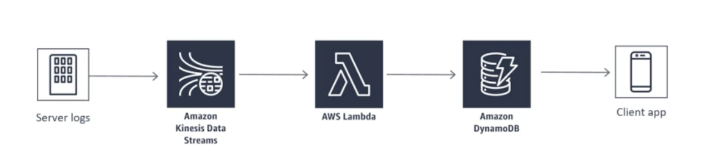
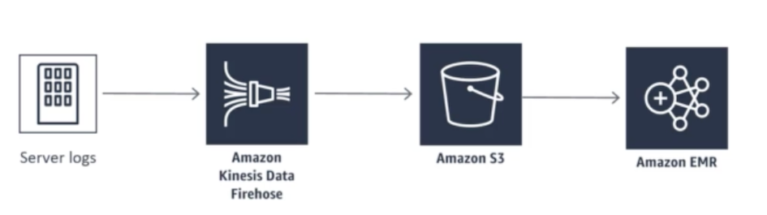
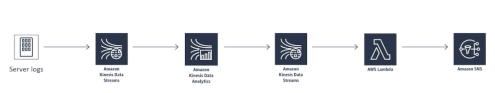
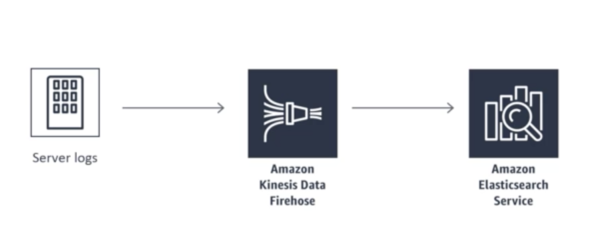
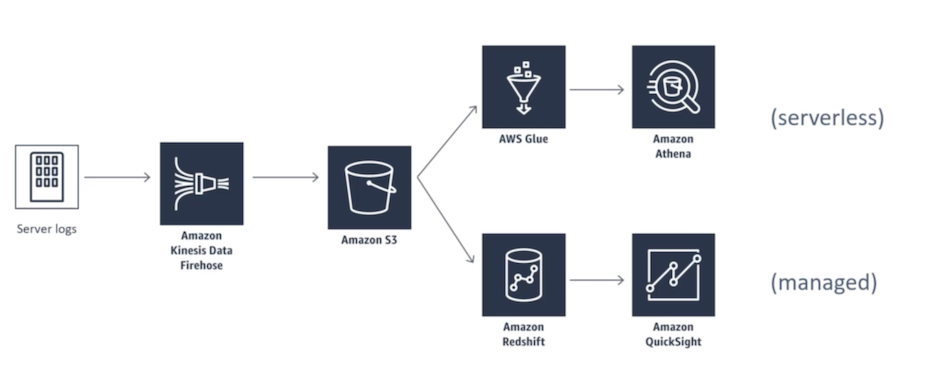
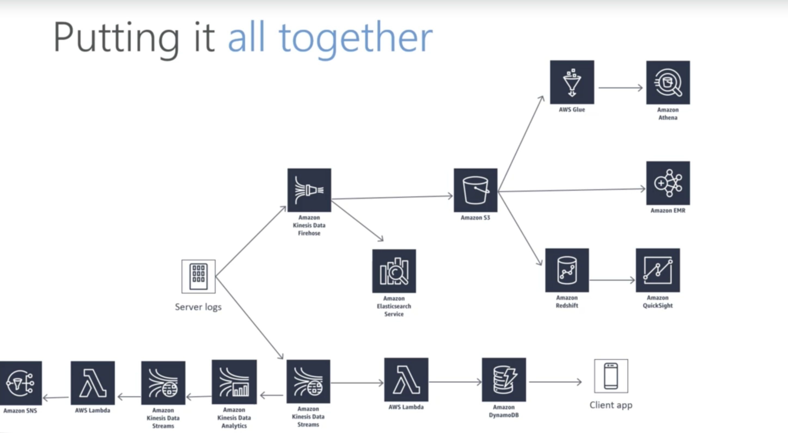

# AWS Certified Big Data Specialty 2020 - In Depth & Hands On!

## Service Will Learn

 

## Introducing our Hands-On Case Study: `Cadabra.com`

### Requirement 1: Order history app

 

1. site's mobile app to do this will simulate order data being generated on an easy to instance and publish that data 
2. Data using **Kinesis data streams** into an **AWS lambda function** which in turn will populate an order database in **dynamoDB** that our app can read from.

### Requirement 2: Product recommendations

 

Automated product recommendations to our customers online which involves training a machine learning:

1. Model based on aggregate customer purchasing data to build this we'll publish our order data through **Kinesis firehose** into a data lake hosted in **Amazon S3**
2. spin up an **Amazon Elastic map reduce cluster** to produce recommendations model using **Apache Spark**.

### Requirement 3: Transaction rate alarm

 

Next we'll create an **operational system that alerts** us if an unexpected rate of orders comes in all of a sudden. **This might indicate some sort of attack that someone needs to deal with immediately**.

* And so it must work in **real time** to build this will use **Kinesis data streams** and **Kinesis data analytics** to monitor our incoming orders 
* Use a **lambda function** to fire off alarms using **Amazon SNS** or cell phone when something unusual happens.

### Requirement 4: Near-real-time log analysis

We also want to be able to **analyze server log data** in near real time for operational purposes for this requirement.

* We'll use Kinesis firehose to pump **Apache log data** directly into the **Amazon Elastic search service** 

### Requirement 5: Data warehousing & visualization

### Final: Put it together

