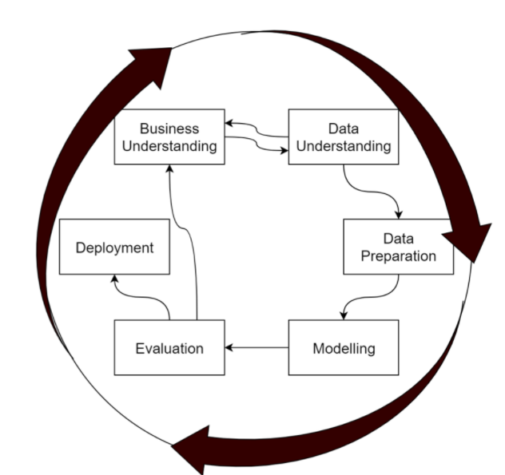
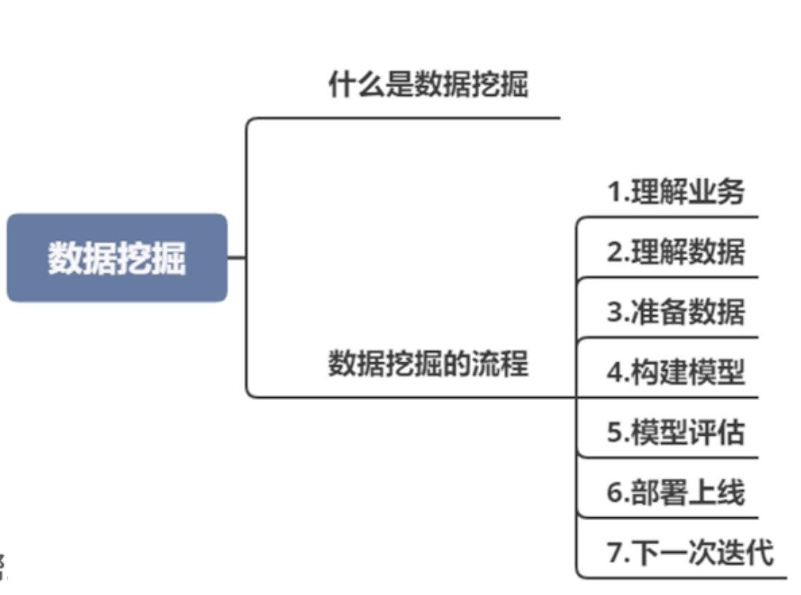

# **第十节 数据挖掘**

## **1、挖掘全流程**

**数据挖掘就是以数据作为研究的对象，从数据中寻找价值，获取知识的过程，至于说机器学习算法，或者数据的统计分析，这些都是手段。**

CRISP-DM（cross-industry standard process for data mining），翻译过来的意思是跨行业数据挖掘标准流程，

1. 理解业务
2. 理解数据
3. 准备数据
4. 构建模型

我们常见的问题通常可以转化**成分类、聚类、回归和关联分析**四种问题，进而选择对应的算法构建模型。比如说我们的文本抄袭检测：

* 可以转化成分类问题，**把相似和不相似看作是二分类**，把文本数据转化成数值数据，使用分类算法构建分类模型；
* 可以把它转化为一个聚类问题，**把文本进行聚类分析**，根据聚类的距离来判定是否抄袭；
* 可以把多种方法组合起来使用。

**5.模型评估**

从数学原理方面，我们有诸如准确率、召回率、F1 Score 等指标来评判一个模型的效果。

**6.部署上线**

**7.下一次迭代**

可能是为了快速上线，也可能是由于当前的某些条件不具备，我们的第一版服务还存在着很大的优化空间，同时来自线上的日志收集也为我们准备了很多问题案例

