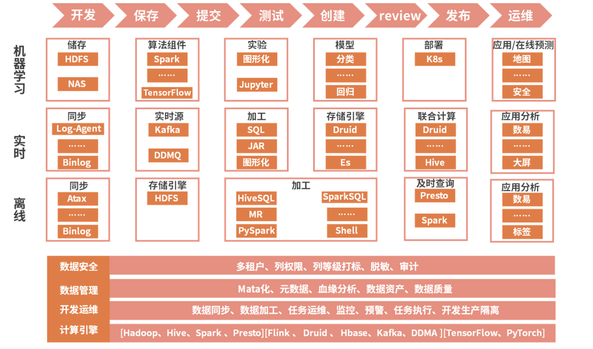
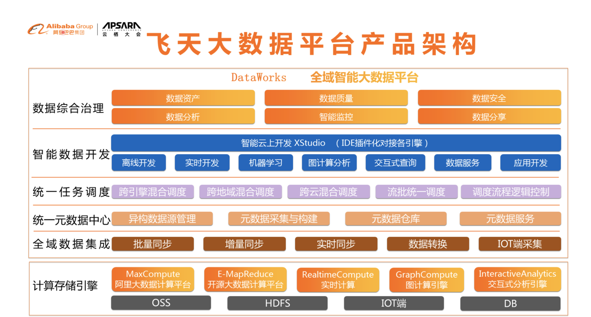
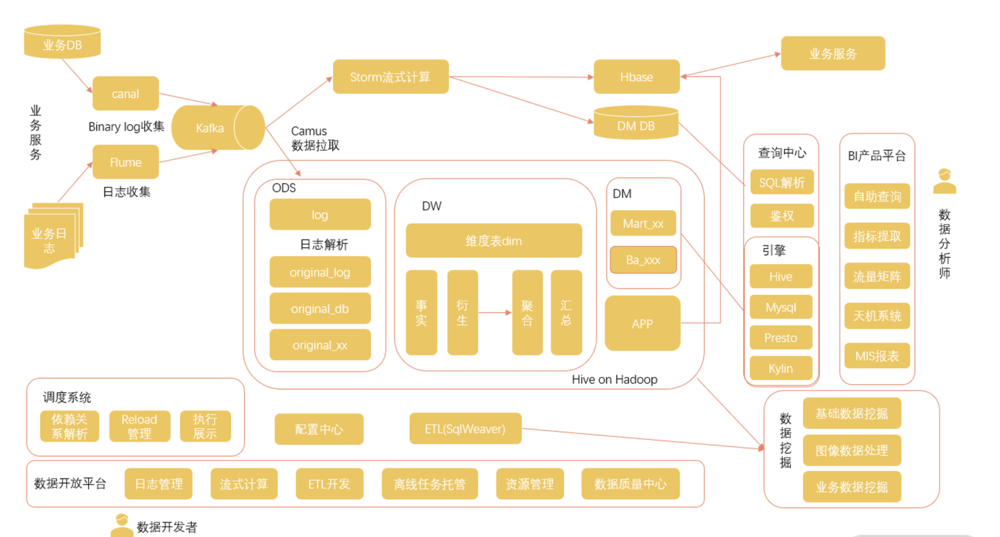
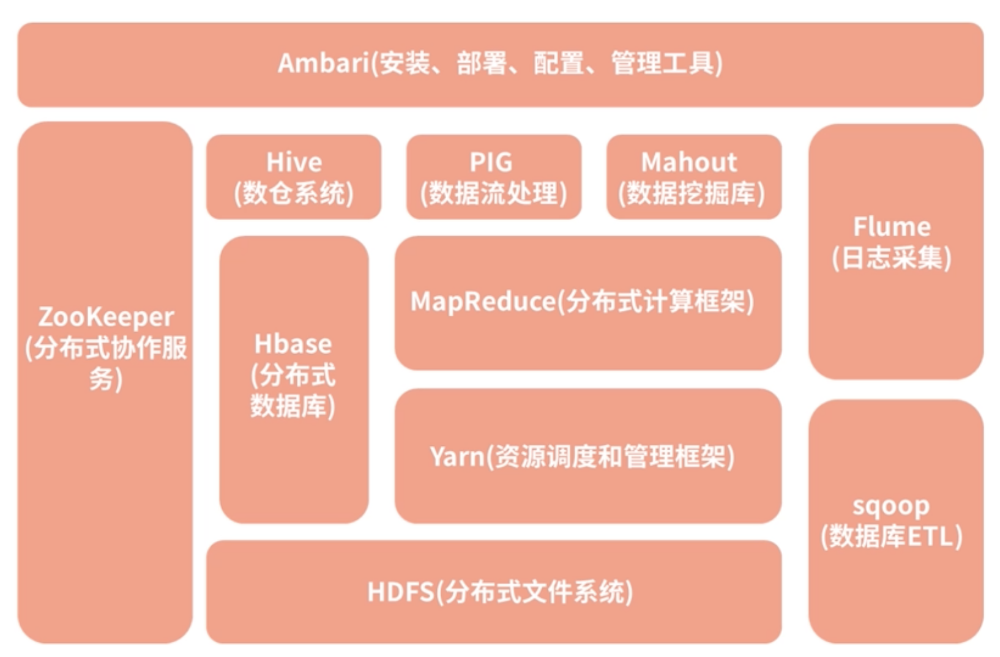

# **第二节 大数据架构 & Hadoop介绍**

## **1、互联网大厂的大数据解决方案**

### **1-1 滴滴的大数据体系**

* 最上层的红色箭头标志展示的是一个**基于大数据平台开发工程的发布流程**，当然，这个流程跟大数据的关系并不是很大，任何一个工程基本都要遵照这个过程进行发布。
* 紧挨着的流程是**机器学习**部分，机器学习会涉及数据挖掘 / 数据分析 / 数据应用几个步骤。
* 再往下是**实时计算解决方案和离线计算解决方案**。
* 在架构图的最底层是**相关的支持**，包**括了数据安全、数据管理、开发运维和计算引擎**四个部分。

### **1-2 就滴滴公布的大数据发展历程来看**

* 滴滴大数据先经历了裸奔时代：**引擎初建，**即通过 Sqoop 从 MySQL 导入 Hadoop，用户通过命令行访问大数据；
* 然后逐步引进了相关的**工具化建设**，但是这个阶段的工具还处于各自为政的状态：
	* 租户管理
	* 权限管理
	* 任务调度等；
* 在那之后，逐步产生了**平台化思维**，开始搭建一站式的智能开发和生产平台，使其可以覆盖整个离线场景，并且内置开发和生产两套逻辑环境，规范数据开发、生产和发布流程；
* 最后，也就是最新的一套大数据架构，在一站式开发生产平台的基础上进行了更多的扩展，**已经可以集离线开发、实时开发、机器学习于一体。**

### **1-2 阿里云的大数据体系**

**最下面是计算存储引擎，这里面包含了通用的存储和计算框架**。

* 存储方面，OSS 是阿里云的云存储系统，
* 底层的 HDFS 文件存储系统，
* 以及其他的各种 DB 系统；
* 在计算框架方面，**有 MapReduce 这种离线计算平台、实时计算平台、图计算引擎、交互式分析引擎等**

* 在存储和计算的基础上，是**全域数据集成**，这里面主要是对数据的各种采集和传输，支持批量同步、增量同步、实时同步等多种传输方式。
* 集成后的数据进入到**统一元数据中心**，统一进行任务调度。
* 再往上是开发层，通过结合各种算法和机器学习手段开发各种不同的应用。
* 最上面的数据综合治理，其实是在大数据全流程起到保障作用的一些模块，包含了智能监控、数据安全等模块

### **1-3 美团的大数据体系**

**最左侧是美团的各种业务服务**，

从这些业务的数据库和日志，可以通过数据传输、日志采集等手段对数据进行汇总，

* 一方面对于计算需求，直接进入到 Storm 流式计算框架进行计算，把结果存储于 HBase 等各种数据库中，并在业务上应用；
* 另一方面，数据汇总到Hadoop 框架的存储中心，经过各种解析和结构化存储在 Hive 表中，并在各种机器学习和数据挖掘项目中进行应用。

**在底层，是围绕着 Hadoop 架构建设的调度系统、配置中心，以及数据开放平台。**

**在最右侧，是经过集成的查询中心和查询引擎，并通过平台化开发建立了一套数据分析产品平台**。

### **1-4 大数据体系的共同点**

* **模块化**

大数据体系涉及了关于数据的一系列动作。随着大数据体系建设的逐渐完善，各个步骤变得更加清晰可分，不管是存储、调度、计算都被拆分成单独的模块，从而可以支持更多的业务，并根据需要进行灵活的选用。

* **平台化**

建设一个把各业务的相似点统一起来，又能够包容各业务的差别的平台，让这些数据发挥出更大的价值成了一个迫在眉睫的需求

* **实时化**

* 最早期的开源大数据框架 Hadoop 都是基于磁盘开发的，不管是底层数据的存储还是计算的中间结果存储都放在磁盘上，而且其中的计算框架 MapReduce 也是基于离线的数据批处理，没办法对实时数据进行计算。
* 而看现在几大公司的大数据体系，实时计算已经成了大数据体系中一个非常重要的组成部分。

* **不完善**

## **2、大数据开发必备工具——Hadoop**

### **2-1 Hadoop 的整体架构**

关于 Hadoop 最朴素的原理，**就是要使用大量的普通计算机处理大规模数据的存储和分析，而不是建造一台超级计算机**

* **计算机的故障问题**。想象我们使用一个有一万台计算机组成的集群，其中一台计算机出现问题的可能性是很高的，所以在大规模计算机集群上要处理好故障问题，就要做到一台计算机出现问题不会影响整个集群。
* **数据的依赖关系**。集群由若干台计算机组成，数据也是分布在不同的计算机上面，当你需要计算一个任务的时候，你所需要的数据可能要从若干台计算机进行读取，而你的计算过程也要分配到不同的计算机上。

Hadoop 系统的一个架构图，但是其中最核心的两部分依然是底层的**文件系统 HDFS和用于计算的 MapReduce。**

#### **2-1-1 HDFS（分布式文件系统）**

HDFS 是 Hadoop Distributed File System 的缩写，从名字就可以看出它是一个文件系统。**它在 Hadoop 体系中帮助解决文件的底层存储问题，能够用来支持海量数据的磁盘存储**，能够进行机器的线性扩充，只需要在集群中增加节点，存储能力就会同步增长。

不仅如此，**HDFS 还具备非常强大的容错性能**，其中的某些节点出现了故障不影响系统的使用，通常数据都有很多的副本。HDFS 屏蔽了那些存储的细节，并在客户端为大家提供了一套完整的文件管理命令，把底层的文件以一种结构化的目录形式展现给用户，我们可以像使用 Linux 文件操作命令一样使用 Hadoop 命令来访问对应的文件。

#### **2-1-2 MapReduce（分布式计算框架）**

在 Hadoop 中的 MapReduce 框架就解决了分布式计算的问题，包括其中的**运算逻辑与数据依赖。**在 MapReduce 的应用上，提供了一套编程模型，重点就是实现 map 函数和 reduce 函数：

* map 函数用于组织和分割数据；
* reduce 函数主要负责在分布式节点上的数据运算。

MapReduce 编程支持多种语言实现，比如 Java、Scala 等。

#### **2-1-3 Hive（数仓系统）**

在 HDFS 之上，Hive 是 Hadoop 体系的**数据仓库工具**，**可以将结构化的数据文件映射成一个数据表**

> **注意这里的重点是结构化的数据文件**。

在 HDFS 文件系统中可以存储结构化数据文件，也可以存储非结构化数据文件，而 Hive 是处理其中的结构化数据文件，它本身并不进行存储。

同时，Hive 提供了一套Hive SQL实现 MapReduce 计算，我们可以使用与 SQL 十分类似的 Hive SQL 对这些结构化的数据进行统计分析，所以从某种意义上来说 Hive 是对 MapReduce 进行包装后产生的工具。

**在公司中，Hive 是一个非常常用的数仓工具，很多公司都会把它当作基础数仓来使用。不过 Hive 也有一些不好用的地方，比如不能进行单条数据更新。**

#### **2-1-4 HBase（分布式数据库）**

在存储方面，Hadoop 架构中还有一个 Hbase 数据库。HBase 是一个分布式高并发的**K-V 数据库系统**，**它的底层当然也是由 HDFS 来支撑，而 HBase 通过对存储内容的重新组织，克服了HDFS 对小文件处理困难的问题，实现了数据的实时操作**。

在互联网公司中，对于量级较大，且变动较多的数据通常适合使用 HBase 进行存取

#### **2-1-5 Yarn（资源调度和管理框架）**

**在最早的 Hadoop 1.0 中其实是没有 Yarn 的，资源调度等功能都包装在 MapReduce 的 JobTracker 中，而 JobTracker 负担了太多的功能，接受任务、资源调度甚至是监控TaskTracker 的运行情况。**

当时存在一个问题，在集群规模非常大的时候会出现不稳定的情况，于是在 2.0 中对其进行了拆分，因此产生了独立的 Yarn。

**在拆分出 Yarn 之后，MapReduce 只负责计算，这也给后面其他计算框架替换 MapReduce 提供了方便，保障了 Hadoop 整个架构长盛不衰**。

#### **2-1-6 ZooKeeper（分布式协作服务）**

ZooKeeper，直译是动物园管理员。

这是因为很多项目都以动物的名字命名，**而 ZooKeeper 最常用的场景是作为一个服务的注册管理中心。**

* 生产者把所提供的服务提交到 ZooKeeper 中，
* 而消费者则去 ZooKeeper 中寻找自己需要的服务，从中获取生产者的信息，然后再去调用生产者的服务。

**ZooKeeper 像是一个锁，把控各种数据流转服务的中间环节**，保障数据的一致性。比如说 HBase、Kafka 等都可以通过 ZooKeeper 进行注册。

幸运的是在我们的开发过程中，不需要了解太多 ZooKeeper 的细节，主要是进行一些代码上的配置就可以了。

#### **2-1-7 Hadoop 的优点**

* **强大的数据存储和处理能力**
	* 通过技术手段，Hadoop 实现了只需要增加一些普通的机器就可以获得强大的存储和运算能力。 
* **隐藏了大量技术细节**
	* 只需要调用相关的 API 就可以实现大规模存储和计算。
* **良好的扩展能力**
	* 提供了很多不同的组件
	* 公司可以使用标准的方案，
	* 可以根据自己的业务需求来进行细节上的调整甚至是自己的开发。比如说对于计算框架 **MapReduce，在很多公司已经使用性能更好的 Spark 或者 Flink 进行了替换**。 

