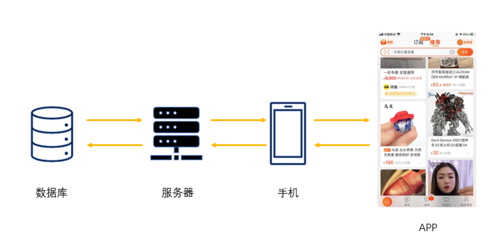
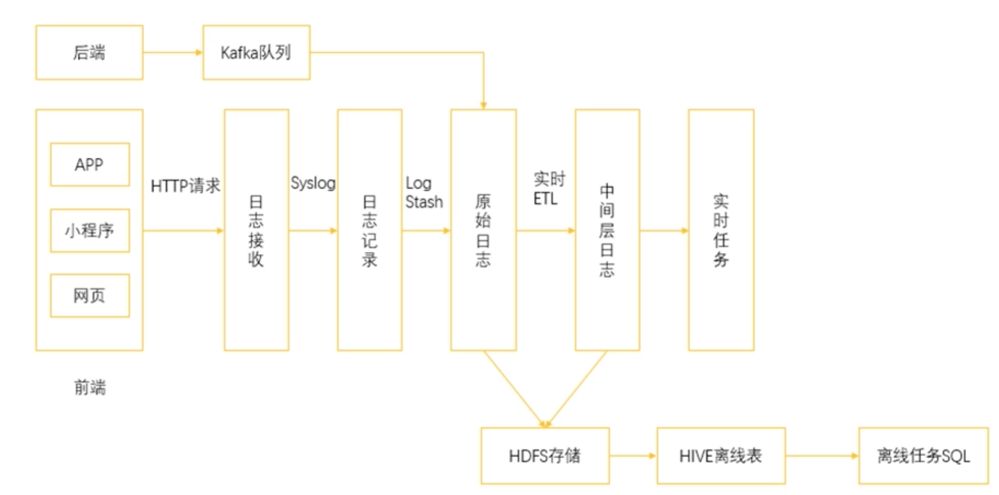

# **第三节 大数据中的数据来源**

### **1、传感器**

* 手机上的指纹开屏；
* 使用指纹进行支付；
* 微信步数的采集；
* 各种手环和运动手表等还可以监测心率；

### **2、爬虫采集**

爬虫采集是通过一套程序去互联网上获取数据的方法。如果把一个互联网公司的数据划分成**站内数据和站外数据**，那么爬虫所获取的都属于站外数据。

### **3、日志采集**

跟硬件传感器相比，**日志记录可以看作是一种软件传感器**，依托手机 App 就可以实现，这通常是现在的互联网公司获取“站内数据”的主流方式。下图就是一个典型的日志采集场景：

* 曝光事件
* 点击事件
* 用户滞留事件

在日志采集的数据中，通常又可以分成两种类型，**一种称为事件，一种称为属性**。

### **4、事件**

**事件是日志采集的重中之重**

* **曝光事件**

最简单的，一个 item 或者一个页面被展示出来，就称作曝光。在日志中记录曝光事件，就是记录每一个被展示出来的页面、商品或者内容。

* **点击事件**

而点击，则是用户在 App 中的点击行为。通常，App 中的各种页面都是通过点击进行跳转的，

* **用户停留事件**

**这个事件记录的是一个用户在某个页面，或者某种情况下停留的时间**。

* 在**新闻推荐场景**，使用新闻曝光和新闻点击可以计算某条新闻的点击率 
* 在**视频场景**，使用点击和用户停留时间可以计算观看完成比 
* 在**交易场景**，使用浏览点击和下单点击可以计算访购率 

### **5、属性**

**与事件的连贯性不同，属性的收集往往是一次性的**。当我们打开 App 时，我们使用的手机型号、网络制式、App 版本等信息都作为属性一次性地收集起来。

### **6、数据埋点**

**实现日志采集所使用的手段被称为数据埋点。**

数据埋点就是在我们 App 的前端，也就是 UI 层的代码中插入一段用于监视用户行为事件的代码。当用户在 App 上发生对应的行为时，就会触发这段代码，从而上传该埋点中事先已经定义好的事件信息。

通过埋点收集到的信息：

* 可以作为监控，看到 App 的长期表现；
* 也可以作为基础原料，进行复杂的运算，用于用户标签、渠道转化分析、个性推荐等。

### **7、数据埋点的困难**

* 来源众多
	* 网页端、App端（安卓、iOS甚至微软客户端）、小程序 
	* 要把不同来源的同一处行为数据进行合并统计  
* 页面众多
	* 浏览、下单、支付 
	* 不同的页面，不同的形式  
* 数据格式各不相同
	* 不同的业务可能对于同一个页面的埋点存在不同的需求 
 
### **8、埋点方式**

**手动埋点：**

* 所谓的埋点就是程序员去增加一些代码 
* 那么手动埋点自然是说程序员手动地去增加代码 

好处：

* 没有其他的开发量，属于懒惰开发的一种情况 
* 只有当需求提出的时候才去增加一个埋点 

**半自动埋点：**

* 半自动的埋点通常出现在产品已经基本成熟的时期
* 程序员对于目前以及预期未来的业务流程进行了梳理
* 整理出一套常用的埋点方案，并把这套方案嵌入到业务代码中
* 如果有一些全新的功能或者页面上线，还是需要进行开发的 

**全自动埋点 ：**

* 全自动埋点完全忽略了需求的存在，直接从最基本的事件和属性
* 把所有的东西都纳入埋点的范畴，事无巨细地记录下来 

* 从根本上解决了埋点的需求，从此解放了双手 
* 收集全量信息，网络开销大、存储成本高 
* 大部分没用的信息则会导致后续数据处理的速度缓慢 

### **9、进阶**

* 在开发了埋点代码的前端环境中监控用户的行为，当用户产生行为的时候会通过 HTTP 请求把这些事件进行上报，进入到日志收集服务中。
* 日志收集服务会把这些日志转发到日志记录服务中，日志记录服务通过简单的日志加工汇总成为原始日志。
* 在这个位置，通过实时的 ETL 把原始日志处理成标准的格式**，比如说汇总成我们所需要的用户 ID 与商品 ID的关联，以及是否有曝光、点击、下单、购买行为，并形成中间层日志，用于各种实时任务。**

同时，原始日志和中间层日志通过 Kafka 消息队列同步到 HDFS 中以备后面的离线分析。

在上面的一个分支则是后端服务的日志采集，直接通过 Kafka 队列收集信息。

实际上，除了前端产生的日志，后端服务同样也会产生各种日志信息，不过这里多用于服务运行状态的检测。

