# **第四节 HDFS解决大数据存储问题 & Hadoop on K8S**

## **1、文件系统**

在电脑中，常用的存储有内存和硬盘两种形式：

* 内存的速度快，但是价格更贵，所以使用的存储容量较小；
* 硬盘价格便宜，速度要慢很多。

**电脑中一般都使用硬盘来进行长期存储，而内存用来存储程序运行时的数据。**所以，对于我们的硬盘来说，最基本的功能就是读取和写入功能。

* 硬盘上的位置如何划分；
* 怎么能够尽快在硬盘上找到需要的数据；
* 对于一块空间如何保障读数据和写数据不是同时进行的；

一个文件就是一个单元，占用一个独立的地址空间，程序可以读取文件或者创建新的文件。

而对这些文件进行管理，解决这些文件的结构、访问、保护、寻址等功能的系统，我们就称为文件系统。

**而我们所要介绍的 HDFS，全称 Hadoop Distribute File System，也就是分布式文件系统的意思，HDFS 是文件系统的一种实例。**

## **2、HDFS 基础**

 HDFS，它可以利用廉价的普通服务器作为其存储，组建一个大规模存储集群，为各类计算提供数据访问的基础。那么 HDFS 的文件系统比起一般的文件系统有什么特色呢？
 
 
**其实 HDFS 文件系统最大的特色就是它在分布式架构上的处理，同时 HDFS 的设计适合一次写入，多次读出的场景，且不支持文件的修改，所以不适合反复修改数据的场景**。

### **2-1 HDFS 的架构**

**1、数据块**

HDFS 默认最基本的存储单位是 64MB 的数据块（在 2.x 版本中是 128MB），大小通过配置可调。对于存储空间未达到数据块大小的文件，不会占用整个数据块的存储空间。

**2、元数据节点（NameNode）**

元数据节点算是 HDFS 中非常重要的一个概念，用于管理文件系统的命令空间，将所有文件和文件夹的元数据保存在文件系统树中，通过在硬盘保存避免丢失，采用文件命名空间镜像（fs image）及修改日志（edit log）方式保存。


**3、数据节点（DataNode）**


数据节点即是真正数据存储的地方。

**4、从元数据节点（Secondary NameNode）**

从字面来看像是元数据节点的备用节点，但实际不然，**它和元数据节点负责不同的事情，主要负责将命名空间镜像与修改日志文件周期性合并，避免文件过大，合并过后文件会同步至元数据节点，同时本地保存一份，以便在出现故障时恢复。**

**5、Client，即客户端**

* 客户端是我们平时用来和 HDFS 服务进行交互的部分，客户端中内置了一套文件操作命令来帮助我们访问 HDFS 服务，比如说我们上传文件、下载文件；
* 同时客户端还负责把我们上传的文件按前面说的数据块进行切分，以方便后续的存储；
* **因此，客户端当然也负责与 NameNode 和 DataNode 进行交互以获取文件位置或者读写文件操作等**。

**HDFS的架构**

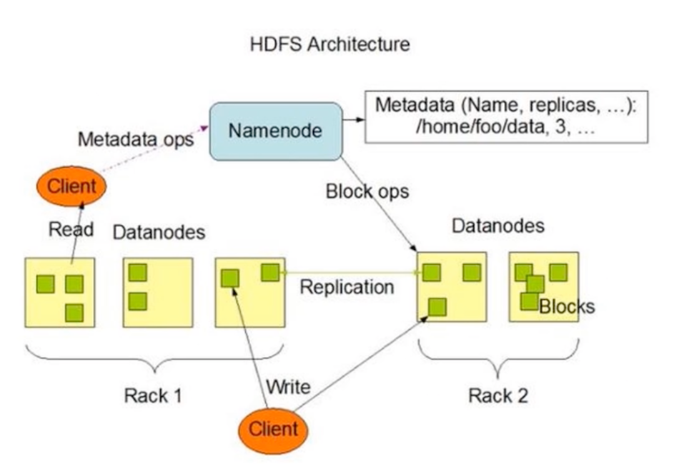

## **3、HDFS 的优缺点**

### **3-1 优点**

* 高容错性。
	* 在 HDFS 文件系统中，数据都会有多个副本。其中的某一个副本丢失（某一个节点的机器损坏）并不影响整体的使用，可以自动恢复。

* **适合大数据处理**。
	* 数据规模：能够处理数据规模达到 GB、TB、甚至 PB 级别的数据；
	* 文件规模：能够处理百万规模以上的文件数量，相当之大。

* **提供数据一致性保障**。
* 任意一个节点所占用的资源较少，**可以在廉价的机器上运行，支持线性扩张**。


**3-2 缺点**

* **不适合低延时数据访问，比如毫秒级的存储数据，是做不到的**。
* **无法高效地对大量小文件进行存储**。
	* 存储大量小文件的话，它会占用 NameNode 大量的内存来存储文件、目录和块信息。这样是不可取的，因为 NameNode 的内存总是有限的；
	* 小文件存储的寻址时间会超过读取时间，它违反了 HDFS 的设计目标。
* **不支持并发写入、文件随机修改**。

对于一个文件，只能有一个线程写入，不可以多个线程同时写入。基本不能进行文件的修改，只支持数据的追加，如果想修改需要使用新文件覆盖整个旧的文件。

## **4、在Kubernetes平台上运行Hadoop的实践**

本文我们给出Hadoop在Kubernetes上的实践案例，以弥补这种缺憾。

* 第一， Hadoop集群重度依赖DNS机制，一些组件还使用了反向域名解析，以确定集群中的节点身份，这对Hadoop在Kubernetes上的建模和运行带来极大挑战，需要深入了解Hadoop集群工作原理并且精通Kubernetes，才能很好解决这一难题。
* 第二， **Hadoop新的Map-Reduce计算框架Yarn的模型出现的比较晚，它的集群机制要比HDFS复杂，资料也相对较少，增加了Hadoop整体建模与迁移Kubernetes平台的难度**。
* 第三， Hadoop与Kubernetes分别属于两个不同的领域，一个是传统的大数据领域，一个是新兴的容器与微服务架构领域，这两个领域之间交集本来很小，加之Hadoop最近几年已经失去焦点（这点从百度搜索关键词就能发现），所以，没有多少人关注和研究Hadoop在Kubernetes的部署问题，也是情理之中的事情。


Hadoop 2.0其实是由两套完整的集群所组成，一个是基本的HDFS文件集群，一个是YARN资源调度集群，如下图所示：

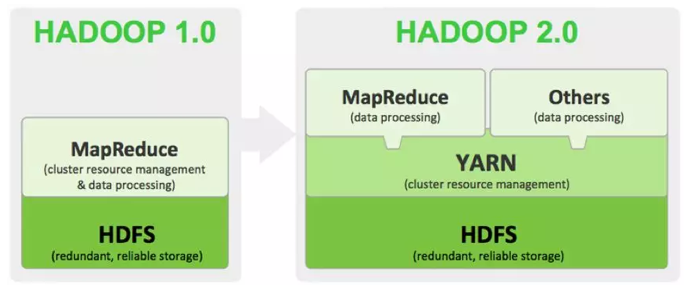

因此在Kubernetes建模之前，我们需要分别对这两种集群的工作机制和运行原理做出深入的分析，下图是HDFS集群的架构图：


我们看到，HDFS集群是由NameNode（Master节点）和Datanode（数据节点）等两类节点所组成，其中，客户端程序（Client）以及DataNode节点会访问NameNode，因此，NameNode节点需要建模为Kubernetes Service以提供服务，以下是对应的Service定义文件：

```
apiVersion: v1
kind: Service
metadata:
  name: k8s-hadoop-master
spec:
  // type: NodePort
  type: clusterIP
  selector:
    app: k8s-hadoop-master
  ports:
    - name: rpc
      port: 9000
      targetPort: 9000
    - name: http
      port: 50070
      targetPort: 50070
      nodePort: 32007
```

其中，NameNode节点暴露2个服务端口：


* 9000端口用于内部IPC通信，主要用于获取文件的元数据
* 50070端口用于HTTP服务，为Hadoop 的Web管理使用


为了减少Hadoop镜像的数量，我们构建了一个镜像，并且通过容器的环境变量`HADOOP_NODE_TYPE`来区分不同的节点类型，从而启动不同的`Hadoop`组件，下面是镜像里的启动脚本startnode.sh的内容：

```
#!/usr/bin/env bash
sed -i "s/@HDFS_MASTER_SERVICE@/$HDFS_MASTER_SERVICE/g" $HADOOP_HOME/etc/hadoop/core-site.xml
sed -i "s/@HDOOP_YARN_MASTER@/$HDOOP_YARN_MASTER/g" $HADOOP_HOME/etc/hadoop/yarn-site.xml
yarn-master
HADOOP_NODE="${HADOOP_NODE_TYPE}"
if [ $HADOOP_NODE = "datanode" ]; then
        echo "Start DataNode ..."
        hdfs datanode  -regular
else
    if [  $HADOOP_NODE = "namenode" ]; then
        echo "Start NameNode ..."
        hdfs namenode
    else
        if [ $HADOOP_NODE = "resourceman" ]; then
            echo "Start Yarn Resource Manager ..."
            yarn resourcemanager
        else
             if [ $HADOOP_NODE = "yarnnode" ]; then
                 echo "Start Yarn Resource Node  ..."
                 yarn nodemanager    
             else               
                echo "not recoginized nodetype "
             fi
        fi
    fi  
fi
```

我们注意到，启动命令里把Hadoop配置文件（`core-site.xml`与`yarn-site.xml`）中的HDFS Master节点地址用环境变量中的参数`HDFS_MASTER_SERVICE`来替换，YARN Master节点地址则用`HDOOP_YARN_MASTER`来替换。

下图是Hadoop HDFS 2节点集群的完整建模示意图：

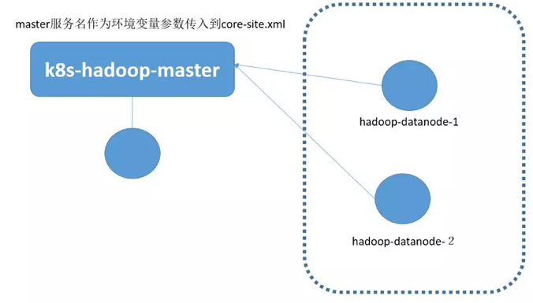

图中的圆圈表示Pod，可以看到，Datanode并没有建模`Kubernetes Service`，而是建模为独立的Pod，这是因为Datanode并不直接被客户端所访问，因此无需建模`Service`。

当Datanode运行在Pod容器里的时候，我们需要修改配置文件中的以下参数，取消`DataNode`节点所在主机的主机名（DNS）与对应IP地址的检查机制：

```
dfs.namenode.datanode.registration.ip-hostname-check=false
```

如果上述参数没有修改，就会出现DataNode集群“分裂”的假象，因为Pod的主机名无法对应Pod的IP地址，因此界面会显示2个节点，这两个节点都状态都为异常状态。

```
apiVersion: v1
kind: Pod
metadata:
  name: k8s-hadoop-master
  labels:
    app: k8s-hadoop-master
spec:
  containers:
    - name: k8s-hadoop-master
      image: kubeguide/hadoop
      imagePullPolicy: IfNotPresent
      ports:
        - containerPort: 9000
        - containerPort: 50070    
      env:
        - name: HADOOP_NODE_TYPE
          value: namenode
        - name: HDFS_MASTER_SERVICE
          valueFrom:
            configMapKeyRef:
              name: ku8-hadoop-conf
              key: HDFS_MASTER_SERVICE
        - name: HDOOP_YARN_MASTER
          valueFrom:
            configMapKeyRef:
              name: ku8-hadoop-conf
              key: HDOOP_YARN_MASTER
  restartPolicy: Always
```
 
 下面是HDFS的Datanode的节点定义（`hadoop-datanode-1`）：

```
apiVersion: v1
kind: Pod
metadata:
    name: hadoop-datanode-1
    labels:
      app: hadoop-datanode-1
spec:
  containers:
    - name: hadoop-datanode-1
      image: kubeguide/hadoop
      imagePullPolicy: IfNotPresent
      ports:
        - containerPort: 9000
        - containerPort: 50070    
      env:
        - name: HADOOP_NODE_TYPE
          value: datanode
        - name: HDFS_MASTER_SERVICE
          valueFrom:
            configMapKeyRef:
              name: ku8-hadoop-conf
              key: HDFS_MASTER_SERVICE
        - name: HDOOP_YARN_MASTER
          valueFrom:
            configMapKeyRef:
              name: ku8-hadoop-conf
              key: HDOOP_YARN_MASTER        
  restartPolicy: Always
```

实际上，Datanode可以用DaemonSet方式在每个Kubernerntes节点上部署一个，在这里为了清晰起见，就没有用这个方式 定义。

接下来，我们来看看Yarn框架如何建模，下图是Yarn框架的集群架构图：

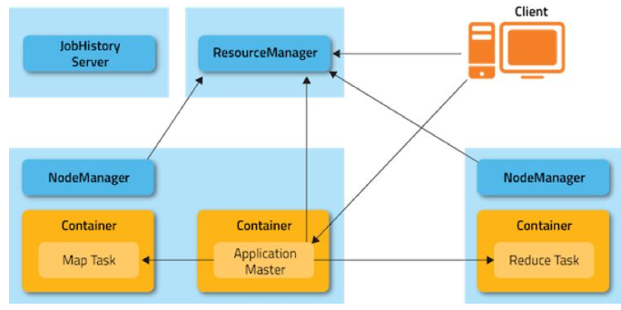

我们看到，Yarn集群中存在两种角色的节点：

**ResourceManager以及NodeManger，前者属于Yarn集群的头脑（Master），后者是工作承载节点（Work Node），这个架构虽然与HDFS很相似，但因为一个重要细节的差别，无法沿用HDFS的建模方式，这个细节就是Yarn集群中的ResourceManager要对NodeManger节点进行严格验证，即NodeManger节点的节点所在主机的主机名（DNS）与对应IP地址严格匹配，**


简单来说，就是要符合如下规则：


**NodeManger建立TCP连接时所用的IP地址，必须是该节点主机名对应的IP地址，即主机DNS名称解析后返回节点的IP地址。**


所以我们采用了Kubernetes里较为特殊的一种Service——Headless Service来解决这个问题，即为**每个NodeManger节点建模一个Headless Service与对应的Pod，下面是一个ResourceManager与两个NodeManger节点所组成的Yarn集群的建模示意图：**


**Headless Service的特殊之处在于这种Service没有分配Cluster IP，**

**在Kuberntes DNS里Ping这种Service的名称时，会返回后面对应的Pod的IP地址，如果后面有多个Pod实例，则会随机轮询返回其中一个的Pod地址，我们用Headless Service建模NodeManger的时候，**


还有一个细节需要注意，即Pod的名字（容器的主机名）必须与对应的Headless Service的名字一样，这样一来，当运行在容器里的NodeManger进程向ResourceManager发起TCP连接的过程中会用到容器的主机名，**而这个主机名恰好是NodeManger Service的服务名，而这个服务名解析出来的IP地址又刚好是容器的IP地址，这样一来，就巧妙的解决了Yarn集群的DNS限制问题。**

下面以yarn-node-1为例，给出对应的Service与Pod的YAM文件，首先是yarn-node-1对应的Headless Service的YAM定义：

```
apiVersion: v1
kind: Service
metadata:
  name: yarn-node-1
spec:
  clusterIP: None
  selector:
    app: yarn-node-1
  ports:
     - port: 8040
```

**注意到定义中“clusterIP:None”这句话，表明这是一个Headless Service，**没有自己的Cluster IP地址，下面给出YAM文件定义：

```
apiVersion: v1
kind: Pod
metadata:
  name: yarn-node-1
  labels:
    app: yarn-node-1
spec:
  containers:
    - name: yarn-node-1
      image: kubeguide/hadoop
      imagePullPolicy: IfNotPresent
      ports:
        - containerPort: 8040
        - containerPort: 8041   
        - containerPort: 8042        
      env:
        - name: HADOOP_NODE_TYPE
          value: yarnnode
        - name: HDFS_MASTER_SERVICE
          valueFrom:
            configMapKeyRef:
              name: ku8-hadoop-conf
              key: HDFS_MASTER_SERVICE
        - name: HDOOP_YARN_MASTER
          valueFrom:
            configMapKeyRef:
              name: ku8-hadoop-conf
              key: HDOOP_YARN_MASTER          
  restartPolicy: Always
```

ResourceManager的YAML定义没有什么特殊的地方，其中Service定义如下：


```
apiVersion: v1
kind: Service
metadata:
  name: ku8-yarn-master
spec:
  type: NodePort
  selector:
    app: yarn-master
  ports:
     - name: "8030"       
       port: 8030
     - name: "8031"     
       port: 8031
     - name: "8032"
       port: 8032     
     - name: http
       port: 8088
       targetPort: 8088
       nodePort: 32088
```

对应的Pod定义如下：


```
apiVersion: v1
kind: Pod
metadata:
  name: yarn-master
  labels:
    app: yarn-master
spec:
  containers:
    - name: yarn-master
      image: kubeguide/hadoop
      imagePullPolicy: IfNotPresent
      ports:
        - containerPort: 9000
        - containerPort: 50070    
      env:
        - name: HADOOP_NODE_TYPE
          value: resourceman
        - name: HDFS_MASTER_SERVICE
          valueFrom:
            configMapKeyRef:
              name: ku8-hadoop-conf
              key: HDFS_MASTER_SERVICE
        - name: HDOOP_YARN_MASTER
          valueFrom:
            configMapKeyRef:
              name: ku8-hadoop-conf
              key: HDOOP_YARN_MASTER          
  restartPolicy: Always
```

目前这个方案，还遗留了一个问题有待解决：HDFS NameNode节点重启后的文件系统格式化问题，这个问题可以通过启动脚本来解决，即判断HDFS文件系统是否已经格式化过，如果没有，就启动时候执行格式化命令，否则跳过格式化命令。

安装完毕后，我们可以通过浏览器访问Hadoop的HDFS管理界面，点击主页上的Overview页签会显示我们熟悉的HDFS界面：


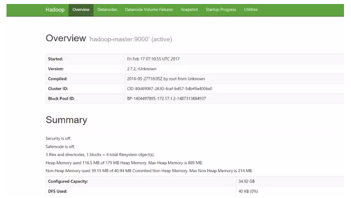

切换到Datanodes页签，可以看到每个Datanodes的的信息以及当前状态：

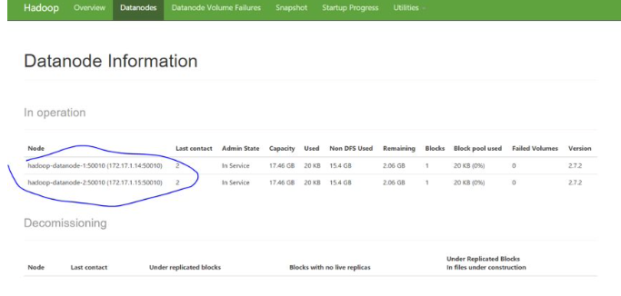


接下来，**我们可以登录到NameNode所在的Pod里并执行HDSF命令进行功能性验证，下面的命令执行结果是建立一个HDFS目录，并且上传一个文件到此目录中**：

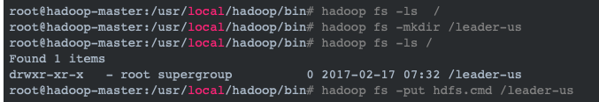

然后，我们可以在HDFS管理界面中浏览HDFS文件系统，验证刚才的操作结果：

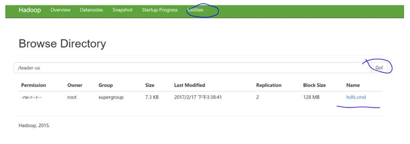


接下来，我们再登录到hadoop-master对应的Pod上，启动一个Map-Reduce测试作业——wordcount，作业启动后，我们可以在Yarn的管理界面中看到作业的执行信息，如下图所示：

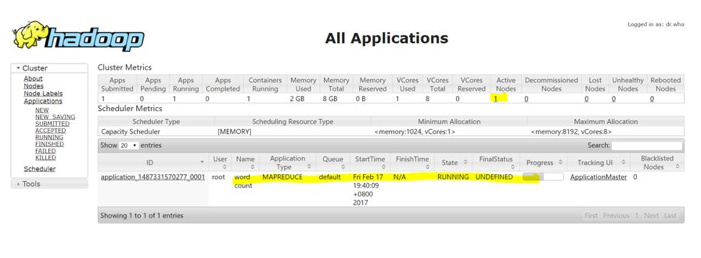

当作业执行完成后，可以通过界面看到详细的统计信息，比如wordcount的执行结果如下图所示：

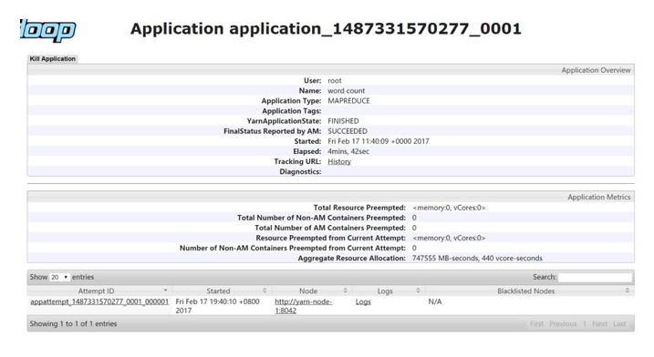


最后，我们进行了裸机版Hadoop集群与Kubernetes之上的Hadoop集群的性能对比测试，测试环境为十台服务器组成的集群，具体参数如下：


硬件：

* CPU：`2*E5-2640v3-8Core`
* 内存：`16*16G DDR4`
* 网卡：2*10GE多模光口
* 硬盘：12*3T SATA


软件：

* BigCloud Enterprise Linux 7（GNU/Linux 3.10.0-514.el7.x86_64 x86_64）
* Hadoop2.7.2
* Kubernetes 1.7.4+ Calico V3.0.1

我们执行了以下这些标准测试项：


* TestDFSIO：分布式系统读写测试
* NNBench：NameNode测试
* MRBench：MapReduce测试
* WordCount：单词频率统计任务测试
* TeraSort：TeraSort任务测试


**综合测试下来，Hadoop跑在Kuberntes集群上时，性能有所下降，以TestDFSIO的测试为例，下面是Hadoop集群文件读取的性能测试对比：**

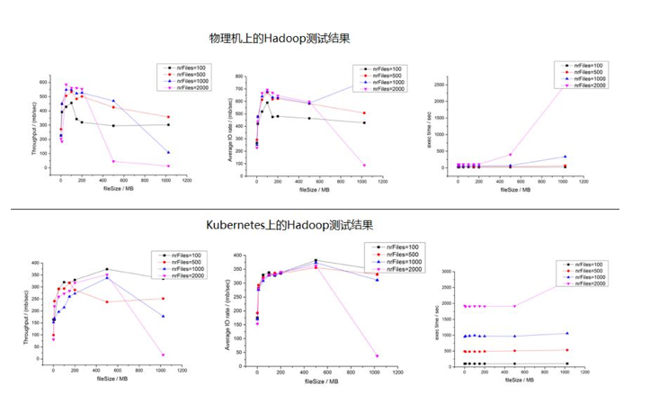

我们看到，Kubernetes集群上的文件读性能与物理机相比，下降了差不多30%左右，并且任务执行时间也增加不少，再来对比文件写入的性能，测试结果如下下图所示：


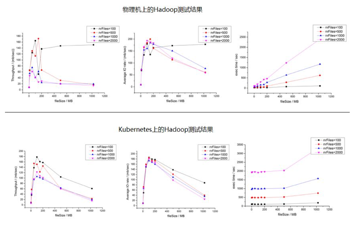


我们看到，写文件性能的差距并不大，这里的主要原因是在测试过程中，HDFS写磁盘的速度远远低于读磁盘的速度，因此无法拉开差距。

之所以部署在Kuberntes上的Hadoop集群的性能会有所下降，主要一个原因是容器虚拟网络所带来的性能损耗，如果用Host Only模型，则两者之间的差距会进一步缩小，下图是TestDFSIO测试中Hadoop集群文件读取的性能测试对比：

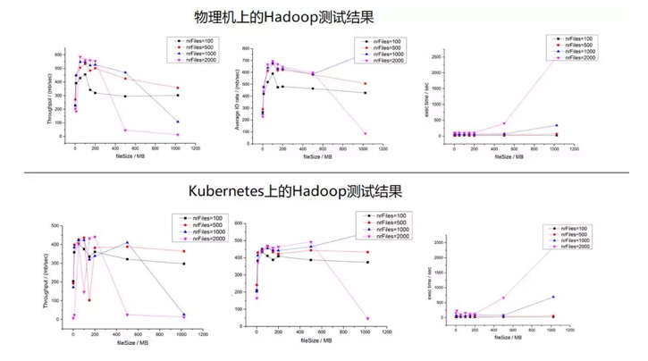


因此我们建议在生产环境中采用Host Only的网络模型，以提升Hadoop的集群性能。

攻下Hadoop在Kubernetes上的部署，并且在生产中加以验证，我们可以很自豪的说，现在没有什么能够难倒应用向Kubernetes的迁移的步伐，采用统一的PaaS构建企业的应用集群和大数据集群，实现资源的共享和服务的统一管理将会大大的提升企业的业务部署速度和管理的效率。


## **5、HDFS 简单使用**

除了这些命令，HDFS 的操作还有：

* 显示文件内容的 cat 命令；
* 上传文件的 put 命令；
* 下载文件的 get 命令；
* 移动文件的 mv 命令；
* 删除文件的 rm 命令；
* ……
