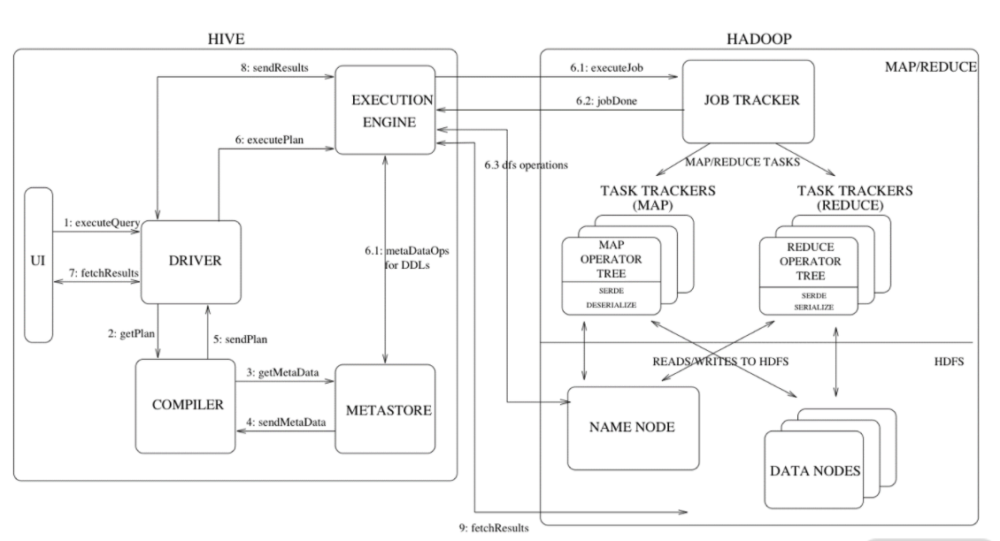
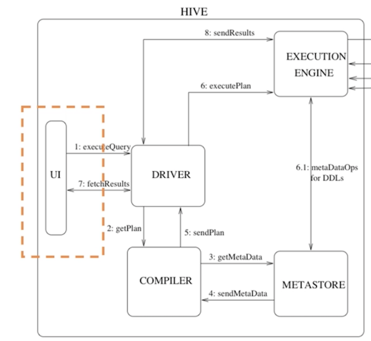
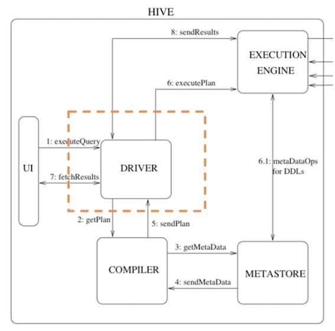
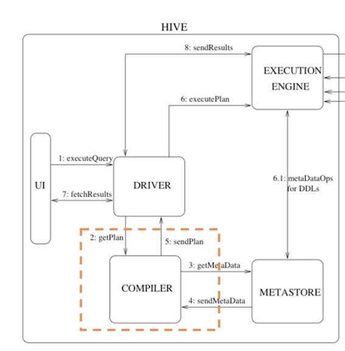
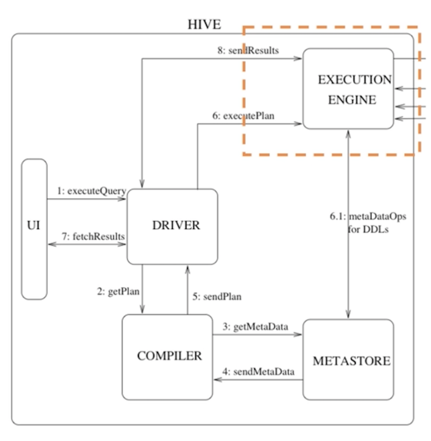
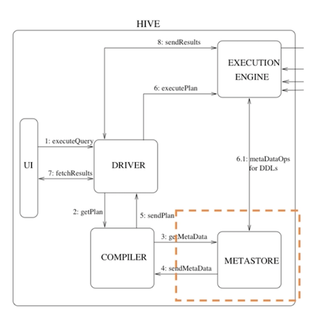
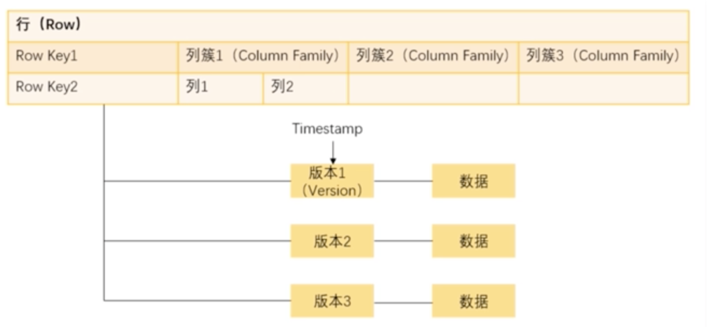

# **第五节 HBase 和 Hive** 

在日常工作中经常用的而且与 HDFS 有紧密联系的两个工具 Hive 和 HBase。

在 Hadoop 系统中，负责计算的部分是 MapReduce，也就是说我们要处理 HDFS 中存储的数据，进行各种统计分析以及运算的话需要去开发一个 MapReduce 程序。

虽然说 MapReduce 已经对分布式计算进行了很好的封装， 但是使用其 API 进行开发对于很多人来说仍然是一件很困难的事情。

比如说很多的数据产品经理或者运营人员只是想统计一下数字，却要去学习如何写代码开发的一套程序，这个难度可想而知**，因此 Hive 便应运而生。Hive 会解析 SQL 语句然后转化成 MapReduce 的程序运行，只是学习 SQL 语句对于一个产品经理来说就要简单得多了**。

简单来说，Hive 就是一个**数据仓库**，**仓库中的数据都是在 HDFS中管理的数据文件，同时 Hive 支持类似 SQL 语句的功能**，

你可以通过这些语句来进行数据分析，Hive 会把这些语句转换成可执行的 MapReduce 代码，然后进行计算。这里的计算，仅限于查找和分析。

Hive 所处理的是已经存储起来的数据，这种计算也就是我们所说的离线计算（区别于实时计算）。通过 Hive 的操作，可以让你在操作数据时感觉是在使用 MySQL，从而减少你的学习成本。

Hive 的基本体系架构。如下图所示：

## **1、Hive的体系架构**

分成两大部分，左侧是 Hive 的主体，右侧是Hadoop 系统

右上是 MapReduce，右下是 HDFS，中间有几条线连接，说明了 Hive 与 Hadoop 两大核心的关系

### **1-1 UI**

用户界面，主要负责与使用者的交互，我们通过 UI 向系统提交查询和其他操作。

当然，在 Hive 中还封装了 ThriftServer，我们可以在开发中使用 Java、 Python 或者 C++ 等语言来访问 Server，从而调用 Hive。

### **1-2 驱动器（Driver）**

* 驱动器在接收 HiveQL 语句之后，
* 创建会话来启动语句的执行，并监控执行的生命周期和进度。
* 在图中可以看到，驱动器既负责与编译器的交互，又负责与执行引擎的交互。

### **1-3 编译器（Compiler）**

* 编译器接收驱动器传来的 HiveQL，
* 并从元数据仓中获取所需要的元数据，
* 然后对 HiveQL 语句进行编译，将其转化为可执行的计划，

按照不同的执行步骤拆分成 MapReduce 和 HDFS 的各个阶段的操作并发送给驱动器。

### **1-4 执行引擎（Execution Engine）**

在编译和优化之后，**执行器将执行任务。它对 Hadoop 的作业进行跟踪和交互，调度需要运行的任务。**

### **1-5 数据仓（Metastore）**

元数据指的是我们构建的 Hive 表的表名、表字段、表结构、分区、类型、存储路径等等，元数据通常存储在传统的关系型数据库中，比如 MySQL。

## **2、Hive的优点**

### **2-1 简单易上手**

只需要了解 SQL 语言就可以使用 Hive，降低了使用 MapReduce 进行数据分析的难度，很多互联网公司都会使用 Hive 进行日志分析，比如说淘宝、美团等等，使用 Hive 统计网站的 PV、UV 等信

### **2-2 Hive 提供统一的元数据管理**

通过元数据管理可以实现描述信息的格式化，使得数据可以共享给 Presto、Impala、SparkSQL 等 SQL 查询引擎。

### **2-3 可扩展性好**

跟 Hadoop 的其他组件一样，Hive 也具备良好的可扩展性，只需要添加机器就可以部署分布式的 Hive 集群。

### **2-4 支持自定义函数（UDF）**

SQL 的功能虽然非常多，但是对于一些个性化的定制方案，使用 SQL 明显要麻烦很多，Hive 支持使用自定义函数的方式来加入自己编写的功能，方便了开发人员。

## **3、Hive 也是有缺点**

### **3-1 速度较慢**

* 由于 Hive 的底层数据仍然是存储在 HDFS 上的，所以速度比较慢，只适合离线查询。
* 在写程序时一般也是使用 Hive 来一次性加载数据，不适合在代码中反复访问。

### **3-2 不支持单条数据操作**

不能任意修改 HDFS 里的数据，所以 Hive 也不行，**要想修改数据只能整个文件进行替换**。

## **4、HBase**

跟 Hive 不同，**HBase 是一个在 Hadoop 大数据体系中应用很多的NoSQL 数据库**，HBase 源于谷歌发表的论文：Bigtable。

**HBase 同样利用 HDFS 作为底层存储，但是并不是简单地使用原本的数据，只是使用 HDFS 作为它的存储系统。**

* 也就是说，HBase 只是利用 Hadoop 的 HDFS 帮助其管理数据的持久化文件。
* HBase 提供实时处理数据的能力，弥补了早期 Hadoop只能离线处理数据的不足

**行键（Row Key)** 

一行数据的唯一标识

* 需要注意的是，HBase在存储Row Key的时候是按照字典顺序存放的 
* 需要设计存储的Row Key，比如在每个旧的前面都加一个HASH值来提升查询性能 

**列簇（Column Family）**

可以看作是**一组列**，

实际上一个列簇的作用也是用来管理若干个列，优化查询速度。所以列簇的名字要尽量短，同时对于经常需要一起查询的列放在一个列簇下面

HBase表中的列簇需要预先定义，而列不需要，如果要新增列簇就要先停用这个表。

**单元（Cell）**

指的是一个确定的存储单元。通过 Row Key、列簇 、列名以及版本号来确定。

**时间戳（Timestamp）**

用来标记前面说的一份数据的不同版本。

**区域（Region）**

一个 Region 可以看作是多行数据的集合。当一个表的数据逐渐增多，需要进行分布式存储，那么这个表就会自动分裂成多个 Region，然后分配到不同的 RegionServer 上面去。

## **5、HBase 的优缺点**

HBase 的优势在于**实时计算**，所有实时数据都直接存入 HBase 中，客户端通过 API 直接访问 HBase，实现实时计算。

**由于它使用的是NoSQL，或者说是列式结构，从而提高了查找性能，使其能运用于大数据场景**，这是它跟 MapReduce 的区别。

除此之外，它还有其他优点。

* 容量大性能高。一张 HBase 表可以支持百亿行、数千列的存储，而查询效率不会有明显的变化。同时 HBase 还可以支持高并发的读写操作。
* **列存储，无须设定表结构**。对于传统数据库，比如 MySQL 是按行来存储的，检索主要依赖于事前建立的索引，**在数据量很大的时候增加列或者更新索引都是非常缓慢的**，而 HBase 每一列都是单独存储的，每一行每一列的那一个单元都是独立的存储，也就是数据本身即是索引。

**而 HBase 不能支持条件查询，也不能用 SQL 语句进行查询。在使用的时候，一般只能使用Row Key 来进行查询。**

## **6、HBase 与 Hive 的使用**

由于 HBase **支持实时随机查询的特性**，主要使用 HBase 进行大量的明细数据的随机实时查询。

比如说以用户 ID 为 Key 的用户信息，以 Itemid 为 Key 的商品信息、各种交易明细等等。在数据收集上来之后通过解析实时流然后存储到 HBase 中，以备查询。而在查询 HBase 的时候一般也是对整条数据进行查询。

**Hive 本身并不解决存储的问题，它只是把 HDFS 中的结构化数据进行了展示，而最核心的功能是实现了对这些结构化文件的查询。**

在日常的工作中，通常使用 Hive分区表来记录一个时间段内的数据，并进行离线的批量数据计算，比如统计分析各种数据指标。

同为 Hadoop 体系的重要工具，Hive 与 HBase 也提供了一些访问机制。

**有时候我们希望能够在 Hive 中查询 HBase 的数据，可以通过关联外表的形式，在 Hive 上创建一个指向对应Hbase 表的外部表。**