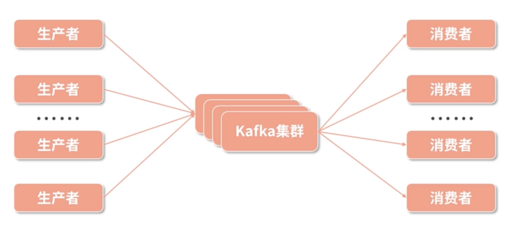
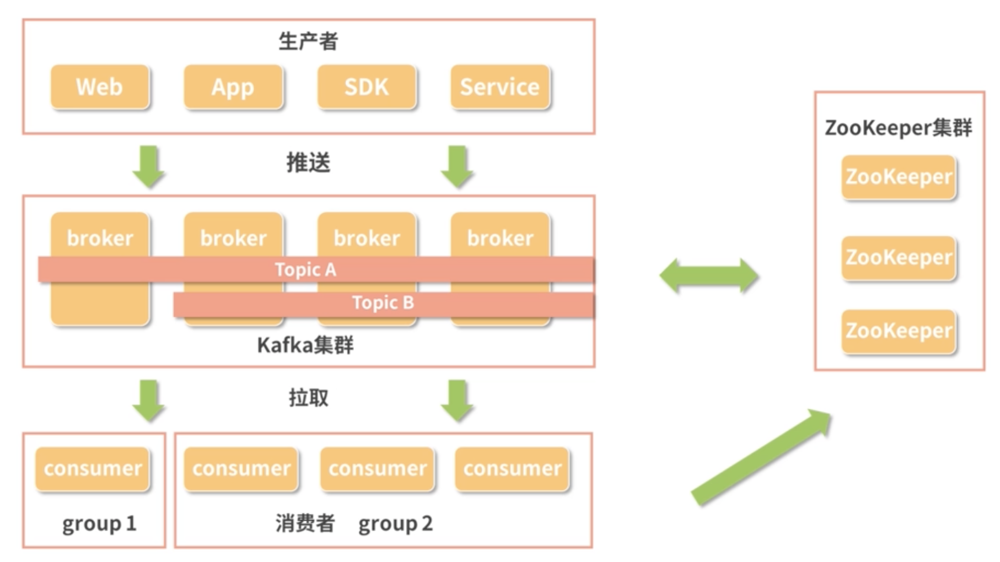
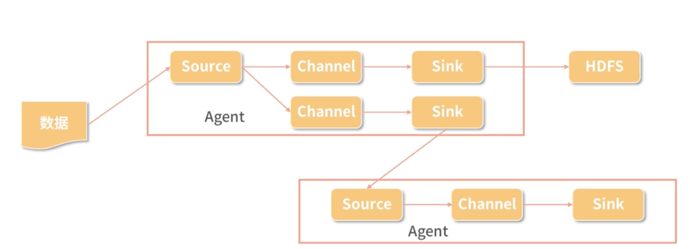

# **第六节 消息系统 Kafka与Flume** 

## **1、什么是 Kafka**

**在大数据的架构中，数据的采集和传输是一个非常重要的环节**，

如何保障如此大批量的数据能够不重不漏的传输，

* 当发生故障时如何保障数据的有效性，
* 当网络堵塞时如何进行缓存，这需要相应的基础设施对其提供支持

**Kafka 也是一个消息系统。所谓的消息系统其实很简单，就是把数据从一个地方发往另外一个地方的工具**

Kafka 也有其自己的特色，它是一个高吞吐量、分布式的发布 / 订阅消息系统，**然而最核心的是“削峰填谷”**

* Kafka 支持多种开发语言，比如 Java、C/C++、Python、Go、Erlang、Node.js 等。现在很多主流的分布式处理系统都支持与 Kafka 的集成，比如 Spark、Flink 等。
* 同时，Kafka 也是基于 ZooKeeper 协调管理的系统，

## **2、Kafka 的结构与概念**

在 Kafka 的基本结构中，有两个重要的参与者：

* 消息的生产者（Producer）；
* 消息的消费者（Consumer）。

如下图所示，Kafka 集群在消息的生产者和消费者之间建立起了联系的机制，来保障消息的运输。

* 生产者负责生产消息，将消息写入 Kafka 集群，
* 而消费者从 Kafka 集群中拉取消息，也可以称为消费消息。

**Kafka 所要解决的就是如何来存储这些消息，如何进行集群调度实现负载均衡，如何保障通信等等问题。**

### **2-1  生产者与消费者**

* 生产者负责将消息发送给 Kafka，它可以是 App，可以是服务，也可以是各种 SDK。
* 消费者则使用拉取的方式从 Kafka 中获取数据。

* 每一个消费者都属于一个特定的小组（Group）
* 同一个主题（Topic）的一条消息只能被同一个消费组下某一个消费者消费，
* 但不同消费组的消费者可同时消费该消息。

依赖这个消费小组的理念，可以对 Kafka 中的消息进行控制，如果需要对消息进行多个消费者重复消费，那么就配置成多个消费组，

**而如果希望多个消费者共同处理一个消息源，那么就把这些消费者配置在一个消费组就可以了**

### **2-2 消息**

**消息就是 Kafka 中传输的最基本的单位**，除去我们需要传输的数据，**Kafka 还会给每条消息增加一个头部信息以对每一条消息进行标记，方便在 Kafka 中的处理**。

### **2-3 主题（Topic）**

在 Kafka 中，**一个主题其实就是一组消息**。在配置的时候一旦确定主题名称，生产者就可以把消息发送到某个主题中，消费者订阅这个主题，一旦主题中有数据就可以进行消费。

### **2-4 分区（Partition）和副本**

在 Kafka 中，**每个主题会被分成若干个分区**。

每个分区是一个有序的队列，是在物理上进行存储的一组消息，**而一个分区会有若干个副本保障数据的可用性。**

**从理论上来说，分区数越多系统的吞吐量越高，但是这需要根据集群的实际情况进行配置，看服务器是否能够支撑。**

与此同时，Kafka 对消息的缓存**也受到分区和副本数量的限制**。**在 Kafka 的缓存策略上，一般是按时长进行缓存**，比如说存储一个星期的数据，或者按分区的大小进行缓存。

### **2-5 偏移量**

偏移量是一种消息的索引。

因为 Kafka 是一个消息队列的服务，我们不能对数据进行随机读写，而是要按照顺序进行，所以需要给每条消息都分配一个按顺序递增的偏移量。这样消费者在消费数据的时候就可以通过制定偏移量来选择开始读取数据的位置

大致的流程为，生产者生产数据，然后把数据推送到 Kafka 集群中，并确定数据流的主题。

**Kafka 集群配合 ZooKeeper 集群完成调度、负载均衡、缓存等等功能，等待消费者消费数据。**

## **3、Kafka 的特点**

经过不断发展，Kafka 已经成为主流的消息队列工具，类似的工具还有 RabbitMQ、Redis 消息队列、ZeroMQ、RocketMQ 等等。

Kafka 最大的特色就是“削峰填谷”，这是它在应用上的特点，这里的谷和峰指的是数据流量的谷和峰，削峰填谷的含义即在数据生产方 A 和数据消费方 B 对数据流量的处理能力不同的时候，我们就可以使用 Kafka 作为中间传输的管道。

### **3-1 消息持久化**

**Kafka 选择以文件系统来存储数据。**

而 Kafka 会把数据存在磁盘上

* 磁盘的存储容量大
* 经过持久化的数据可以支持更多的应用

### **3-2 处理速度快**

硬盘是使用物理磁头来进行数据读写的，**通常磁盘的速度都以转数来描述，比如 5400 转、7200 转**

* 因为随机寻址的话，需要通过转动移动到下一个地址。
* **但是由于 Kafka 是队列的形式，创造性地对磁盘顺序读写，大大增加了磁盘的使用效率，既获得了大存储量，又提高了速度**。
* 同时 Kafka 中还加入了很多其他方面的优化，比如通过数据压缩来增加吞吐量、支持每秒数百万级别的消息。

### **3-3 扩展性**

与大数据体系中的其他组件一样，Kafka 也同样支持使用多台廉价服务器来组建一个大规模的消息系统，通过 ZooKeeper 的关联，Kafka 也非常易于进行水平扩展。

### **3-4 多客户端支持**

前面我们也提到了，Kafka 支持非常多的开发语言，比如 Java、C/C++、Python、Go、Erlang、Node.js 等。

### **3-5 Kafka Streams**

Kafka 在 0.10 之后版本中引入 Kafka Streams，能够非常好地进行流处理。

## **4、什么是 Flume**

### **4-1 数据采集**

为前端用户使用的客户端，不管是 App、网页还是小程序，在用户使用的时候，**会通过 HTTP 链接把用户的使用数据传输到后端服务器上**，

服务器上运行的服务把这些回传的数据通过日志的形式保存在服务器上，

而从日志到我们将数据最终落入 HDFS 或者进入实时计算服务中间还需要一些传输。

### **4-2 实现方法**

* 比如说在 Java 开发中，
* 可以借助 `kafka-log4j-appender `类库把 log4j（日志记录类库）
* 记录的日志同步到 Kafka 消息队列，由 Kafka 传输给下游任务。
* 然而这种方式比较简陋，并不太适合大规模集群的处理，因此，这里就有一个日志采集工具，那就是 Flume。

### **4-3 Flume 是一个高可用、分布式的日志收集和传输的系统**

Flume 有源（Source）、通道（Channel）和接收器（Sink）三个主要部分构成。

这三个部分组成一个 Agent，每个 Agent都是独立运行的单位，而 Source、Channel、Sink 有各种不同的类型，可以根据需要进行选择：

* Channel 可以把数据缓存在内存中，也可以写入磁盘；
* Sink 可以把数据写入 HBase；
* HDFS 也可以传输给 Kafka 甚至是另外一个 Agent 的 Source。

## **5、Flume 中的概念**

### **5-1 源（Source）**

Source 是负责接收输入数据的部分，Source 有两种工作模式：

* 主动去拉取数据；
* 等待数据传输过来。

在获取到数据之后，Source 把数据传输给 Channel。

### **5-2 通道（Channel）**

Channel 是一个中间环节，是临时存储数据的部分，Channel 也可以使用不同的配置，比如使用内存、文件甚至是数据库来作为 Channel。

### **5-3 接收器（Sink）**

Sink 则是封装好的输出部分，选择不同类型的 Sink，将会从 Channel 中获取数据并输出到不同的地方，比如向 HDFS 输出时就使用 HDFS Sink。

### **5-4. 件（Event）**

Flume 中传递的一个数据单元即称为事件。

### **5-5 代理（Agent）**

正如我们前面介绍的，一个代理就是一个独立的运行单元，由 Source、Channel 和 Sink 组成，一个 Agent 中可能有多个组件。

## **6、Kafka 与 Flume 的比较**

在数据传输方面，Flume 和 Kafka 的实现原理比较相似，但是这两个工具有着各自的侧重点。

* Kafka 更侧重于数据的存储以及流数据的实时处理，是一个追求高吞吐量、高负载的消息队列。
* 而 Flume 则是侧重于数据的采集和传输，提供了很多种接口支持多种数据源的采集，但是 Flume 并不直接提供数据的持久化。

就吞吐量和稳定性来说，Flume 不如 Kafka。

而对于Flume 则是提供了更多封装好的组件，也更加轻量级，最常用于日志的采集，省去了很多自己编写代码的工作。

**由于 Kafka 和 Flume 各自的特点，在实际的工作中有很多是把Kafka 和 Flume 搭配进行使用，比如线上数据落到日志之后，使用 Flume 进行采集，然后传输给 Kafka，再由 Kafka 传输给计算框架 MapReduce、Spark、Flink 等，或者持久化存储到 HDFS 文件系统中**。