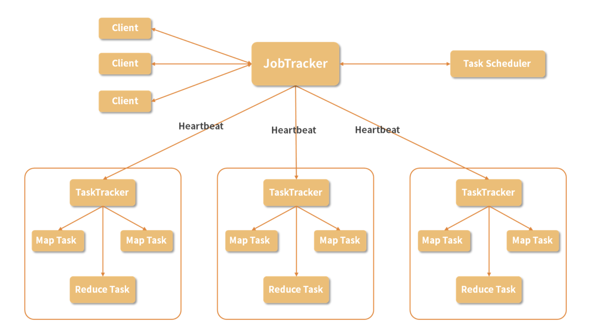

# **第七节 MapReduce 处理大数据**

## **1、MapReduce 的架构**

MapReduce 即是采用了这种分而治之的处理数据模式，将要进行的数据处理任务分成 Map（映射）和 Reduce（化简）这两个处理过程。

这样做最大的好处就是可以把**大规模数据分布到普通性能的服务器中进行预处理**，然后将处理后的结果重新进行整合，从而得到需要的结果。

除了计算本身，MapReduce 还解决了协调这些集群中的服务器的问题，

* 比如在若干台机器中执行运算的顺序、
* 计算压力的分配、
* 操作的原子性等等

跟 HDFS 一样的，**MapReduce 也是采用主从结构的架构**

### **1-1 Job**

Job 即是作业，一个 MapReduce 作业是用户提交的最小单位，比如说我们在下面即将动手运行的 WordCount 运算就可以称为一个作业。

### **2-2 Client**

Client 就是客户端，是用户访问 MapReduce 的接口，通过 Client 把编写好的 MapReduce 程序提交到 JobTracker 上。

### **2-3 JobTracker**

在 MapReduce 中，为了实现分布式的管理架构，使用了领导和随从的模式。

而 JobTracker 就是这个体系中的领导。一个 MapReduce 集群只有一个JobTracker，这个节点负责下发作业，同时，它要收听来自很多 TaskTracker 的状态信息，从而决定如何分配工作。在这个集群中，JobTracker“既当爹又当妈”，而且只有一个，存在单点故障的可能，必须给它安排一个好点、稳定点的机器，不然如果它罢工了，将导致集群所有正在运行的任务全部失败。

### **2-4 TaskTracker**

**TaskTracker 在集群中则扮演了随从的角色，主要负责执行 JopTracker 分配的任务，同时 TaskTracker 通过 Heartbeat（心跳信息）汇报当前的状态，JobTracker 根据这些状态再进行任务的分配**。

随从是具体负责工作的，人多力量大，一个集群自然可以有多个 TaskTracker。

在一个实际的节点上，会有一个 TaskTracker ，还有我们在 HDFS 环节介绍的 DataNode，这样，一个节点既是计算部分又是存储部分，在进行运算时，可以优先进行本机数据本机计算，从而提升效率。

### **2-5 Task**

Task 称为任务，是在 MapReduce 实际计算时的最小单位，**Task 有两种：MapTask 和ReduceTask，由 TaskTracker 进行启动**。

### **2-6 Split**

除了在图中出现的概念，还有一个 Split，称为一个划分，这是 MapReduce 处理的元数据信息，Split 会记录实际要处理的数据所在的位置、大小等等。在《07 | 专为解决大数据存储问题而产生的 HDFS》中，我们介绍了数据块的概念，Split 实际的数据就存储在 HDFS 的数据块中，通常我们会把 Split 的大小设置成与数据块大小一致，每次需要处理的数据存放在一个位置，这样可以减少不必要的网络传输，节约资源，提升计算速度。

了解完这么多概念，我们再回顾一下整个处理流程：

* 我们编写一个 MapReduce 程序，这可以称为一个 Job，在这个程序中往往包含较多的 Map 操作，和较少的 Reduce 操作；
* 通过 Client 把 Job 提交到 JobTracker 上，JobTracker 会根据当前集群中 TaskTracker 的状态，分配这些操作到具体的 TaskTracker上；
* TaskTracker 启动相应的 MapTask 或者 ReduceTask 来执行运算。

### **2-7 MapReduce具体的运算**

MapTask 读取 Split 的数据，根据事先写好的程序对其中的每一条数据执行运算，比如说后面的单词计数代码，我们输入的是若干文本文件，Map 操作处理每一行文本，并为一行中的单词进行计数，然后把结果保存下来。

而在 ReduceTask 中，获取之前 Map 的预处理结果，并对数据进行分组，**比如说相同单词分为一组，然后进行加和运算。对于 Reduce 的输出结果，会存储三个副本。**

## **3、MapReduce 的特点**

1. 简化了分布式程序的编写
2. 可扩展性强
3. 容错性强

## **4、MapReduce 的硬伤**

1. 学习成本高
2. 时间成本过高

MapReduce 是纯粹的批处理模式，也就是说所有的数据都是事先已经存储好的，MapReduce 只是对这些数据进行批量的处理，这对于互联网中大量的流式数据无法给到很好的支持，如果我们想要处理今天的数据，要等到今天的数据都已经存储好再进行计算，而不能随来随算。

