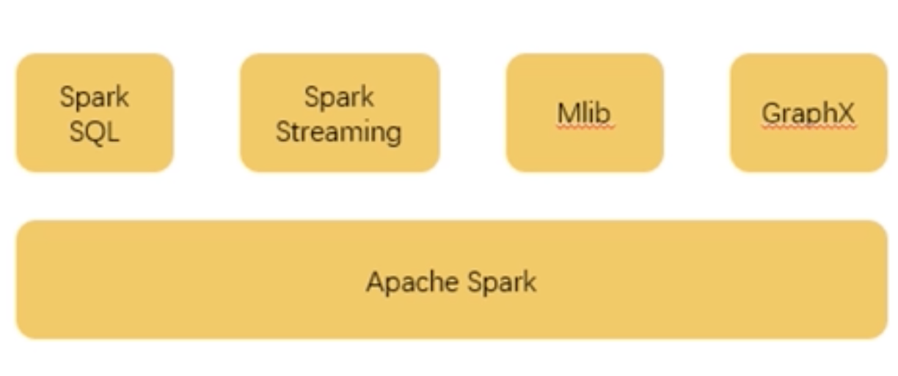
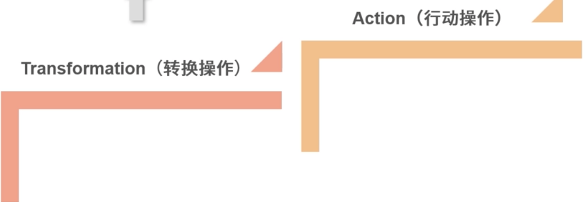
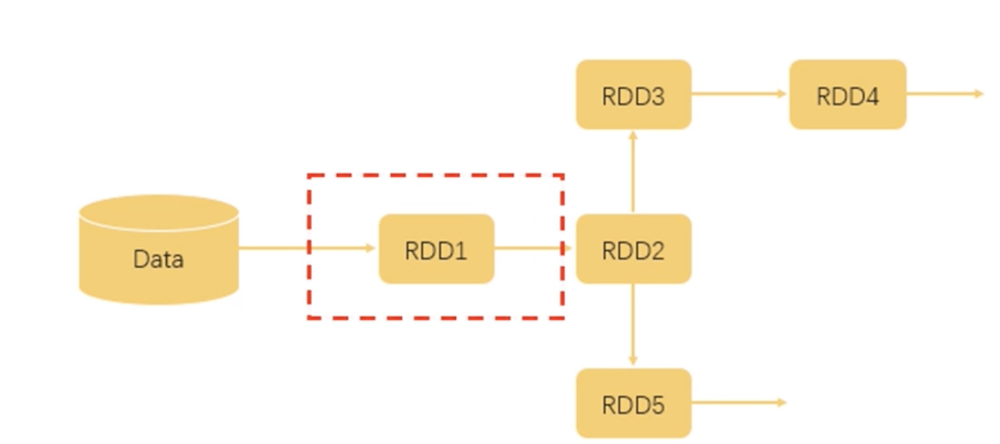
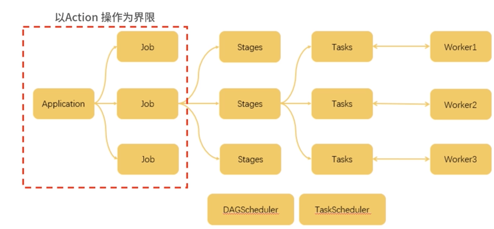
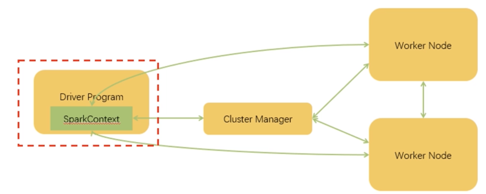
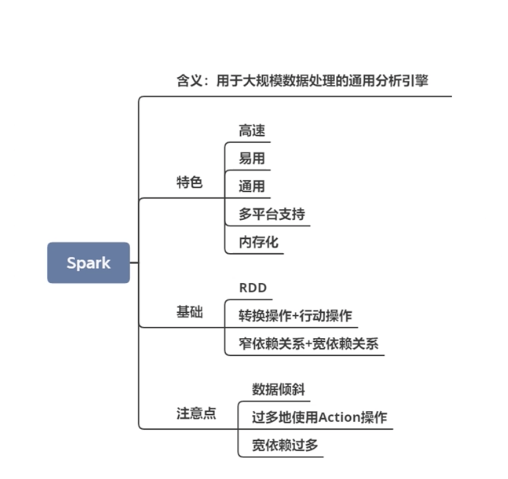

# **第八节 Spark 与 Flink 的爱恨情仇 (Spark)**

**MapReduce 的主要功能就是并行计算**，但是它也不是十全十美的，MapReduce 高成本的硬伤使得它已经不能很好地解决新时代的问题

## **1、什么是 Spark**

Spark 是用于大规模数据处理的通用分析引擎。 Spark 的功能，

* 一个是针对大规模数据
* 一个是通用分析引擎

### **1-1 Spark 的发展历程**

在 2009 年，加州大学伯克利分校的 RAD 实验室（AMP 实验室前身）推出了 Spark 框架，并表明 Spark 是一个类似 MapReduce 的通用并行框架，可用来构建大型的、低延迟的数据分析应用程序。实验室的研究人员在使用 MapReduce 时发现它在迭代计算和交互计算上效率低下，于是开始设计 Spark。很快，Spark 在一些任务上的效率就已经比 MapReduce 提升了 10 倍以上。

**Spark 在互联网公司的大数据架构中逐渐成为主流计算框架。**

### **1-2 Spark 的特色**

* **高速**

Spark 使用了最新的 DAG 调度方案，查询、优化和物理执行引擎，在批处理和“流”处理上都表现优异。

* **易用**

Spark 提供了 80 多种高阶操作，构建应用更加方便。Spark 还提供了多种语言支持，使用 Java、Scala、Python、R 甚至是 SQL 都可以非常容易地编写 Spark 程序。


* **通用**

如下图所示，Spark 除了提供计算框架以外还整合了 SQL、流式处理，**以及机器学习算法库和图操作算法库。其中 Spark SQL 支持使用 HiveQL 和 Spark 进行交互**。




* **多平台支持**

	* Spark 本身是可以独立运行的，当然，它也可以运行在 Hadoop、Mesos、Kubernetes，甚至是云平台上。
	* 支持访问各种不同的数据源，比如 HDFS、HBase、Hive、Cassandra 都是可以的。

* **内存化**

在运算流程上，Spark 和 MapReduce 基本上是一致的，但是有一个很大的不同就是中间结果的存储：

1. MapReduce 所有的中间结果都是保存在磁盘上；
2. 而 Spark 的中间结果是保存在内存中的。


## **2 Spark 基础**

### **2-1 RDD Resillient Distributed Dataset（弹性分布式数据集)**

它是 Spark 的一个基本数据结构，**也是Spark 最核心的数据结构**。

* Spark 在运行时，会将 RDD 分割成不同的 Partition（分区），并把这些分区投放到不同的计算节点下面，进行并行运算
* Spark 程序的整个生命流程，就是对这些数据的处理，创建 RDD、转换 RDD、调用 RDD 操作计算各种结果等

### **2-2 两种操作**


在我们的运算中，通常包含两种操作，**一个是Transformation（转换操作），一个是Action（行动操作）。这两个操作最大的区别是 Spark 对它们的处理逻辑是不一样的**。

* **如说 Filter（过滤），这些操作是对 RDD 本身的一些操作**,
	* 其结果是数据的规模发生变化，而数据的类型或者说内容不会发生变化 
* **Spark 是进行惰性运算**
	* Spark 只是记录下这个操作，而不会真的去执行它。
	* 只有当 Spark 遇到了行动操作，才会把之前的转换操作进行统一的处理，我们可以认为行动操作是一些产生结果的操作，它的输出是非 RDD 对象。



```
val RDD1 = sc.textFile("data.txt")
val RDD2 = RDD1.map(x => x+1)
val RDD3 = RDD2.filter(lambda x: "Python" in x)
val RDD4 = RDD3.reduceByKey((x,y) => x + y)

val RDD5 = RDD2.filter(lambda x: "Java" in x)
RDD5.count
```



* 首先，我们从文件中读取数据，这时候形成 RDD1。
* 后面两步执行了 map、filter 和 reduceByKey 操作，map 操作给所有值加了 1，而 filter 操作过滤出带有 Python 的数据，reduceByKey 对 x 和 y 进行相加。这几个操作都属于 Transformation 操作，输出的结果都仍然是 RDD。
* 而最后一行执行了 count 操作，count 就是一个 Action 操作，它返回的是 RDD5 中的数据元素个数。


* 如果 Spark 对每一步都认真执行，那么第一步读取文件后，就已经把全量的数据存储在了内存中
* 但实际这并没有什么用，当 Spark 根据上面的执行逻辑分析了运算流程之后，
* 会对 Transformation 操作进行整合，
* 直到遇到 Action 操作才真正去进行运算。


## **3、两种依赖关系**

由于在 Spark 中流转的数据通常都是RDD 格式，从我们的代码可以看出，每一步生成的 RDD 都会依赖于上一步的 RDD，所以，具备上下联系的 RDD 产生的关系被称为依赖关系

根据不同情况又分成**窄依赖关系和宽依赖**关系两种：

* 窄依赖关系指的是生成下级 RDD 不会引起数据在不同的分区（Partition）之间进行迁移（Shuffle）；
* 宽依赖指的是要生成的 RDD 依赖于多个分区的数据，很明显这会导致处理速度的下降。



当我们编写了一个 Spark 程序，也就是一个 Application 时：

* 这个 Application 以 Action 操作为界限，被划分成多个 Job；
* 一个 Job 以 Shuffle 为界限被划分成多个 Stage；
* 而一个 Stage 又会分成多个 Task，Stage 的划分和调度是由 DAGScheduler 来负责的，而 Task 由 TASKScheduler 来进行调度。

**这些调度的终极目标就是根据依赖的关系找出开销最小的调度方法**

最终，这些任务被分派到不同的 Worker 上进行运算。



如上图所示，这里的 Driver 也就是我们在代码中常说的 main 函数，当它被执行时会创建一个 SparkContext 对象，这个对象会与服务器中的 Cluster Manager 进行通信，从而申请任务所需要的资源。当成功获得资源之后，它的 Task 会被分配到 Worker 的执行器中，从而处理对应的运算。

## **4、开发时需要注意的问题**

### **4-1 数据倾斜**

由于 RDD 数据会被分配到不同的分区，存在常见的问题就是**数据倾斜**，某些分区分配了过多的数据，而另外的一些分区则分配了很少的数据，这会导致一些节点的运算过于缓慢。

### **4-2 过多地使用 Action 操作**

由于 Action 操作会引发真正的运算，并对数据进行缓存，所以，如果 Action 操作太多会造成内存的大量消耗，从而占用过多的资源。

### **4-3 宽依赖过多**

宽依赖会引发 Shuffle，将不同 Partition 的数据迁移到同一个 Partition 中去，所以这个操作也会消耗很多时间。


