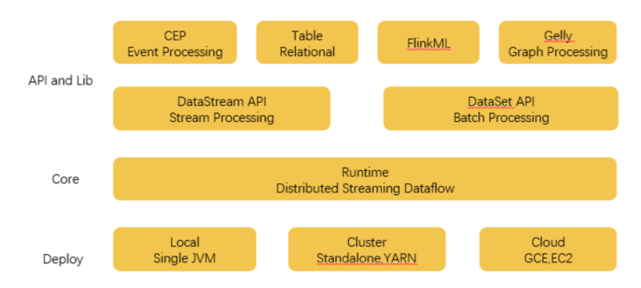
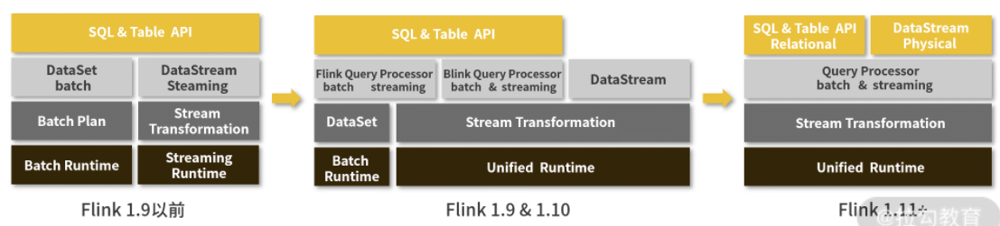

# **第九节 Spark 与 Flink 的爱恨情仇 (Flink)**

在介绍 Flink 之前，我想先介绍两个概念：**批处理与流处理。**

## **1、批处理与流处理**

### **1-1 批处理**

所谓的批处理，就是**把一整块数据切分成一小块一小块，每一个小块称为一批**。

把一个小块数据分配给一个计算节点进行运算，这种情况称为批处理。

**批处理针对的数据是一个有限集合，也就是有界数据**

这些数据在处理之前就已经存储在我们的源数据地址，当我们要进行处理的时候直接从这个数据集进行读取就可以了

### **1-2 流处理**

与批处理相对的，流处理的数据是无界的，数据就像一条河里的水源源不断地从上游流到计算框架中，我们不知道数据的总量是多少，也不知道什么时候结束

## **2、什么是 Flink**

Apache Flink 是一个框架和分布式处理引擎，用于在无边界和有边界数据流上进行有状态的计算，Flink 能在所有常见集群环境中运行，并能以内存速度和任意规模进行计算。

Flink 的功能与 Spark 也基本一致，都属于大数据计算框架。

## **3、Flink 的特色**

### **3-1 数据皆流**

在 Flink 的构建思想上，**把所有的数据都看作是流式数据，所有的处理方式都是流处理**

对于事实上的批数据，只不过当成一种特殊的数据流，我们称之为有界流，也就是说这个流数据有开始有结束，我们可以等着这个流获取完全后统一进行计算。

对于在我们公司中真正的流数据，我们将其称为无界流，这个数据只有开始，没有结束。只要我们的业务还在运转，用户还在浏览我们的 App，查看、下单、支付数据就会源源不断地传送过来

处理这种数据，不光是汇总起来就完事了，**很多时候还需要注意数据的顺序**，

比如说正常情况下肯定是先点击，再下单，最后支付。如果数据的顺序搞错了，已经有了支付，但是没有点击和下单，那这数据计算起来就乱了套了。

* 在数据接收方面，**Flink 与 Kafka 有异曲同工之妙，都是基于事件驱动的，也就是数据随来随处理，**
* 而 Spark 实现的流处理实际上是微批处理，只是把数据块划分的更小。
* 同时，**Flink 还有精确的时间控制和状态以保障一致性**。

### **3-2 多平台支持**

同 Spark 一样，Flink 可以作为单独的服务进行部署运行，也可以与 Hadoop、Mesos、Kubernetes 集成部署。

### **3-3 高速**

**同样的，Flink 也使用了内存作为计算的中间缓存。**

在前面我们已经知道，批处理由于是已经累积下来的数据，所以需要大吞吐量，而流处理是来即处理，需要的是低延迟。

在 Flink 中，使用了一种缓存块机制来保障两种计算的速度。当缓存块的超时时间设置为 0，那么只要有数据就立即处理，适合处理无界数据，而当缓存块超时时间设置为无限大，那么就要等着数据结束才处理，这样更适合有界数据。

## **4、Flink 的组件架构**

与 Spark 类似，Flink 也实现了用一整套组件来支持整个体系的运转，如上图所示。

* 最底层是部署相关的组件，包括了支持本地单机部署、集群部署，以及云上部署的组件。

* Core 核心层，是 Flink 实现的最关键组件，包括支持分布式的流处理运算，各种分配和调度系统都在这一部分实现，为更上层的 API 提供基础服务，这也为用户的方便使用奠定了基础。

* API 和 Lib 层，提供了流处理和批处理计算的各种 API，以及针对特定的计算支持库，比如 FlinkML 就是和 SparkMlib 类似的机器学习库，而 Gelly 是和 GraphX 类似的图处理计算库。

## **5、Spark VS Flink**

### **5-1 核心实现**

在核心实现方面：

* Spark 主要使用 Scala 语言编写而成；
* 而 Flink 早期是使用 Java 进行编写的，但是后期的很多更新也使用了 Scala 语言。

### **5-2 编程接口**

在编程接口方面，Spark 和 Flink 就更加相似了。二者都提供了对各种编程语言的支持，包括 Java、Python、Scala 等，都可以用来编写 Spark 或者 Flink 程序。

### **5-3 计算模型**

计算模型，或者我们也可以叫作设计理念

Flink 是把所有数据都看作流来进行处理，所以它本身对流式数据有着非常优秀的计算性能，在流计算方面做了大量的优化

而 Spark 虽然也是混合计算框架，但是 Spark 的设计理念是批处理，也就是所有数据都是批数据。在处理流数据的时候使用了模拟的办法，把数据分割成更小的批来进行处理，从而模拟流式处理，所以在 Spark 中的流处理，我们也可以称为微批处理。

**Flink 选择了‘batch on streaming’的架构，不同于 Spark 选择的‘streaming on batch’架构”**。

早期的 Flink 由于针对流处理进行的优化，也使得它在批处理方面仍然没有 Spark 性能良好

### **5-4 流批一体**

在最近的两年内，Flink 主打流批一体的升级，从上面的架构图变化我们可以看出来，在最新的 1.11 版本，不管是 SQL 还是 DataStream API，都已经可以使用同一套编写规范，而只需要进行简单的选择就可以进行批处理或者流处理。

随着流批一体技术的实现，使用 Flink 的公司不再需要维护两套架构，部署两套代码，维护成本会进一步降低，觉得 Flink 会变得更加普及，甚至是取代 Spark 成为新一代主流计算框架。

