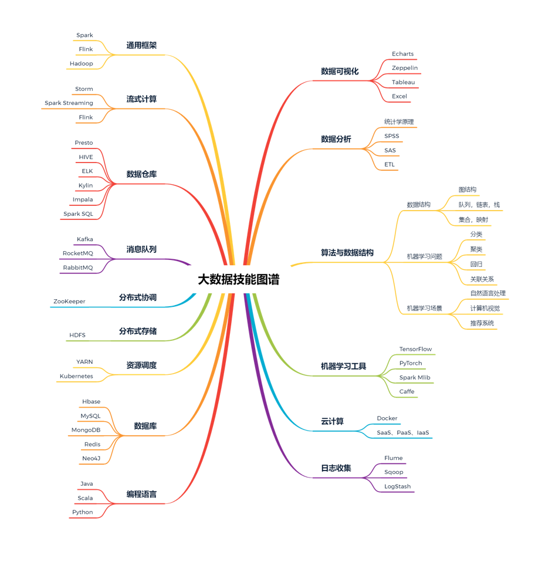

# **第一节 大数据体系中明确路径**

大数据体系如此庞大，它的职业发展路径无疑也有很多，我总结了 3 大方向

* **“大数据架构”方向**。主要工作是从众多的大数据工具中选取合适的工具，并能够让这些工具在庞大的云服务器或者集群中良好的配合和运转，来支撑上层的应用。职业发展路径为：**数据运维工程师 → 高级运维工程师 → 架构师 → 技术专家**。所涉及的技能主要在上面图谱的左半部分，比如通用框架、流式计算、消息队列、资源调度等。
* **“大数据开发”方向**。每家公司的情况各不相同，业务也各不相同，因此要想数据能够在这些工具中良好地运转，以及适配公司业务，就需要大数据开发工程师来进行建设。职业发展路径为：**开发工程师 → 高级开发工程师 → 组件代码提交者**。所涉及的技能也是图谱的左半部分居多，但与架构方向不同，重点在于熟悉这些工具的用法
* **“数据挖掘与分析”方向**。有了底层的框架和适配公司业务的各种系统，这时候就轮到数据挖掘与分析工程师来对数据进行精加工，从而在大数据中发现对业务有帮助的部分，最终实现数据到现金的转化。这一方向的职业发展路径为：**数据清洗师 → 数据分析师 → 高级数据分析师 → 数据科学家**。该方向的技能主要分布在图谱的右侧，比如数据可视化、机器学习工具、算法与数据结构等。

## **1、课程共划分 5 个模块**

* **模块一，大数据简介**
* **模块二，大数据架构**
* **模块三，大数据开发**
* **模块四，数据挖掘与分析**
* **模块五，大数据应用**

## **2、大数据简介**

### **2-1 大数据的 4 个重要特点**

**数量多（Volume）、种类多（Variety）、速度快（Velocity）及数据价值（Value）。**

大数据是有价值的，但是大数据价值有一个特色——价值密度低。

### **2-2 大数据的工作环节**

* 数据的采集
* 数据的存储
* 数据的计算
	* 目前主流的就是**批处理和流处理**两种方式，而针对这些方式，**又有多种计算框架被研制出来，比如当前应用广泛的 Spark、Flink 等**。 
* 数据挖掘与分析
* 数据的应用
* 数据安全

## **3、大数据de发展**

### **3-1 大数据的发展过程**

早在 1980 年，大数据这个词被阿尔文·托夫勒写在了他的新书《第三次浪潮》里，不仅如此，他还声称大数据是第三次浪潮的华彩乐章，这就是大数据一词的由来。阿尔文·托夫勒是一位著名的未来学家，他非常成功地预测了大数据的爆发。

2004 年前后，谷歌发表了三篇论文，也就是我们常说的大数据三驾马车：

* 分布式文件系统GFS；
* 大数据分布式计算框架MapReduce；
* NoSQL 数据库系统BigTable。

这 3 篇论文的发表惊醒了很多懵懂的人，也解决了大数据体系中最核心的 3 个问题：

* **GFS 文件系统解决了数据的底层存储问题；**
* **计算框架 MapReduce 解决了数据的处理运算问题**；
* **BigTable 数据库系统解决了数据的有序组织问题**。

### **3-2 工作方向选择**

**1、大数据架构方向**

大数据架构方向涉及偏向大数据底层与大数据工具的一些工作。做这一方向的工作更注重的是：

* Hadoop、Spark、Flink 等大数据框架的实现原理、部署、调优和稳定性问题；
* 在架构整合、数据流转和数据存储方面有比较深入的理解，能够流畅地落地应用；
* 熟知各种相关工具中该如何搭配组合才能够获取更高的效率，更加符合公司整体的业务场景。

从事这一方向的工作，需要具备以下技术。

* **大数据框架：Hadoop、Spark、Flink、高可用、高并发、并行计算等**。
* **数据存储：Hive、HDFS、Cassandra、ClickHouse、Redis、MySQL、MongoDB 等**。
* **数据流转：Kafka、RocketMQ、Flume 等。**

**2、大数据分析方向**

* 数据分析：ETL、SQL、Python、统计、概率论等。
* 数据挖掘：算法、机器学习、深度学习、聚类、分类、协同过滤等。

**3、大数据开发方向**

大数据开发是大数据在公司内使各个环节得以打通和实施的桥梁和纽带，爬虫系统、服务器端开发、数据库开发、可视化平台建设等各个数据加工环节，都离不开大数据开发的身影。大数据开发需要具备 2 方面的能力：

* 要了解大数据各类工具的使用方法；
* 要具备良好的代码能力。

需要具备的技术有这些：数仓、推荐引擎、Java、Go、爬虫、实时、分布式等。

