# **数据库、数据湖、数据仓库、湖仓一体、智能湖仓**

## **1、数据仓库是个啥？和数据库有什么不同？**

数据库主要用于「事务处理」，存取款这种算是最典型的，特别强调每秒能干多少事儿：QPS（每秒查询数）、TPS（每秒事务数）、IOPS（每秒读写数）等等。

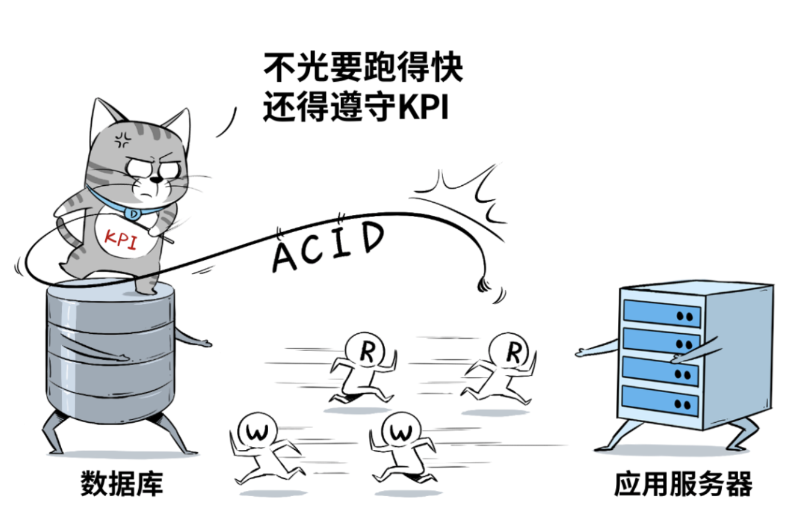

### **1-1 数据仓库**

通常是业务发展到一定规模后，业务分析师、CIO、决策者们，希望从大量的应用系统、业务数据中，进行关联分析，最终整点“干货”出来。

可是，数据库“脑容量不足”，擅长**事务性**工作，不擅长**分析型**的工作，于是就产生了**数据仓库**。

虽然现在HTAP的概念很盛行，也就是混合事务/分析处理，用一套数据库架构来同时支持事务(OLTP)和分析(OLAP)两种需求，但真正大规模的分析和洞察，还是离不开数据仓库。

**数据仓库相当于一个集成化数据管理的平台，从多个数据源抽取有价值的数据**，在仓库内转换和流动，并提供给BI等分析工具来输出干货。

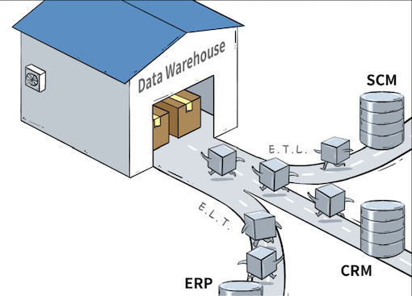

因为分析型业务需要大量的“读”操作，所以数据仓库通过“Denormalized”化的方式优化表结构，减少表间联接，牺牲空间来换取读性能。（一张表里的冗余数据增加了，但查询起来却更快了），并使用列式存储优化，来进一步提高查询速度、降低开销。

再结合面向分析场景的Schema设计，数据仓库就可以高效率、全方位、多维度的扛起“联机分析”重任了。

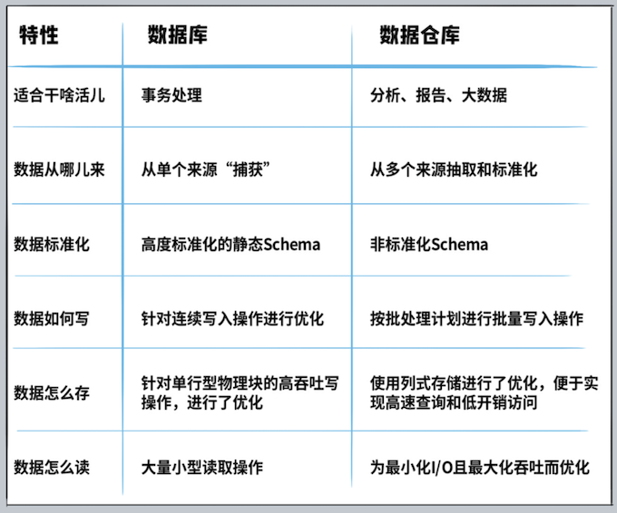

## **2、数据湖又是个啥？**

数据库负责干事务处理相关的事，数据仓库负责干业务分析相关的事，还有新兴的HTAP数据库既干事务又干分析，都已经这么内卷了，还要数据湖来干个毛线？

企业希望把生产经营中的所有相关数据，历史的、实时的，在线的、离线的，内部的、外部的，结构化的、非结构化的，都能完整保存下来，方便“沙中淘金”。

数据湖的本质，**是由“➊数据存储架构+➋数据处理工具”组成的解决方案，而不是某个单一独立产品。**

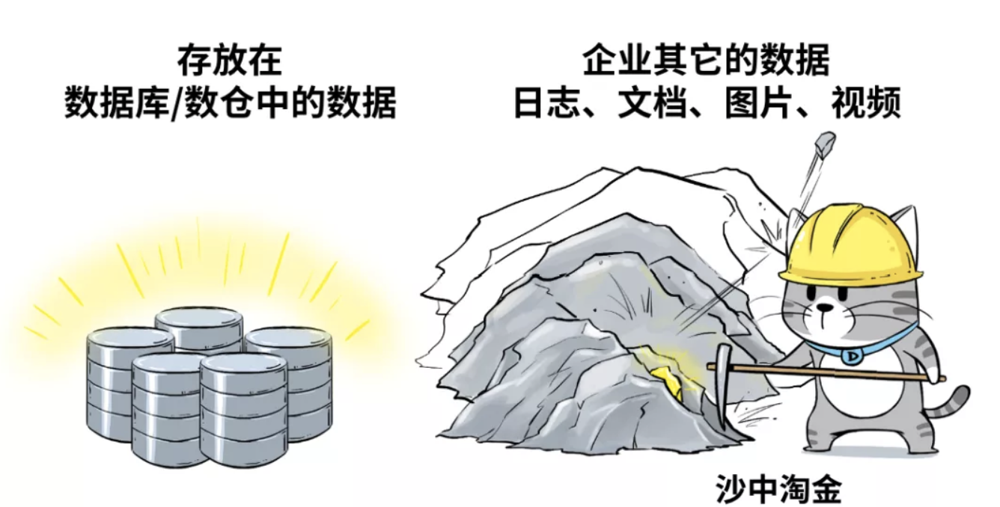

* 数据存储架构，要有足够的扩展性和可靠性，要满足企业能把所有原始数据都“囤”起来，存得下、存得久。比如 Amazon Web Service，修建“湖底”用的“砖头”，就是Amazon S3云对象存储。
* 数据处理工具，则分为两大类↓
	* 第一类工具，解决的问题是如何把数据“搬到”湖里，包括定义数据源、制定数据访问策略和安全策略，并移动数据、编制数据目录等等。

如果没有这些数据管理/治理工具，元数据缺失，湖里的数据质量就没法保障，“泥石俱下”，各种数据倾泻堆积到湖里，最终好好的数据湖，慢慢就变成了数据沼泽。

**Amazon Web Services提供“Amazon Lake Formation”这个工具，帮助客户自动化地把各种数据源中的数据移动到湖里，同时还可以调用Amazon Glue来对数据进行ETL，编制数据目录，进一步提高湖里数据的质量。 **

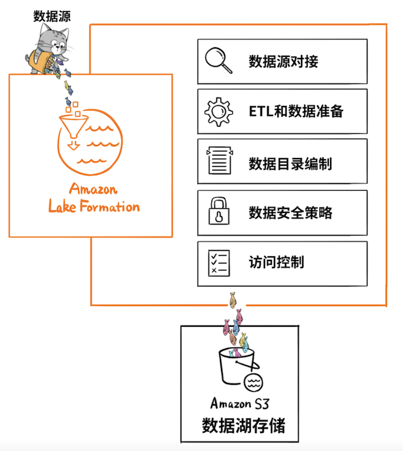

* 第二类工具，就是要从湖里的海量数据中“淘金”。

我们继续拿Amazon Web Services来举例子，基于Amazon Athena这个服务，就可以使用标准的SQL来对 Amazon S3（数据湖）中的数据进行交互式查询。

再比如使用Amazon SageMaker机器学习服务，导入数据湖中的数据进行模型训练，这些都是常规操作。

## **3、数据湖和数据仓库区别**

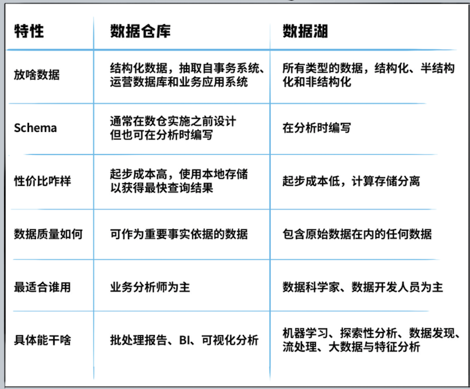

从数据含金量来比，数据仓库里的数据价值密度更高一些，数据的抽取和Schema的设计，都有非常强的针对性，便于业务分析师迅速获取洞察结果，用于决策支持。

而从产品形态看，数据仓库可以是独立的标准化产品，拿云上数仓来举例，Amazon Redshift，就是一款“数仓产品”。

数据湖则是一种架构，通常是围绕对象存储为“湖底座”的大数据管理方案组合。比如，Amazon Web Services并没有哪个产品叫“数据湖”，**而是以 Amazon S3为基础，结合一系列数据管理工具，帮助客户构建云上“数据湖”**

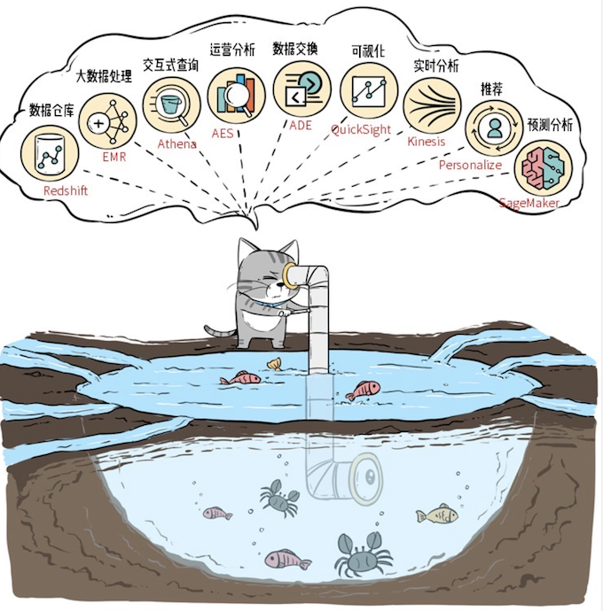

## **4、为什么要把“湖”和“仓”糅到一起？** 

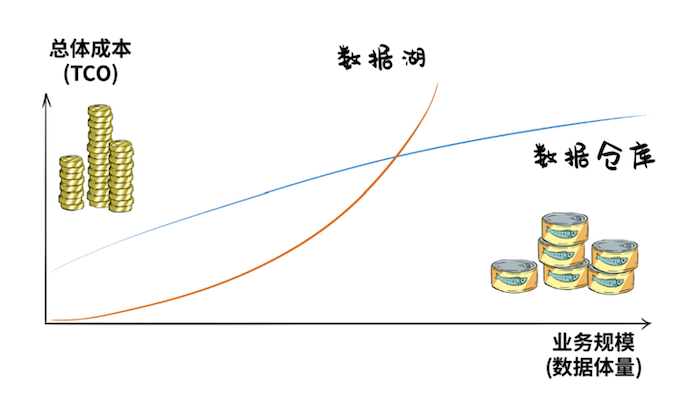

数据湖起步成本很低，但随着数据体量增大，TCO成本会加速飙升，数仓则恰恰相反，前期建设开支很大。

总之，一个后期成本高，一个前期成本高，**对于既想修湖、又想建仓的用户来说**，仿佛玩了一个金钱游戏。

比如，让“数仓”在进行数据分析的时候，可以直接访问数据湖里的数据（Amazon Redshift Spectrum是这么干的）。再比如，让数据湖在架构设计上，就“原生”支持数仓能力（DeltaLake是这么干）。

正是这些想法和需求，推动了数仓和数据湖的打通和融合，也就是当下炙手可热的概念：Lake House。

## **5、到底什么才是真正的Lake House？**

Lake House，坊间通常称之为“湖仓一体”，而Amazon Web Services则叫做“智能湖仓”。

Lake House架构最重要的一点，是实现“湖里”和“仓里”的数据/元数据能够无缝打通，并且“自由”流动。

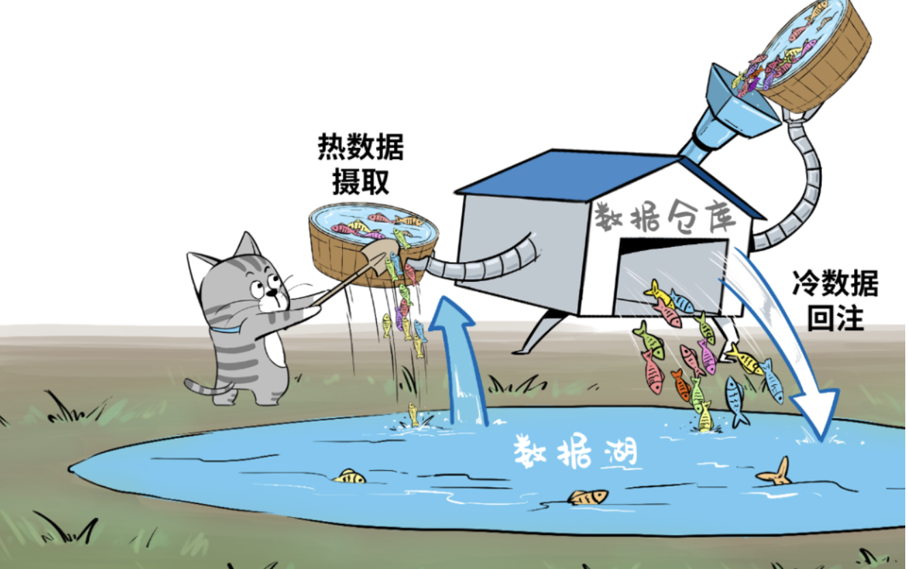

为了实现这个目标，Amazon Web Services推出了 Amazon Redshift Spectrum，打通了数仓对数据湖的直接访问，能够高效查询 Amazon S3 数据湖当中的EB级数据。

“Spectrum”是智能湖仓的核心组件，被称为“Lake House引擎”，它可以在湖与仓之间架起数据流动的管道

* 可以将数据湖中最近几个月的“热数据”摄取到数仓中；
* 反过来，也可以轻松将大量冷门历史数据从数仓转移至成本更低廉的数据湖内，同时这些移到湖里的数据，仍然可以被 Amazon Redshift 数仓查询使用;
* 处理数仓内的热数据与数据湖中的历史数据，生成丰富的数据集，全程无需执行任何数据移动操作；
* 生成的新数据集可以插入到数仓中的表内，或者直接插入由数据湖托管的外部表中。

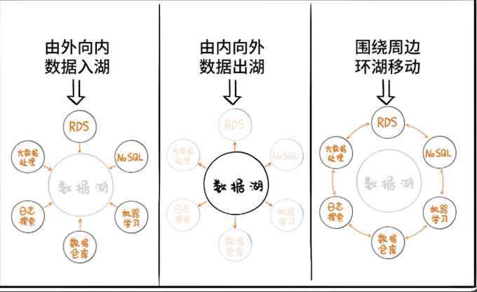

把数据湖和数据仓库集成起来只是第一步，还要把湖、仓以及所有其他数据处理服务组成统一且连续的整体，这就是Amazon Web Services为何把自家的Lake House架构称为“智能湖仓”，而非“湖仓一体”。

## **6、智能湖仓才是终极**

智能湖仓并非单一产品，它描述的是一种架构。

这套架构，以数据湖为中心，把数据湖作为中央存储库，再围绕数据湖建立专用“数据服务环”，环上的服务包括了数仓、机器学习、大数据处理、日志分析，甚至RDS和NOSQL服务等等。

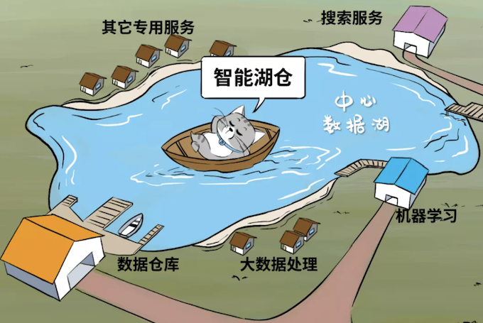

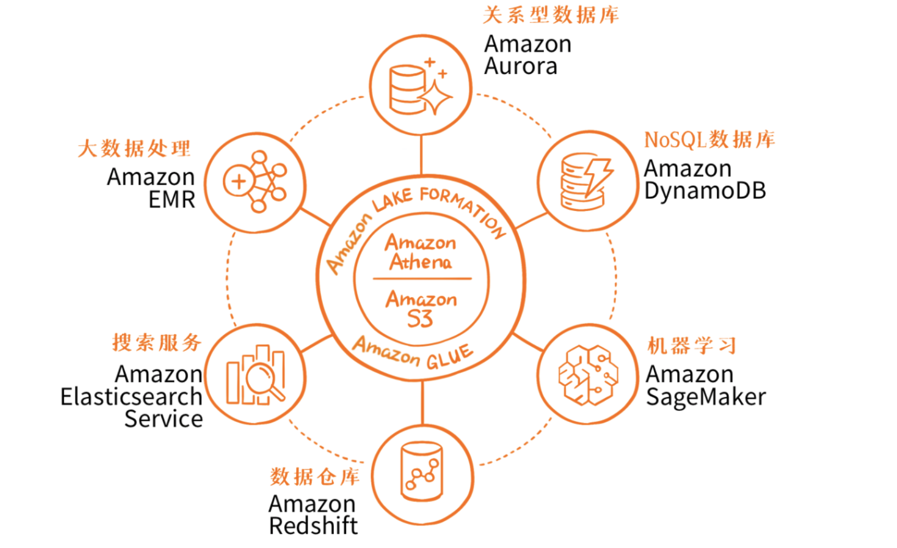

中间是湖，周边集成了全套的云上数据服务，然后还有 Amazon Lake Formation、Amazon Glue、Amazon Athena 以及前面重点提到的 Amazon Redshift Spectrum这些工具，来实现数据湖的构建、数据的管理、安全策略以及数据的移动。

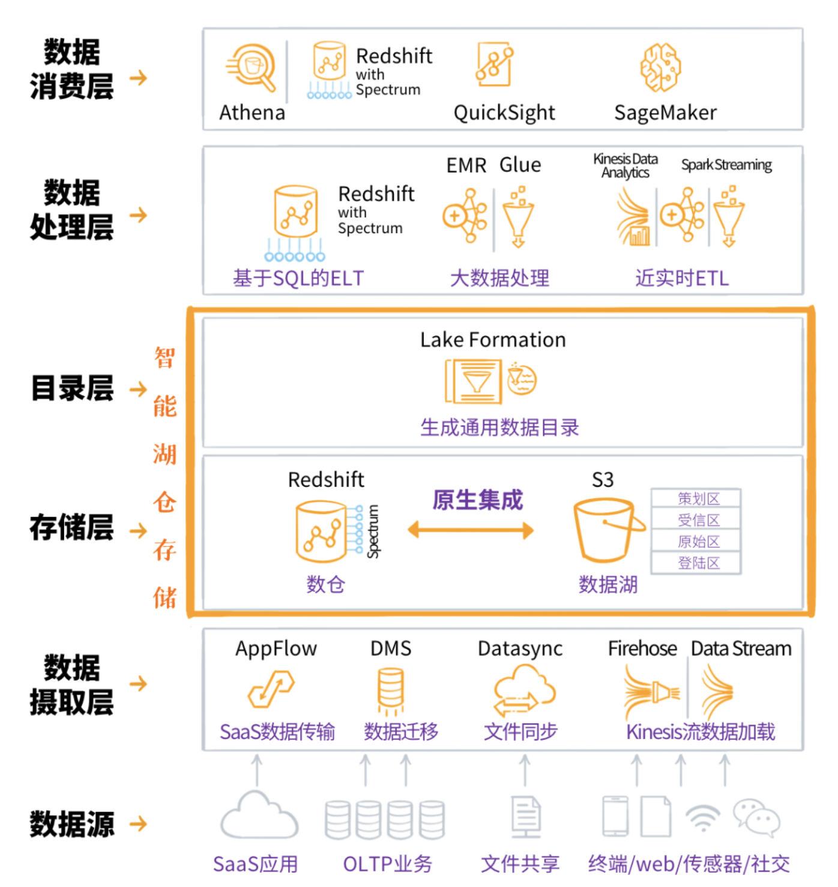