# **20230421-云原生大数据EMR研讨会**

与亚马逊云科技专家们互动并一起参加云原生大数据研讨会，了解与自建大数据平台相比，Amazon EMR是如何帮您节省 **56%** 的运营成本的。借助Amazon EMR，您可以在基础设施成本并末增加甚至减少的同时，通过使用EMR Serverless, EMR on EKS等最新托管服务来支持不断增长的大规模数据分析需求，从而使您的业务脱颖而出。

* 了解Amazon EMR的最新产品信息，包括如何在Amazon Elastic Kubernetes Service(Amazon EKS)容器环境或者 Serverless全托管环境中使用Amazon EMR。
* 初步了解Data on EKS, 包括如何使用Terraform蓝图模板来简化DevOps运维任务等。

### **新趋势**

* Always share data
* Metadata-driven data fabric
* Data-centric AI
* Business-composedD&A
* Context-enriched analysis
* Adaptive AI systems
* Connected governance
* Vendor and region ecosystems
* Decision-centricD&ADecision-centricD&A
* AI risk management
* Expansion to the edge
* Skills and literacy shortfall

### **下一代代数据分析架构**

* **数据服务**
    * Augmented Analytics
    * Continuous Intelligence
    * Conversational Analytics
    * Data Centric AI

* **计算**

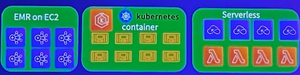

* 存储
    * 对象存储 S3

* 分布式边缘基础设施
    * 

* **增强数椐治理**
    * 数据目录： AWS Glue data catalog
    * 数据安全: AWS Lake Formation
    * 数据主权: Amazon Data Zone
    * 数据质量: AWS Glue data Quality

### EMR 部署模式

自由选择最佳性价比的实例来运行工作负戰

在托管容器服务 EKS 内自动完成集群创建，管理，扩缩容执行Spark任务

在您自己的数据中心部馨、管理、运维EMR如在云上一样轻松

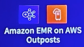

无需管理和运维，在云端也能执行PB级别的大數据分析服务

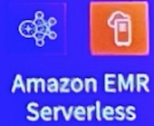

**Spark功能增强**

* 动态Executor资源分配
* 自适应Join方式选择
* 动态裁剪数掘
* 算子优化
* 提前分配 Worker 节点
* 智能过濾
* 井行/ 异步初始化
* 遊免重复扫描數据
* 预先获取敷据
* 智能选择 Broadcast Join
* 統计推断
* 优化元数招取方式

**Presto/Trino 功能增强**

* Spot中断处理(Presto)
* 改进关联的顺序及方法
* 通过Lake Formation进行安全访问控制(Presto)
* 支持Iceberg及Delta(Trino)
* 容错执行(Trino)
* 利用HDFS存储检查点数据 (Trino)

**Hive 功能增强**

* Zero-rename 数据写入
* 元数据 MSCK 优化
* Parquet 模块加密
* 通过Lake Formation进行权限管理
* 在Amazon EMR 6.9支持Iceberg
* 集成300多个关键 Bug,新特性

### **Managed Scaling 功能概述**

> 通过自动调整集群规模降低 60% 的成本

* 持续改进的 EMR 托管箄法为您提供完整的托管体验
* 通过Managed scaling获得高精度指标
* 只需配靈最小/最大成本限制
* 相比 AutoScaling提供更多數据点和更快速的响应
* 解约20-60的成本

**全面的安全功能**

* **隔离**
    * VPC
    * 私有子网
    * 安全组
* **身份验证**
    * LDAP
    * Kerberos
    * Amazon SSO (EMR Studio)
    * Amazon IAM (EMR Studlo)
* **授权**
    * 集群IAM角色
    * AM Execution Role
    * FGAC 使用 Apache Ranger
    * FGAC 使用 Amazon Lake Formation
* **加密**
    * 存储后加密
    * 传输中加密
    * 秘钥管理
* **审计**
    * 使用 Ranger Amazon CloudWatch Logs进行审计
    * 使用 Amazon Lake Formation通过 Amazon Cloudtrail 进行审计

### 多租户共享集群

用户运行角色: User1 可以访问 Stream1, Bucket1 and Table1

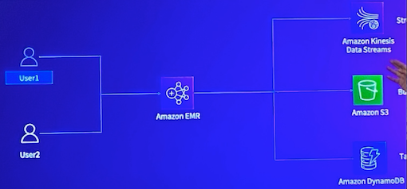

Lake Formation实现细粒度的权限管控

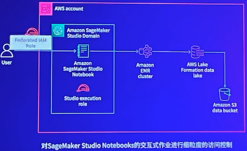

### 构建智能湖仓架构

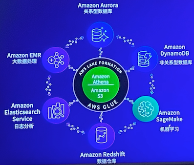

**数据集成**

* 基于CDC技术，提供不便入业务系统的企业吸实时数据
同步服务，保障数据时饮性、可用性；
* 基于WAI架构下的CKP异常自动保存技术，实现断点续
便，面对复的网络状况，也能保证致据传输定性：
* 插件式能力扩展，快速送代数短集成销力和数起习道面
范围

**数据建模**

* 支持逻辑模型、物理模型设计保障建模流程规范可控
* 支持模型逆行工程，快速容纳管理企业存量数据模型
* 融合多个行业最健实践方法论提升建模效率：

**数据开发**

* 交持WEB SQL的可视化离线/实时任务开发，降低用户学习成本：
* 多种任务DAG组尔形式，实现跨流程，跨项目任务依赖，方便支持多种业务场具
* 丰富的大致大数据组件，根质资源现状灵活实原多种任务，资源利用率更
* 支持数据的开发与生产环境隔离、多人协同开发、更安全、更高效：

**数据运维**

* 数据处理任务以DAG组织井监控、任务修复重跑、暂停、Kill等操作更优雅
* 完备的告警体系，支持自定义告警规则和丰富的日志信息，提高运维效率：

**数据服务**

* 拖拽式工作流编排，实现复杂的API的场景
* 统一的企业数据共享服务，严格管控数据使用权限
* 多视角监控及分析服务的使用情况，高效评估数据询产的价值；

**数据质量**

* 覆盖数据资产化全流理进行质置监管和检验，保障数据完整性、有效性、及时性、一致性、准确性、唯一性；
* 内置质量检测规则模板井支持自定义规则，使质量检查场景更丰富
* 支持与ETL任务关联执行质量检查，及时发现问题数据，减少数据污染：

**数据安全**

贯穿数据资产化全场，提供对隐私数据的脱敏权限管理和安全审计等多种数据安全管理全方位保障致据的安全运作

### 客户业务范围及数据分析场景

* 业务范国

容户是广告中间环节服务商，将广告推送到终端投放设备。主要是对按上游广告提供商，和下游设备投放商。

* 技术设备

捕获广告接受和推送的数据，并针对广告推送效率，频次等数据进行分析。以及各个广告线路的成本分擔。

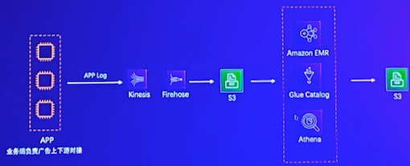

### 方案优势&客户收益

* 学习成本低：在通过一整天的hands on培训，客户第二天就开始测试，第二周就实际在生产环境上线
* 都署便捷：在多环境使用中，都署时间成本低
* 使用成本低：针对低频率的ETL工作，EMR serverless有效降低使用成本
* 资源弹性：针对不同Job，资源弹性分配，十分便捷。降低客户预估资源和准备资源的时间

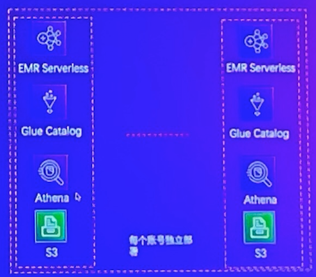

* 根本上解决客户数据附高，成本分担的需求
* 达到客户的降本增效的预期，降本70%以上

### 客户当前架构

* 主业务，依然使用EMR On EC2执行long running任务。
* 子业务，使用EMR Serverless + Athena的方案
* 临时性任务，使用Athena完成查询
* 元数据通过glue catalog管理

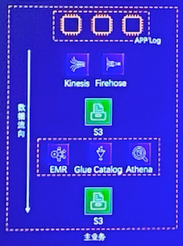

### Amazon EMR Serverless 无需管理运维集群

* 所需版本可随意切换(EMR 6.6+)
* 自动扩缩无需猜测所需资源
* 成本优化更细颗粒度扩缩资源
* 性能优化
* 多可用区域(AZ)设计
* 自动开始和停止任务
* 集成Cloudwatch监测应用
* 集成Apache Airflow
* 自定义镜像

### EMR Serverless 核心概念

**任务**

* 以Spark应用为单位
* 多个任务可以发布到同一个应用
* 可以在任务层面控制权限

**工作节点**

* 工作节点是最小单位用以执行您的工作负载
* 工作节点运行选择的 Spark 或 Hive 版本
* 您可以改变工作节点的配置(内存，VCPU)来控制其性能

**预初始化节点**

* （可选) 设置预初始化工作节点
* 优点：任务可以立即启动无需等待
* 帮助您维护管理一个预热的资源池随时执行任务
* 缺点：需要对与预初始化节点资源同样付费

### EMR Serverless 工作示意图

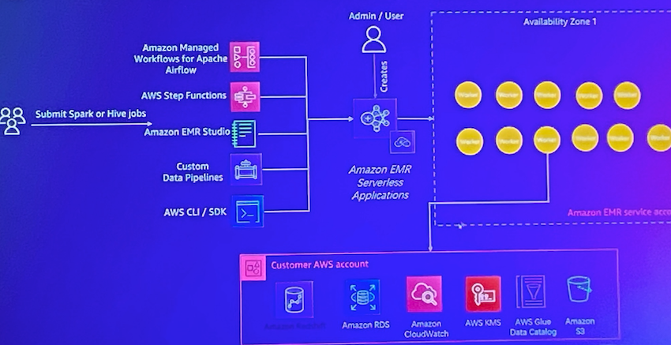

**EMR部署模式成本比较**

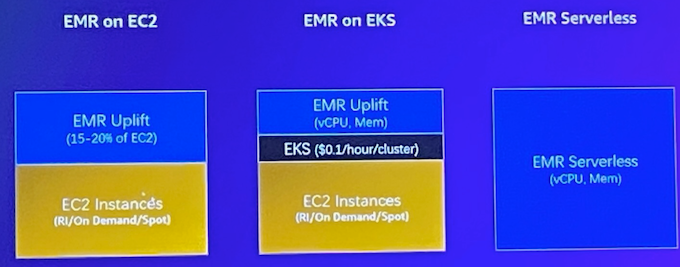

## Amazon EMR on EKS

Consolidate analytics workloads with other workloads on Amazon EKS

* Simplify infrastructure management
* Consolidate multiple versions of Spark on same EKS cluster and simplify Spark application upgrades
* Add Multi-AZ resiliency Choose serverless with AWS Fargate on Amazon EKS
* Start jobs quickly, no cluster provisioning delays

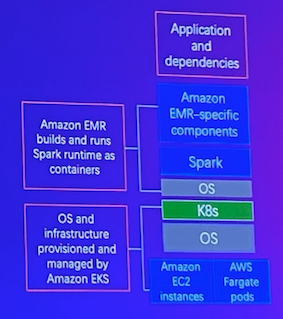

### Compute cost optimization

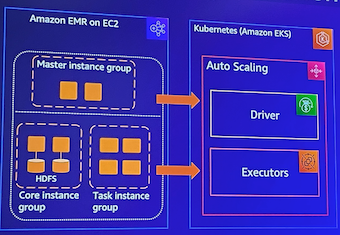

* **Amazon EC2 Spot**： up to 90% off compared to on-demand pricing
* **AWS Savings Plans**： up to 72% for committed compute usage
* **Auto Scaling**： based on job-level usage/request
* **Arm-based CPU**： 19% performance boost & 15% cost reduction running on Graviton3 vs. Graviton2

### Runtime performance impacts costs

Applications finish faster, resulting in lower TC as well as faster time to insights

### **Amazon EMR on Amazon EKS**

Amazon EMR on Amazon EKS

* individual queries can run over 10x faster.
* Faster Application runtime reduces costs
* Default Spark configurations to optimize application performance based on 10 years' experience of running workloads at all scale factors automatically applied to your application

**Auto Pod Tuning**

> Auto-tuning workloads to improve performance, save costs and increase resiliency

* Automatically adjust pod sizes based on real-time and historic CPU / Memory utilization
* Minimize out of memory exceptions and improve Spark
job resiliencies
* Avoid the need to manually tune driver, executors resources
* Save costs without performance penalty

### Managed Apache Flink

> Managing and Scaling your Apache Flink Applications become easier

* Consolidate your Flink applications under a single EKS infrastructure
* Autoscales based on SLAs on your upstream data source (eg. Kafka, Kinesis) and resource usage by your Flink application
* 100% compatible with open source Apache Flink
* Open to customers to configure their Flink applications just like open source Flink
* Frequent updates of Flink version to support new feature

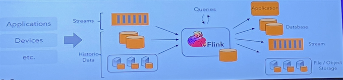

### Amazon EMR on Amazon EKS

* Consolidate compute across the organization to
optimize cost
* Allocate resources by team, application, or job to meet performance requirements
* Start jobs quickly by taking advantage of existing
capacity or using AWS Fargate
* Run highly available data processing workloads across multiple availability zones

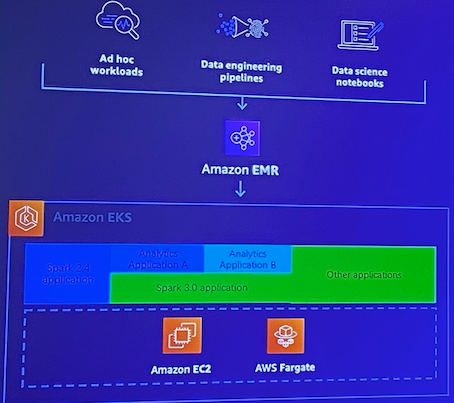

**Data on EKS Focus Areas**

* Data Processing & Analytics 
* AI/ML
* Distributed Databases
* Streaming Platforms
* Distributed Query Engines
* Job & Workflow Schedulers

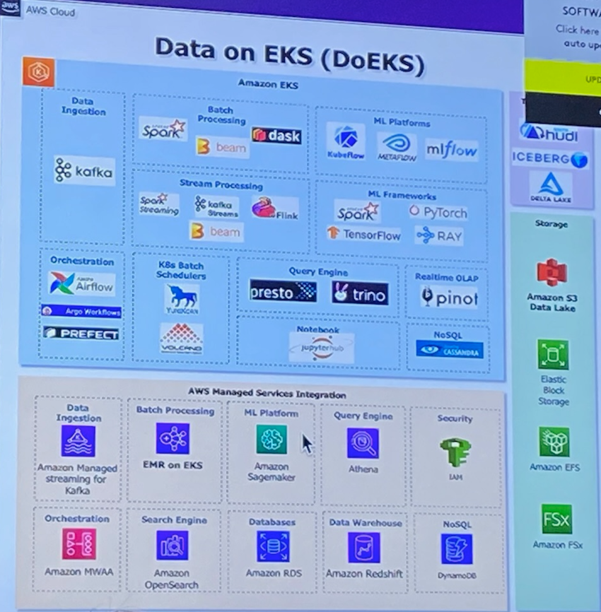

**Cluster add-ons**

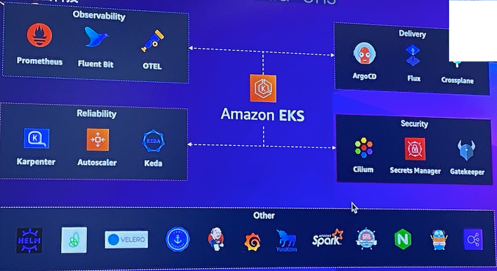

**Multiple environments**

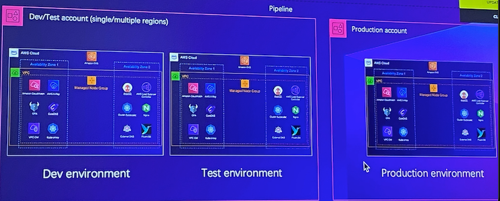

**Karpenter scale-up**

> HPA/Application Pending pods

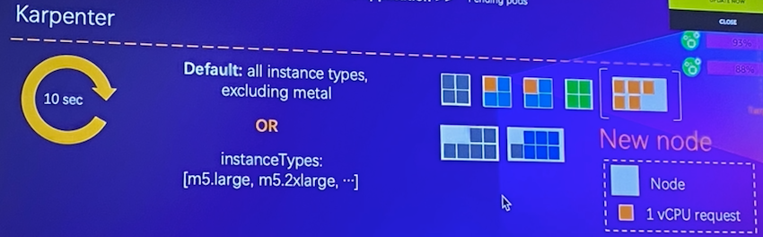

Provisioning and scheduling decisions

* Early binding to provisioned nodes vs. placeholder instances
* Remove scheduler version dependency