# **L1 Collections - Kinesis DataStream Overview**

## **1. Collection Section Introduction (Moving Data into AWS)**

### **1-1 Collection Introduction** 

**Real Time - Immediate actions**

* Kinesis Data Streams (KDS)
* Simple Queue Service (SQS) 
* Internet of Things (IoT)

**Near-real time - Reactive actions**

* Kinesis Data Firehose (KDF) 
* Database Migration Service (DMS) 

**Batch - Historical Analysis** 

* Snowball 
* Data Pipeline 

### **1-2 AWS Kinesis Overview** 

* **Kinesis is a managed alternative to `Apache Kafka`** 
* Great for application **logs, metrics, loT, clickstreams** 
* **Great for "real-time" big data** 
* Great for streaming processing frameworks (Spark, NiFi, etc...) 
* **Data is automatically replicated synchronously to 3 AZ** 

 

* **Kinesis Streams**: low latency streamin ingest at Scale
* **Kinesis Analytics**: perform real-time analytics on streams using SQL SQL 
* **Kinesis Firehose: load streams into S3, Redshift  ElasticSearch & Splunk**

### **1-3 Kinesis**

What is the architecture surrounding Kinesis? 

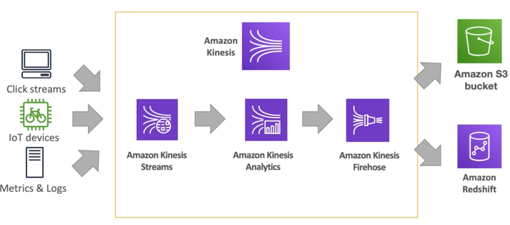 

* The streams can take a lot of data from say **click streams** or **IoT devices** for example a connected bike or metrics and logs from your servers directly. So the streams will just ingest a lot of data 
* You would like to analyze that there in real time maybe you're trying to compute a metric maybe build alerts for this you can use optionally the **Amazon Kinesis Analytics service**
*  Kinesis Firehose can deliver your data to maybe an **Amazon S3 bucket** or an **Amazon Redshift database, or Splunk, or ElasticSearch** 

### **1-4 Kinesis Streams Overview** 

* Streams are divided in ordered **Shards / Partitions** 

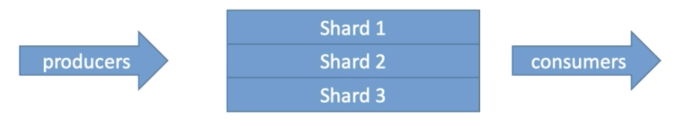 

* Data retention is **24 hours by default, can go up to 7 days** 
* Ability to **reprocess / replay data** 
* **Multiple applications can consume the same stream** 
* Real-time processing with scale of throughput 
* **Once data is inserted in Kinesis, it can't be deleted (immutability)** 

### **1-5 Kinesis Streams Shards**

 * **One stream is made of many different shards** 
 * Billing is per shard provisioned, can have as many shards as you want
 * Batching available or per message calls. 
 * **The number of shards can evolve over time (reshal / merge)** •
 * **Records are ordered per shard** 

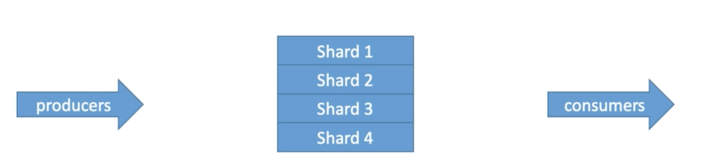 

### **1-6 Kinesis Streams Records** 

* **Data Blob**: data being sent, **serialized as bytes. Up to 1 MB**. Can represent anything 

* **Record Key:** 

* sent alongside a record, helps to group records in Shards. `Same key = Same shard` 
* Use a highly distributed key to avoid the "**hot partition**" problem 
* **Sequence number**: Unique identifer for each records put in shards. **Added by Kinesis after ingestion**

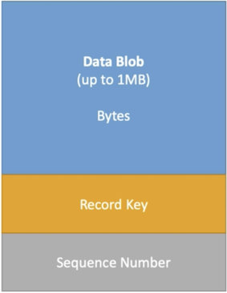 

### **1-7 Kinesis Data Streams Limits to know** 

**Producer**

* 1 MB/s or 1000 messages/s at **write PER SHARD**
* "**ProvisionedThroughputException**" otherwise 

**Cosumer Classic:**

* **2MB/s at read `PER SHARD`, across all consumers**
* **5 API calls per second PER SHARD across all consumers**

**Consumer ENHANCED Fan-Out** 

* **2MB/s at read PER SHARD, PER ENHANCED CONSUMER** 
* **No API** calls needed (push model) 

**Data Retention**: 

* **24 hours data retention by default** 
* **Can be extended to 7 days** 

### **1-8 Kinesis Data Streams — Handling Duplicates For Producers**

* Producer retries can create duplicates due to **network timeouts** 
* Although the two records have identical data, they also have unique sequence numbers 
* Fix: **embed unique record ID** in the data to de-duplicate on the consumer side 

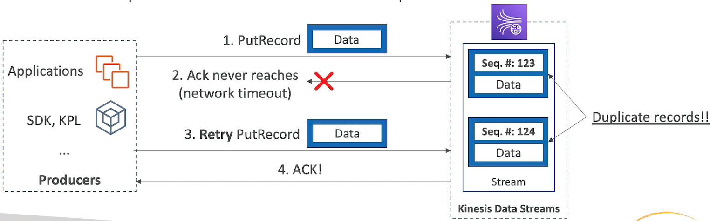 

### **1-9 Kinesis Data Streams — Kinesis Data Streams — Handling Duplicates For Consumers** 

* Consumer retries can **make your application read the same data twice** 
* Consumer retries happen when **record processors restart**: 
	1. A worker terminates unexpectedly 
	2. Worker instances are added or removed 
	3. Shards are merged or split 
	4. The application is deployed 

* Fixes: 
	* **Make your consumer application idempotent** 
	* **If the final destination can handle duplicates, it's recommended to do it there** 

**More info**: 

[https://docs.aws.amazon.com/streams/latest/dev/kinesis-record-processor-duplicates.html](https://docs.aws.amazon.com/streams/latest/dev/kinesis-record-processor-duplicates.html)

### **1-10 CloudWatch Logs Subscriptions Filters with Kinesis**

* You can stream CloudWatch Logs into 
	* **Kinesis Data Streams** 
	* Kinesis Data Firehose 
	* **AWS Lambda** 

* **Using CloudWatch Logs Subscriptions Filters** 
* **You can enable them using the AWS CLI** 

### **1-11 CloudWatch Logs Subscription Filter Patterns Near Real Time into Amazon ES**

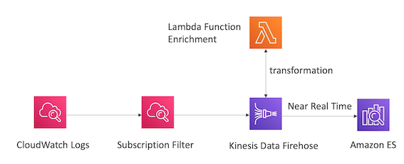 
 
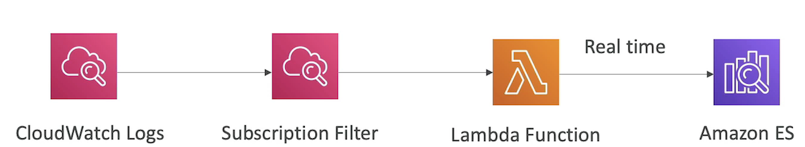 

**CloudWatch Logs Subscriptions Filters Patterns Real Time Analytics**

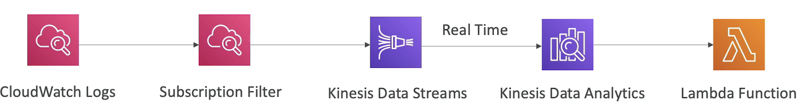 

## **2、Kinesis Producers** 

* **Kinesis SDK**

* SDK allows you to write code or use the CLI to directly send data into Amazon Kinesis streams

* **Kinesis Producer Library (KPL)** 
	* Better Code 

* **Kinesis Agent** 

The Kinesis agent is a linux program that runs on your server so remember that it's an agent that runs on servers and it basically allows you to get a log file for example and send that reliably into the Amazon Kinesis streams 

* 3rd party libraries: Spark, Log4J Appenders, Flume, Kafka Connect, NiFi...

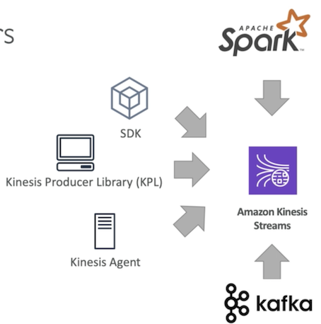 

### **2-1 Kinesis Producer SDK - PutRecord(s)** 

* APIs that are used are **PutRecord (one) and PutRecords (many records)** 
* **PutRecords** uses batching and increase throughput => l**ess HTTP requests** 
* **ProvisionedThroughputExceeded** if we go over the limits 
* `+ AWS Mobile SDK`: Android, iOS, etc... 
* Use case: **low throughput, higher latency, API, AWS Lambda**

**Managed AWS sources for Kinesis Data Streams:** 

* CloudWatch Logs 
* AWS IoT 
* Kinesis Data Analytics 

### **2-2 AWS Kinesis API Exceptions**

 
**`ProvisionedThroughputExceeded Exceptions`**

* Happens when sending more data (exceeding MB/s or TPS for any shard) 
* Make sure you don't have a hot shard (such as your partition key is bad and too much data goes to that partition) 

**Solution**

* Retries with backoff: 
	* **That means that you will retry after maybe 2s and if it doesn't work you will try to 4s and then after 8s** 

* **Increase shards (scaling)** 
	* It might be good to increase the much the amount of scaling you can do 

* **Ensure your partition key is a good one** 

### **2-3 Kinesis Producer Library (KPL) Aggrengation** 

* Easy to use and highly configurable C++ / Java library 
* Used for building high performance, long-running producers 
* Automated and configurable retry mechanism 
* **Synchronous or Asynchronous API (better performance for async)** 
* **Submits metrics to CloudWatch for monitoring** 
* **Batching** (both turned on by default) increase throughput, decrease cost: 
	* **Collect Records and Write to multiple shards in the same PutRecords API call** 
	* Aggregate increased latency 
		* Capability to store multiple records in one record (go over 1000 records per second limit) 
		* Increase payload size and improve throughput (maximize 1 MB/s limit) • 

* Compression must be implemented the user 
* KPL Records must be de-coded with KCL or special helper library 

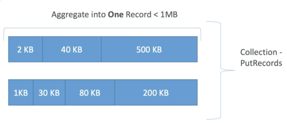 

* We can influence the bat Sy by introducing some delay with **RecordMaxBufferedTime** (default 100ms)

### **2-4 Kinesis Agent** 

* Monitor Log files and sends them to Kinesis Data Streams
* Java-based agent, built on top of KPL
* **Install in Linux-based server environments** 

**Features:** 

* Write from multiple directories and write to multiple streams 
* Routing feature based on directory / log file 
* Pre-process data before sending to streams  (single line, csv to json, log to jsOn•••) •
* he agent handles file rotatiRp, checkpointing, and retry upon failures 
* **Emits metrics to CloudWatch for monitoring**

## **3、Kinesis Consumers**

### **3-1 Kinesis Consumers - Classic** 

* Kinesis SDK 
* Kinesis Client Library (KCL) 
* Kinesis Connector Library 
* 3rd party libraries: Spark, Log4J Appenders, Flume, Kafka Connect...
* Kinesis Firehose 
* AWS Lambda 
* (Kinesis Consumer Enhanced Fan-Out discussed in the next lecture) 

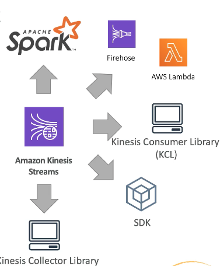 

### **3-2 Kinesis Consumer SDK - GetRecords** 

* **Classic Kinesis** - Records are polled by consumers from a shard 
* **Each shard has 2 MB total aggregate throughput** 
* GetRecords returns up to 10MB of data (then throttle for 5 seconds) or up to 10000 records 
* **Maximum of 5 GetRecords API calls** per shard per second **= 200ms latency** 
* **If 5 consumers application consume from the same shard,  means every consumer can  poll once a second and receive less than 400 KB/s**  

`More consumers => less throughput you will have per consumer`

So if we had consumer B and consumers C they will all share that limit of 2MB/s per shard and **they will all share that limit of 5 get records API call per second**. 

> So it's really important to understand that and we'll see how **Kinesis Enhance FanOut** for consumers will solve that problem. 

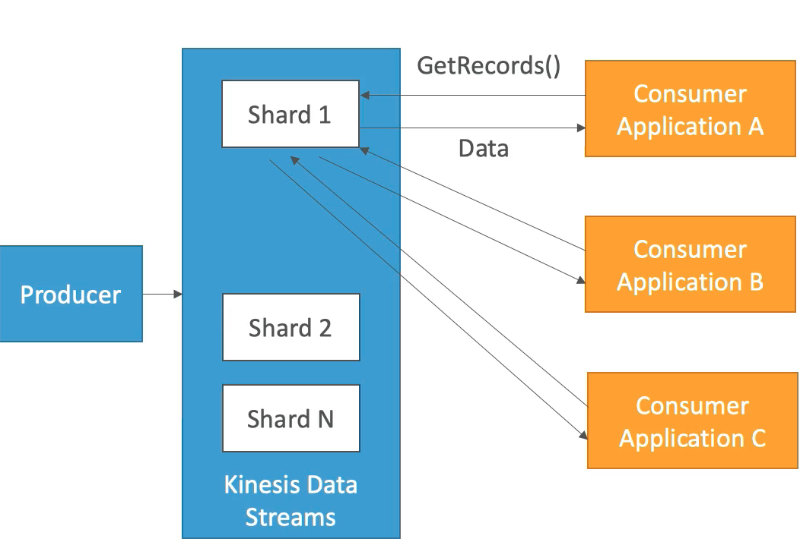 

### **3-3 Kinesis Client Library (KCL) > de-aggregation**

* Java-first library but exists for other lanuages too (Golang, Python, Ruby, Node,.NET...) 
* **Read records from Kinesis produced with the KPL (de-aggregation)** 
* Share mutiple shards with multiple consumers in one "group", shard discovery •
* **Checpointing** feature to resume progress 
* **Leverages DynamoDB for coordination and checkpointing (one row per shard)** 
	* Make sure you provision enough `WCU / RCU` (Write Capacit Unit/Read Capacity Unit) 
	* Or use On-Demand for DynamoDB 
	* Otherwise DynamoDBmay slow down KCL 
	* API of Record processors will Process the data 
	
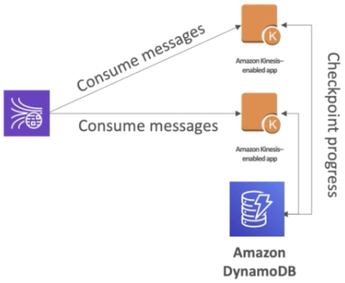 

> So how does checkpointing works and all the shard discovery? Well it basically uses an Amazon dynamoDB table to check point the progress over time and synchronize to see who is going to read which shard 

**Exam Question**: My KCL library is not reading fast enough even though there isn't a throughput in my Kinesis data stream what's the problem? 

Answer: the problem is that you probably have **undellorovisioned your dynamodb table and therefore it cannot checkpoint fast enough and therefore it cannot consume fast enough.**

### **3-4 Kinesis Connector Library** 

* Older Java library (2016), leverages the KCL library 
* Write data to: 
	* Amazon S3 
	* DynamoDB 
	* Redshift 
	* ElasticSearch 

**Kinesis Firehose replaces the Connector Library for a few of these targets**, Lambda for the others 

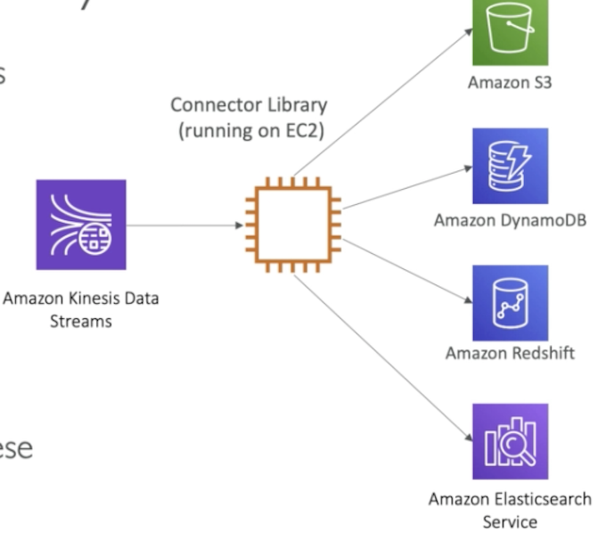 

> **Connector library** must be running on an EC2 instance for example for it to happen since an application whose sole purpose is to take data from **Kinesis data streams** and send it to all these destinations. 

### **3-5AWS Lambda sourcing from Kinesis** 

* AWS Lambda can source records from Kinesis Data Streams 
* Lambda consumer has a library to de-aggregate record from the KPL 
* Lambda can be used to run lightweight ETL to: 
	* Amazon S3 
	* DynamoDB 
	* Redshift 
	* ElasticSearch 
	* Anywhere you want 

* Lambda can be used to trigger notifications I send emails in real time
* Lambda has a configurable batch size (more in Lambda section) 

## **4、Kinesis Enhanced Fan Out**

### **4-1 Kinesis Enhanced Fan Out**

* New game-changing feature from August 2018.
* Works with `KCL 2.0` and AWS Lambda (Nov 2018) 
* Each Consumer get 2 ms/s of provisioned throughput per shard 
* That means **20 consumers** will get `40MB/s` per shard aggregated 
* **No more 2 MB/s limit** 
* Enhanced Fan Out: **Kinesis pushes data to consumers over HTTP/2** 
* Reduce latency (~70 ms) 

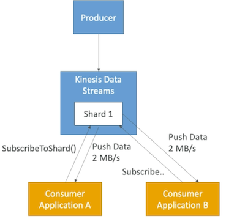 

### **4-2 Enhanced Fan Out vs Standard Consumers**

**Standard consumers:**

* Low number of consuming applications (1,2,3...) 
* Can tolerate `~200` ms latency 
* Minimize cost 

**Enhanced Fan Out Consumers:**

* Multiple Consumer applications for the same Stream 
* Low Latency requirements `~70ms`
* Higher costs (see Kinesis pricing page) 
* **Default limit of 5 consumers using enhanced fan-out per data stream** 

## **5、Kinesis Scaling** 

### **5-1 Kinesis Operations — Adding Shards**

* Also called **"Shard Splitting"** 
* Can be used to increase the Stream capacity (1 MB/s data in per shard) 
* **Can be used to divide a "hot shard"** 
* The old shard is closed and will be deleted once the data is expired 

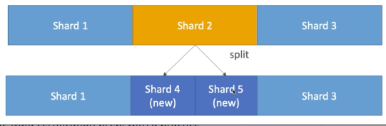 

1. We have shard 1, 2, and 3 in this example and they occupy the same space. 
2. Now shard 2 is very hot and we want to split it to increase throughput on this key space of shard 
3. So we're going to do a split operation what's going to happen is that there's gonna be **shard 4 that has been created and shard 5 that're being created**. 
4. And as you can see they're occupying the same space as shard 2 
5. Because we have two shards we have two `2MB/s` on this space instead of 1MB/s then the other shard 
6. 1 and 3 there remain the same. 
7. So shard 2 will be available as long as the data in it is not expired but when it's expired it will be gone. 

> You can split as many shards as you want over time and increase your throughput this way. 

### **5-2 Kinesis Operations Merging Shards** 

* Decrease the Stream capacity and save costs 
* Can be used to group two shards with low traffic 
* Old shards are closed and deleted based on data expiration 

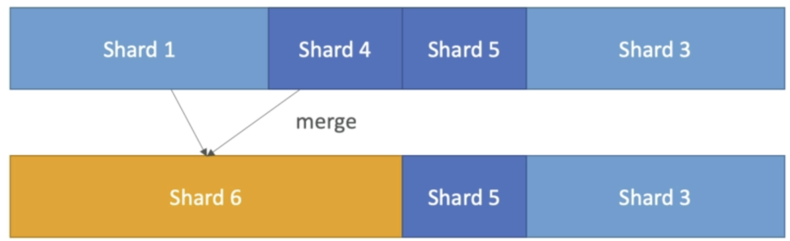 

1. Maybe shard 1 and 4 didn't get much traffic so we can merge them together and save some cost. 
2. So we're going to merge them together and it's becoming shard 6 
3. Then shard 5 and 3 while they remain on the same the same the same as before. 

### **5-3 Kinesis Operations Auto Scaling** 

* Auto Scaling is not a native feature of Kinesis
* The API call to Change the number of shards is **UpdateShardCount** 
* We can implement Auto Scaling with AWS Lambda 

[https://aws.amazon.com/blogs/big-data/scaling-amazon-kinesis-data-streams-with-aws-application-auto-scaling/](https://aws.amazon.com/blogs/big-data/scaling-amazon-kinesis-data-streams-with-aws-application-auto-scaling/) 

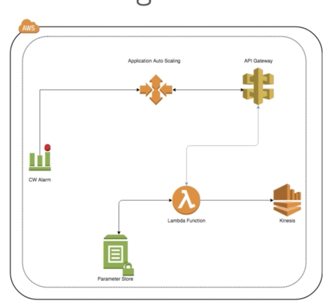 

### **5-4 Kinesis Scaling Limitations** 

* Resharding cannot be done in parallel. Plan capacity in advance 
* You can only perform one esharding operation at a time and it takes a few seconds 
* For 1000 shards, it takes 30K seconds(8.3 hours) to double the shards to 2000 

**You can't do the following**

* Scale more than twice for each rolling 24-hour period for each stream 
* Scale up to more than double your current shard count for a stream 
* Scale down below half your current shard count for a stream 
* Scale up to more than 500 shards in a stream 
* Scale a stream with more than 500 shards down unless the result is fewer than 500 shards 
* scale up to more than the shard limit for your account 

## **6、Kinesis Security** 

* Control access / authorization using IAM policies 
* Encryption in flight using HTTPS endpoints 
* Encryption at rest using KMS 
* Client side encryption must be manually implemented (harder) 
* **VPC Endpoints available for Kinesis to access within VPC**

## **7、AWS kinesis Data Firehose** 

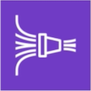 

* Fully Managed Service, no administration 
* Near Real Time (60 seconds latency minimum for non full batches) 
* **Load data into Redshift Ama2on S3 / ElasticSearch / Splunk** 
* Automatic scaling 
* Supports many data formats 
* Data Conversions from JSON to Parquet / ORC onl for S3) 
* **Data Transformation through AWS Lambda (ex: CSV => JSON)** 
* Supports compression when target is Amazon S3 (GZIP, ZIP and SNAPPY) 
* Only GZIP is the data is further loaded into Redshift 
* **Pay for the amount of data going through Firehose** 
* Spark/KCL do not read from KDF 

Exam will trick you into thinking that Spark or the KCL can read from KDF(Kinesis data firehose) 

This is not the case. **Spark streaming and Kinesis client library** from fire hose they only read it from **Kinesis data stream**. 

### **7-1 kinesis Data Firehose Diagram**

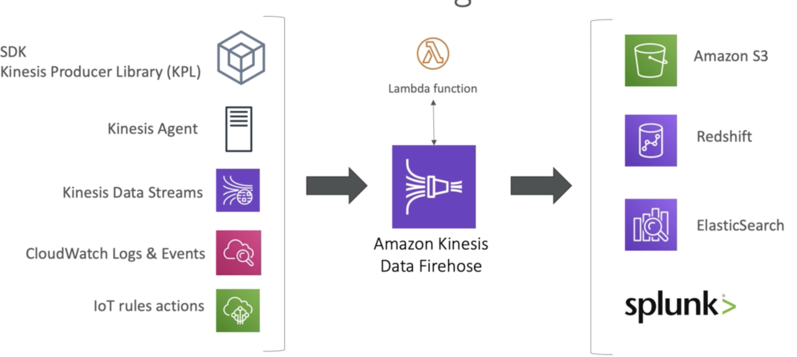 

### **7-2 Kinesis Data Firehose Deliver Diagram** 

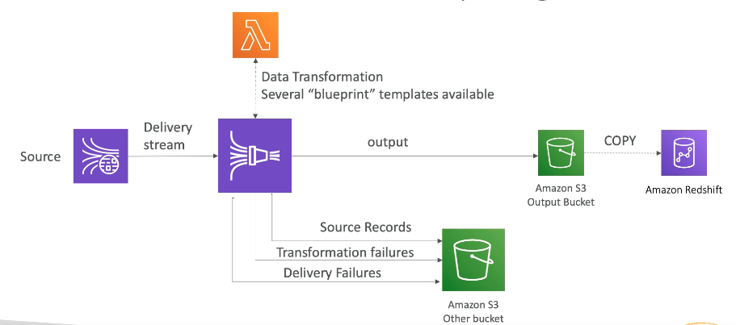 

**Actually it goes through S3 and then there will be a copy command issued to put that data into Redshift.** 

> Exam asks you "How do we get all the source data into an Amazon S3 bucket through consider a firehose?" 
> 
> **This is directly a feature from firehose**. 

### **7-3 Firehose Buffer Sizing** 

* Firehose accumulates records in a buffer 
* The buffer is flushed based on time and size rules 

* **Buffer Size** (ex: 32MB): if that buffer size is reached, its flushed
* **BufferTime (ex: 2 minutes)**: if that time is reached, it's flushed 
* **Firehose can automatically increase** the buffer size to increase throughput 

* **High throughput —> Buffer Size will be hit** 
* **Low throughput => BufferTime will be hit** 

## **8、Kinesis Data Streams vs Firehose** 

### **8-1 Streams** 

* Going to write custom code (producer / consumer)
* Real time (-200 ms latency for classic, —70 ms latency for enhanced fan-out) 
* Must manage scaling (shard splitting / merging)
* Data Storage for 1 to 7 da s, replay capability, multi consumers 
* Use with Lambda to insert data in real-time to ElasticSearch (for example) 

### **8-2 Firehose**
 
* Fully managed, send to **S3, Splunk, Redshift, ElasticSearch** 
* Serverless data transformations with Lambda 
* **Near real time (lowest buffer time is 1 minute)** 
* **Automated Scaling** 
* No data storage 

## **9、Kinesis Data Streams vs Firehose** 