# **L2 [Exercise] Kinesis Firehose (PurchaseLogs/OrderLogs)**

## **1、Part One [Create Kinesis Firehose delivery streams]**

Continously collect, transform, and load streaming data into destinations such as Amazon S3 and Amazon Redshift.

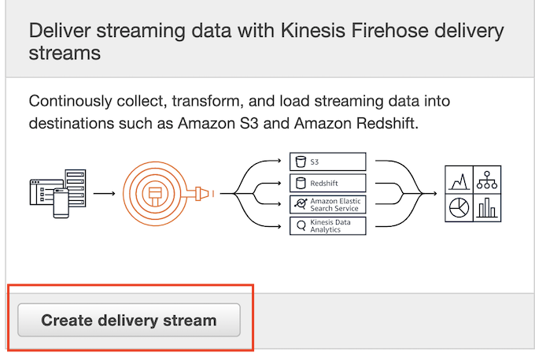 

* Delivery stream name: **PurchaseLogs**
* Source: **Direct PUT or other sources**

> Choose this option to send records directly to the delivery stream, or to send records from AWS IoT, CloudWatch Logs, or CloudWatch Events.

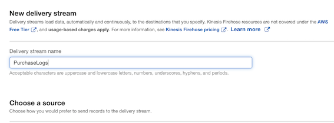 

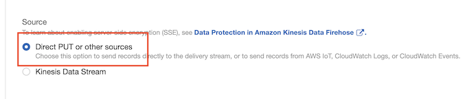 

### **1-1 Choose a destination**

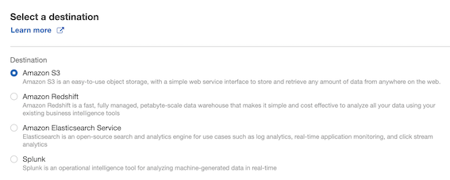 

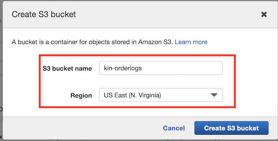 


* S3 name: **`kin-orderlogs`**
* Region: **US-EAST-1**

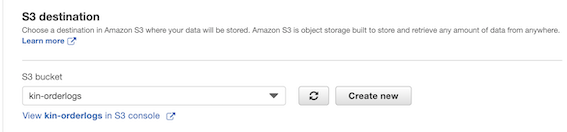 

### **1-2 Configure settings**

Configure buffer, compression, logging, and IAM role settings for your delivery stream

**S3 buffer conditions:**

Firehose buffers incoming records before delivering them to your S3 bucket. Record delivery will be triggered once either of these conditions has been satisfied

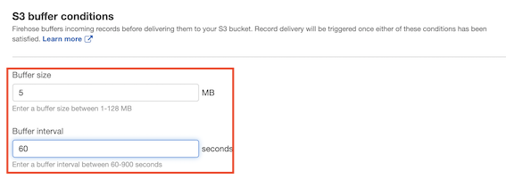 

* Enter a buffer size between 1-128 MB:  **5**
* Enter a buffer interval between 60-900 seconds: **60S** **(NEAR REAL TIME)**


**Permissions IAM role:**

Default IAM role name with default policy: **`firehose_delivery_role`**

<!-- 

 -->

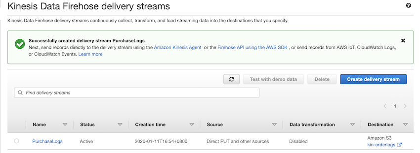 

## **2、Part two [Create EC2 and attach policy]**

### **2-1 Step 1: Choose an Amazon Machine Image (AMI)**

**Launch Amazon Linux AMI not the Linux 2 AMI** because this comes with more **AWS tools pre installed** for us it makes life a little bit easier.

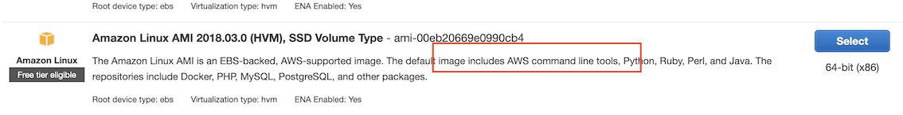 

**Type: T2 micro**

### **2-2 Step 2: Configure Network and Auto assign public ip for it**

<!-- -->

### **2-3 Step 3: Create New key pair and download**

Keypair Name:  **JamData** 

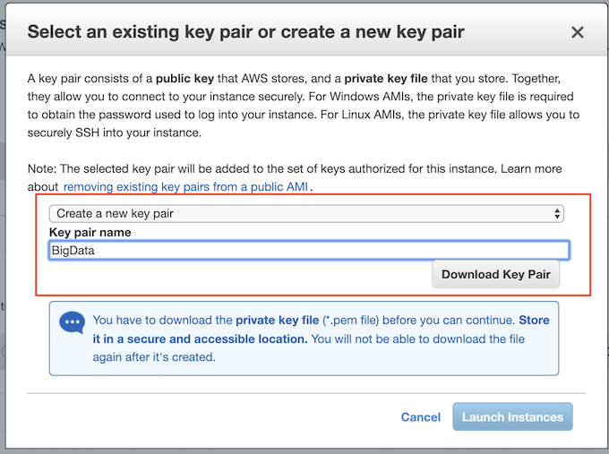 

### **2-4 Step 4: Connect to Your Linux Instance using an SSH Client**

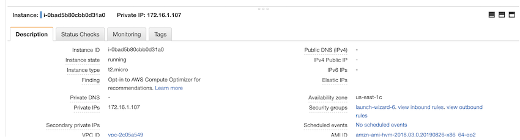 

<!-- -->


```
$ chmod 400 JamData.pem
$ ssh -i "JamData.pem" ec2-user@100.26.107.74
The authenticity of host '100.26.107.74 (100.26.107.74)' can't be established.
ECDSA key fingerprint is SHA256:4DO4XuWMGeQKE4n7svfHr2T1wpGBQZu3DVurDchYPC8.
Are you sure you want to continue connecting (yes/no)? yes
Warning: Permanently added '100.26.107.74' (ECDSA) to the list of known hosts.

       __|  __|_  )
       _|  (     /   Amazon Linux AMI
      ___|\___|___|

https://aws.amazon.com/amazon-linux-ami/2018.03-release-notes/
16 package(s) needed for security, out of 32 available
Run "sudo yum update" to apply all updates.
-bash: warning: setlocale: LC_CTYPE: cannot change locale (UTF-8): No such file or directory
[ec2-user@ip-172-16-1-121 ~]$
```

### **2-5 Step 5: Assign IAM role for it**

* Create new role attach to to instance **EC2AdminAccess** with full **adminpolicy**

<!-- 

 -->

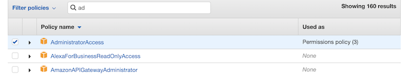 

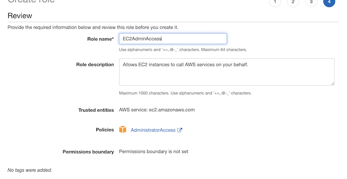 

* **rolename**： **EC2AdminAccess**
* Attach iam role to the EC2 instance

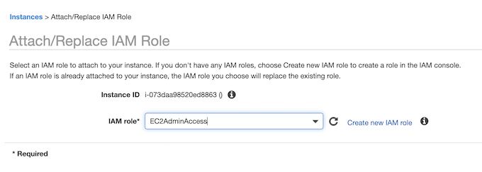 

## **3、Part Three [Enable Kinesis on EC2 instance]**

### **3-1 Step 1: Install `aws-kinesis-agent`**

```
$ sudo yum install -y aws-kinesis-agent
```

### **3-2 Step 2: Make use of `LogGenerator`**

```
wget http://media.sundog-soft.com/AWSBigData/LogGenerator.zip
unzip LogGenerator.zip
chmod a+x LogGenerator.py
```

`/var/log/cadabra/` The log will locate in this place from the code

```
sudo mkdir /var/log/cadabra/
```

### **3-3 Step 3: Change `agent.json` for `aws-kinesis-agent`**

```
$ cd /etc/aws-kinesis
$ sudo vi agent.json

{
  "cloudwatch.emitMetrics": true,
  "kinesis.endpoint": "",
  "firehose.endpoint": "firehose.us-east-1.amazonaws.com",

  "flows": [
    {
      "filePattern": "/var/log/cadabra/*.log",
      "deliveryStream": "PurchaseLogs"
    }
  ]
}
```

* `firehose.endpoint`: `"firehose:us-east-1.amazonaws.com"`
* **filePattern**: `"/var/log/cadabra/*.log"`
* **deliveryStream**:`"PurchaseLogs"`

### **3-4 Step 4: Start `aws-kinesis-agent`**

```
$ sudo service aws-kinesis-agent start
aws-kinesis-agent startup                                  [  OK  ]
$ sudo chkconfig aws-kinesis-agent on
```

### **3-5 Step 5: Run the code and generate logs**

```
$ cd
$ sudo ./LogGenerator.py 500000
Writing 500000 lines starting at line 0

Wrote 500000 lines.

# check logs
$ cd /var/log/cadabra/
$ ls
20200111-101057.log

$ tail -f /var/log/aws-kinesis-agent/aws-kinesis-agent.log
2020-01-11 10:11:17.036+0000 localhost (Agent.MetricsEmitter RUNNING) com.amazon.kinesis.streaming.agent.Agent [INFO] Agent: Progress: 152501 records parsed (16777082 bytes), and 50056 records sent successfully to destinations. Uptime: 120032ms
2020-01-11 10:11:17.036+0000 localhost (Agent.MetricsEmitter RUNNING) com.amazon.kinesis.streaming.agent.Agent [INFO] Agent: Tailing is 27.924805 MB (29281475 bytes) behind.
2020-01-11 10:12:17.036+0000 localhost (Agent.MetricsEmitter RUNNING) com.amazon.kinesis.streaming.agent.Agent [INFO] Agent: Progress: 304001 records parsed (29359855 bytes), and 218094 records sent successfully to destinations. Uptime: 180032ms
...
2020-01-11 10:16:17.035+0000 localhost (FileTailer[fh:PurchaseLogs:/var/log/cadabra/*.log].MetricsEmitter RUNNING) com.amazon.kinesis.streaming.agent.tailing.FileTailer [INFO] FileTailer[fh:PurchaseLogs:/var/log/cadabra/*.log]: Tailer Progress: Tailer has parsed 500000 records (42036691 bytes), transformed 0 records, skipped 0 records, and has successfully sent 499500 records to destination.
2020-01-11 10:16:17.035+0000 localhost (Agent.MetricsEmitter RUNNING) com.amazon.kinesis.streaming.agent.Agent [INFO] Agent: Progress: 500000 records parsed (42036691 bytes), and 499500 records sent successfully to destinations. Uptime: 420032ms
```

### **3-6 Step 6: Check S3 and Kinese Firehose delivery streams**

**S3** logs pushed in

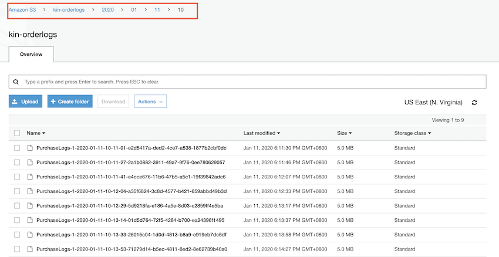 

**Firehose delivery streams cloudwatch**

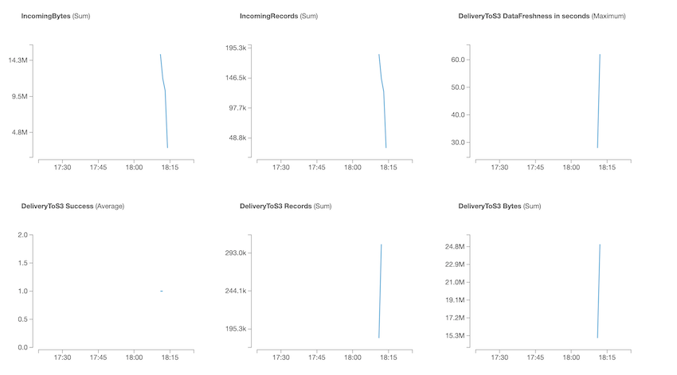 


