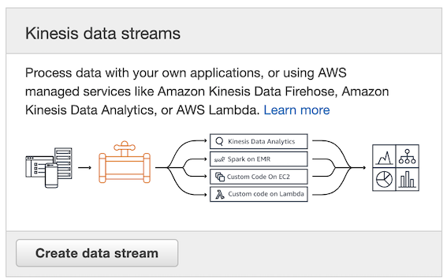
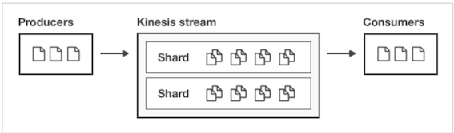
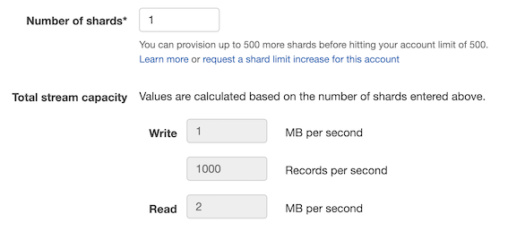
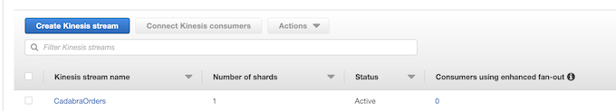
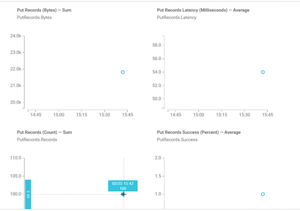

# **L3 [Exercise] Kinesis Data Streams**

## **1、Create Kinesis stream**

 

**Kinesis stream name**: **CadabraOrders**

### **1-1 Shards**


A shard is a unit of throughput capacity. Each shard ingests up to `1MB/sec` and `1000 records/sec`, and emits up to `2MB/sec`. 

To accommodate for higher or lower throughput, the number of shards can be modified after the Kinesis stream is created using the API

 

**Number of shards: 1**

> on the exam however how you would figure out how many shards you might need for a given application and it has a little reminder here that one shard only gives you `1MB/sec` of write capacity. `2MB/sec` of read capacity and up to  `1000 records/sec`.

 

 

## **2、Change `aws-kinesis-agent` config file**

```
$ cd /etc/aws-kinesis
$ sudo vi agent.json

{
  "cloudwatch.emitMetrics": true,
  "kinesis.endpoint": "kinesis.us-east-1.amazonaws.com",
  "firehose.endpoint": "firehose.us-east-1.amazonaws.com",
  
 // "awsAccessKeyId": "",
 // "awsAccessAccessKey": ""

  "flows": [
    {
      "filePattern": "/var/log/cadabra/*.log",
      "kinesisStream": "CadabraOrders",
      "partitionKeyOption": "RANDOM",
      "dataProcessingOptions": [
         {
            "optionName": "CSVTOJSON",
            "customFieldNames": ["InvoiceNo", "StockCode", "Description", "Quantity", "InvoiceDate", "UnitPrice", "Customer", "Country"]
         }
      ]
    },
    {
      "filePattern": "/var/log/cadabra/*.log",
      "deliveryStream": "PurchaseLogs"
    }
  ]
}
```

```
$ sudo service aws-kinesis-agent restart
aws-kinesis-agent shutdown                                 [  OK  ]
aws-kinesis-agent startup                                  [  OK  ]
```

## **3、Run the code and generate logs**

```
$ cd

#default 100
$ sudo ./LogGenerator.py
Writing 100 lines starting at line 500100

Wrote 100 lines.
```

```
tail -f /var/log/aws-kinesis-agent/aws-kinesis-agent.log
2020-01-11 11:45:00.499+0000 localhost (Agent.MetricsEmitter RUNNING) com.amazon.kinesis.streaming.agent.Agent [INFO] Agent: Progress: 300 records parsed (34824 bytes), and 100 records sent successfully to destinations. Uptime: 120081ms
```

## **4、Check Kinesis stream Monitoring**

There is `Put Records Success (Percent) — Average` data

 


