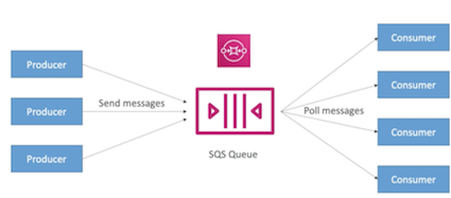
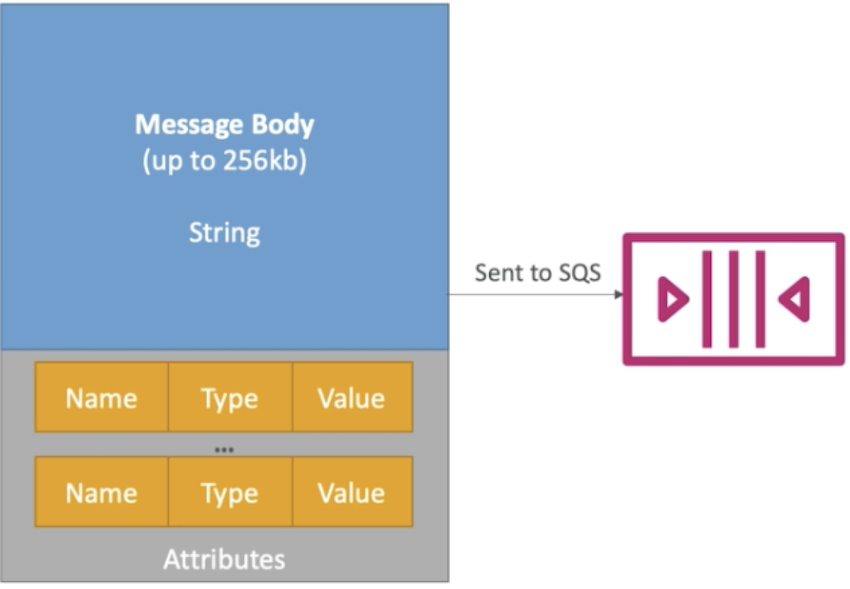
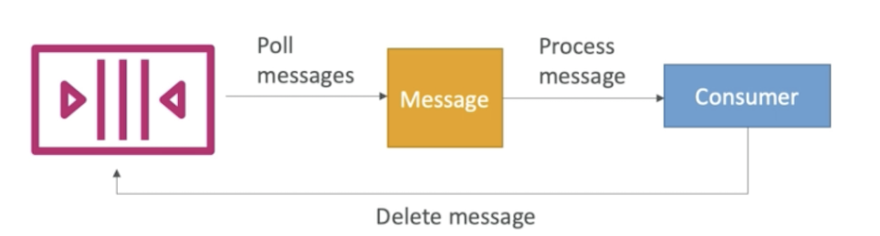
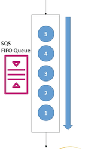
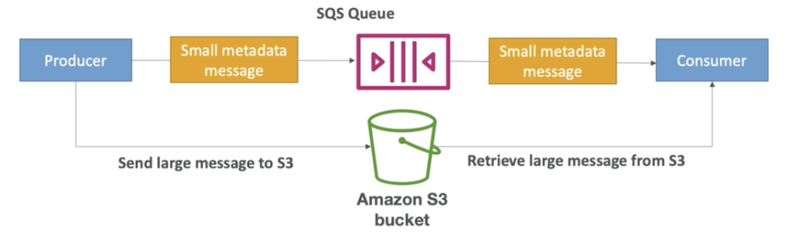
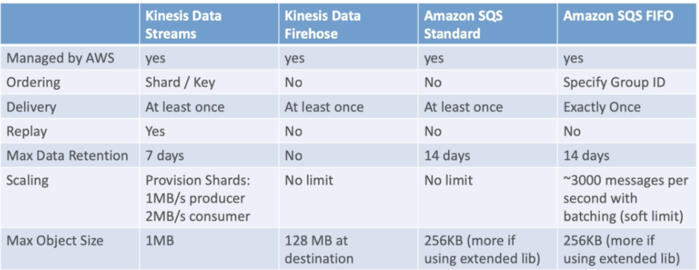

# **L4 SQS vs. Kinesis Data Stream**

## **1、SQS Overview**

### **1-1 AWS SQS**

**What's a queue**

 

SQS Queue and producers or producer or **producers** will send a message to the **SQS Queue** and a consumer or **consumers will pull messages from that Queue**.

### **1-2 AWS SQS Standard Queue** 

 
 
* Oldest offering (over 10 years old) 
* Fully managed 
* **Scales from 1 message per second to 10,000s per second** 
* **Default retention of messages: 4 days, maximum of 14 days**
* No limit to how many messages can be in the queue 
* Low latency **(< 10 ms on publish and receive)** 
* Horizontal scaling in terms of number of consumers 
* <mark>**Can have duplicate messages**</mark> (**at least once delivery**, occasionally) 
* **Can have out of order messages** (best effort ordering) 
* **Limitation of 256KB per message sent** 

### **1-3 SQS Producing Message**

* **Define Body** 
* Add message attributes (metadata — optional) 
* Provide Delay Delivery (optional) 
* Get back 
	* Message identifier 
	* MD5 hash of the body 

 

### **1-4 SQS - Consuming Messages** 

* Consumers... 
* Poll SQS for messages (receive up to 10 messages at a time) 
* **Process the message within the visibility timeout** 
* **Delete the message** using the **message ID** & **receipt handle**

> That means that basically when you have SQS your consumers will poll messages and you consumers will process these messages and then delete them from the SQS Queue so the messages cannot be processed by multiple different consumer applications.

> That's a very big difference versus Kinesis.

 

### **1-5 AWS SQS — FIFO Queue** 

* Newer offering (**First In - First out**) — not available in all regions! 
* Name of the queue must end in `.fifo` 
* Lower throughput (up to 3,000 per second with batching, 300/s without) 
* Messages are processed in order by the consumer 
* **Messages are sent exactly once** 
* **5-minute interval de-duplication using "Duplication ID"**

 

### **1-6 SQS Extended Client** 

* Message size limit is `256KB`, how to send large messages? 
* Using the **SQS Extended Client (Java Library)**
* Need use S3 as companion

 

> Send very large payload maybe like **10gb** or fight with you know **5mb** to **10mb** to S3 and it will **send a message metadata in the SQS Queue** and then **the extended client on the consumer side will receive the smaller metadata message** saying **where the file is in S3** and the consumer will be able to read the large message directly from S3.

### **1-7 AWS SQS Use Cases** 

* **Decouple applications** 
	* (for example to handle payments asynchronously) 
* **Buffer writes to a database** 
	* (for example a voting application) 
* **Handle large loads of messages coming in** 
	* (for example an email sender) 
* **SQS can be integrated with Auto Scaling through CloudWatch!**

### **1-8 SQS Limits** 

* Maximum of 120,000 in-flight messages being processed by consumers
* **Batch Request has a maximum of 10 messages — max 256KB**
* Message content is **XML, JSON**, **Unformatted text** 
* Standard queues have an unlimited TPS 
* FIFO queues support up to **3,000 messages per second** (using batching) 
* **Max message size is 256KB (or use Extended Client)** 
* Data retention from **1 minute to 14 days** 

> Once the messages are read they are deleted from the SQS queue

* Pricing: 
	* Pay per API Request 
	* Pay per network usage 

> Pricing is very different from Kinesis

### **1-9 AWS SQS Security** 

* Encryption in flight using the HTTPS endpoint 
* Can enable **SSE (Server Side Encryption)** using KMS 
	* Can set the CMK (Customer Master Key) we want to use 
	* SSE only encrypts the body, not the metadata (message ID, timestamp, attributes) 
* **IAM policy must allow usage of SQS** 
* SQS queue access policy 
	* **Finer grained control over IP** 
	* Control over the time the requests come in 

## **2、Kinesis Data Streams vs SQS**

### **2-1 Kinesis Data Stream:** 

* **Data can be consumed many times** 
* Data is deleted after the retention period(24h-7days) 
* Ordering of records is preserved(at the shard level) — even during replays 
* **Build multiple applications reading** from the **same stream incependently** (Pub/Sub)
* "Streaming Mapreduce" querying capability 
* **Checkpointing needed to track progress of consumption** (use with the KCL that interacts with DynamoDB)
* Shards (capacity) must be provided ahead of time 

### **2-2 SQS:** 

* Queue, decouple applications 
* **One application per queue** 
* **Records are deleted after consumption (ack / fail)** 
* Messages are processed independently for standard queue 
* Ordering for FIFO queues 
* **Capability to "delay" messages** 
* Dynamic scaling of load (no-ops) 

### **2-3 Finally**

* **Kinesis data stream has a message payload size of maximum 1MB** 
* **SQS is 256 kilobytes**

 

### **2-4 SQS vs Kinesis — Use cases** 

* SQS Use cases : 
	* Order processing 
	* Image Processing 
	* Auto scaling queues according to messages. 
	* Buffer and Batch messages for future processing. 
	* Request Offloading 

* Amazon Kinesis Data Streams Use cases : 
	* Fast log and event data collection and processing 
	* RealTime metrics and reports 
	* Mobile data capture 
	* RealTime data analytics 
	* Gaming data feed 
	* Complex Stream Processing 
	* Data Feed from "Internet of Things" 
