# **L5 IoT Overview and DeepDive**

## **1、IoT Overview**

 

* We deploy IoT devices ("Things") 
* We configure them and retrieve data from them 

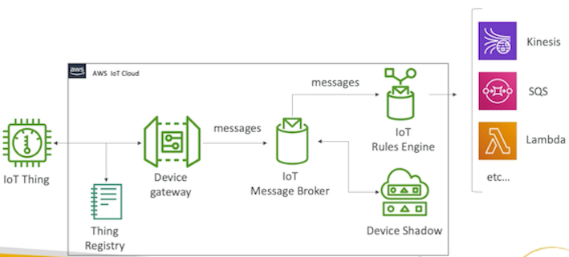 

### **1-1 Overview:** 

**IoT things**

IoT things like here it's a **thermostat** but it could be a bike it could be a car it could be a light bulb. It could be anything you want really. **So it's just going to be a connected device to your AWS infrastructure.** 

**Thing registry**

**IoT thing is going to be registered with our IoT cloud** in AWS so it's going to have a **thing registry** and a thing registry will be giving the device an ID, making sure it's weil authenticated. 

### **1-2 AWS IoT Details**
 
**Device Gateway** 

* The AWS loT Device Gateway enables devices to seL_uelyeacI efficiently communicate with AWS IoT 
* Things can communicate with each other via the Device Gateway, even if they are using different protocols. 

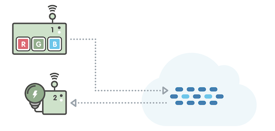 

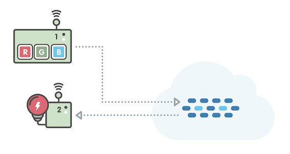 

> The example at the above illustrates two things -- a connected light bulb, and a control unit -- both connected to the Device Gateway. The control unit can publish commands into the Device Gateway, and the light bulb can subscribe and listen for relevant commands. 

**Rules Engine**

**The rules engine evaluates inbound messages published into AWS IoT**, transforms and delivers them to another thing or a cloud based on business rules you define. Many targets like **Kinesis, SQS, lambda or so many different other targets**. 

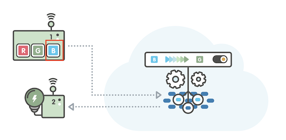 

> The example at the above illustrates a rule that: 
> 
> Evaluates commands published by the control unit Determines whether the command is "B" If the command is "Be, the rule transforms the message to "G" and relays "G" to the light bulb 

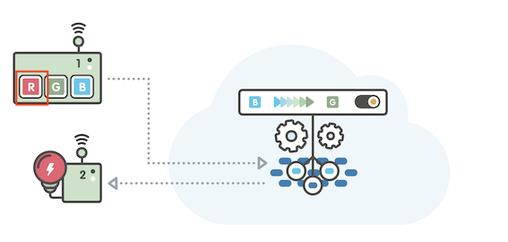 

**Rule actions**

The rules engine can also route messages to **cloud endpoints such as AWS Lambda functions, or a DynamoDB table** 

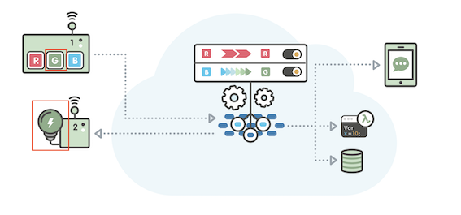 

> Evaluates commands publish by the control unit 

> Determines whether the command is "R" 

> If the command is "R", the rule delivers copies of the message to 3 endpoints -- a DynamoDB database table, a Lambda compute function, and Simple Notification Service (SNS) for push notifications to a mobile device. 

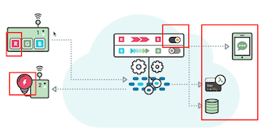 

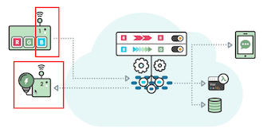 

**Device Shadows** 

AWS loT includes Device Registry and Device Shadows, so you can register any thing wish to represent in the cloud with a name, some attributes, and a persistent virtual down. 

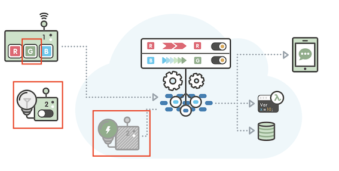 

Try turning off the physical light bulb. You'll notice that the Device Shadow remembers the color the physical light bulb. 

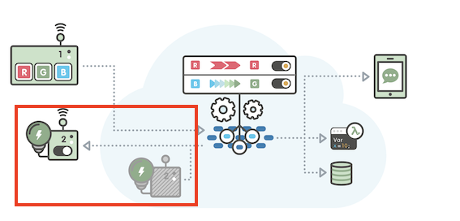 

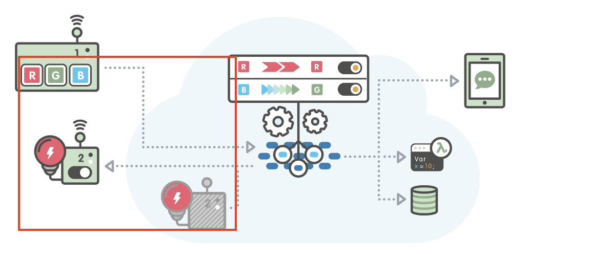 

**Build solutions**

AWS IoT makes it easy to build companion applications that interact with your 

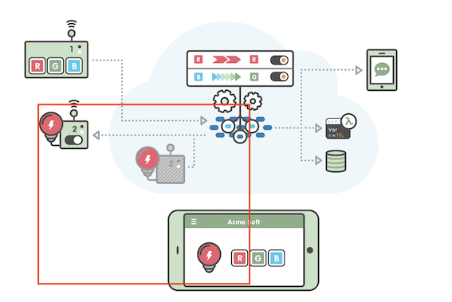 

mobile application that reflects the color of your light bulb. The mobile app never communicates directly to the light bulb. Rather, the mobile app uses a REST API to read and set the state of the bulb's Device Shadow. 

## **2、IoT Components Deep Dive**  

### **2-1 IoT Device Gateway** 

* Service as the entry point for IoT devices connecting to AWS 
* **Allows devices to securely and efficiently communicate with AWS IoT**
* Supports the MQTT WebSockets and HTTP 1.1 protocols
* Fully managed and scales automatic to support over a billion devices 
* No need to manage infrastructure

### **2-2 MQTT** 

**Message broker supports Quality of Service**

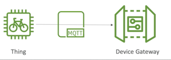 

### **2-3 IoT Message Broker**

* Pub/sub (publishers/subscribers) messaging pattern - low latency
* Devices can communicate with one another this way 
* Messages sent using the MQTT, WebSockets or HTTP 
* Messages are published into topics (just like SNS) 
* **Message Broker forwards messages to all clients connected to the topic** 

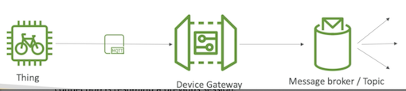 

### **2-4 IoT Thing Registry - IAM of IoT**

 

* All connected IoT devices are represented in the AWS IoT registry 
* Organizes the resources associated with each device in the AWS Cloud
* Each device gets a unique 
* Supports metadata for each device (ex: Celsius vs Fahrenheit, etc...) •
* **Can create X.509 certificate to IoT devices connect to AWS** 
* IoT Groups: group devices together and apply permissions to the group 

### **2-5 Authentication** 

* 3 possible authentication methods for Things: 
	* Create X509 certificates an的 load them securely onto the Things
	* AWS SigV4 
	* Custom tokens with Custom authorizers • 

* For mobile apps: 
	* Cognito identities (extension to Google, Facebook login, etc...)  

* Web / Desktop / CLI: 
	* IAM 
	* Federated Identities 

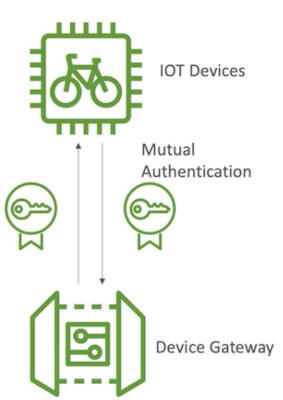 

### **2-6 Authorization**

**AWS IoT policies:** 

* Attached to X.509 certificates or Cognito Identities 
* Able to revoke any device at any time 
* IoT Policies are JSON docuements 
* Can be attached to groups instead of individual Things. 

**IAM Policies:** 

* Attached to users, group or roles 
* Used for controlling loT AWS APIs 

> Summary: Your devices are ruled by **AWS IoT policies** 
> 
> Your users, roles, and groups just like in AWS normal are ruled by **IAM policies** 

### **2-7 Device Shadow**

> Device Shadow concept: Even if a device was offline we could change its shadow in the AWS cloud and as soon as the device came back up online it would look at what 

* JSON document representing the state of a connected Thing 
* We can set the state to a different desired state (ex: light on) 
* **The IoT thing will retrieve the state when online and adapt** 

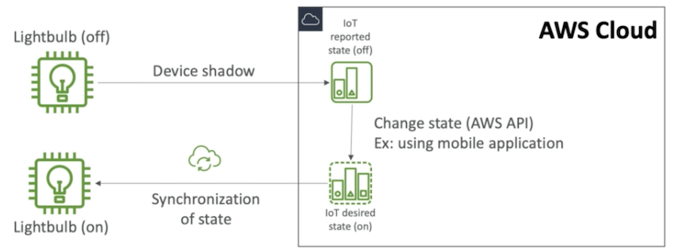 

### **2-8 Rules Engine (Exam)** 

* Rules are defined on the MATT topics
* **Rules = when it's triggered / Action = what is does** 
* Rules use cases: 
	* Augment or filter data received from a device 
	* Write data received from a device to a DynarnoDB database 
	* Save a **file to S3**
	* Send a push notification to all users using **SNS** 
	* Publish data to a SQS queue 
	* Invoke a **Lambda** function to extract data 
	* Process messages from a large number of devices using Amazon Kinesis
	* Send data to the Amazon Elasticsearch Service 
	* Capture a CloudWatch metric and Change a CloudWatch alarm
	* Send the data from an **MQTT** message to **Amazon Machine Learning** to make predictions based on an Amazon NIL model 
	* & more 

* Rules need IAM Roles to perform their actions 

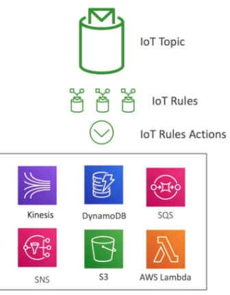 

### **2-9 IoT Greengrass** 

* **IoT Greengrass brings the compute layer to the device directly** 
* You can execute AWS Lambda functions on the devices: 
	* Pre-process the data 
	* Execute predictions based on ML models 
	* Keep device data in sync 
	* Communicate between local devices 

* Operate offline 
* Deploy functions from the cloud directly to the devices 

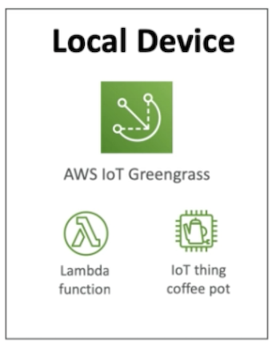 