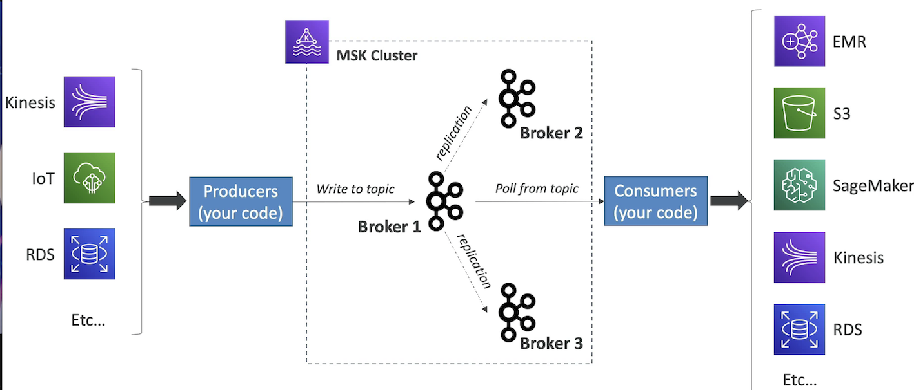
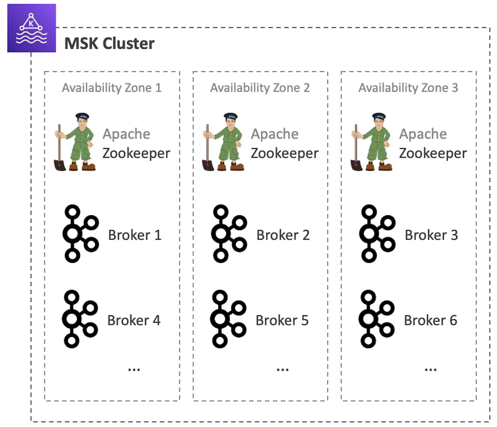
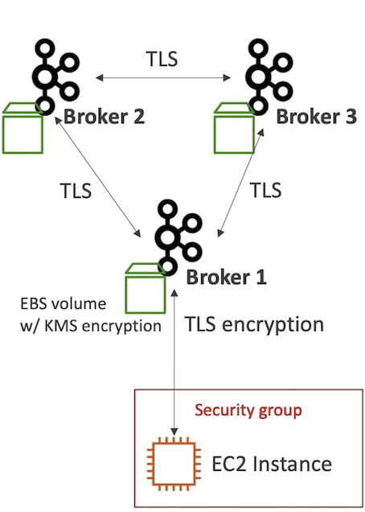

# **L7 MSK Managed Streaming for Apache Kafka (Amazon MSK)**

## **1、MSK Managed Streaming for Apache Kafka**

 

* Alternative to Kinesis (Kafka vs Kinesis next lecture) 
* Fully managed Apache Kafka on AWS 
	* Allow you to create, update, delete clusters 
	* MSK creates & manages Kafka brokers nodes & Zookeeper nodes for you
	* Deploy the MSK cluster in yourVPC, multi-AZ (up to 3 for HA) 
	* Automatic recovery from common Apache Kafka failures 
	* Data is stored on EBS volumes 

* You can build producers and consumers of data 
* Can create custom configurations for your clusters 
	* Default message size of 1 MB 
	* **Possibilities of sending large messages (ex: 10MB) into Kafka after custom configuration** 

### **1-1 Apache Kafka at High Level**

 

* Your responsibilityjis to **create your own producers so you write your own code and these producers run the code pull data from data like IoT** 
* Producer get data and write to Kafka topic. You write the data to your main broker, then the leader broker then is going to **be replicated to follower brokers**
* Once it's fully replicated its going to be available for **a consumer to be your code** pull and read from that topic and receive the data. 

### **1-2 MSK — Configurations** 

* Choose the number of AZ (3 — recommended, or 2) 
* Choose the VPC & Subnets 
* The broker instance type (ex: kafka.m5.1arge) 
* The number of brokers per AZ (can add brokers later) 
* **Size of your EBS volumes (1GB — 16TB)**

 

### **1-3 MSK — Security** 

**Encryption:** 

* Optional in-flight using TLS between the brokers 
* Optional in-flight with TLS between the clients and brokers 
* At rest for your EBS volumes using KMS

**Network Security:** 

* Authorize specific security groups for your Apache Kafka clients  

**Authentication & Authorization (important):** 

* Define who can read/write to which topics 
* Mutual TLS (AuthN) + Kafka ACLs (AuthZ) 
* SASL/SCRAM (AuthN) + Kafka ACLs (AuthZ) 
* IAM Access Control (AuthN AuthZ) 

 

### **1-4 MSK — Monitoring**

 
**CloudWatch Metrics** 

* Basic monitoring (cluster and broker metrics) 
* Enhanced monitoring (++enhanced broker metrics) 
* Topic-level monitoring (++enhanced topic-level metrics) 

**Prometheus (Open-Source Monitoring)** 

* Opens a port on the broker to export cluster, broker and topic-level metrics 
* Setup the JMX Exporter (metrics) or Node Exporter (CPU and disk metrics) 

**Broker Log Delivery** 

* Delivery to CloudWatch Logs 
* Delivery to Amazon S3 
* Delivery to Kinesis Data Streams 

### **1-5 MSK Override Kafka Configurations**

* List of properties you can set: 

**Important to note:** 

* Max message size in Kakfa by default is 1 MB bnicvelytes) 
	* Can override this with the broter **message.max.bytes** settings
	* Must also change the consumer **max.fetch.bytes** setting 

* Latency: 
	* By default ifs low in Kafka **10-40ms** (way less than Kinesis) 
	* The producer can increase latency to increase hatching using **linge.rms**

## **2、Kinesis VS MSK**

### **2-1 Kinesis Data Streams**

 

* 1MB message size limit 
* Data Streams with Shards 
* Shard Spitting & Verging 
* TLS In-flight encryption 
* KMS At-rest encryption 
* Security: 
	* IAM policies for AuthN/Auth/ 

### **2-2 Amazon MSK**

 

* 1MB, default, configure for higher (ex: 1OMB) 
* Kafka Topics with Partitions 
* Can only add partitions to a topic 
* PLAINTEXT or TLS In-flight Encryption 
* KMS At-rest encryption  
* Security: 
	* Mutual MS (AuthN) + KafKa ACLs(AuthZ) 
	* SASL/SCARM (AuthN) + Kafka ACLs (Auth7) 
	* IAM Access Control (AuthN + AuthZ) 

	
	
