# **L6 Data Collection Others**

## **1、Database Migration Service(DMS)**

 

* Quickly and securely **migrate databases to AWS, resilient, self healing** 
* The source database remains available during the migration 
* Supports: 
	* **Homogeneous migrations**: ex Oracle to Oracle 
	* **Heterogeneous migrations**: ex Microsoft SQL Server to Aurora 
* **Continuous Data Replication** using CDC 
* **You must create an EC2 instance** to perform the replication tasks 

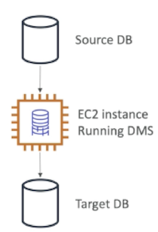 

### **1-1 DMS Resources and Targets**

**`_SOURCES_`:** 

* On-Premise and EC2 instances databases: Oracle, MS SQL Server MySQL, MariaDB, PostgreSQL, MongoDB, SAP, DB2 
* Azure: Azure SQL Database 
* Amazon RDS: all including Aurora 
* Amazon S3 

**`_TARGETS_`**

* On-Premise and EC2 instances databases: Oracle, MS SQL Server, MySQL, MariaDB, PostgreSQL, SAP
* Amazon RDS 
* Amazon Redshift 
* Amazon DynamoDB 
* Amazon S3 
* ElasticSearch Service 
* Kinesis Data Streams 
* DocumentDB 

### **1-2 AWS Schema Conversion Tool (SCT)** 

* **Convert your Database's Schema from one engine to another** 
* Example **OLTP**: (SQL Server or Oracle) to MySQL, PostgreSQL, Aurora 
* Example **OLAP**: (Teradata or Oracle) to Amazon Redshift 
* **You can use AWS SCT to create AWS DMS endpoints and tasks**. 

## **2、Direct Connect**

 

* Provides a dedicated ***_private_*** connection from a remote network to yourVPC 
* Can setup **multiple 1 Gbps or 10 Gbps dedicated network connections** 
* Setup Dedicated connection between your DC and Direct Connect locations 
* You need to setup a **Virtual Private Gateway** on your VPC 
* Access public resources (S3) and private (EC2) on same connection 
* Use Cases: 
	* Increase bandwidth throughput - working with large data sets - lower cost 
	* More consistent network experience - applications using real-time data feeds 
	* Hybrid Environments (on premise + cloud) 
	* Enhanced security (private connection) 
* Supports both IPv4 and IPv6 
* High-availability: **Two DC as failover or use Site-to-Site VPN as a failover**

 

1. Basically we see that from our customer network
2. we have a **router** and we connect that router into a direct connect location right here which goes into a **direct connect end point** 
3. This **direct connect end point** is connected directly either into the public resources of AWS such as Glacier, S3, 
4. Or into the **private resources of AWS using a virtual private gateway** where we can connect to our EC2 instances in a private manner.

### **2-1 Direct Conned Gateway**

* If you want to setup a **Direct Connect** to one or more VPC in many different regions (same account), you must use a **Direct Connect Gateway** 

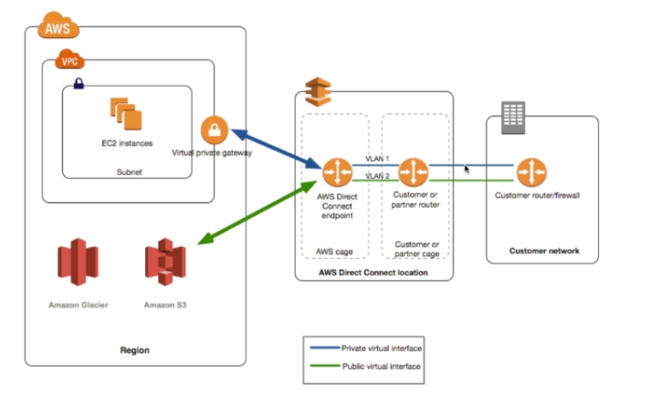 

## **3、SnowBall**

 

### **3-1 Snowball** 

* Physical data transport solution that helps moving **TBs** or **PBs** of data in or out of AWS 
* Alternative to moving data over the network (and paying network fees) 
* Secure, tamper resistant, uses KMS 256 bit encryption 
* Tracking using SNS and text messages. E-ink ship ping label
* **Pay per data transfer job** 
* Use cases:
	* large data cloud migrations, 
	* DC decomission 
	* disaster recovery 
* If it takes more than a **week** to transfer over the network, use **Snowball devices**! 

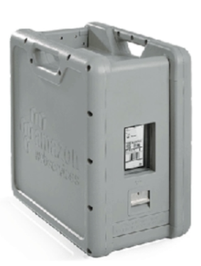 

### **3-2 Snowball Process** 

1. Request snowball devices from the AWS console for delivery 
2. Install the snowball client on your servers 
3. C**onnect the snowball to your servers and copy files using the client** 
4. Ship back the device when you're done (goes to the right AWS facility)  
5. Data will be loaded into an S3 bucket 
6. Snowball is completely wiped 
7. Tracking is done using SNS, text messages and the AWS console 

### **3-3 Snowball Diagrams**

**Direct upload to s3**

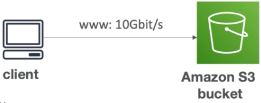 

**With Snowball**

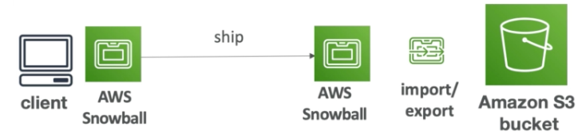 

### **3-4 Snowball Edge**

 

* Snowball Edges add computational capability to the device 
* 1OOTB capacity with either: 
	* Storage optimized — 24 vCPU 
	* Compute optimized — 52 vCPU & optional GPU 
* **Supports a custom EC2 AMI so you can perform processing on the go**
* Supports custom Lambda functions 
* Very useful to pre-process the data wile moving 
* Use case: 
	* **data migration**
	* image collation 
	* IoT capture
	* machine learning

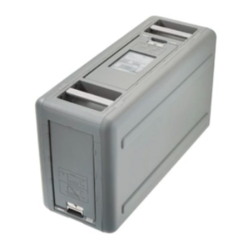 

### **3-5 Snowball Edge (for data transfers)** 

* Physical data transport solution: move TBs or PBs of data in or out of AWS
* Ahernative to moving data over the network (and paying network fees) 
* Pay per data transfer job 
* Provide block storage and Amazon S3-compatible object storage 
* **Snowball Edge Storage Optimized** 
	* **80 TB of HDD capacity** for block volume and 53 compatible object storage 
* **Snowball Edge Compute Optimized** 
	* **42 TB of HDD canacity** for block volume and S3 compatible object storage 

### **3-6 Snowmobile**

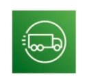 

* Transfer exabytes of data ( 1 EB = 1,000 PB = 1,000,000TBs) 
* Each Snowmobile has 100 PB of capacity (use multiple in parallel) 
* Better than Snowball if you transfer more than 10 PB 
* **High security: temperature controlled, GPS, 24/7 video surveillance**

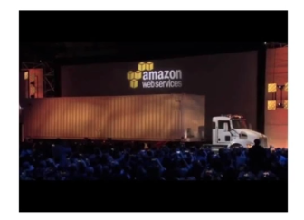 

### **3-7 AWS SnowCone**

 

* Small, portable computing, anywhere, rugged & secure, withstands harsh environments 
* **Light (4.5 pounds, 2.1 kg)** 
* Device used for edge computing, storage, and data transfer 
* **8 TBs of usable storage** 
* Use Snowcone where Snowball does not fit (space-constrained environment)
*  **Must provide your own battery / cables** 

*  Can be sent back to AWS offline, or connect it to intemet and use **AWS DataSync** to send data 

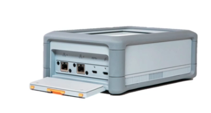 

### **3-8 AWS Snow Family for Data Migrations** 

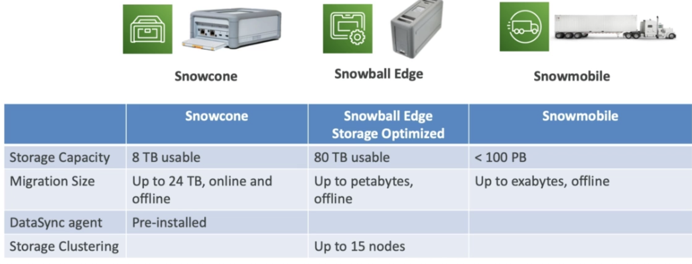 

### **3-9 Snow-Family - Usage process**

1. Request Snowball devices from the AWS console for delivery 
2. Install the snowball client / AWS OpsHub on your servers 
3. Connect the snowball to your servers and copy files using the client 
4. Ship back the device when you're done (goes to the right AWS facility) 
5. Data will be loaded into an S3 bucket 
6. Snowball is completely wiped 

## **4、Edge-Computing**

### **4-1 What's Edge-Computing**

 

* Process data while its being created on **an edge location**
	* A truck on the road, a ship on the sea, a mining station underground 

* These locations may have 
	* Limited / no intemet access  
	* Limited / no easy access to computing power

* We setup a **Snowball Edge / Snowcone** device to do edge computing 
* Use cases of Edge Computing 
	* Preprocess data 
	* Machine learning at the edge 
	* Transcoding media streams

* Eventually (if need be) we can ship back the device to AWS (for transferring data for example) 

### **4-2 Snow Family — Edge Computing**

 
 
* **Snowcone (smaller)** 
	* 2 CPUs, 4 GB of memory wired or wireless access 
	* USB-C power using a cord or the optional battery 

* **Snowball Edge — Compute Optimized** 
	* 52 vCPUs. 208 GiB of RAM  
	* Optional GPU (useful for video processing or machine) learning) 
	* 42TB usable storage 

	
* **Snowball Edge — Storage Optimized** 
	* Up to 40 vCPUs, 80 GiB of RAM 
	* Object storage clustering available  
	
* All: Can run EC2 Instances & AWS Lambda functions (using AWS IoT Greengras） 
* Long-term deployment options: 1 and 3 years discounted pricing 

## **5、AWS OpsHub**

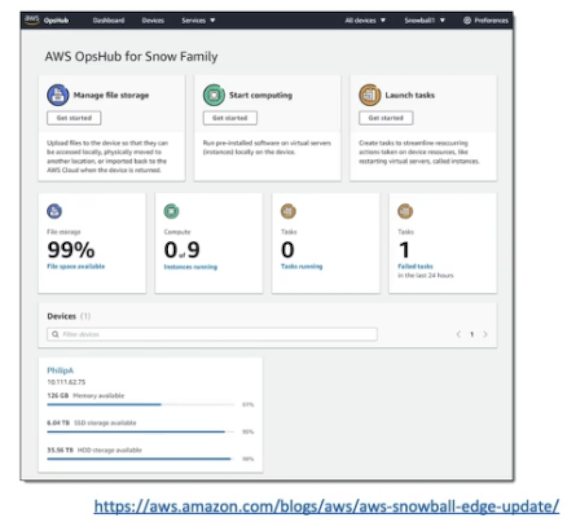 

* Historically, to use Snow Family devices, you needed a al (Command Line Interface tool) 
* **Today, you can use AWS op Hub (a software you install onyour computer / laptop) to manage your Snow Family Device** 
	* Unlocking and configuring single or clustered devices 
	* Transferring files 
	* Launching and managing instances running on Snow Earn Devices
	*  Monitor device metrics (storage capacity, active instances on your device 
	*  Launch compatible AWS services on your devices (ex:Amazon EC2 instances, AWS DataSync, Network Ede System (NFS) 
