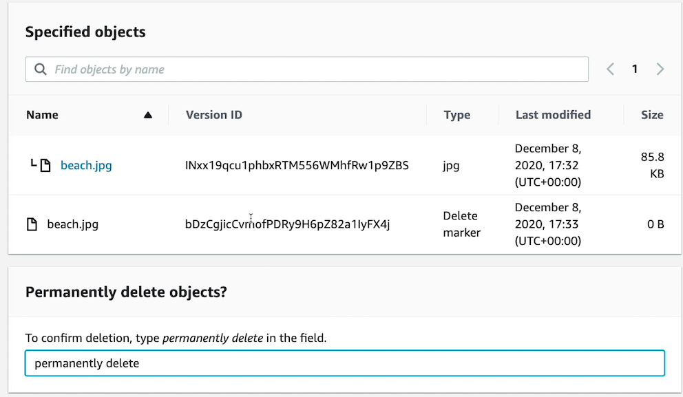

# **L3 Hands on S3**

## **1、S3 Storage Classes Hands on**

**Storage Classes**

 

**Initiate restore**

 

## **2、S3 Lifecycle Rules Hands on**

**Life rule actions**

 

 

**Timeline summary**

 

 

## **3、S3 Versioning - Hands on**

**Enable S3 Versioning**

 

**Delete object firstly**

 

**Add `Delete marker` to object**

 

**Permantely delete**

 

## **3、S3 Replication - Hands on**

**Enable Replication rule and Replication Destination**

 

 

 

## **4、S3 Encryption - Hands on**

**Object Encryption SSE-S3 & SSE-KMS**

 

**Bucket Encryption SSE-S3 & SSE-KMS**

 

## **4、S3 Security & Bucket Policies - Hands on**

**Add Bucket policy conditions**

 

 

 

## **5、S3 Events Notification - Hands on**

### **5-1 Add upload events** 

 

### **5-2 Add upload events** 

**Send Notification to SQS queue**

 

**Also need add policy to SQS enable the notification**

 

 

 

 