# **L1 Storage S3**

## **1、S3 Overview**

 

### **1-1 AWS S3 Overview - Buckets** 

* Amazon S3 allows people to store objects (files) in "buckets" (directories) 
* Buckets must have a **globally unique name** 
* Buckets are defined at the **region level**
* Naming convention 
	* No uppercase 
	* No underscore 
	* 3-63 characters long 
	* Not an IP 
	* **Must start with lowercase letter or number** 

### **1-2 AWS S3 Overview - Objects**

 

* Objects (files) have a Key.The key is the FULL path: 
	* `<my_bucket>/my_file.txt` •
	* `<my_bucket>/my_folder/another_folder/myfile.txt` 
* There's no concept of"directories" within buckets (although the UI will trick you to think otherwise) 
* **Just keys with very long names that contain slashes ("/")** 
* Object Values are the content of the body 
	* **Max Size is 5TB** 
	* If uploading more than **5GB**, **must use "multi-part upload"** 
* Metadata (**list of text key / value pairs — system or user metadata**) 
* Tags (Unicode key / value pair — up to 10) — useful for security / lifecycle 
* **Version ID (if versioning is enabled)** 

### **1-3 AWS S3 - Consistency Model** 

* **Read after write consistency for PUTS of new objects**
	* As soon as an object is written, we can retrieve it 
		* ex (`PUT 200 -> GET 200`) 
	* This is true, except if we did a GET before to see if the object existed 
		* ex (**GET 404 -> PUT 200 -> GET 404**) — eventually consistent(wait 1s or 2s then you will get 200)

* **Eventual Consistency for DELETES and PUTS of existing objects** 
	* If we read an object after updating we might get the older version 
		* ex: (PUT 200 -> PUT 200 -> GET 200 (might be older version)) 
	* If we delete an object, we might still be able to retrieve it for a short time 
		* ex (DELETE 200 -> GET 200) 

## **2、S3 Storage Tiers**

* Amazon S3 Standard - General Purpose 
* Amazon S3 Standard-Infrequent Access (IA) 
* Amazon S3 One Zone-Infrequent Access 
* Amazon S3 Reduced Redundancy Storage (deprecated) 
* Amazon S3 IntelligentTiering (new!) 
* Amazon Glacier 

### **2-1 S3 Standard — General Purpose** 

* High durability (11)(99.999999999%) of objects **across multiple AZ**
* If you store 10,000,000 objects with Amazon S3, you can on average expect to incur a loss of a single object once every 10,000 years 
* **99.99% Availability over a given year** 
* Sustain 2 concurrent facility failures 
* Use Cases: 
	* **Big Data analytics** 
	* mobile & gaming applications
	* content distribution... 

### **2-2 S3 Reduced Redundancy Storage (RRS) - DEPRECATED**

* Designed to provide 99.99% durability 
* 99.99% availability of objects over a given year 
* Designed to sustain the loss of data in a single facility 
* Use cases: 
	* noncritical, 
	* reproducible data at lower levels of redundancy than Amazon S3's standard storage (thumbnails, transcoded media, processed data that can be reproduced) 

### **2-3 S3 Standard — Infrequent Access (IA)** 

* **Suitable for data that is less frequently accessed**, but requires rapid access when needed 
* High durability (99.999999999%) of objects across multiple AZs 
* **99.9% Availability (less than General Purpose)**
* Low cost compared to Amazon S3 Standard 
* Sustain 2 concurrent facility failures 
* Use Cases:
	* As a data store for disaster recovers 
	* backups... 

### **2-4 S3 One Zone - Infrequent Access (IA)** 

* **Same as IA but data is stored in a single AZ** 
* High durability (99.999999999%) of objects in a single AZ; **data lost when AZ is destroyed**
* 99.5% Availability • Low latency and high throughput performance 
* Supports SSL for data at transit and encryption at rest 
* **Low cost compared to IA (by 20%)**
* Use Cases: 
	* Storing secondary backup copies of on-premise data,
	* storing data you can recreate 

### **2-5 S3 IntelligentTiering (new!)** 

* Probably not at the exam (yet!) 
* Same low latency and high throughput performance of S3 Standard 
* Small monthly monitoring and auto-tiering fee 
* Automatically moves objects between two access tiers based on changing access patterns 
* Designed for durability of 99.999999999% of objects across multiple Availability Zones 
* **Resilient against events that impact an entire Availability Zone** 
* Designed for 99.9% availability over a given year 

### **2-6 S3 Glacier**

* Low cost object storage meant for **archiving / backup**
* **Data is retained for the longer term (10s of years)** 
* Alternative to on-premise magnetic tape storage 
* Average annual durability is 99.999999999%
* **Cost per storage per month ($0.004 / GB) + retrieval cost** 
* Each item in Glacier is called "Archive" (up to **40TB**) 
* **Archives are stored in "Vaults"** 
* **3 retrieval options**: 
	* **Expedited (1 to 5 minutes retrieval)** — $0.03 per GB and $0.01 per request 
	* **Standard (3 to 5 hours)** - $0.01 per GB and 0.05 per 1000 requests 
	* **Bulk (5 to 12 hours)** - $00025 per GB and $0.025 per 1000 requests 

### **2-7 S3 Storage Tiers Comparisons**

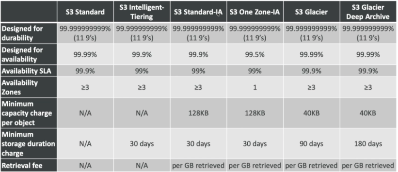 

### **2-8 S3 Storage Classes — Price Comparison Example us-east-2 **

 

## **3、S3 Lifecycle Rules**

* Set of rules to move data between different tiers, to save storage cost 
* Example: **General Purpose => Infrequent Access => Glacier** 
* **Transition actions**: It defines when objects are transitioned to another storage class. 
	* Eg: We can choose to move objects to Standard IA class 60 days after you created them or can move to Glacier for archiving after 6 months 
* **Expiration actions**: Helps to configure objects to expire after a certain time period. S3 deletes expired objects on our behalf 
	* Eg: Access log files can be set to delete after a specified period of time 
* **Moving to Glacier is helpful for backup / long term retention / regulatory needs** 

## **4、S3 Versioning**

* **You can version your files in AWS S3** 
* It is enabled at the **bucket level** 
* Same key overwrite will increment the "version": 1 , 2, 3.... 
* It is best practice to version your buckets 
	* Protect against** unintended deletes** (ability to restore a version) 
	* Easy roll back to previous version 
* Any file that is not versioned prior to enabling versioning will have version "null" 
* You can "suspend" versioning 

`Enable versioning` => `version id`

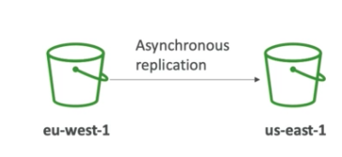 

## **5、S3 Cross Region Replication** 

* Must enable versioning (source and destination) 

 

* Buckets **must be in different AWS regions** 
* **Can be in different accounts** 

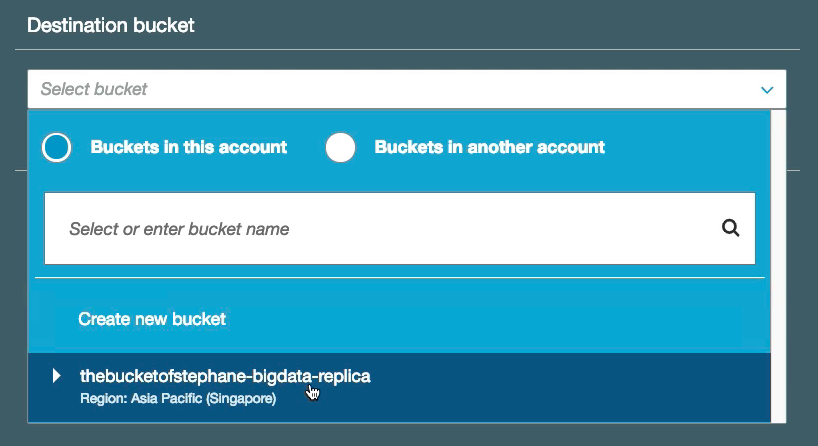 

* Copying is asynchronous 

 

* Must give proper IAM permissions to S3 

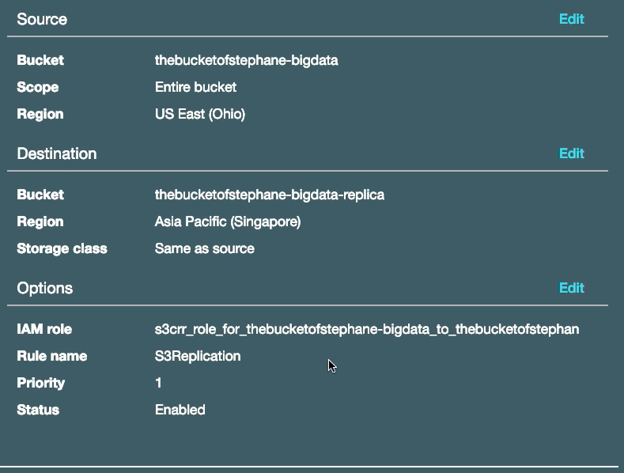 

* Use cases: 
	* compliance, 
	* lower latency access, 
	* replication across accounts 

 

## **6、S3 ETags (Entity Tag)** 

* Flow do you verify if a file has already been uploaded to S3? 
* Names work, but how are you sure the file is exactly the same? 
* For this, you can use AWS ETags: 
	* For simple uploads (less than 5GB), it's the **MD5 hash** 
	* For multi-part uploads, it's more complicated, no need to know the algorithm 
* Using **ETag**, we can ensure integrity of files 

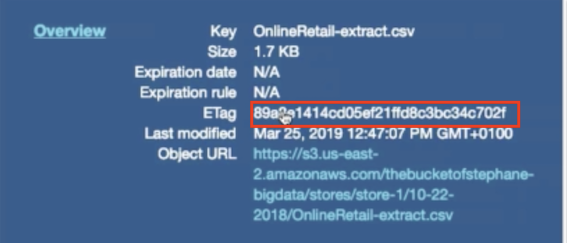 
 

 

## **6、AWS S3 Performance** 

> Historic fact and current exam 

* **When you had > 100 TPS (transaction per second), S3 performance could degrade** 
* Behind the scene, each object goes to an S3 partition and for the best performance, **we want the highest partition cistribution** 
* In the exam, and historically, it was recommended to have **random characters in front of your key name to optimise performance**: 
	* `<my_bucket>/5r4d_my_folder/my_file1.txt` 
	* `<my_bucket>/a91e_my_folder/my_file2.txt` 
	* ...

* It was recommended **never to use dates to prefix keys**: 
	* `<my_bucket>/2018_09_09_my_folder/my_file1.txt` 
	* `<my_bucket>/2018_09_10_my_folder/my_file2.txt `

### **6-1 AWS S3 Performance Key Names Current performance (not yet exam)** 

[https://aws.amazon.com/about-aws/whats-new/2018/07/amazon-s3-announces-increased-request-rate-performance/](https://aws.amazon.com/about-aws/whats-new/2018/07/amazon-s3-announces-increased-request-rate-performance/)

* As of July 17th 2018, we can scale up to 3500 RPS(request per second) for PUT and 5500 RPS for GET for EACH PREFIX 
* "**This S3 request rate performance increase removes any previous guidance to randomize object prefixes to achieve faster performance**" 
* It's a "good to know", until the exam gets updated 

### **6-2 AWS S3 Performance** 

* Faster upload of **large objects (>5GB), use multipart upload**: 
	* parallelizes **PUTs** for greater throughput 
	* maximize your network bandwidth 
	* decrease time to retry in case a part fails 
* **Use CloudFront to cache 53 objects around the world (improves reads)** 
* **S3 Transfer Acceleration** (uses edge locations) — ju**st need to change the endpoint you write to**, not the code. 
* If using **SSE-KMS encryption, you may be limited** to your AWS limits for KMS usage (~100s — 1000s downloads / uploads per second) 

## **7、S3 Encryption**

### **7-1 S3 Encryption for Objects** 

There are 4 methods of encrypting objects in S3 

* **SSE-S3**: encrypts S3 objects using keys handled & **managed by AWS** 
* **SSE-KMS**: **leverage AWS Key Management Service** to manage encryption keys 
* **SSE-C**: when you want to manage **your own encryption keys** 
* **Client Side Encryption** 
* It's important to understand which ones are adapted to which situation for the exam 

### **7-2 SSE-S3** 

* SSE-S3: encryption using keys handled & managed by AWS S3 
* **Object is encrypted server side** 
* AES-256 encryption type 
* Must set header: **"x-amz-server-side-encryption": "AES256"** 

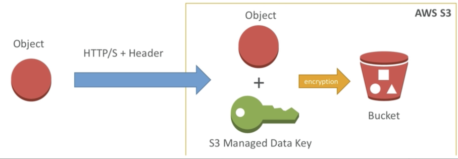 

> Remember the form it's **x-amz** for Amazon server-side-encryption AES256 which makes sense because requesting Amazon to perform servers that encryption for us with the algorithm AES-256.

1. Make an **HTTP** or **HTTPS** request and I'm going to had to add that header **"x-amz-server-side-encryption": "AES256"**
2. We requested server side encryption it's also going to create a manage key and manage data key.

### **7-3 SSE KMS** 

* SSE-KMS: **encryption using keys handled & managed by KMS**
* KMS Advantages: user control + audit trail 
* Object is encrypted server side
* Must set header: **"x-amz-server-side-encryption": "aws:kms"** 

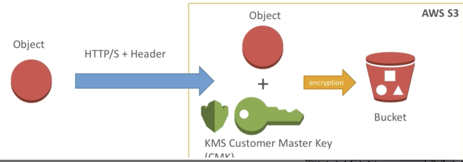 

* **KMS Customer Master Keys** : **KMS CMK**
* We transfer the object using **HTTP** or **HTTPS** in the header that we set before and so the object is now in S3.
* And so now the key that is use is a **KMS customer master key or CMK**

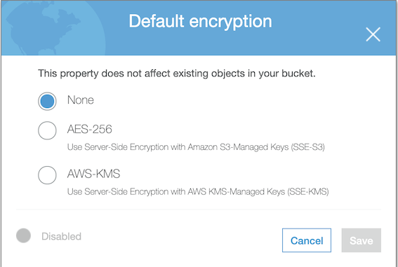 

### **7-4 SSE-C** 

* SSE-C: server-side encryption using data keys fully managed by the customer outside of AWS 
* Amazon S3 does not store the encryption key you provide 
* **HTTPS must be used** 
* **Encryption key must provided in HTTP headers, for every HTTP request made** 

 

### **7-5 Client Side Encryption** 

* Client library such as the **Amazon S3 Encryption Client** 
* **Clients must encrypt data themselves before sending to S3** 
* **Clients must decrypt data themselves when retrieving from S3** 
* Customer fully manages the keys and encryption cycle 

 

> Left Side

1. Using the **S3 encryption in SDK we will generate a client side data key altogether with the object** we will encrypt that data client side.
2. The clients must decrypt the data themselves as well when they retrieved it from S3 
3. The customer fully manages the key and encryption cycle.

 

> We cannot do SSE-C and we cannot do client side encryption from UI but **IT's possible to do progrmmatically**

 

### **7-6 Encryption in transit (SSL)** 

#### AWS S3 exposes: 

* HTTP endpoint: **non encrypted**
* HITTPS endpoint: **encryption in flight**
 
* You're free to use the endpoint you want, but HTTPS is recommended 
* HITTPS is mandatory for SSE-C 
* **Encryption in flight is also called SSL /TLS** 

## **8、S3 Security**

### **8-1 S3 CORS (Cross-Origin Resource Sharing)** 

* If you request data from another website, **you need to enable CORS** 
* **Cross Origin Resource Sharing** allows you to **limit the number of websites that can request your files in S3 (and limit your costs)** 
* <mark>It's a popular exam question</mark>

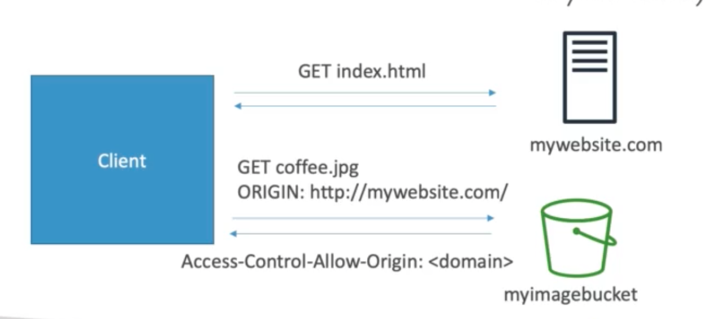  

1. Here's our client and we have **mywebsite.com** and all the Web
2. The Web site images are my are in my image bucket.
3. So the client connects to the Web site.
4. Now the image bucket looks at **the origin of the request mywebsite.com** and **compares it to the CORS** and if the **CORS is positive** and contains that mywebsite.com it says Yes you're fine you can definitely request that file.

### **8-2 S3 Access Logs** 

* **For audit purpose**, you may want to log all access to S3 buckets 
* Any request made to S3, from any account, authorized or denied, will be logged into another S3 bucket 
* That data can be analyzed using data analysis tools... 
* Or Amazon Athena as we'll see later in this course!

  
 
* The log format is at: https://docs.aws.amazon.com/AmazonS3/latest/dev/LogFormat.html  

### **8-3 S3 Security **

**User based** 

* IAM policies - which API calls should be allowed for a specific user from IAM console 

**Resource Based** 

* **Bucket Policies - bucket wide rules from the S3 console - allows cross account** 
* **Object Access Control List (ACL) — finer grain** 
* Bucket Access Control List (ACL) — less common 

### **8-4 S3 Bucket Policies** 

**JSON based policies** 

* Resources: buckets and objects 
* Actions: Set of API to Allow or Deny 
* Effect: Allow / Deny 
* Principal: The account or user to apply the policy to 

**Use S3 bucket for policy to**: 

* Grant public access to the bucket 
* Force objects to be encrypted at upload 
* Grant access to another account (Cross Account) 

### **8-5 S3 Default Encryption vs Bucket Policies** 

* The **old way to enable default encryption was to use a bucket policy** and refuse any HTTP command without the proper headers: 

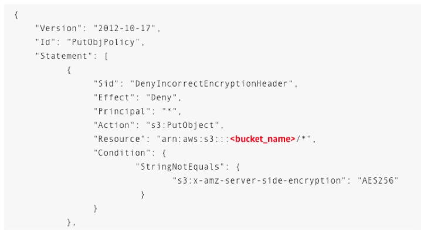  

* **The new way is to use the "default encryption" option in S3** 

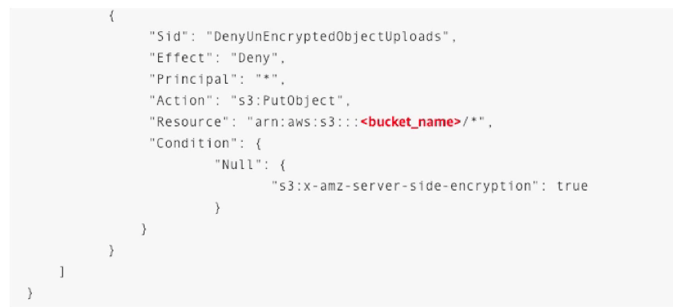  

* Note: **Bucket Policies are evaluated before "default encryption"**

### **8-6 S3 Security - Other** 

**Networking:** 

* Supports VPC Endpoints (for instances in VPC without www Internet) 

**Logging and Audit**: 

* S3 access logs can be stored in other 53 bucket
* API calls can be logged in AWS CloudTrail 

**User Security**: 

* MFA (multi factor authentication) can be required in versioned buckets to delete objects 
* Signed URLs: URLs that are valid only for a limited time (ex: premium video service for logged in users) 

## **9、Glacier & Vault Lock Policies**

### **9-1 Glacier**

  

* Low cost object storage meant for archiving / backup  
* Data is retained for the longer term ( I Os of years) 
* Alternative to on-premise magnetic tape storage • Average annual durability is 99.999999999%  
* Cost per storage per month ($0.004 / GB) ± retrieval cost 

* **Each item in Glacier is called "Archive" (up to 40TB)** 
* **Archives are stored in "Vaults"** 

* **Exam tip: archival from S3 after XXX days —> use Glacier**

### **9-2 Glacier Operations**

* **Restore links have an expiry date** 
* 3 retrieval options: 
	* Expedited (1 to 5 minutes retrieval) $0.03 per GB and $0.01 per request 
	* Standard (3 to 5 hours) - $0.01 per GB and 0.05 per 1000 requests 
	* Bulk (5 to 12 hours) - $0.0025 per GB and $0.025 per 1000 requests 

### **9-3 Glacier -Vault Policies & Vault Lock (Exam)**

* Vault is a collection of archives 
* Each Vault has: 
	* ONE vault access policy 
	* ONE vault lock policy 
* Vault Policies are written in JSON 
* Vault Access Policy is similar to bucket policy (restrict user / account permissions) 
* Vault Lock Policy is a policy you lock, for regulatory and compliance requirements. 
	* **The policy is immutable, it can never be changed** (that's why it's call LOCK) 
	* Example 1: forbid deleting an archive if less than 1 year old 
	* Example 2: **implement WORM policy (write once read many)** 

## **10、S3 & Glacier Select**

* Retrieve less data using SQL by performing server side filtering 
* Can filter by rows & columns (simple SQL statements) 
* Less network transfer, less CPU cost client-side 

  

### **10-1 S3 Select with Hadoop** 

Transfer some data from S3 before analyzing it with your cluster 

  

## **11、S3 Event Notification**

* `S3:ObjectCreated`, `S3:ObjectRemoved`
* `S3:ObjectRestore`, 	`S3:Replication`... 
* Object name filtering possible `(*.jpg)` 
* **Use case**: generate thumbnails of images uploaded to S3 
* **Can create as many "S3 events" as desired** 

* S3 event notifications typically deliver events in seconds but can sometimes take a minute or longer 
* If two writes are made to a single non-versioned object at the same time, **it is possible that only a single event notification will be sent** 
* If you want to ensure that an event notification is sent for every successful write, you can enable versioning on your bucket. 

  