# **L2 DynamoDB**


## **L2 DynamoDB Overview**

 

* Fully Managed, Highly available with replication **across 3 AZ** 
* NoSQL database - not a relational database 
* **Scales to massive workloads, distributed database**
* Millions of requests per seconds, trillions of row, **100s of TB of storage** 
* **Fast and consistent in performance (low latency on retrieval)**
* Integrated with IAM for security, authorization and administration 
* Enables event driven programming with DynamoDB Streams 
* **Low cost and auto scaling capabilities** 

### **1-1 DynamoDB - Basics** 

* DynamoDB is made of **tables** 
* Each table has a **primary key** **(must be decided at creation time)**

 
* Each table can have an **infinite number of items (= rows)** 
* Each item has **attributes** (can be added over time can be null) 
* Maximum size of a item is **400KB** 
* Data types supported are: 
	* **Scalar Types**: String, Number, Binary, Boolean, Null 
	* Document Types: **List, Map** 
	* Set Types: String Set, Number Set, Binary Set 

### **1-2 DynamoDB — Primary Key**

* Option 1: **Partition key only (HASH)** 
* **Partition key must be unique for each item** 
* **Partition key must be "diverse"** so that the data is distributed
* Example: **user id for a users table**

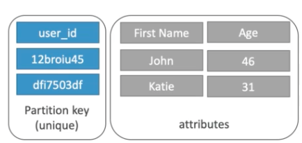 

### **1-3 DynamoDB — Primary Keys**

* Option 2: **Partition key + Sort Key** 
* **The combination must be unique** 
* **Data is grouped by partition key**
* **Sort key == range key** 
* Example:  users-games table 
	* `user_id` for the partition key 
	* `game_id` for the sort key 

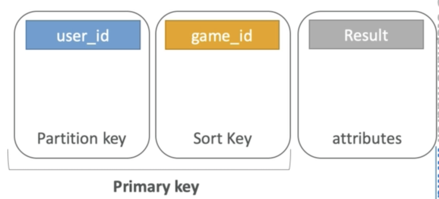 

> partition key and sort key can be duplicate, but the combination must be unique

### **1-4 DynamoDB Partition Keys exercise** 

* We're building a movie database 
* What is the best partition key to maximize data distribution? 
	* `movie_id` 
	* `producer_name` 
	* `leader_actor_name`
	* `movie_language` 

* **movie_id** has the **highest cardinality**(unqiue) so it's a good candidate 
* `moving_language` doesn't take many values and may be skewed towards English so it's not a great partition key 

### **1-5 DynamoDB in Big Data** 

**Common use cases include**: 

* Mobile apps 
* Gaming 
* Digital ad serving 
* Live voting 
* Audience interaction for live events 
* Sensor networks 
* Log ingestion 
* Access control for web-based content
* Metadata storage for Amazon S3 objects
* E-commerce shopping carts
* Web session management 

**Anti Pattern** 

* Pre-written application tied to a **traditional relational database**: use RDS instead 
* joins or complex transactions 
* **Binary Large Object (BLOB) data: store data in S3 & metadata in DynamoDB** 
* Large data with **low I/O rate: use S3 instead** 

> DynamoDB is to be more for data is hot and smaller
> 
> S3 is goiing to be colder but bigger

## **2、DynamoDB RCU & WCU**

### **2-1 DynamoDB Provisioned Throughput** 

* Table must have provisioned read and write capacity units 
* **Read Capacity Units (RCU)**: throughput for reads 
* **Write Capacity Units (WCU)**: throughput for writes 
* Option to setup **auto-scaling of throughput to meet demand** 
* **Throughput can be exceeded temporarily using "burst credit"**
* If burst credit are empty, you'll get a "**ProvisionedThroughputException**". 
* It's then advised to do an exponential back-off retry 

### **2-2 DynamoDB — Write Capacity Units** 

* One **write capacity unit** represents **one write per second** for an **item up to 1 KB in size.** 
* If the **items are larger than 1 KB, more WCU are consumed** 

* **Example 1**: We write 10 objects per seconds of 2 KB each. 

```
We need 2 * 10 = 20 WCU 
```

* **Example 2**: we write 6 objects per second of 4.5 KB each 

```
We need 6 * 5 = 30 WCU  #(4.5 gets rounded to the upper KB)
```

* **Example 3**: we write 120 objects **per minute** of 2 KB each 

```
We need 120 / 60 * 2 = 4 WCU 
```

### **2-3 Strongly Consistent Read vs Eventually Consistent Read** 

**Eventually Consistent Read**: 

If we read just after a write, it's possible we'll get unexpected response because of replication 

**Strongly Consistent Read:** 

If we read just after a write, we will get the correct data 

**By default DynamoDB uses Eventually Consistent Reads**, but `Getltem`, `Query` & `Scan` provide a "**ConsistentRead**" parameter you can set to True 


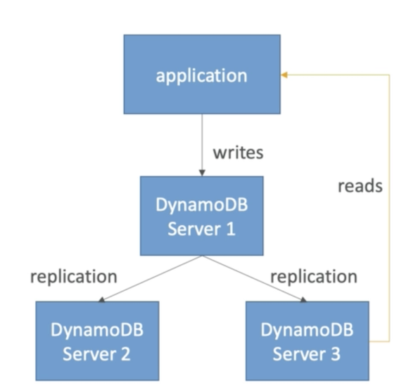 

### **2-3 DynamoDB Read Capacity Units** 

* One **read capacity unit** represents **one strongly consistent read per second**, or **two eventually consistent reads per second**, for an item up to **4 KB in size**. 
* If the items are larger than 4 KB, more RCU are consumed 

> 1 strongly consistent read/s
> 
> 2 eventually consistent reads/s
> 
> 4kb up

* **Example 1**: 10 strongly consistent reads per seconds of 4 KB each 

```
We need 10 * 4 KB / 4 KB = 10 RCU 
```

* **Example 2**: 16 eventually consistent reads per seconds of 12 KB each 

```
We need (16 / 2) * ( 12 / 4 ) = 24 RCU 
```

* **Example 3**: 10 strongly consistent reads per seconds of 6 KB each 

```
We need 10 * 8 KB / 4 = 20 RCU (we have to round up 6 KB to 8 KB) 
```

### **2-4 DynamoDB -Throttling** 

* If we **exceed our RCU or WCU**, we get **ProvisionedThroughputExceededExceptions** 
* Reasons: 
	* **Hot keys / partitions**: one partition key is being read too many times (popular item for ex) 
	* **Very large items**: remember RCU and WCU depends on size of items 

* Solutions: 
	* Exponential back-off when exception is encountered (already in SDK) 
	* **Distribute partition keys as much as possible** 
	* If RCU issue, we can use **DynamoDB Accelerator (DAX)**


### **2-5 on-demand RCU and WCU**

Select on-demand if you want to pay only for the read and writes you perform, with no capacity planning required. It's pretty expensive

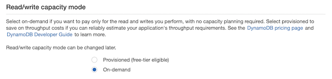 

### **2-6 Capacity calculator**	

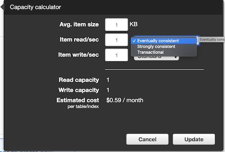 


## **3、DynamoDB Partitions**

### **3-1 DynamoDB - Partitions Internal**

* You start with **one partition** 
* Each partition: 
	* Max of **3000 RCU / 1000 WCU**
	* Max of 10GB 

* To compute the number of partitions:

* By capacity: `(TOTAL RCU / 3000) + (TOTAL WCU / 1000)` 
* By size: `Total Size / 10 GB` 
* Total partitions = `CEILING(MAX(Capacity, Size))` 
* **WCU and RCU are spread evenly between partitions** 

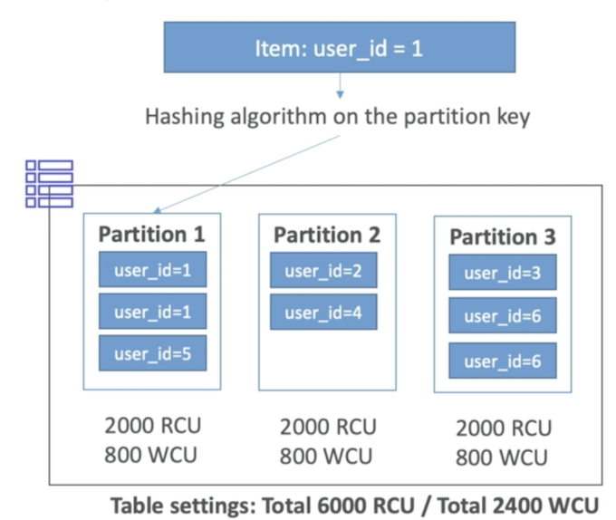 

## **4、DynamoDB APIs (ADUS)**

### **4-1 DynamoDB — Writing Data**

* **PutItem** - Write data to DynamoDB (**create data or full replace**) 
	* **Consumes WCU** 
* **UpdateItem** — Update data in DynamoDB (**partial update of attributes**) 
	* Possibility to use Atomic Counters and increase them 
* **Conditional Writes**: 
	* Accept a write / update only if conditions are respected, otherwise reject 
	* Helps with concurrent access to items
	* No performance impact 


### **4-2 DynamoDB — Deleting Data** 

* **Deleteltem** 
	* Delete an individual row 
	* Ability to perform a **conditional delete** 

* **DeleteTable** 
	* Delete a whole table and all its items 
	* Much quicker deletion than calling **Deleteltem on all items** 


### **4-3 DynamoDB — Batching Writes** 

* **BatchWriteltem** 
	* Up to **25** **Putltem** and / or **Deleteltem** in one call 
	* Up to **16 MB of data written** 
	* Up to **400 KB of data per item** 
	
* Batching allows you to save in latency by **reducing the number of API** calls done against DynamoDB 
* **Operations are done in parallel** for better efficiency 
* It's possible for part of a batch to fail, in which case we have the try the failed items (using exponential back-off algorithm) 


### **4-4 DynamoDB — Reading Data** 

* **GetItem**: 
	* Read based on **Primary key** 
	* **Primary Key = HASH or HASH-RANGE** 
	* Eventually consistent read by default 
	* ption to use strongly consistent reads (**more RCU - might take longer**)
	* **ProjectionExpression** can be specified to include only certain attributes 

* **BatchGetltem**: 
	* **Up to 100 items** 
	* **Up to 16 MB of data** 
	* Items are retrieved in parallel to minimize latency 

### **4-5 DynamoDB — Query** 

* **Query** returns items based on: 
	* **PartitionKey** value (**must be = operator**) 
	* **SortKey** value (=, <, <=, >, >=, **Between, Begin**) — optional 
	* **FilterExpression** to further filter (**client side filtering**) 

> Query by PartitionKey

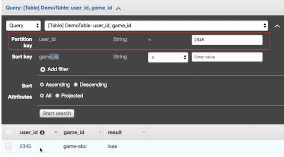 

> Query by PartitionKey + SortKey

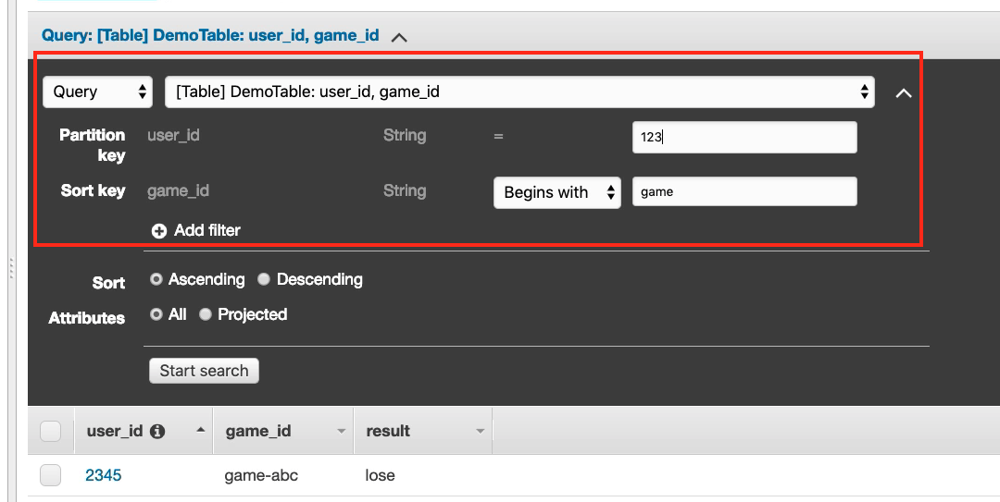 

> The only thing you can query is PartitionKey and SortKey
> 
> You could have filter at the very end and it's client side filtering

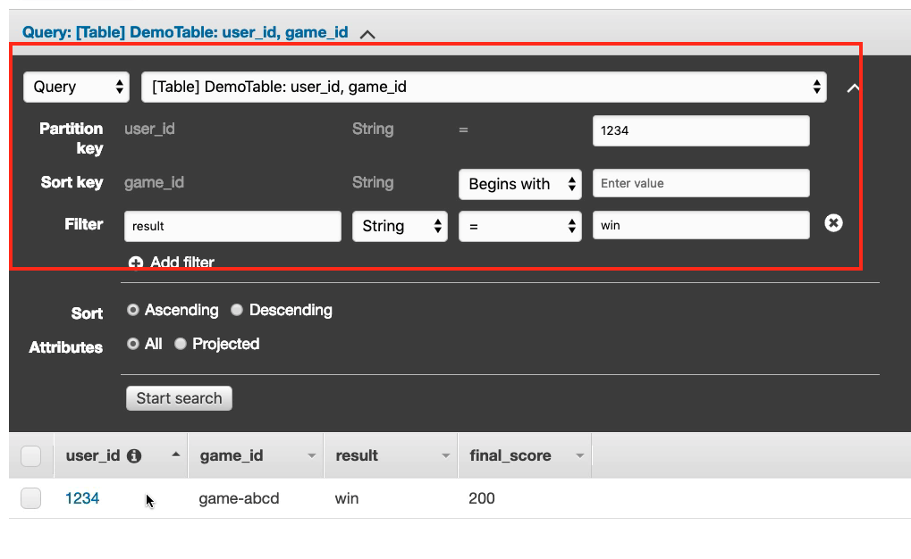 

* Returns: 
	* Up to 1 MB of data 
	* Or number of items specified in **Limit** 


* Able to do **pagination** on the results 
* **Can query table, a local secondary index, or a global secondary index** 


### **4-6 DynamoDB - Scan** 

* **Scan** the entire table and then filter out data (**inefficient**) 
* Returns up to 1 MB of data use pagination to keep on reading 
* **Consumes a lot of RCU** 
* **Limit impact using Limit or reduce the size of the result and pause** 
* For faster performance, **use parallel scans**: 
	* Multiple instances scan multiple partitions at the same time
	* Increases the **throughput and RCU consumed** 
	* Limit the impact of parallel scans just like you would for Scans 

* Can use a **ProjectionExpression ± FilterExpression** (no change to **RCU**) 

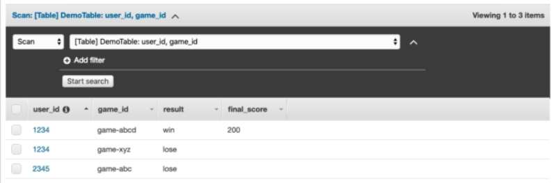 

## **5、DynamoDB Indexes: LSI & GSI**

### **5-1 DynamoDB — LSI (Local Secondary Index)** 

* Alternate range key for your table, **local to the hash key** 
* **Up to five local secondary indexes per table**. 
* The **sort key consists of exactly one scalar attribute**. 
* The attribute that you choose must be a **scalar String**, Number, or Binary 
* **LSI must be defined at table creation time**

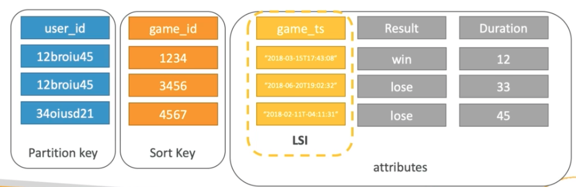 

> Create local secondary indexex with partition key + Sort key

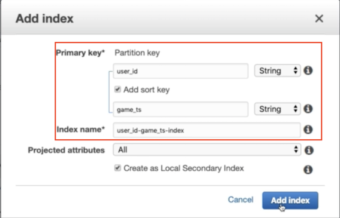 

> **LSI must be defined at table creation time**

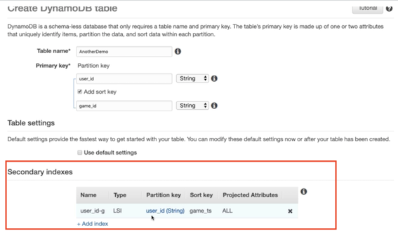 

> instead Query table, you can query index

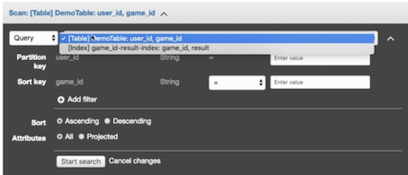 

### **5-2 DynamoDB — GSI (Global Secondary Index)** 

* **To speed up queries on non-key attributes, use a Global Secondary Index** 
* GSI = **partition key** ± **optional sort key** 
* **The index is a new "table" and we can project attributes on it** 
	* The partition key and sort key of the original table are always projected (**KEYS_ONLY**) 
	* Can specify extra attributes to project (INCLUDE) 
	* Can use all attributes from main table (ALL)

* **Must define RCU /WCU for the index**
* **Possibility to add / modify GSI (not LSI)**


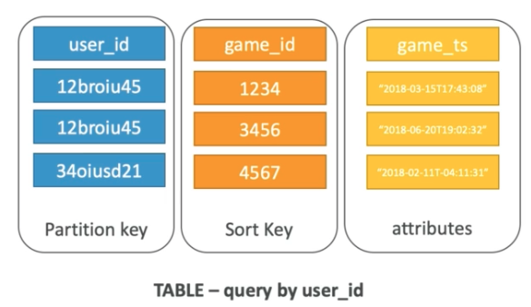 

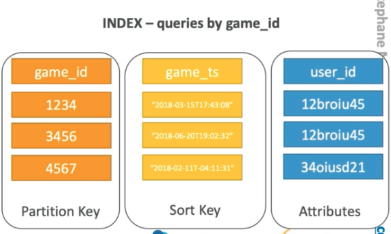 


> partition key + Sort key
> 
> Add RCU /WCU for the index

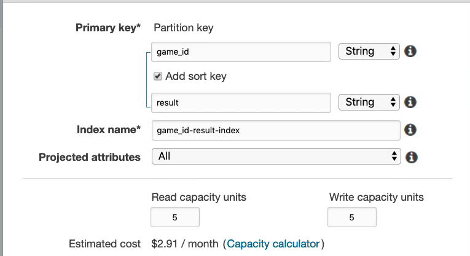 

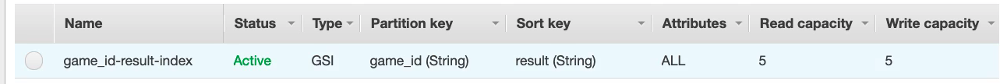 

## **6、DynamoDB DAX**

* **DAX = DynamoDB Accelerator** 
* **Seamless cache for DynamoDB**, **no application re-write** 
* **Writes go through DAX to DynamoDB** 
* Micro second latency for cached reads & queries 
* Solves the Hot Key problem (too many reads) 
* **5 minutes TTL for cache by default** 
* **Up to 10 nodes in the cluster**
* **Multi AZ (3 nodes minimum recommended for production)** 
* Secure (Encryption at rest with KMS,VPC, IAM, CloudTrail...) 


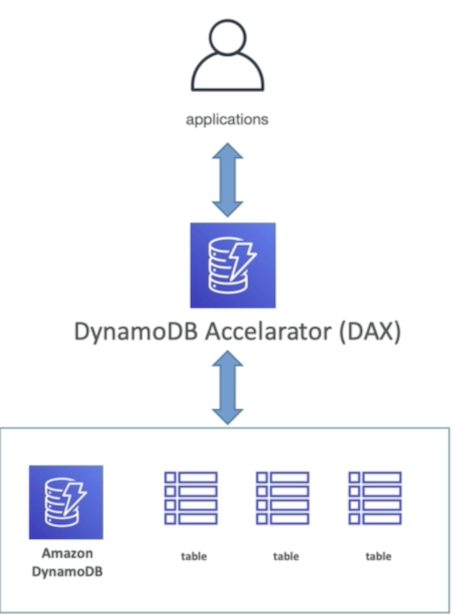 

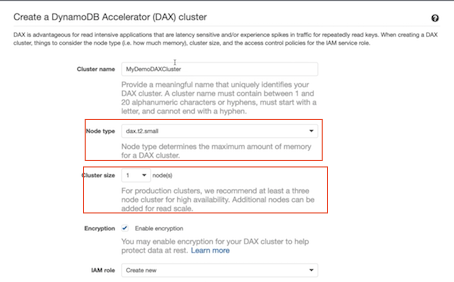 

## **7、DynamoDB Streams**

* Changes in DynamoDB (Create, Update, Delete) **can end up in a DynamoDB Stream** 
* This stream can be **read by AWS Lambda**, and we can then do: 
	* **React to changes in real time** (welcome email to new users) 
	* Create derivative tables / views 
	* Insert into ElasticSearch 

* **Could implement Cross Region Replication using Streams** 
* **Stream has 24 hours of data retention** 】
* Configurable batch size (up to 1,000 rows, 6 MB) 

### **7-1 DynamoDB Streams Kinesis Adapater**

* **Use the KCL library to directly consume from DynamoDB Streams** 
* You just need to add a **"Kinesis Adapter" library** 
* The interface and programming is exactly the same as Kinesis Streams 
* That's the alternative to using AWS Lambda 

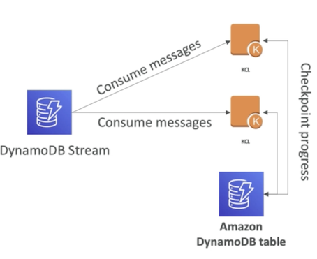 

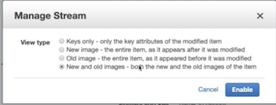 


## **8、DynamoDB TTL (Time to Live)** 

* **TTL = automatically delete an item after an expiry date / time** 
* TTL is provided at no extra cost, deletions do not use WCU / RCU 
* TTL is a background task operated by the DynamoDB service itself 
* **Helps reduce storage and manage the table size over time**
* Helps adhere to regulatory norms 
* **TTL is enabled per row (you define a TTL column, and add a date there)** 
* DynamoDB typically deletes expired items within 48 hours of expiration 
* Deleted items due to TTL are also deleted in GSI / LSI 
* **DynamoDB Streams can help recover expired items** 

> TTL is enabled per row
> 
> Add attribute: **expire_on**

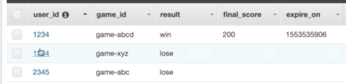 

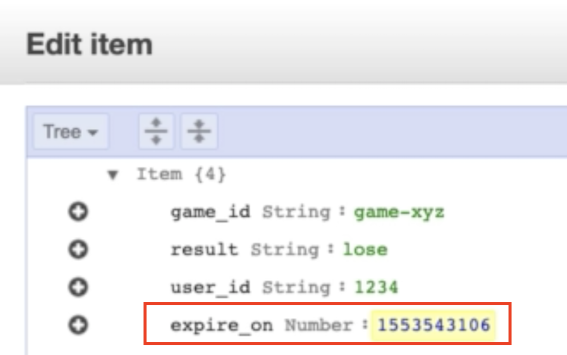 

[https://www.epochconverter.com/](https://www.epochconverter.com/)


> Enable TTL on table level

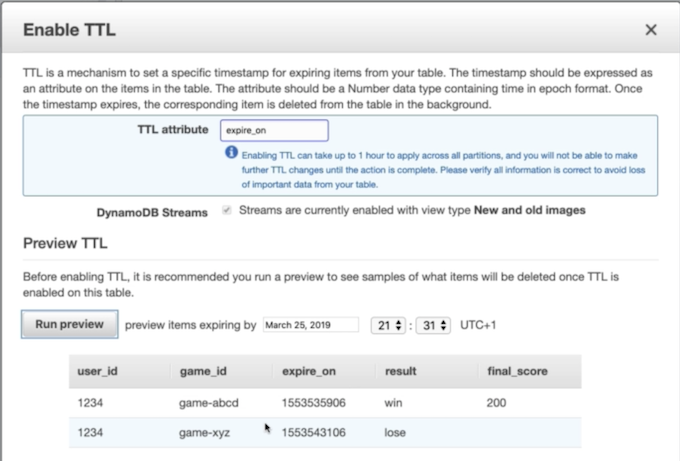 


## **9、DynamoDB — Security & Other Features** 

### **9-1 Security:** 

* **VPC Endpoints available** to access DynamoDB without internet 
* Access fully controlled by IAM 
* Encryption at rest using KMS 
* Encryption in transit using SSL /TLS • 

### **9-2 Backup and Restore feature available** 

* **Point in time restore like RDS**
* No performance impact 

### **9-2 Global Tables** 

* **Multi region, fully replicated, high performance** 

Amazon Database Migration Service (DMS) can be used to migrate to DynamoDB (from Mongo, Oracle,TlySQL, S3, etc...) 

* **You can launch a local DynamoDB on your computer for development purposes** 


## **10、DynamoDB: Storing Large Objects**

### **10-1 DynamoDB Storing large objects** 

* Max size of an item in **DynamoDB = 400 KB** 
* For large objects, **store them in S3 and reference them in DynamoDB**

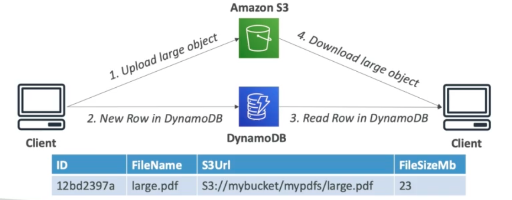 

### **10-2 DynamoDB - Price comparison for 300 KB** 


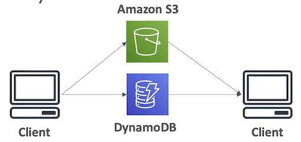 

* **Amazon S3 (300KB of storage)** 
	* `$0.0000069` storage per month 
	* `$0.0000050` initial PUT 
	* `$0.0000004` per GET 

* **DynamoDB (< 1 KB of storage)** 
	* `$0.0006500` for one WCU per month 
	* `$0.0001300` for one RCU per month 
	* `$0.00000025` storage per month 

* **Assuming I write, 100 reads per month**: 
	* `$0.00119215` per month 


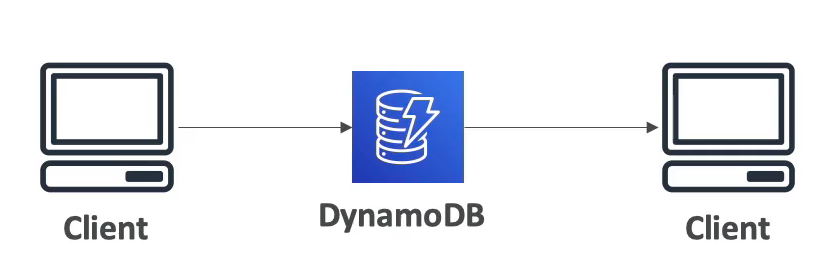 

* **DynamoDB (300 KB of storage)** 
	* `$0.195` for `300` WCU per month 
	* `$0.004940` for `38` RCU per month 
	* `$0.000075` storage per month 

* **Assuming I write, 100 reads per month:** 
	* Storage is  **11x more expensive**  
	* WCU + RCU are under-used 

* **Even for items that fit in DynamoDB, if under-used, S3 + DynamoDB is a solution** 


## **11 AWS ElastiCache Overview** 

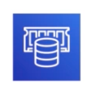 

* The same way RDS is to get managed Relational Databases... 
* ElastiCache is to get managed **Redis** or **Memcached** 
* Caches are in-memory databases with really **high performance, low latency** 
* Helps reduce load off of databases for read intensive workloads 
* Helps make your **application stateless** 
* **Write Scaling using sharding** 
* Read Scaling using Read Replicas 
* **Multi AZ with Failover Capability**
* AWS takes care of OS maintenance / patching, optimizations, setup, configuration, monitoring, failure recovery and backups 

### **11-1 Redis Overview**

* **Redis is an in-memory key-value store** 
* Super low latency (sub ms) 
* Cache survive reboots by default (it's called persistence) 
* Great to host 
	* User sessions 
	* Leaderboard (for gaming) 
	* Distributed states 
	* Relieve pressure on databases (such as RDS) Pub / Sub capability for messaging 
* **Multi AZ with Automatic Failover for disaster recovery if you don't want to lose your cache data** 
* Support for Read Replicas 

### **11-2 Memcached Overview **

* **Memcached is an in-memory object store(Like S3)** 
* **Cache doesn't survive reboots** 
* Use cases: 
	* Quick retrieval of objects from memory 
	* Cache often accessed objects 
* Overall, Redis has largely grown in popularity and has better feature sets than Memcached. 
* **I would personally only use Redis for caching needs.** 

