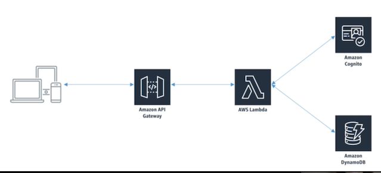
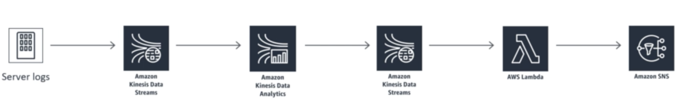
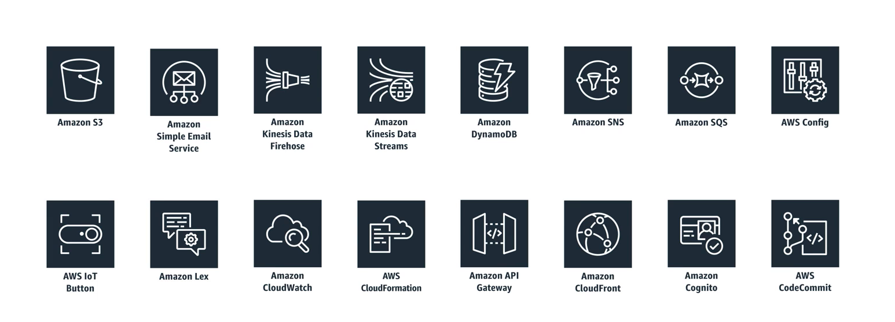
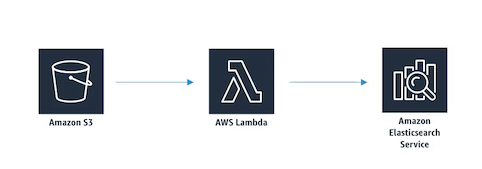
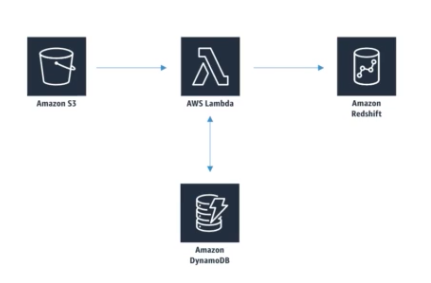
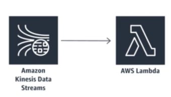

# **L1 AWS Lambda**

> Serverless Data processing

 

## **1、What is Lambda?** 

* A way to run code snippets "in the cloud" 
	* **Serverless** 
	* **Continuous scaling** 
* Often used to process data as it's moved around 
	* **Some services** don't talk directly to other services in AWS but **lambda can be used as the glue between these services** 
	* So it can sit there and get triggered by some other service sending data into it like a **Kinesis data stream reformat** that information into a format required by some other service send that data to another service for further processing and maybe retrieve that data and send it back.

## **2、Example: Serverless Website**

 

1. Build your Web site by just having **static html and ajax** calls embedded within that html well you can serve that from **S3**
2.  You have an **API Gateway** in Amazon it sort of serves as the wall between the **outside clients and you the the interior of your system there**.
3.  User **Log in request** go through the **API Gateway** which in turn would then get sent off to **AWS Lambda Lambd**a would say OK the Web site wants this person to log in
4. It could turn around and craft request to **Amazon Cognito** to say **do you authenticate this user or not** Amazon Cognito will come back and say Sure here's your token lambda could then format that result and send it back to the Web site.
5. Or It would then **turn around craft that request a DynamoD**B for that chat history.
6. Talk to DynamoDB to get that and then send it back through the API Gateway back to the Web site.

## **3、Example: Transcation rate alarm**

 

1. **Kinesis data stream** that's receiving events it says something weird is going on that requires someone's attention.
2. **Lambda is going to be triggered by those data stream events** 
3. **Lambda will then turn around and craft an SNS request** to actually send out a message to your cell phone notifying you that something requires our attention.

## **4、Lambda Integration**

### **4-1 Why not just run a server?**

* Server management (patches, monitoring, hardware failures, etc.) 
* Servers can be cheap, but **scaling gets expensive really fast**
* **You don't pay for processing time you don't use** 
* Easier to split up development between front-end and back-end 

### **4-2 Main uses of Lambda**

* Real-time file processing 
* **Real-time stream processing** 
* ETL 
* **Cron replacement** 
* **Process AWS events** 

### **4-3 Supported languages**

* Node.js 
* Python 
* Java 
* C# 
* Go 
* Powershell 
* Ruby 

### **4-4 Lambda triggers**

 

1. **DynamoDB table that can trigger event data** that invokes a **lambda function** as well and that allows for **real time event driven data processing for the data arriving in dynamo DB tables**
2. You can integrate lambda with Kinesis streams and then the lambda function can read records from a stream and be processed accordingly
3. **Kinesis isn't actually pushing that data into lambda** as the architectural diagrams might suggest lambda actually pulls that stream periodically and collects information from it in a batch manner.

### **4-5 Lambda and Amazon ElasticSearch Service**

 

1. **data being sent into Amazon S3 like a data lake**
2. **object creation in S3 can then trigger off a lambda function** 
3. lambda function processes that data and send to the Amazon Elastic search service.

### **4-6 Lambda and Data Pipeline**

 

1. **Object comes into S3** and we might trigger in a **lambda function** there to process that data 
2. Kick off a data pipeline to process that data further.

>  Normally data pipeline you can schedule activities where you can define preconditions that see whether or not data exists on S3 and then allocate resources accordingly.
> 
> But by using **lambda that's a better mechanism** because data pipeline can be **activated at any random time and not on a fixed schedule**.

### **4-7 Lambda and Redshift**

 

We're going to **copy data in one record at a time** we could just do that by having a trigger from S3 that says OK some new data was received in S3 lambda go deal with it your lambda function will turn around and **Insert that into your redshift database but that's not very efficient**

> It's better batch things up and send it in together in a parallel manner.

The problem here is that **lambda cannot have any stateful information so there's no way to pass information from one call of lambda to another.**

The reason **being that your lambda function could be deployed on many different servers all running concurrently at the same time.**

1. S3 as triggering off an event a Lambda Lambda
2. Using dynamo DB to keep track of how much data has been received so far.
3. When **hit some threshold** we'll b**atch that up** and actually **copy it into redshift altogether at once**.

### **4-8 Lambda + Kinesis [exam]**

 

* Your Lambda code receives an event with a **batch of stream** records 
	* You specify a batch size when setting up the trigger (up to **10,000** records) 
	* **Too large a batch size can cause timeouts!**
	* **Batches may also be split beyond Lambda's payload limit** (6 MB) 

* **Lambda will retry the batch until it succeeds or the data expires** 
	* This can stall the shard if you don't handle errors properly 
	* Use more shards to ensure processing isn't totally held up by errors 
* Lambda processes shard data synchronously 

## **5、Lambda Costs, Promises, and Anti-Patterns**

### **5-1 Cost Model** 

* "Pay for what you use" 
* Generous free tier (1M requests / month, 400K GB-seconds compute time) 
* `$0.2` / million requests 
* `$.00001667` per GB/second 

### **5-2 Other promises** 

* High availability  
* **Unlimited scalability**
* High performance  
	* But you do specify a timeout! This can cause problems. **Max is 900 seconds**. 

> If you're trying to do something in a lambda function that takes more than 900 seconds lambda is not the tool for you or maybe you need to **reduce your batch size to reduce the load of that individual function call**.

### **5-3 Anti-patterns** 

* Long-running applications 

> You should be using EC2 instead or you can also chain multiple lambda functions together.

* Dynamic websites 

> EC2 and Cloud Front is a better choice for a building dynamic web sites.

* Stateful applications 

> You can't maintain information from one lambda call to another. Like we said it is **stateless** but **you can store state information in DynamoDB or S3**