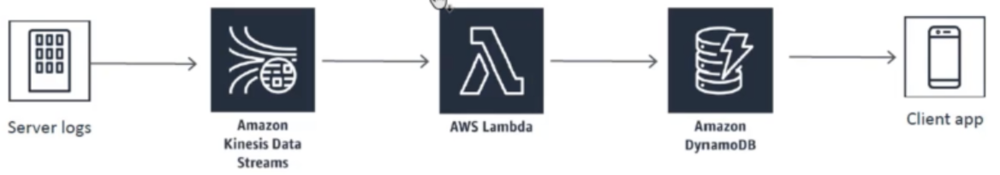
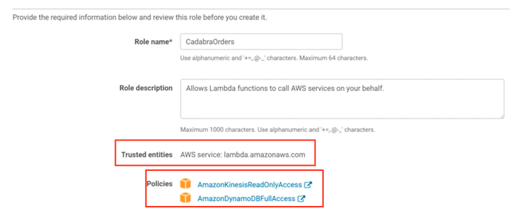
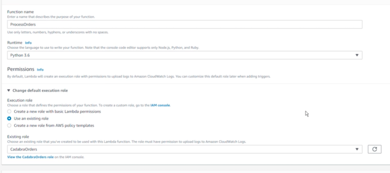
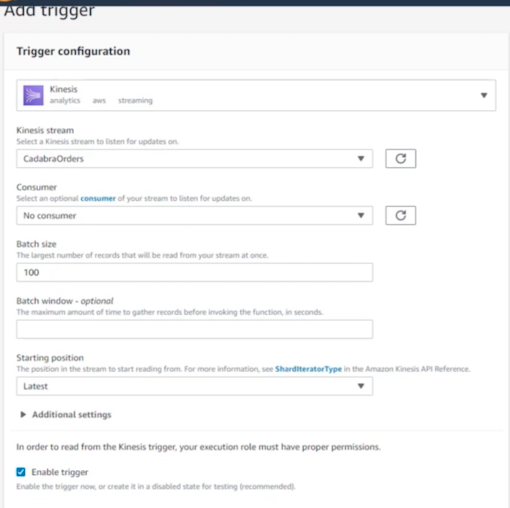
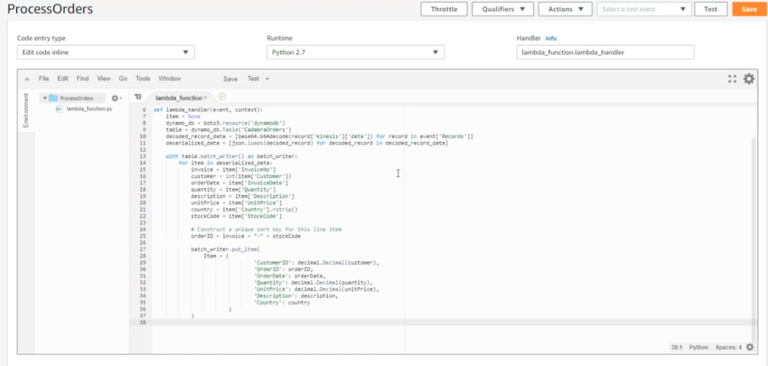

# **L2 [Exercise] AWS Lambda**

## **1、Requirement : Order history app**

 


## **2、Create IAM role enable AWS Lambda** 

**Policies**

* **Read only access from Kinesis**
* **DynamoDB Full Access**

 


## **3、AWS Lambda Function**

* **Runtime: python 3.6**
* **Excuting role: existing role**
 
  
 

### **3-1 Add Lambda trigger** 

  

### **3-2 Runtime code** 

  
 
**`lambda_function.py`**

```
import base64
import json
import boto3
import decimal

def lambda_handler(event, context):
    item = None
    dynamo_db = boto3.resource('dynamodb')
    table = dynamo_db.Table('CadabraOrders')
    decoded_record_data = [base64.b64decode(record['kinesis']['data']) for record in event['Records']]
    deserialized_data = [json.loads(decoded_record) for decoded_record in decoded_record_data]

    with table.batch_writer() as batch_writer:
        for item in deserialized_data:
            invoice = item['InvoiceNo']
            customer = int(item['Customer'])
            orderDate = item['InvoiceDate']
            quantity = item['Quantity']
            description = item['Description']
            unitPrice = item['UnitPrice']
            country = item['Country'].rstrip()
            stockCode = item['StockCode']
            
            # Construct a unique sort key for this line item
            orderID = invoice + "-" + stockCode

            batch_writer.put_item(                        
                Item = {
                                'CustomerID': decimal.Decimal(customer),
                                'OrderID': orderID,
                                'OrderDate': orderDate,
                                'Quantity': decimal.Decimal(quantity),
                                'UnitPrice': decimal.Decimal(unitPrice),
                                'Description': description,
                                'Country': country
                        }
            )

```

### **3-3 Generate Log** 

```
./LogGenerator.py 10
```