# **L3 AWS Glue & Lake Formation** 

## **1、What is Glue? + Partitioning your Data Lake**

> Table definitions and ETL 

Basically ETL can **define table definitions** and **perform ETL** on your underlying data lake and **provide structure to unstructured data**.

 

### **1-1 What is Glue?(<mark>AWS Glue: Metadata repo for ur data</mark>)**

1. **AWS Glue**  main use is to **serve as a central metadata repository for your data lake in S3** so it's able to **discover schemas or table definitions and publish those for use with analysis tools** such as Athena or redshift or EMR down the road.
2. AWS Glue **do custom ETL jobs** on your data so as it's finding new data in S3 it can actually trigger off jobs to actually **transform that data into a more structured** or purpose built format for later processing.
3. <mark>AWS Glue ETL jobs use Apache Spark **is completely serverless and fully managed.**<mark>

* **Serverless** discovery and definition of table definitions and schema
	* **S3 "data lakes"** 
	* RDS 
	* Redshift 
	* Most other SQL databases 

* **Custom ETL jobs** 
	* Trigger-driven, on a schedule, or on demand 
	* Fully managed 

### **1-2 Glue Crawler / Data Catalog**

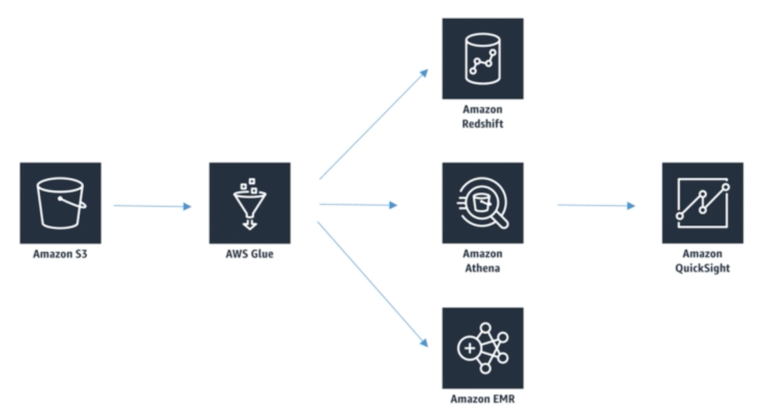 

###  **1-3 AWS glue crawler**

AWS glue crawler is one component of glue.

* Basically it **scans your data in S3** and often the **glue crawler will infer a schema automatically** just based on the structure of the data that it finds there in your S3 buckets.
* You can schedule that crawler to run **periodically if you need to**.
* **Example**: If you have new data or new types of data just popping into S3 at random times, **Glue can discover those automatically and just run on a schedule and automatically pick up that data**

### **1-4 Glue data catalogue**

<mark>**Glue data catalogue** is a **central metadata repository** used by all the other tools that might analyze that data</mark>.

* The data itself remains where it was originally in S3.
* Only the table definition itself is stored by glue in the glue data catalog. Means things like the **column names** the **types of data** in those columns where that data is stored
* Glue data catalog just tells these other services like **spectrum or Athena or EMR** how to interpret that data and how it's structured.

### **1-5 Glue and S3 Partitions**

> Glue cannot work magic and automatically structure your data in S3 

* **Glue crawler will extract partitions based on how your S3 data is organized** 
* Think up front about how you will be querying your data lake in S3 
* Example: devices send sensor data every hour 
* Do you query **primarily by time ranges**? 
	* If so, organize your buckets as `yyyy/mm/dd/device` 
* Do you query **primarily by device?** 
	* If so, organize your buckets as `device/yyyy/mm/dd` 

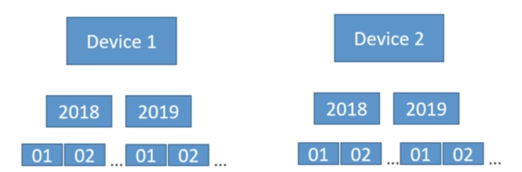 

## **2、Glue + Hive**

 

**Apache Hive** runs on **Elastic MapReduce** that allows you to **issue SQL like queries** on data accessible to your **EMR cluster**

* **AWS glue data catalog** as **metadata store** for **hive**  
* And also can **import a hive meta store into glue**.
* The **glue data catalog** can provide **metadata information to hive on EMR**.

### **2-1 Glue ETL** 

* Can **automatically generate code** for you to **perform that ETL after you define the transformations you want to make to your data in a graphical manner**.
* Scala or Python 
* Encryption  
	* Server-side (at rest) 
	* SSL (in transit) 
* **Can be event-driven** 

> It can be run in response to new data being discovered for example.

* **Can provision additional "DPU's" (data processing units)** to increase performance of underlying Spark jobs 
* **Errors reported to CloudWatch** 

## **3、Glue ETL: Developer Endpoints,Running ETL Jobs with Bookmarks**

### **3-1 Glue ETL** 

* **Transform data, Clean Data, Enrich Data (before doing analysis)** 
	* Generate ETL code in Python or Scala, you can modify the code 
	* Can provide your own Spark or PySpark scripts 
	* Target can be **S3, JDBC (RDS, Redshift), or in Glue Data Catalog** 
* Fully managed, cost effective, pay only for the resources consumed 
* **Jobs are run on a serverless Spark platform** 
* **Glue Scheduler** to schedule the jobs 
* Glue Triggers to automate job runs based on "events" 

### **3-2 Glue ETL - Transformations**

* **_Bundled Transformations_**:  
	* **DropFields, DropNullFields** — remove (null) fields 
	* **Filter** — specify a function to filter records 
	* **Join** — to enrich data 
	* **Map** - add fields, delete fields, perform external lookups • 

* **_Machine Learning Transformations_**:  
	* **FindMatches ML**: **identify duplicate or matching records in your dataset, even when the records do not have a common unique identifier and no fields match exactly**.

> You have multiple vendor is multiple third party merchants submitting their different products into the catalog. And often they're selling the same thing just under slightly different names or slightly different descriptions with fine matches that Mel. You can train that system on a known set of duplicate items and it will learn from that training set and use that information to identify future duplicates going forward that might not be exact matches but still represent the same thing.

* Format conversions: CSV, JSON, Avro, Parquet, ORC, XML 
* **Apache Spark transformations** (example: K-Means) 

### **3-3 AWS Glue Development Endpoints** 

* *Develop ETL scripts using a notebook* 
	* Then create an ETL job that runs your script (using Spark and Glue) 

* *Endpoint is in a VPC controlled by security groups*, connect via: 
	* Apache Zeppelin on your local machine 
	* Zeppelin notebook server on EC2 (via Glue console) 
	* SageMaker notebook 
	* Terminal window
	* PyCharm professional edition 
	* **Use Elastic IP's to access a private endpoint address** 

### **3-4 Running Glue jobs** 

* **Time-based schedules (cron style)** 

> You can there's a glue scheduler that lets you run these on some sort of fixed frequency.

* **Job bookmarks** 
	* Persists state from the job run 
	* **Prevents reprocessing of old data** 
	* **Allows you to process new data only** when re-running on a schedule
	* Works with S3 sources in a variety of formats 

>  Mostly job bookmarks are used with S3 data links.
  
  * Works with **relational databases **via JDBC (if PK'[**primary key**]s are in sequential order) 
  * Only handles new rows, not updated rows

		
		
* **CloudWatch Events** 
	* Fire off a Lambda function or SNS notification when ETL succeeds or fails 
	* **Invoke EC2 run, send event to Kinesis, activate a Step Functior**, 

## **4、Glue Costs and Anti-Patterns**

### **4-1 Glue cost model** 

* Billed by the minute for crawler and ETL jobs 
* First million objects stored and accesses are free for the Glue Data Catalog
* Development endpoints for developing ETL code charged by the minute 

### **4-2 Glue Anti-patterns** 

* Streaming data (**Glue is batch oriented, minimum 5 minute intervals**)

> Now if you must ETL your data while streaming it in it would be a better idea to perform your ETL using **Kinesis**, **store the data in S3 or redshift**, and then **trigger glue ETL to continue transforming it**.
> 
> Or you use a trigger to **actually kick off ETL on demand** after your data has been coming in from some stream someplace now **gclue ETL is implemented in spark**.

* Multiple ETL engines 

> You're going to be running jobs **using other engines such as Hive or pig or something data pipeline or EMR might be a better choice** for doing that ETL than glue ETL.

* NoSQL databases 

> **Glue does not support NoSQL databases such as DynamoDB** and that wouldn't make sense anyway because **NoSQL databases don't require a rigid schema**. Glue provides a **schema** for unstructured data for databases or analysis tools that **require some sort of structure to the data**

## **5、AWS Glue Studio**

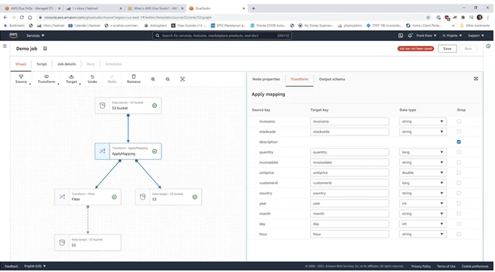 

* Visual interface for ETL workflows 
* Visual job editor 
	* Create DAG's for complex workflows 
	* **Sources include S3, Kinesis, Kafka, JDBC** 
	* Transform / sample / join data 
	* **Target to S3 or Glue Data Catalog** 
	* **Support partitioning** 

* Visual job dashboard 
	* Overviews, status, run times 

### **5-1 Create AWS Glue Studio Job**

* Source: S3
* Target: S3

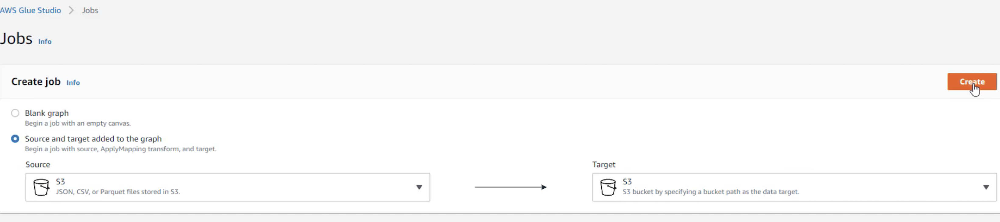 

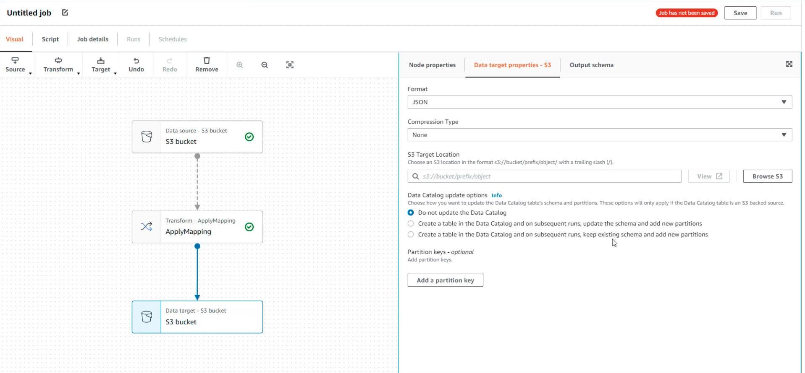 

**Add filter and filter condition**

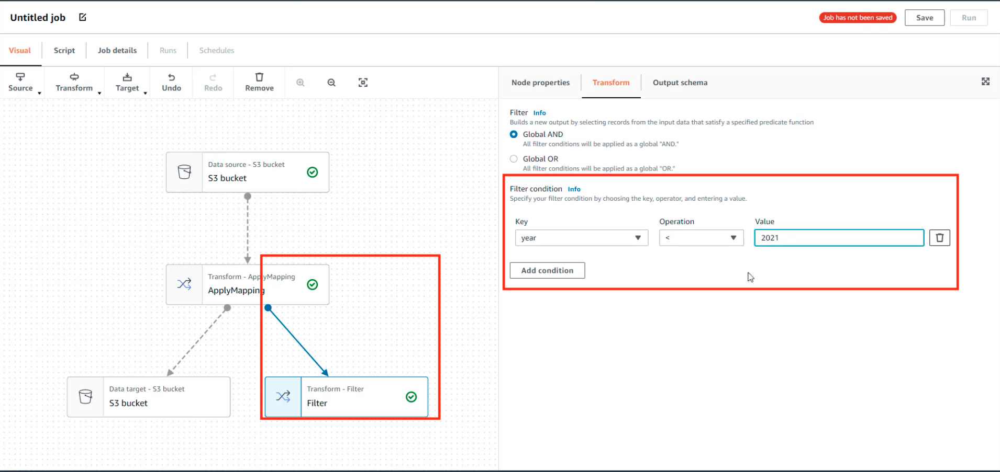 

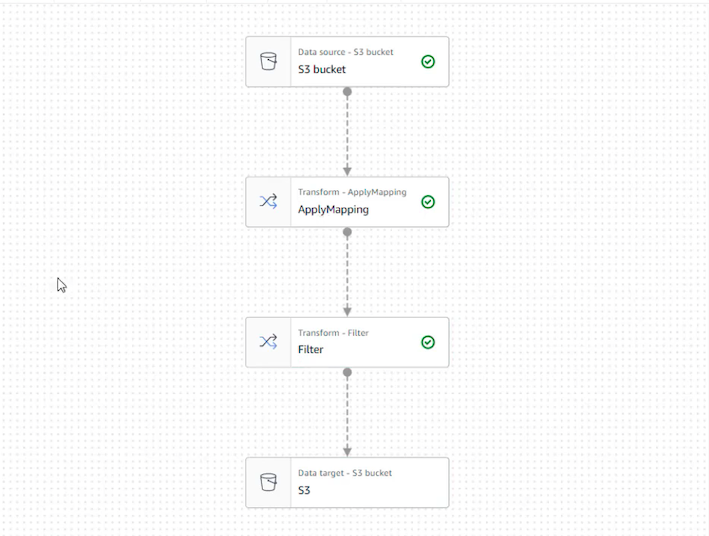 

## **6、AWS Glue Databrew**

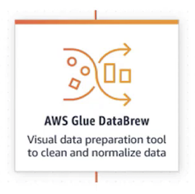 

**A visual data preparation tool**

* UI for pre-processing large data sets 
* Input from S3, data warehouse, or database 
* Output to S3 

**Over 250 ready-made transformations** 

**You create "recipes" of transformations that can be saved as jobs within a larger project** 

**Security**

* Can integrate with KMS (with customer master keys only) 
* SSL in transit 
* IAM can restrict who can do what 
* CloudWatch & CloudTrail 

### **6-1 Create Databrew Project**

* Add role

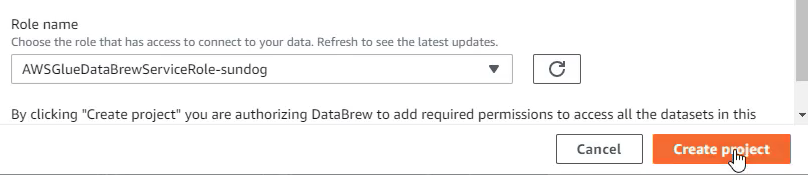 

* Generate Sample Data

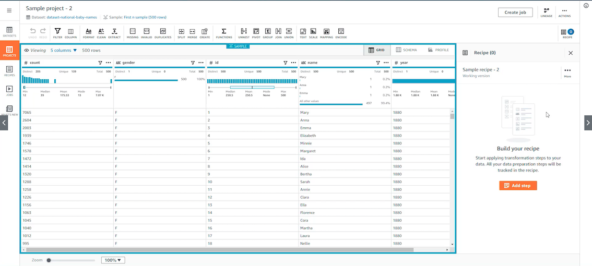 

* Apply transformation and filter

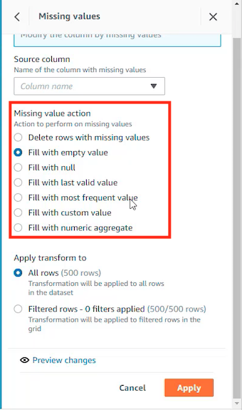 

* Add filter

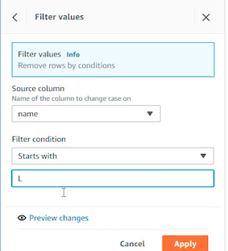 

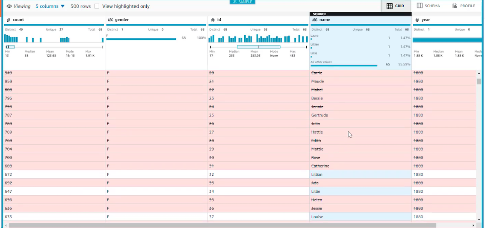 

**It's relatively a new feature and possibly an alternative to using Glue ETL**

## **7、AWS Glue Elastic Views**

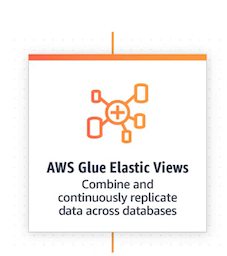 

* Coming soon! 
* **Builds materialized views from Aurora, RDS, DynamoDB** 
* Those views can be used by Redshift, Elasticsearch, S3, DynamoDB, Aurora, RDS 
* **SQL interface**
* Handles any copying or combining / replicating data needed 
* Monitors for changes and continuously updates
* Serverless 

## **8、AWS Lake Formation**

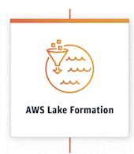 

### **8-1 AWS Lake Formation**

* "Makes it easy to set up a secure data lake in days" 
* Loading data & monitoring data flows 
* Setting up partitions 
* Encryption & managing keys 
* Defining transformation jobs & monitorng them 
* Access control 
* **Auditing** 
* **Built on top of Glue** 

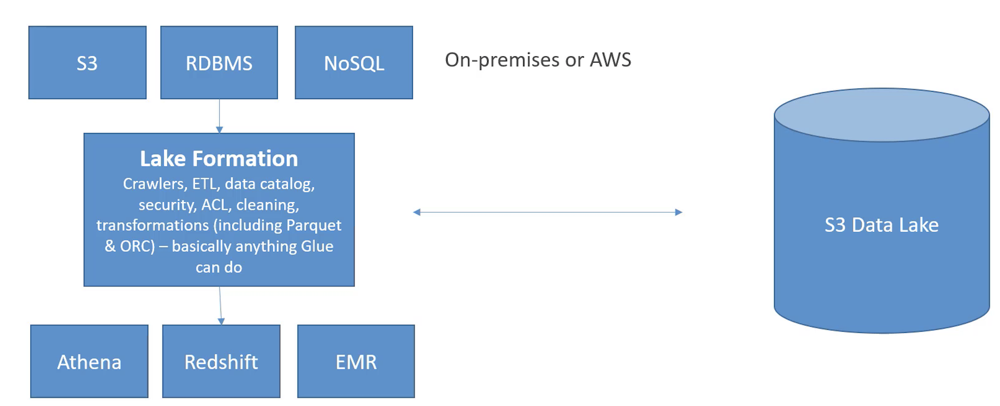 

### **8-2 AWS Lake Formation: Pricing** 
 
* **No cost for Lake Formation itself** 
* But underlying services incur charges 
	* Glue 
	* S3 
	* EMR 
	* Athena 
	* Redshift 

### **8-3 AWS Lake Formation: Building a Data Lake** 

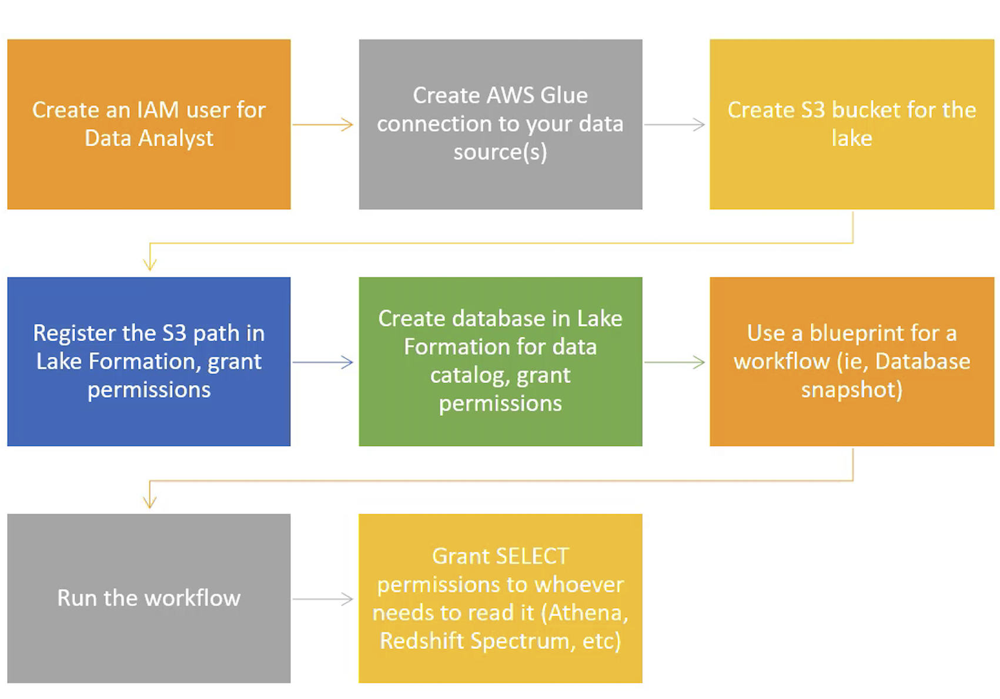

### **8-4 AWS Lake Formation: the Finer Points** 

* Cross-account Lake Formation permission 
	* **Recipient must be set up as a data lake administrator** 
	* Can use AWS Resource Access Manager for accounts external to your organization 
	* IAM permissions for cross-account access 

* **Lake Formation does not support manifests in Athena or Redshift queries** 
* **IAM permissions on the KMS encryption key are needed for encrypted data catalogs in Lake Formation** 
* **IAM permissions needed to create blueprints and workflows** 
