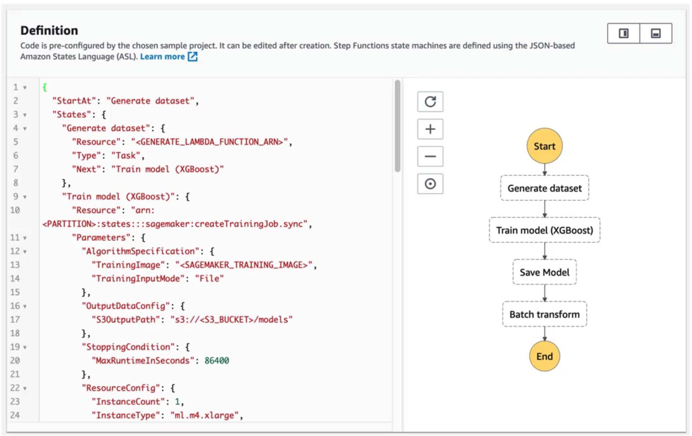
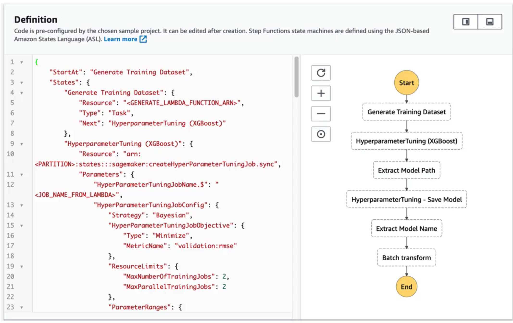
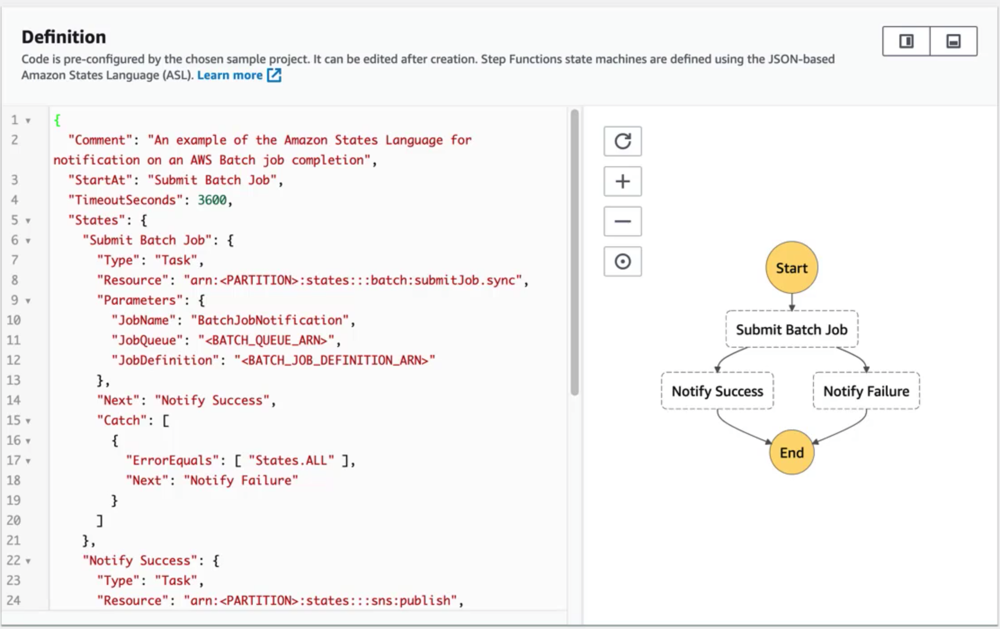

# **L6 AWS Data Pipeline** 

## **1、Data Pipeline Example**

Basically data pipeline lets you **schedule tasks for processing your big data.**

1. Log files that are published on EC2 instances.
2. We need to **publish those log files into S3** and later **analyze them using EMR.**
3. data pipeline can schedule a **daily task or whatever frequency you want** to copy those log files from EC2 into S3 

**Basically it's a web service that helps you reliably process and move data between different AWS compute(EC2) and storage(S3) services at specified intervals.**

## **2、Data Pipeline Features** 

* **Destinations include S3, RDS, DynamoDB, Redshift and EMR**
* Manages task dependencies 
* Retries and notifies on failures
* **Cross-region pipelines** 
* Precondition checks 
* Data sources may be on-premises 
* Highly available 

### **2-1 Precondition checks**

**DynamoDB Precondition :**

Data exists so that can check for the existence of data inside a dynamo db table before you try to move it or process it somewhere else.

**Dynamo db table exists that can check for the existence of an entire table for S3 :**

S3 key exists and S3 prefix exists which can both be used to test for the existence of either a specific path in S3 or a specific prefix you know sort of a path that exists within S3 itself.

**shell command precondition :** 

This runs an arbitrary script of your own on your resources and checks that the script succeeds.

### **2-2 Data Pipeline Activities** 

* EMR
	* Spin up an EMR instance and run a sequence of steps automatically and then automatically terminate the cluster when it's done. 
* Hive 
	* Allows you to execute hive queries on a schedule. 
* Copy 
	* Copy data between Amazon S3 and JBDC data sources or run a SQL query and copy its output into Amazon S3. 
* SQL 
* Scripts
	* Run arbitrary Linux shell commands or programs as part of your data pipeline.  

### **2-3 Custom Data Pipeline Activities**

You can specify this as a custom activity or will be automatically added if you're using any of the templates specified by AWS during the pipeline creation.

* **Default activity**: will retry **three times** before entering a hard failure state.
* You can **increase the number of automatic retry up to 10** if you want to after an activity exhaust its attempts it will trigger any configured on failure alarm 

## **3、AWS Step Functions - a high-level overview** 

* **Use to design workflows** 
* Easy visualizations 
* Advanced Error Handling and Retry mechanism outside the code
* Audit of the history of workflows 
* Ability to "Wait" for an arbitrary amount of time 
* **Max execution time of a State Machine is 1 year** 

### **3-1 Step Functions Examples Train a Machine Learning Model** 

**generate the data set** => (kicking off a lambda function) => **Trains the model using Sage makers x g boost algorithm** =>  **saves that trained model from stage maker**  => **Applies a batch transform to that model from some data set that we had at that point**

* When it's done it extracts that model path and then it saves the tuned model that it's settled on.
* We extract the model name of the tune model and then use that to apply a transformation of a bunch of data in a batch format to that tuned model automatically.
 
### **3-2 Step Functions Examples Tune a Machine Learning Model** 

 
 
### **3-3 Step Functions Examples Manage a Batch Job** 

You just need to know that **they manage workflows and they give you a nice graphical representation of those workflows and they can monitor whether individual steps succeed or fail** and notify you based on