# **L4 EMR Elastic MapReduce**


## **1、Elastic MapReduce (EMR) Architecture and Usage**

### **1-1 What is EMR?**

 

* Elastic MapReduce 
* Managed Hadoop framework on EC2 instances 
* Includes Spark, HBase, Presto, Flink, Hive & more 
* EMR Notebooks 
* Several integration points with AWS


### **1-2 An EMR Cluster**

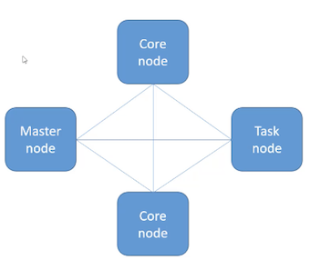 

**Master node**: manages the cluster 

* Tracks status of tasks, monitors cluster health 
* Single EC2 instance (it can be a single node cluster even) 
* AKA "leader node" 

**Core node**: Hosts HDFS data and runs tasks 

* Can be scaled up & down, but with some risk 
* Multi-node clusters have at least one 

**Task node**: Runs tasks, does not host data 

* Optional 
* No risk of data loss when removing 
* Good use of **spot instances** 


### **1-3 EMR Usage** 

* Frameworks and applications are specified at cluster launch 
* Connect directly to master to run jobs directly 
* Or, submit ordered steps via the console 
	* Process data in S3 or HDFS 
	* Output data to S3 or somewhere 
	* Once defined, steps can be invoked via the console 

* Transient vs Long-Running Clusters 
	* Transient clusters terminate once all steps are complete
		* Loading data, processing, storing — then shut down 
		* Saves money 

* Long-running clusters must be manually terminated 
	* Basically a data warehouse with periodic processing on large datasets 
	* Can spin up task nodes using Spot instances for temporary capacity 
	* Can use reserved instances on long-running clusters to save $ 
	* Termination protection on by default, auto-termination on 


## **2、EMR, AWS integration, and Storage** 

### **2-1 EMR / AWS Integration**

* Amazon EC2 for the instances that comprise the nodes in the cluster 
* Amazon VPC to configure the virtual network in which you launch your instances
* Amazon S3 to store input and output data 
* Amazon Cloud Watch to monitor cluster performance and configure alarms 
* AWS IAM to configure permissions 
* AWS CloudTrail to audit requests made to the service 
* AWS Data Pipeline to schedule and start your clusters 

> self-contained job that requires you to spin up an EMR cluster run that job and then 
> shut it down.


### **2-2 EMR Storage** 

* HDFS
* EMRFS: **access S3 as if it were HDFS** 
	* **EMRFS Consistent View** — Optional for Consistency(exam) 
	* Uses DynamoDB to track consistency 
	
* Local file system
* EBS for HDFS

### **2-3 HDFS Description (Hadoop distributed file system)**

 
* HDFS is a distributed scalable file system for Hadoop and it distributes the data at **stores across different instances** in your cluster. 
* Allows Hadoop to actually, try to run the code that analyzes your data on the same instance where that data is stored --- **performance optimization**
* Stores multiple copies of your data on different instances and that ensures that no data is lost if an individual instance fails
* **HDFS is ephemeral when you terminate your cluster that data is gone**. 
* It is useful for caching intermediate results during MapReduce processing or for workloads 

### **2-4 HDFS Block** 

* **Each file in HDFS is stored as blocks** and it's distributed across the entire Hadoor cluster. 
* If you have a large file **that you're storing in HDFS it's going to get broken up into blocks** and **those blocks are going to be stored in multiple places for backup purposes**. 
* **By default a block size is 128 megabytes** 
* If you have a big file and you're gonna be storing it on HDFS that file will ultimately be split up into 128 megabyte chunks for processing. 


### **2-5 EMRFS** 

* This basically creates a file system that looks like HDFS but it's **actually backed by S3**. 
* Terminate your cluster your data will still live in S3 and you don't lose anything. 
* Also **S3 would be used to store your input and output data** and you could **still use HDFS to store intermediate results** 
* With S3, you may encounter consistency problem, EMRFS consistent view solves for you. 
* **DynamoDB database to store object metadata and track consistency with S3** 


### **2-6 Local file system**

 
* The local file system pre-configured with an instance store. And of course that will only persist until the lifetime of that individual EC2 instance 


### **2-7 EBS for HDFS** 


* Amazon EBS **general purpose SSD 10GB** volume as the root device for its AMIs to enhance your performance 
* You can add additional EBS volumes to the instances in your EMR cluster to allow you to customize a storage on an instance 
* EMR will delete these volumes once the cluster is terminated. 
* **You cannot attach an EBS volume to a running cluster**, You can only add EBS volumes when launching a cluster 
* Can't mess with your EBS storage once your cluster is up 


## **3、EMR Promises; Intro to Hadoop** 

### **3-1 EMR promises** 

* EMR charges by the hour 
	* Plus EC2 charges 

* **Provisions new nodes** if a core node fails 
* Can add and remove tasks nodes on the fly 
* **Can resize a running cluster's core nodes** 

### **3-2 What's hadoop**

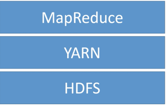 

Hadoop consists of these three systems **MapReduce, Yarn, and HDFS** these contain the **libraries and utilities required for other Hadoop modules and provides the underlying file system and operating system** level abstractions that we need. Also contains all the **jar files and scripts that we need to start Hadoop itself**. 


**1. HDFS** 

What This is a distributed scalable file system for Hadoop. 

It distributes the data it stores across the instances in the cluster and it stores r,rewft copies of that data on different instances to ensure that no data is lost. 

**Negative**

That data will be lost if you terminate your EMR cluster it is stored on the cluster itself. 


**Positive** 

This can be useful from a **performance standpoint** because it allows Hadoop to try to run the analysis of your code on the same node where that data is stored 


**2. Yarn** 

**Yarn stands another resource negotiator**

**What** 


It's a component introduced in Hadoop 2.0 to **centrally manage cluster resources or multiple data processing frameworks.** 


**How**

Manages what gets run 

**3.Hadoop MapReduce** 


**The software framework for easily writing applications** that process **vast amounts of data in parallel** on large clusters of commodity hardware in a reliable fault tolerant manner. 


**Map functions** 


* **Map data to sets of key value pairs called intermediate results** 

**Reduce functions** 

Combine the intermediate results applies additional algorithms and produces the final output from your system. 


## **4、Intro to Apache Spark** 

### **4-1 Apache Spark** 

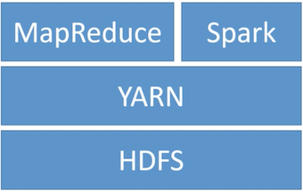 


### **4-2 What is Spark**
 
Mainly taking the place of **MapReduce is Apache Spark** and it's an open source distributed processing system commonly used for big data workloads. 


Its secret is using in memory caching so it really does a lot of work in memory instead of on disk and it uses directed acyclic graphs to optimize its query execution for very fast analytic queries against data of any size 


### **4-3 How to use Spark** 

Spark provides development APIs in Java, Scala, python, and R, so you do need to write code to use Spark 


**Spark provides lot of code libraries built in** so you can reuse that code across multiple workloads and some of the libraries it provides you will do 

* batch processing 
* interactive queries
* real time analytics
* machine learning
* graph processing 


**Common Usage** 

* Apache Spark includes **stream processing through Spark streaming**. This allows you to **process data** collected from Amazon Kinesis for example but also things outside of the AWS ecosystem such as **Apache Kafka** or any other data stream that spark streaming can integrate with on Amazon EMR. 
* it can also **do streaming analytics** and it's **performed in a fault tolerant way** and you can write the results of those analytics to HDFS or in the case of AWS to S3. 
* You can also use **Spark for machine learning at massive scale** and includes a **library called M.L. lib** which is a library of machine learning algorithms that work on data at massive scale 
* You can do interactive SQL using Spark SQL that's used for low latency interactive queries using either SQL or Hive QL 


**Anti pattern**

* So it's **not really meant for real time  usage**. 
* **Spark is not meant for OLTP or batch processing, Spark jobs generally takes some time to complete** because it has to distribute all that work across the cluster and collect the results back to it. 


### **4-4 How Spark Works**

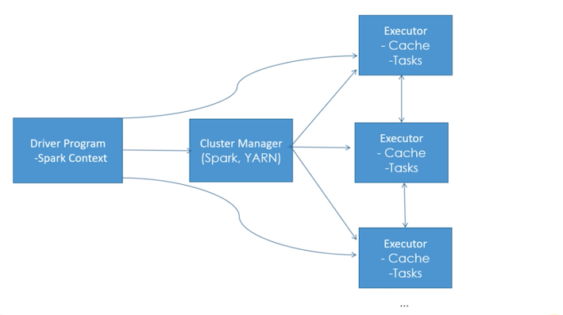 

**Driver - Spark context object:**

**Spark context object within your main program and that program is known as the driver program or the driver script.** 


This is the actual code of your Spark program that tells a Sark cluster what you want to do with your data the Spark context **will connect to different cluster managers** 


**Cluster Managers**

**cluster managers will take care of allocating all the resources that your driver script needs across different applications.**

In the case of EMR it's going to be using Apache yarn because that's a component of Hadoop.
 
You can also **use Apache Spark outside of a Hadoop cluster** as well it has its own cluster manager 

so once the cluster manager has decided how to distribute that work Spark will **acquire executors on nodes** 

**Executors** 

Within the cluster executors are processes that **run computations and store the data for your applications**.

 
The application code is then sent to each executor and in the final step the Spark context sends the tasks to the executors to run. 


### **4-5 Spark Components**


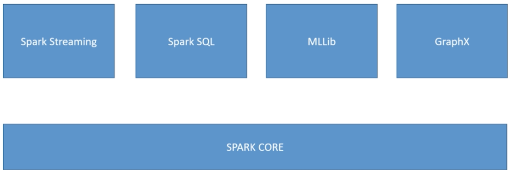 


**Spark core** 

It's responsible for **memory management, fault recovery, scheduling, distributing and monitoring jobs, and interacting with storage systems**. 


It supports **APIs for Java, Scala, python, and R** at the lowest level here it's dealing with something called a **resilient distributed dataset(RDD)** and that **represents a logical collection of data partitioned across the different compute nodes.** 

**Spark SQL** 

We tend to deal with data these days in Spark **at a higher level than the RDDs** and that's where **Spark SQL** comes in. So **Spark SQL is a distributed query engine that provides low latency interactive queries up to 100 times faster than MapReduce**. 

* Spark SQL includes: 
	* cost based optimizer
	* columnar storage 
	* cogeneration for fast queries 


* It supports various data sources coming into it such as JDBC, ODBC, JSON, HDFS, Hive, Orc, and Parquet 
* It also supports querying Hive tables using Hive QL. 


Spark SQL is especially important because it contains a construct known as a **data set** that basically **lets you view the data that you have on Spark as a giant database** if you will and by using straight up SQL to interact with your data it makes the development of your Spark driver scripts a lot more simple and it allows Spark itself to perform optimizations that it could not normally do. 

**Modern Spark code its using the datasets that are exposed through Spark SQL**


**Spark Streaming** 


Spark streaming is also built on top of Spark core and it also integrates with Spark SQL to use datasets as well Spark streaming is a real time solution that **leverages Spark core's fast scheduling capability to do streaming analytics** 


It ingests data in mini batches and it enables analytics on that data with the same application code you would write for batch analytics it improves your developer productivity because the same code can be used for both batch processing 


Real time streaming applications it supports data from a variety of streaming sources as well **including Kafka, Flume, HDFS, and Zero MQ** 

**ML lib** 

ML library of algorithms to do machine learnin on data at large scale 

**These algorithms include things like the ability to do classification, regression, clustering, collaborative filtering, and pattern mining.** 


**ML lib can read data from HDFS, Hbase, or any Hadoop data source as well as S3 on EMR.**


Spark code you can write your M.L. lib applications with Scala, Java, Python, or Spark, R. 

**GraphX**


GraphX that's a **distributed graph processing framework built on top of Spark, graphs in the data structure sense**


It provides **ETL capabilities, exploratory analysis, and iterative graph computation** to enable users to **interactively build and transform a graph data structure at scale**


If has a highly flexible API and **you can select from different distributed graph algorithms.** 


**5、Spark Integration with Kinesis and Redshift**

### **5-1 Spark Structured Streaming** 

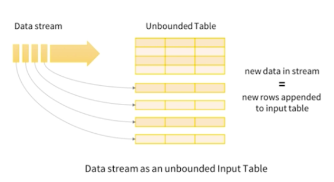 

**Spark applications** usually use something called a data set in their code to refer to your data and a data set is treated very much like a database table with **Spark streaming** 


New data is received by the stream it just keeps adding rows to that **virtual database table** in the form of a data set so you can query this data using windows of time. 

**Code Example** 

**Monitor all the stuff that's being thrown into a logs bucket in S3.**


```
val inputDF = spark.readStream.json("s3://logs") 
inputDF.groupBy($"action", window(Vtime", "1 hour")).count().writeStream.formandb c").start(ldbc:mysql//...") 
```

* 1 hour: Continually **counting up the records being received** in that bucket over the previous one hour and the **write those counts using JDBC into some external MySQL database** 


### **5-2 Spark Streaming + Kinesis**

There is a library for **Spark streaming built on top of the Kinesis client library** to allow **Spark streaming to import data from Amazon Kinesis data streams** and you just have to plug in that library and code against it and you can treat Kinesis as any other stream of data coming into a data set in Spark structured streaming. 

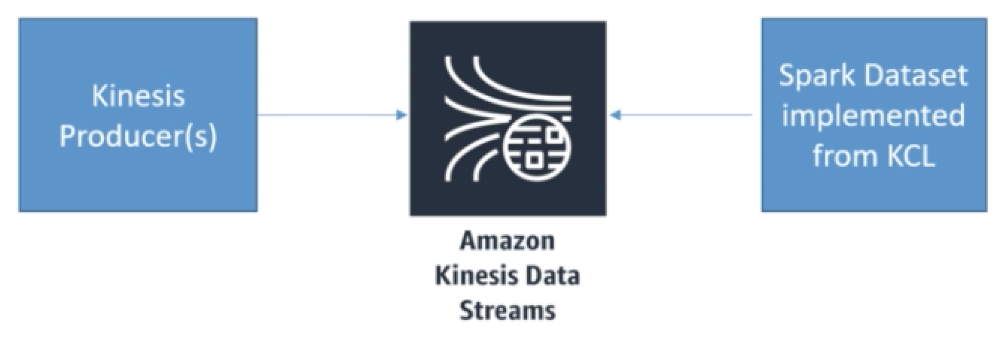 


**So for example** 

1. There are some Kinesis producers use bunch of EC2 host generating logs 
2. Pumping data into a Kinesis data stream. 
3. Integrate that using the Spark data set integration code as any other dataset coming in to Spark streaming
4. Process dataset acros the tire cluster on EMR using Apache Spark

### **5-3 Spark + Redshift** 


* spark-redshift package allows Spark datasets from Redshift 
	* Its a Spark SQL data source 

* Useful for ETL using Spark 


**Redshift is a massive distributed data warehouse that's offered by AWS**. 

There is Spark Redshitt package and that allows **Spark to treat data sets from Redshift just like any other SQL database**. 

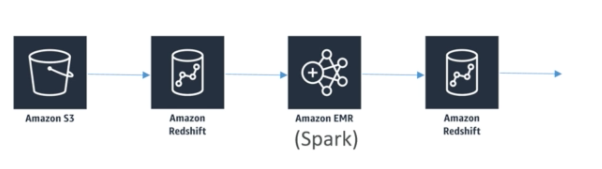 


> Integrating Redshift with Spark I an distribute the processing of that !huge data set sitting in S3 

1. Deploy **Amazon Redshift spectrum** on top of that data in S3 which will **provide SQL Interface on top of that data that lives in S3**.  
2. Using the **Spark Redshift package spin up in Apache Spark cluster on Amazon EMR** 
3. **Perform ETL on that data that's residing in S3 through Amazon Redshift** because Redshift like any other SQL data source to Apache Spark. 
4. Put that **process data back into another Amazon Redshift table** for further processing. 


## **6、Hive on EMR**

### **6-1 Apache Hive** 

* **Hive basically exposes SQL interface to your underlying data stored on your EMR cluster**. 
* **Hive execute straight up SQL code on underlying unstructured data that might live in Hadoop, Yarn, or S3** 

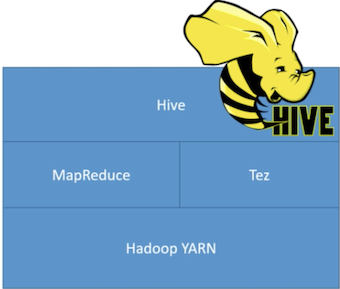 
 
**EMR Hive sits on top of MapReduce to figure out how to distribute the processing of SQL** on the underlying data 


**Tez:** 

Tez is kind of like **Apache Spark** and that it uses **a lot of** in memory directed acyclic graph[无环图] to accelerate things, so **Hive often being used on top of Tez instead of MapReduce** 

### **6-2 Why Hive?** 

* Uses familiar SQL syntax (HiveQL)
* Interactive 
* Scalable - works with "big data" on a cluster 
	* Really most appropriate for data warehouse applications 
* **Easy OLAP queries WAY easier than writing MapReduce in Java** 
* Highly optimized Highly extensible 
	* User defined functions 
	* Thrift server 
	* JDBC / ODBC driver 

> anti-pattern

> Hive is not really for OLTP so you shouldn't be writing a web service that hits Hive continuously hundreds of times per second or anything like that trying to get results back very quickly 


### **6-3 The Hive Metastore** 

* Hive maintains a "**metastore**" that **imparts a structure** you define on the unstructured data that is stored on HDFS etc. 
	* Column names N
	* Data types 

```
CREATE TABLE ratings ( 
	userID INT, 
	movieID INT, 
	rating INT, 
	time INT) 
ROW FORMAT DELIMTED 
FIELDS TERMINATED BY '\t 
STORED AS TEXTFILE; 


LOAD DATA LOCAL INPATH '${env:HOME}/m1-100k/u.data' 
OVERWRITE INTO TABLE ratings; 
```

> How the actual **data is delimited** and terminated and the **format** that it's stored in and where it is actually located That information has to be stored somewhere and that's what we call the **Hive Metastore**. 

### **6-4 External Hive Metastores**

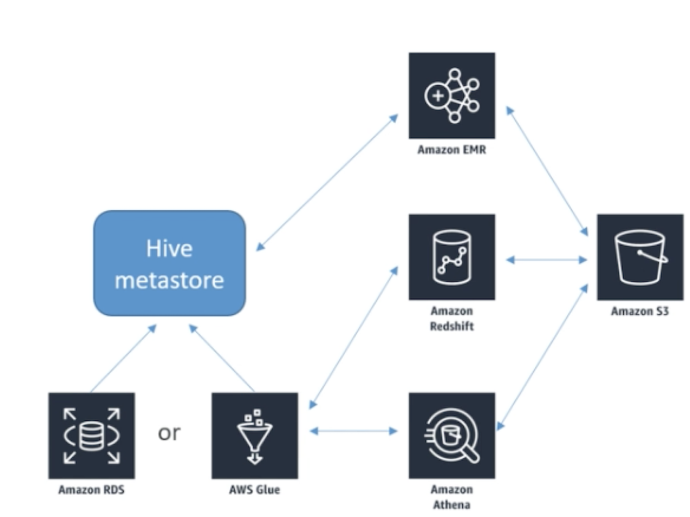 

* By default the **hive metastore just stored in a MySQL database on the master node of your cluster (Not persistence if shut down master node)** 
* **External metastores offer better resiliency** / integration 
	* AWS Glue Data Catalog
	* Amazon RDS 


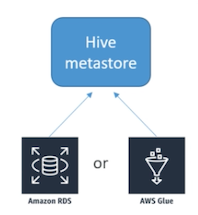 


**1. store Hive Metastore within AWS glue data catalog** 

**AWS glue data catalog that serves double duty as a hive metastore** and that allows you to centrally locate your metadata for your unstructured data  and ex ose that directly to hive where Amazon EMR can get to it but also expose that same metadata to **Amazon Redshift, Amazon Athena**. 

**2.Store your hive metastore on an external Amazon RDS instance or Amazon Aurora**

Master node you can choose to **store that in an external RDS database instance** that will be more persistent. So even if you shut down your cluster that metastore will survive in your RDS database. 


### **6-5 AWS integrates with Hive in other ways**


* Load table partitions from S3
* Write tables in S3 
* Load scripts from S3 
* DynamoDB as an external table 

**1. integrates with S3**

* Using hive with EMR provides the ability to load a table partitions automatically from S3
	* **Example**: Store your data in S3 undr different sub directories for example year then month then date then hour 
	* Translated into table partitions and you can do that automatically with hive on EMR 

* Hive with Amazon EMR provides the ability to specify an off instance metadata store 


**2. integrates with DynamoDB** 

* Use hive to analyze the data stored in dynamo DB and either load the results back into dynamo DB or archive them into Amazon S3. 
* Allows you to copy data from a dynamoDB into EMR FS or HDFS and vice versa

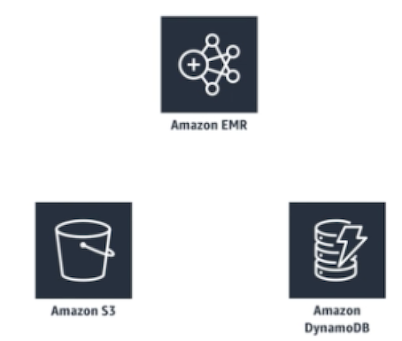 


## **7、Apache Pig on EMR**


Apache Pig is also an important part of the Hadoop ecosystem that comes pre-installed on Amazon EMR. 


**Pig is an alternative interface to MapReduce.it recognizes that writing code from mappers and reducers using MapReduce takes a tong time**

 
* Writing mappers and reducers by hand takes a long time. 
* Pig introduces **Pig Latin, a scripting language that lets yon use SQL-like syntax to define your map and reduce steps** instead of Java code for MapReduce. 
* Highly extensible with user-defined functions (LIDF's) 


### **7-1 How pig works**


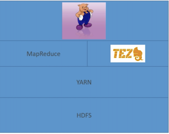 

### **7-2 Pig AWS Integration**


* Ability to use multiple file systems (not just HDFS) 
	* i.e., query data in S3 
* **Load JAR's and scripts from S3** 

 


## **8、HBase on EMR** 

 

* **Non-relational**, petabyte-scale database 
* Based on **Google's BigTable, on top of HDFS** 
* In-memory (fast) 
* Hive integration 


### **8-1 Sounds a lot like DynamoDB**

* Both are NoSQL databases intended for the same sorts of things 
* But if you're all-in with AWS anyhow, **DynamoDB has advantages** 
	* Fully managed (auto-scaling) 
	* More integration with other AWS services 
	* **AWS Glue integration** 

* HBase has some advantages though: 
	* Efficient storage of sparse data,

	> If vou have data that's just really scattered across your entire cluster. HBase tends to be able to deal with that better than dynamo DB. 
	
	* Appropriate for high frequency counters (consistent reads & writes)
	* High write & update throughput 
	* More integration with Hadoop 


### **8-2 HBase AWS integration** 

* Can store data (StoreFiles and metadata) on S3 via **EMRFS** 
* Can back up to S3 


## **9、Presto on EMR**

 

### **9-1 Presto** 


* **It can connect to many different "big data" databases and data stores at once. and query across them** 

> You can write a SQL join command that combines data from different databases stored in different technologies that live on your cluster. 

* **Interactive queries at petabayte scale** 
* Familiar SQL syntax 
* Optimized for OLAP analytical queries, data warehousing 
* Developed, and still partially maintained by Faceboolik ---

> Athena is a serverless version of Presto and with a nice little skin on top of it

* **This is what Amazon Athena uses under the hood** 
* **Exposes JDBC, Command-Line, and Tableau interfaces** 

### **9-2 Presto connectors** 

* HDFS 
* S3 
* Cassandra 
* MongoDB 
* HBase 
* SQL 
* Redshift 
* Teradata 


Using Presto can be **both relational and non relational databases** like it doesn't care can treat them all as a SQL interface

 
Amazon EMR you can launch a Presto cluster in just minutes. **You don't have to do node provisioning or a cluster setup or Presto configuration or cluster tuning** 


## **10、Zeppelin and EMR Notebooks**

 

* If you're familiar with iPython notebooks —it's like that 
	* Lets you interactively run scripts against our data o
	* Can interleave with nicely formatted notes 
	* Can share notebooks with others on your cluster 

* **Spark, Python, JDBC, HBase, Elasticsearch + more** 

### **10-1 Zeppelin + Spark**

* Can run Spark code interactively (like you can in the Spark shell) 
	* This speeds up your development cycle
	* And allows easy experimentation and exploration of your big data 
* Can execute SQL queries directly against SparkSQL 
* Query results may be visualized in charts and graphs 
* Makes Spark feel more like sicence tool! 

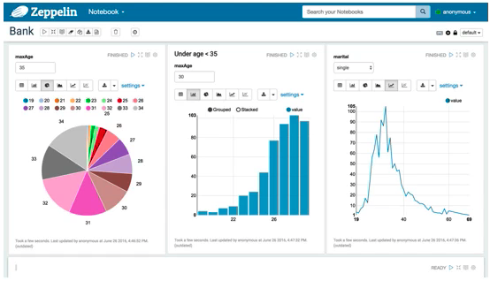 


### **10-2 EMR Notebook** 

* Similar concept to Zeppelin, with more AWS integration 
* Notebooks backed up to S3 
* Provision clusters from the notebook! 
* Hosted inside a VPC 
* Accessed only via AWS console 


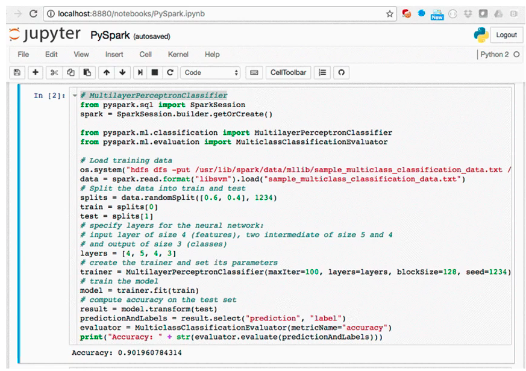 

### **10-3 EMR Notebook Features** 


* **Packaged with some popular open source graphical libraries from the anaconda repository** that helps you to prototype code and visualize results 
* Perform exploratory analysis with Spark data frames they **can be attached to an existing cluster or you can revision new clusters directly** from the notebook. 
* **Allows multiple users from the organization** to create their own notebooks attach them to shared multi tenant EMR clusters 
* **No additional charge** to Amazon EMR customers. 


## **11、Hue, Splunk, and Flume** 

### **11-1 Hue** 

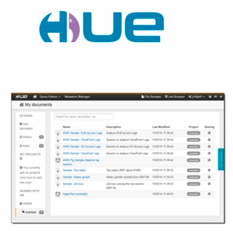 

* Hadoop User Experience 
* **Graphical front-end for applications on your EMR cluster** 
* IAM integration: Hue Super-users inherit IAM roles 
* **S3: Can browse & move data between HDFS and S3** 

**Exam: Which tool:** 

**Hue is this a management tool it's the front end  dashboard for your entire cluster** 

### **11-2 Splunk**

 * Splunk / Hunk "makes machine data accessible, usable, and valuable to everyone" 
 * **Operational tool — can be used to visualize EMR and S3 data using your EMR Hadoop cluster**. 

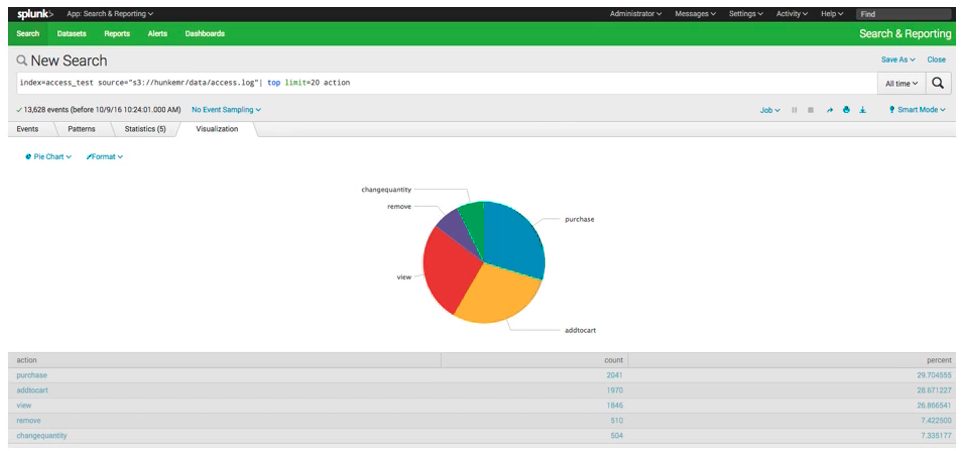 

**Exam: Which tool:** 

**Splunk is just an operational tool**


### **11-3 Flume** 

 

> Another way of streaming data into your cluster, like Kinesis or Kafka 

* Another way to stream data into your clustr 
* Made from the start with Hadoop in mind
	* Built-in sinks for HDFS and HBas 

* **Originally made to handle log aggregation** 

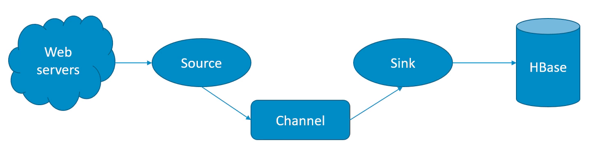 

* A web server act as an external source that provides events to a flume source. 
* That event is then stored in one or more channels 
* A channel acts as a passive store that keeps the event until it is consumed by a flume sink 
* The flume sink then removes the event from the channel 
* And the flume sink puts event into an external repository like HDFS on your EMR cluster. 

**Flume sink** 

* **HDFS sink** that writes events into HDFS it supports creating text and sequence files and supports compression and both file types as well. 
* **Hive sink** and that would stream events containing delimited text or JSON data directly into a hive table or partition events are written using hive transactions 

**Exam: Which tool:** 

**Flume is a way of streaming log data into a cluster, as an alternative technology**


**for handling streaming applications on an EMR cluster.**

### **11-4 MXNet**

 
* Like Tensorflow, a library for building and accelerating neural networks 
* Included on EMR 

**Exam: Which tool**

**MXNet is a framework and library that is used to build deep learning applications.** 

## **12、S3DistCP and Other Services** 


* Tool for copying large amounts of data 
	* From S3 into HDFS 
	* From HDFS into S3 

* **Uses MapReduce to copy in a distributed manner** 
* Suitable for parallel copying of large numbers of objects 
	* Across buckets, across accounts 

	
### **12-1 Other EMR / Hadoop Tools (Throw out for misdirect)** 

* **Ganglia (monitoring like cloudwatch)** 
* **Mahout (machine learning** like spark's ML lib) 
* **Accumulo (another NoSQL database** like HBase and dynamo DB) 
* **Sqoop** (relational database connector like S3DistCP, used primarily for importing data from external databases into your cluster in a very scalable manner.) 
* **HCatalog (table and storage management for Hive metastore)** 
* **Kinesis Connector (directly access Kinesis streams in your scripts** on EC2 node) 
* **Tachyon (accelerator for Spark)** 
* **Derby (open-source relational DB in Java)** 
* **Ranger (data security manager for Hadoop)** 
* Install whatever you want 


## **13、EMR Security and Instance Types**

### **13-1 EMR Security**

* IAM policies Kerberos 
* SSH 
* IAM roles 

**IAM policies** 

* IAM rules for EMRFS requests to Amazon S3

**Kerberos** 

**Kerberos** is a way of providing strong authenti alio through secret key cryptography. 

This is a **network authentication protocol** that ensures that **passwords or other credentials aren't sent over the network in an unencrypted format** 


**SSH**
 
* SSH provides a secure way for users to **connect to the command line on cluster instances** 
* **It provides tunneling so you can view web interfaces** that are hosted on your master node of your cluster from outside of the cluster itself. 


**IAM roles** 

If you're going to be enabling automatic scaling on your cluster you're going to need an auto scaling IAM role attached to it 


### **13-2 EMR: Choosing Instance Types**

 
**Master Node:** 

* m4.large if < 50 nodes, m4.xlarge if > 50 nodes 

**Core & task nodes:** 

* m4 large is usually good 
* If cluster waits a lot on external dependencies (i.e. a web crawler), t2.medium 
* Improved performance: m4.xlarge 
* **Computation-intensive applications: high CPU instances** 
* Database, memory-caching applications: high memory instances 
* Network / CPU-intensive (NLP, ML) — cluster computer instances 

**Spot instances** 

* Good choice for task nodes 
* **Only use on core & master if you're testing or very cost-sensitive**; you're risking partial data loss 
