# **L5 Elastic MapReduce Exercise**

## **1、Create EMR**

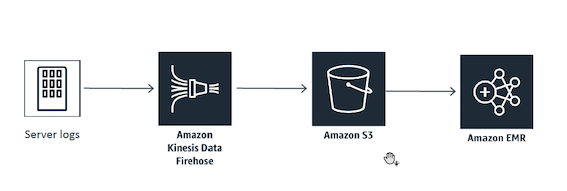 

* Name: **CadabraRecs**
* Appliactions: **Spark**
* Instance type: **C5**
	*  **Apache Spark doing machine learning** and machine learning tends to be a very CPU heavy operation.
	*  Tensor flow cluster to use a GPU optimized cluster

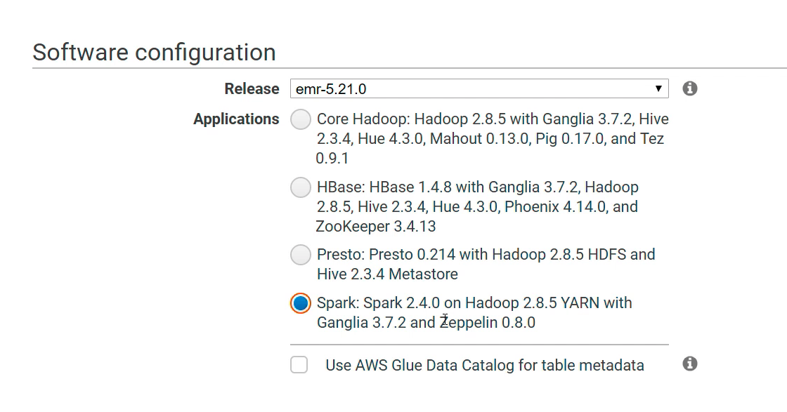 

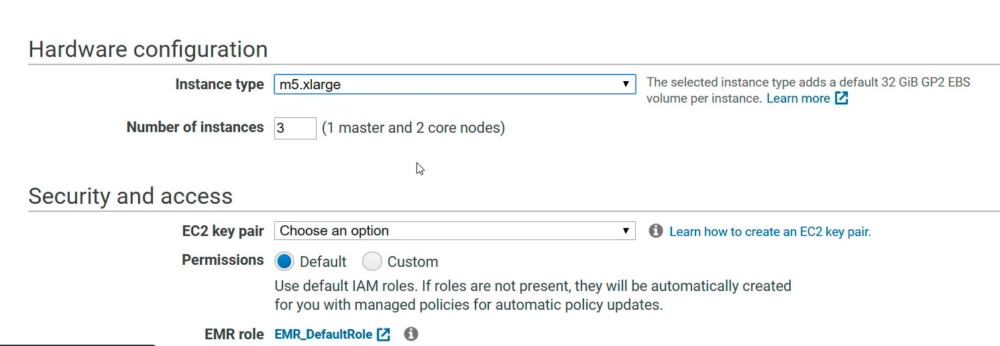 

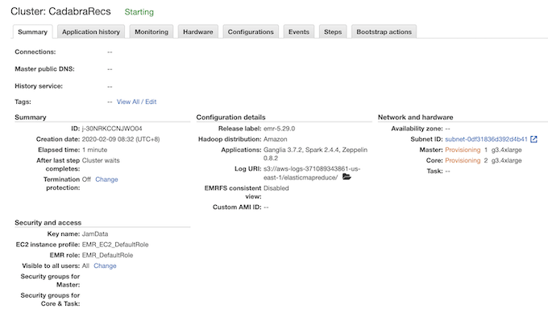 


### Change master node SG

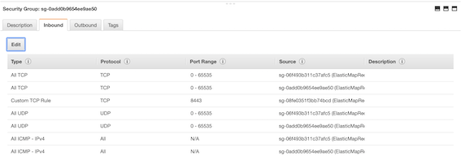 

**Add Port 22:**

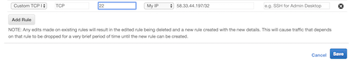 

**SSH Master public DNS**

 

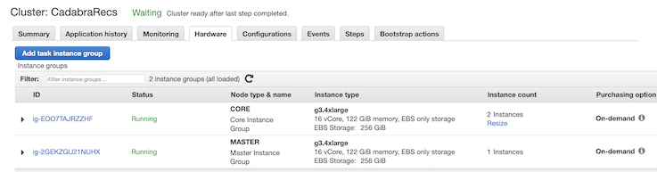 

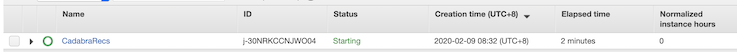 

```
ssh -i Data.pem hadoop@ip-10-250-0-78.ec2.internal
```

## **2、Example: Using Algorithm called ALS alternating least squares**

>  Under the samples directory of Spark itself.

```
$ cp /user/lib/spark/examples/src/main/python/als_example.py ./
$ ls
als_example.py
```
### **2-1 `als_example.py**`

This is a python script that is a **spark driver script** it kicks off a Spark session, calls **ALSExample**

```
rom __future__ import print_function

import sys
if sys.version >= '3':
    long = int

from pyspark.sql import SparkSession

# $example on$
from pyspark.ml.evaluation import RegressionEvaluator
from pyspark.ml.recommendation import ALS
from pyspark.sql import Row
# $example off$

if __name__ == "__main__":
    spark = SparkSession\
        .builder\
        .appName("ALSExample")\
        .getOrCreate()

    # $example on$
    lines = spark.read.text("data/mllib/als/sample_movielens_ratings.txt").rdd
    parts = lines.map(lambda row: row.value.split("::"))
    ratingsRDD = parts.map(lambda p: Row(userId=int(p[0]), movieId=int(p[1]),
                                         rating=float(p[2]), timestamp=long(p[3])))
    ratings = spark.createDataFrame(ratingsRDD)
    (training, test) = ratings.randomSplit([0.8, 0.2])

    # Build the recommendation model using ALS on the training data
    # Note we set cold start strategy to 'drop' to ensure we don't get NaN evaluation metrics
    als = ALS(maxIter=5, regParam=0.01, userCol="userId", itemCol="movieId", ratingCol="rating",
              coldStartStrategy="drop")
    model = als.fit(training)

    # Evaluate the model by computing the RMSE on the test data
    predictions = model.transform(test)
    evaluator = RegressionEvaluator(metricName="rmse", labelCol="rating",
                                    predictionCol="prediction")
    rmse = evaluator.evaluate(predictions)
    print("Root-mean-square error = " + str(rmse))

    # Generate top 10 movie recommendations for each user
    userRecs = model.recommendForAllUsers(10)
    # Generate top 10 user recommendations for each movie
    movieRecs = model.recommendForAllItems(10)

    # Generate top 10 movie recommendations for a specified set of users
    users = ratings.select(als.getUserCol()).distinct().limit(3)
    userSubsetRecs = model.recommendForUserSubset(users, 10)
    # Generate top 10 user recommendations for a specified set of movies
    movies = ratings.select(als.getItemCol()).distinct().limit(3)
    movieSubSetRecs = model.recommendForItemSubset(movies, 10)
    # $example off$
    userRecs.show()
    movieRecs.show()
    userSubsetRecs.show()
    movieSubSetRecs.show()

    spark.stop()
```

* Reads in data here from something called `sample_movielens_ratings.txt` so by default it's using some movie ratings data.
	* Not work on S3, actually **work in the HDFS file system on this cluster**.
* Spark on EMR on top of a Hadoop cluster with HDFS file system
* Reading every line of that **movie ratings data** it's mapping it out to actually split that up based on individual fields it looks like 
* It's delimited by double colon characters and then creates rows into an RDD by splitting out the user **I.D., movie I.D., rating, and timestamp** for each movie rating,
* Creates a data frame from that, splits that into a **training, and test set** and then it creates this **ALS recommendation model**

**Goal: Generate top 10 user recommendations for a specified set of movies**

### **2-2 Copy sample data into Hadoop's HDFS file system.**

```
hadoop fs -mkdir  -p /user/hadoop/data/mlib/als 
```

* Created that directory in the HDFS file systems that's shared across this cluster.

```
hadoop fs -copyFromLocal /user/lib/hadoop/data/mlib/als/sample_movielens_ratings.txt /user/hadoop/data/mlib/als/sample_movielens_ratings.txt
```

* Copy from the local path and putting it into HDFS under the same place

```
spark-submit als_example.txt
```

* Distribute script across the entire cluster of three machines and that entire cluster will just start chewing on the data and building that recommendation model 

### **2-3 Add error log output**

```
$ sudo vim als_example.txt

spark.sparkContext.setLogLevel("Error")


$ spark-submit als_example.txt
```

### **2-4 Root mean square error**

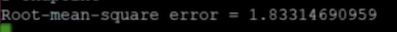 

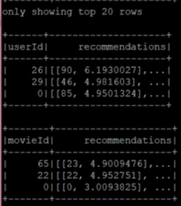 


## **3、Customer Recommend Data**

### **3-1 Make S3 data public (Only for Exercise)**

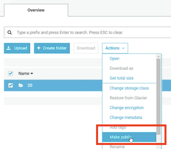 

```
$ sudo vim als_example.txt
```

```
lines = spark.read.text("s3://kin-orderlogs/2020/02/09/20/*").rdd
parts = lines.map(lambda row: row.value.split(','))

#Filter out postage, shipping, bank charges, discounts, commissions
productsOnly = parts.filter(lambda p: p[1][0:5].isdigit())

#Filter out empty customer ID's
cleanData = productsOnly.filter(lambda p: p[6].isdigit())
ratingsRDD = cleanData.map(lambda p: Row(customerId=int(p[6]), \
        itemId=int(p[1][0:5]), rating=1.0))

als = ALS(maxIter=5, regParam=0.01, userCol="customerId", itemCol="itemId", ratingCol="rating", 
```

```
$ spark-submit als_example.txt
```

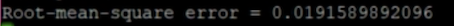 

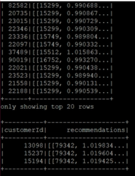 