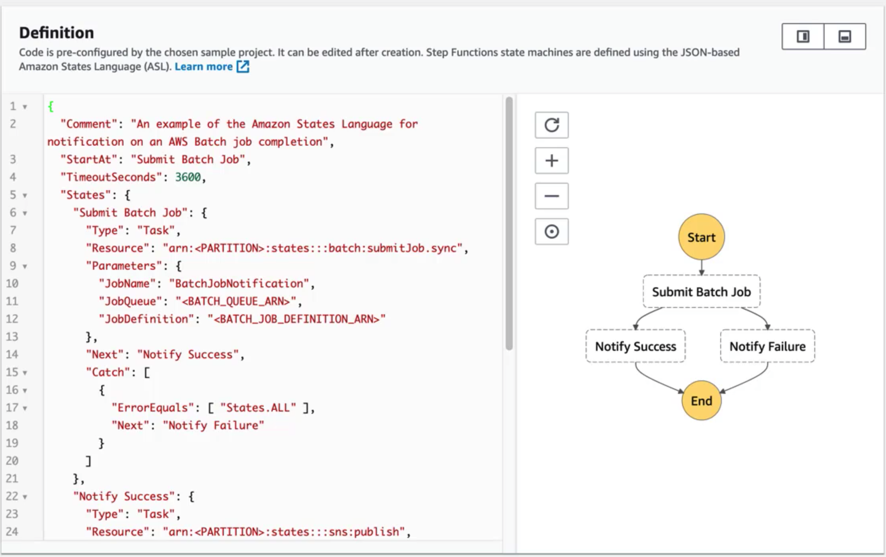

# **L7 Deep Learning**

## **1、Deep Learning 101**

### **1-1 The biological inspiration**

>  Individual nerve cells areconnected to each other via **axons** and **dendrites**.

* Neurons in your cerebral cortex are connected via axons 
* A neuron "fires" to the neurons it's connected to, when enough of its input signals are activated. 
* **Very simple at the individual neuron level** — but layers of neurons connected in this way can yield **learning behavior**. 
* **Billions of neurons, each with thousands of connections, yields a mind** 

### **1-2 Cortical columns** 

* Neurons in your cortex seem to be arranged into many stacks, or "columns" that process information in parallel 
* "mini-columns" of around 100 neurons are organized into larger "hyper-columns". There are 100 million mini-columns in your cortex 
* This is coincidentally similar to how GPU's work... 

>  3D video card in computer works. It has a bunch of very simple, very small **processing units** that are responsible for computing how **little groups of pixels on your screen are computed**.

### **1-3 Deep Neural Networks**

 

Input **feature data at the bottom** where **attributes at the bottom of the neural networks** and **predicted labels come out of the top**

> Exam
> 
> Deep learning because there's more than one layer of neurons. 

* Basically it's stacked up layers of neurons connected together in different ways 
* Those weights between each neuron are what formed the basis of your neural network neural nets tend to lend themselves very well to **parallelization** 
* **Individual neurons are simple enough to be modeled as units on a GPU**
* **GPU can parallelize the processing lots of neurons** 
	* You can have many GPUs on a single node in a cluster 
	* You can have many nodes in a cluster.

### **1-4 Deep Learning Frameworks** 

* Tensorflow / Keras 
* MXNet 

 

* Sets up a layer of 64 input neurons at the bottom where you're feeding in your input features.
* There's a hidden layer there of 64 neurons in the middle as well
* at the top there's a layer of 10 neurons that actually output the final classification of one of 10 different things

### **1-5 Types of Neural Networks** 

* Feedforward Neural Network 
* Convolutional Neural Networks (CNN) 
	* **Image classification (is there a stop sign in this image?)**

> Neural networks built for processing image data either 2D or 3D image data and typically they're being used for image classification.
  
* Recurrent Neural Networks (RNNs) 
	* Deals with sequences in time (predict stock prices, understand words in a sentence, etc) 
	* **LSTM(long short term memory cell) , GRU(gated recurrent units cell)**

> RNN is appropriate for dealing with things like **predicting stock prices** or **understanding words in a sentence** 

 

### **1-6 Deep Learning on EC2 / EMR** 

* EMR supports Apache MXNet and GPU instance types 
* Appropriate instance types for deep learning: 
	* P3: 8 Tesla V100 GPU's 
	* P2: 16 K80 GPU's 
	* G3: 4 M60 GPU's (all Nvidia chips) 
* Deep Learning AMI's 

## **2、AWS Data Pipeline**

**Data pipeline lets you schedule tasks for processing your big data.**

### **2-1 Example**

 

1. Log files that are published on EC2 instances.
2. Data pipeline can **schedule a daily task or whatever frequency** to copy those log files from EC2 into S3
3. Maybe on a weekly task basis **launch that data analysis using an EMR cluster** on the data that's been stored up in S3.

> It's kind of like Hadoop Oozie.
> 
> It's basically a task scheduling framework where you can run different operations that depend on each other on different schedules.

### **2-2 Data Pipeline Features** 

* **Destinations include S3, RDS, DynamoDB, Redshift and EMR** 
* Manages task dependencies 
* Retries and notifies on failures 
* Cross-region pipelines 
* **Precondition checks** 
	* **DynamoDB Data exists**: check for the existence of data inside a dynamo db table before you try to move it or process it 
	* **DynamoDB table exists** that can check for the existence of an entire table
	* **S3 key exists** and **S3 prefix exists** which can both be used to test for the existence of either a specific path in S3 or a specific prefix you know sort of a path that exists within S3 itself
	* **Shell command precondition** and this runs an arbitrary script of your own on your resources and checks that the script succeeds.
* Data sources may be on-premises 
* Highly available 

### **2-3 Data Pipeline Activities** 

* **EMR** 
* **Hive**: Hive queries on a schedule
* **Copy**: Copy data between Amazon S3 and JBDC data sources
* **SQL**: SQL query and copy its output into Amazon S3. 
* **Scripts** 

**EMR**

It's possible to spin up an EMR instance and run a sequence of steps automatically and then automatically terminate the cluster when it's done.

**Scripts**

Run arbitrary Linux shell commands or programs as part of your data pipeline and will be automatically added if you're using any of the templates specified by AWS during the pipeline creation.

## **3、AWS Step Functions**

 

* **Use to design workflows** 
* **Easy visualizations** 
* Advanced Error Handling and Retry mechanism outside the code 
* Audit of the history of workflows 
* Ability to "Wait" for an arbitrary amount of time 
* Max execution time of a State Machine is 1 year 

### **3-1 Step Functions Examples: Train a Machine Learning Model** 

**JSON based Amazon states language or ASL.**

 

1. Generate the data set by **kicking off a lambda function**
2. Trainsthe model using **Sagemakers(XGboost) algorithm**
3. Saves that trained model from Sagemaker
4. **Applies a batch transform to that model from some data set** that we had at that point

### **3-2 Step Functions Examples: Tune a Machine Learning Model** 

 

1. Generating a training dataset
2. kick off a **hyperparameter tuning job in Sagemaker** that just tries different parameters on the machine learning while to figure out **what the right set of parameters are for this given dataset**.
3. Extracts that model path
4. Saves the tuned model that it's settled on.
5. Extract the model name of the tune model
6. Use that to apply a transformation of a bunch of data in a batch format to that tuned model automatically.

### **3-3 Step Functions Examples: Tune a Machine Learning Model** 

* Submitting a batch job 
* Use step functions to notify us if it succeeds or fails.

### **3-4 Summary**

Step functions manage **workflows** and they give you a **nice graphical representation** of those workflows and they can **monitor whether individual steps succeed or fail and notify you what happens there.**
