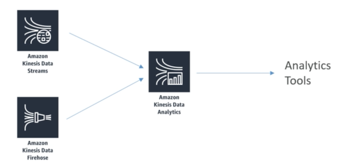
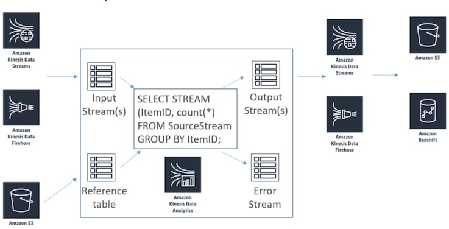

# **L1 Kinesis Analytics** 

## **L1、Amazon Kinesis Data Analytics**

 

> Querying streams of data 

Querying streams of data continuously very similar to Spark streaming but it is specific to AWS Kinesis. 

 

**Kinesis data analytics can receive data from either a Kinesis data stream or from a Kinesis data firehose stream.**

> Receiving stream of data => write straight up SQL to analyze that data => spit out the results to some other stream 

## **2、Kinesis analytics parts**

 

* Input or the source can either be **Kinesis streams or firehose streams** coming in from the left there. 
* Input or the source goes into **Input Streams** 
* **Optionally** configure a **reference data** source to enrich your input data stream within the application. And **Store your reference data as an object in an S3 bucket** 
	* When your Kinesis analytics application starts the Amazon Kinesis data analytics will **read the Amazon S3 object and create an in application table so you can refer to that data in S3** 
* **Application code: The real time analytics or the application code in the middle** where the actual analysis happens and perform real time analytics just using straight up SQL queries on your stream 
	* **SQL statements: on StreamIng data and Reference tables**. 
* **Output Stream**: Processed Data output can be sent 
	* Kinesis data stream or to another data firehose stream again 
	* Data warehouse: **S3 bucket or Amazon Redshift** 
	* Lambd

* **Application error stream**: 
	* Certain records like a type mismatch or late arrival will be written out to the error stream. 

	
### **2-1 Common use-cases**

* Streaming ETL 
* Continuous metric generation 
* Responsive analytics 

### **2-2 Streaming ETL** 

Build an application that continuously reads IoT sensor data stored in a Kinesis data stream, organize that data by the sensor type, remove duplicate data, normalize the data for a specified schema, and then go on to deliver that process data to Amazon S3.

### **2-3 Continuous metric generation**

Build leader board for a mobile game by computing the top players every minute and then sending that on to Amazon DynamoDB or you could check the traffic to your website by calculating the number of unique web site visitors every five minutes or so and then sending the process results off to Amazon Redshift for further analysis responsive analytics is another one. 

### **2-4 Responsive analytics** 

Application computing the availability or success rate of a customer facing API over time and then sending those results on to Amazon CloudWatch 

## **3、Kinesis Analytics Costs; `RANDOM_CUT_FOREST`**

### **3-1 Kinesis Analytics Costs** 

* Pay only for resources consumed (but it's not cheap) 
* **Serverless; scales automatically** 
* Use IAM permissions to access streaming source and destiontion(s)
* Schema discovery 

### **3-2 `RANDOM_CUT_FOREST`**

* SQL function offered by **Kinesis data analytics** used for **anomaly detection on numeric columns in a stream**
* They're especially proud of this because they published a paper on it 
* It's a novel way to **identify outliers in a data set** so you can handle them however you need to 
* Example: **detect anomalous subway ridership during the NYC marathon**

> EXAM 
> 
> Question about trying to **detect wog-oldies or outliers in a stream of data** `RANDOM_CUT_FOREST` with Kinesis analytics is very likely a good answer for that. 