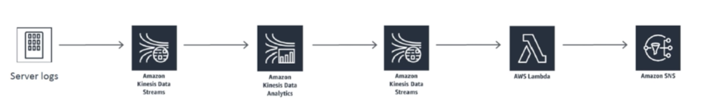
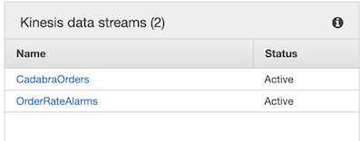
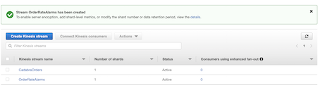
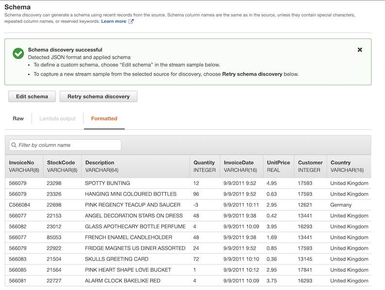
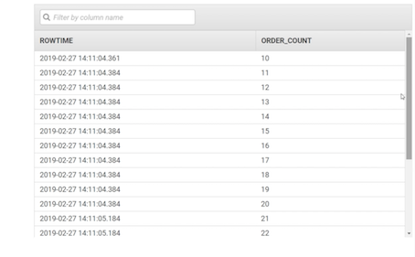
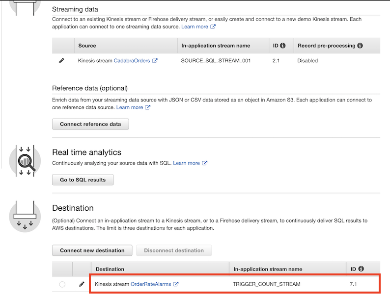
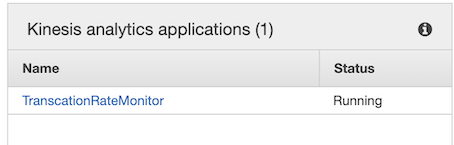
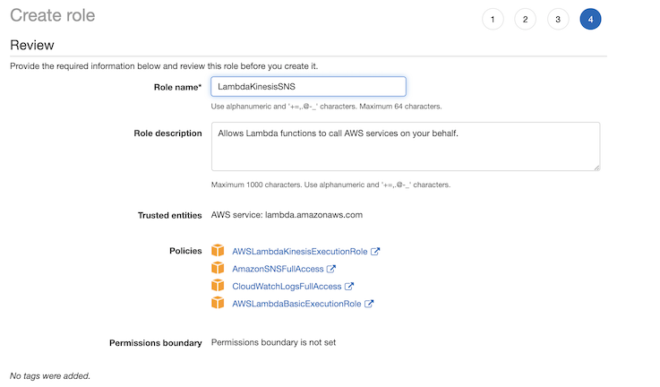
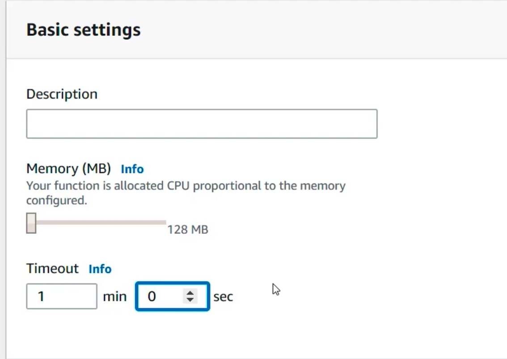
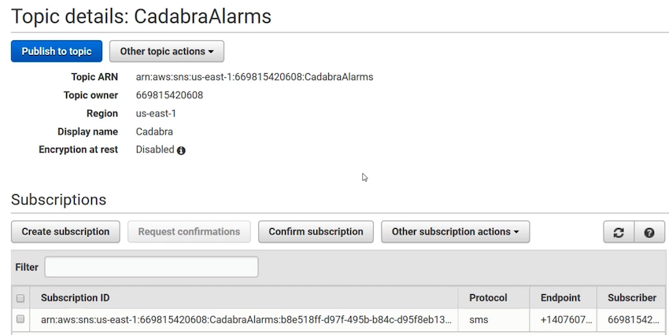

# **L2 Kinesis Analytics Exercise**

## **1、Transaction Rate Alarm**

 

Getting more than 10 orders in the span of 10 seconds. Individual orders mind you. **Which may means my site is under some sort of weird attack** where someone's using a fraudulent credit card to buy stuff on my Web site over and over again automatically.


## **First get order logs from EC2 from kinesis data stream**

* **CadabraOrders**
* **OrderRateAlarms**

**Number of shards: 1**

 

 

## **Second: Create some order logs**

**ssh to EC2 instance**

```
$ sudo service aws-kinesis-agent start
aws-kinesis-agent startup                                  [  OK  ]

$ sudo ./LogGenerator.py 
Writing 100 lines starting at line 332524

Wrote 100 lines.

$ tail -f /var/log/aws-kinesis-agent/aws-kinesis-agent.log
```

## **Third: Create Kinesis Analytics**

* Application Name: **TranscationRateMonitor**
* Runtime; SQL
* Source: 
	* Kinesis Data Streams: **CadabraOrders**
* **Automaitcally Schema discovery**:

 

## **Fourth: Run SQL Analytics**

```
CREATE OR REPLACE STREAM "ALARM_STREAM" (order_count INTEGER);

CREATE OR REPLACE PUMP "STREAM_PUMP" AS 
    INSERT INTO "ALARM_STREAM"
        SELECT STREAM order_count
        FROM (
            SELECT STREAM COUNT(*) OVER TEN_SECOND_SLIDING_WINDOW AS order_count
            FROM "SOURCE_SQL_STREAM_001"
            WINDOW TEN_SECOND_SLIDING_WINDOW AS (RANGE INTERVAL '10' SECOND PRECEDING)
        )
        WHERE order_count >= 10;

CREATE OR REPLACE STREAM TRIGGER_COUNT_STREAM(
    order_count INTEGER,
    trigger_count INTEGER);
    
CREATE OR REPLACE PUMP trigger_count_pump AS INSERT INTO TRIGGER_COUNT_STREAM
SELECT STREAM order_count, trigger_count
FROM (
    SELECT STREAM order_count, COUNT(*) OVER W1 as trigger_count
    FROM "ALARM_STREAM"
    WINDOW W1 AS (RANGE INTERVAL '1' MINUTE PRECEDING)
)
WHERE trigger_count >= 1;
```

**Save and run:**

**`Trigger_Count_Stream`:**

 

## **Fifth: Connect to destination**

**OrderRateAlarms**:


 

 

## **6th: Create Lambda function**

### **6-1 Create IAM Role for Lambda function**

* Name: **LambdaKinesisSNS**
* Policy: 
	* **AWSLambdaKinesisExecutionRole** 
	* **AmazonSNSFullAccess**
	* **CloudWatchLogsFullAccess**
	* **AWSLambdaBasicExecutionRole**

 

#### **6-2 Create lambda function**

* Name: **TransactionRateAlarm**
* Runtime: **Python2.7**
* IAM role: **LambdaKinesisSNS**


### **6-3 Create lambda function tigger**

**Kinesis**: **CadabraAlarms**

### **6-4 Add lambda function**

```
from __future__ import print_function
import boto3
import base64

client = boto3.client('sns')
# Include your SNS topic ARN here.
topic_arn = 'arn:aws:sns:us-east-1:...:CadabraAlarms

def lambda_handler(event, context):
    try:
        client.publish(TopicArn=topic_arn, Message='Investigate sudden surge in orders', Subject='Cadabra Order Rate Alarm')
        print('Successfully delivered alarm message')
    except Exception:
        print('Delivery failure')
```

**Change timeout to**: **1m**

 

## **7th: Create SNS for alaram**

Name: **Cadabra Alarm**

 

Copy **ALARM ARN** back to **Lambda function**

```
topic_arn = 'arn:aws:sns:us-east-1:...:CadabraAlarms
```