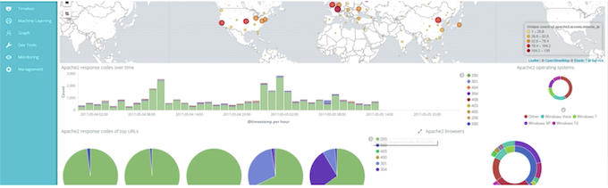
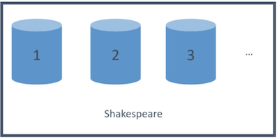
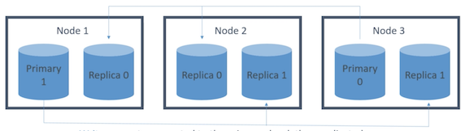
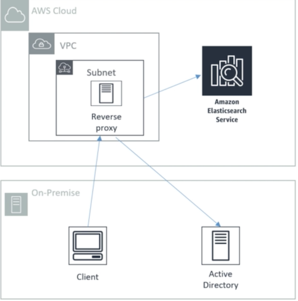

# **L3 Amazon Elasticsearch Service** 

> Petabyte-scale analysis and reporting 

## **1、What is Elasticsearch?** 

* The Elastic Stack 
* A search engine 
	* **JSON requests go search for documents that contain these keywords or attributes**
	* **Built on top of an open source solution called Lucine** and Elasticsearch fundamentally is just a scalable version of Lucine as **distributed horizontally across many nodes in a cluster**. 
* An analysis tool 
* A visualization tool (Kibana)
* A data pipeline (Beats / LogStash) 
* You can use Kinesis too 
* Horizontally scalable 

### **1-1 What is Kibana**

### **1-2 Elasticsearch applications** 

* Full-text search 
* Log analytics 
* Application monitoring 
* Security analytics 
* Clickstream analytics 

### **1-3 Amazon Elasticsearch**

Amazon ES is shorthand for Elasticsearch service Adobe can easily **see traffic patterns** and **error rates** and quickly identify and troubleshoot any potential issues all with reduced operational overhead.

### **1-4 Elasticsearch Concepts**

#### **documents** 

**Documents are the things you're searching fo**r. They can be more than text — any structured **JSON data works**. Every document has a unique ID, and a type. 

#### **types** 

> Elasticsearch releases types are going to be eliminated entirely.

**A type defines the schema and mapping shared by documents that represent the same sort of thing**. (A log entry, an encyclopedia article, etc.) 

#### **indices** 

**An index powers search into all documents within a collection of types.** They contain inverted indices that let you search across everything within them at once. 

> types are gonna be a thing of the past soon really want to think about documents and indices

### **1-5 An index is split into `shards`** 

Documents are **hashed** to a particular **shard**. 

* Each shard may be on a different **node** in a **cluster**. 
* **Every shard is a self-contained Lucene index of its own**. 

> Every shard is actually its own little mini search engine.

### **1-6 Redundancy** 

* **This index has two primary shards and two replicas.** 
* Your application should **round-robin requests amongst nodes**. 

* **Write requests** are routed to the **primary shard, then replicated** 
* **Read requests** are routed to the primary or any replica 

## **2、Amazon Elasticsearch Service**

### **2-1 Amazon Elasticsearch Service** 

* **Fully-managed (but not serverless)** 
	* Need decide how many servers you want in your Elasticsearch Cluster
* **Scale up or down without downtime** 
	* But this isn't automatic 
* **Offer a lot of services**
	* Elasticsearch APIs
	* Managed Kibana
	* Integrations with log stash
	* Integrations with AWS services such as Kinesis
* **Pay for what you use** 
	* Instance-hours, storage, data transfer 
* **Network isolation**
	* Amazon VPC
* **AWS integration** 
	* S3 buckets (via Lambda to Kinesis) 
	* Kinesis Data Streams 
	* DynamoDB Streams 
	* CloudWatch / CloudTrail 
	* Zone awareness 

#### **AWS integration** 

* Ensure data security by encrypting your data at rest and in transit using keys 

* Manage authentication and access control using **Amazon Cognito and IAM policies**

* Integrates with IoT well one good use case is sending data into Elasticsearch from your devices from your **Internet of Things** which can then be **analyzed and visualized**.

* **Zone awareness so you can actually allocate nodes in your Elasticsearch service cluster** across to different availability zones in the same region.
	* Increase your high availability
	* Increased latency

### **2-2 Amazon ES options** 

* Dedicated master node(s) 
* **Choice of count and instance types** 
* "Domains" 
	* **Amazon Elasticsearch service domain is a collection of all the resources needed to run the ES cluster**. So it contains all the configuration for the cluster as a whole.
* Snapshots to S3 **(automatic backup)**
* Zone Awareness 

### **2-3 Amazon ES Security** 

* Resource-based policies 
* Identity-based policies 
* IP-based policies 
* Request signing 
* VPC 
* Cognito 

#### **Resource-based policies**

Attach those to the service domain that determines what actions a principal can take on Elasticsearch API is where a principal is a user an account to a role that can be granted access.

#### **Request signing**

All request Amazon ES must be signed and when you send in requests from the AWS SDKs to Elasticsearch

### **2-4 Securing Kibana** 

* Cognito 
* Getting inside a VPC from outside is hard... 
	* Nginx reverse proxy on EC2 forwarding to ES domain 
	* SSH tunnel for port 5601 
	* VPC Direct Connect 
	* VPN 

### **2-5 Amazon ES anti-patterns** 

* OLTP 
	* No transactions 
	* **RDS or DynamoDB is better** 
* **Ad-hoc data querying** 
	* Athena is better 
* **Remember Amazon ES is primarily for search & analytics** 

## **3、Amazon ES performance**

Memory pressure in the JVM can result if: 

* **You have unbalanced shard allocations across nodes** 
* **You have too many shards in a cluster**

Fewer shards can yield better performance if **JVMMemoryPressure** errors are encountered 

* Delete old or unused indices 
