# **L4 Amazon Elasticsearch Service Exercise**

## **1、Near-real-time log analysis**

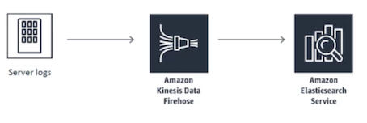 

### **1-1 Cenerate Fake Log**

```
$ pwd
/home/ec2-user

$ wget http://media.sundog-soft.com/AWSBigData/httpd.zip
--2020-02-12 00:27:39--  http://media.sundog-soft.com/AWSBigData/httpd.zip
Resolving media.sundog-soft.com (media.sundog-soft.com)... 52.217.38.124
Connecting to media.sundog-soft.com (media.sundog-soft.com)|52.217.38.124|:80... connected.
HTTP request sent, awaiting response... 200 OK
Length: 39403376 (38M) [application/octet-stream]
Saving to: 'httpd.zip'

httpd.zip                      100%[===================================================>]  37.58M  48.3MB/s    in 0.8s    

2020-02-12 00:27:40 (48.3 MB/s) - 'httpd.zip' saved [39403376/39403376]


$ unzip httpd.zip
$ sudo mv httpd /var/log/httpd
```

## **2、Create Amazon ES** 

*  **Create a new domain**
*  Deployment type: **Development and testing**
*  Elasticsearch version: **6.8**
*  Elasticsearch domain name: **cadabra**

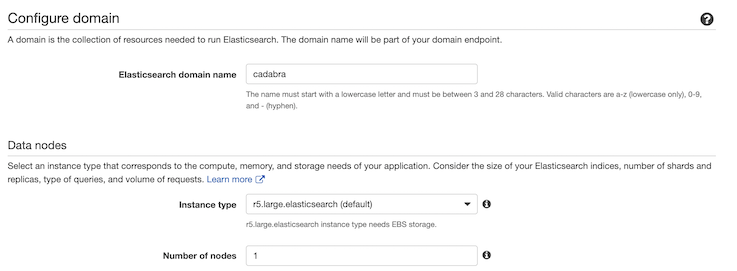 

* Network configuration: **Public access** (Not recommended, only for exercise)
* **Uncheck**: **Enable fine-grained access control**
* Access policy: 
	* Custom Access Policy
	* IAM ARN
	* **arn:aws:iam::...:user/jacob.xi**
	* allow

```
{
  "Version": "2012-10-17",
  "Statement": [
    {
      "Effect": "Allow",
      "Principal": {
        "AWS": "*"  
      },
      "Action": "es:*",
      "Resource": "arn:aws:es:us-east-1:371089343861:domain/cadabra/*"
    }
  ]
}
```


## 3、Create firehose delivery stream and Lambda function 

* New delivery stream: **Weblogs**

### **3-1 Lambda function to transform source**

* Transform source records with AWS Lambda: **Enabled**
* **Create New**: **Apache Log to JSON**

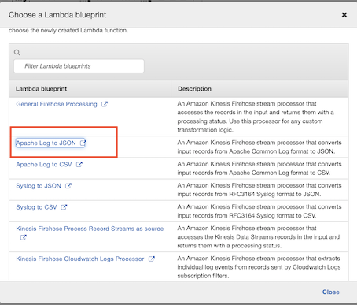 

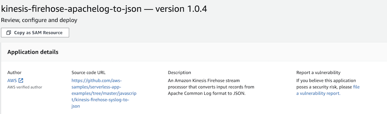 

* FunctionNameParameter: **LogTransform**
* TableNameParameter: **LogTransform**

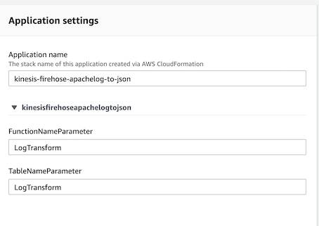 

* **Change timeout to: 1 minute**

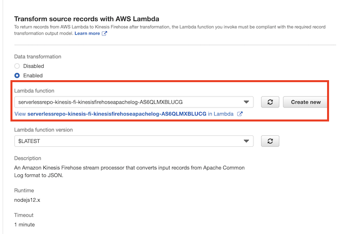 


### **3-2 Add Amazon ElasticSearch Service**

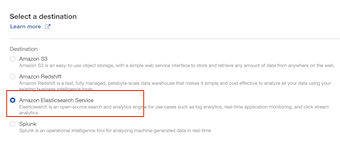 

* Domain: **cadabra**
* index: **weblogs**
* index rotation: **1day**
* Type: **weblogs**

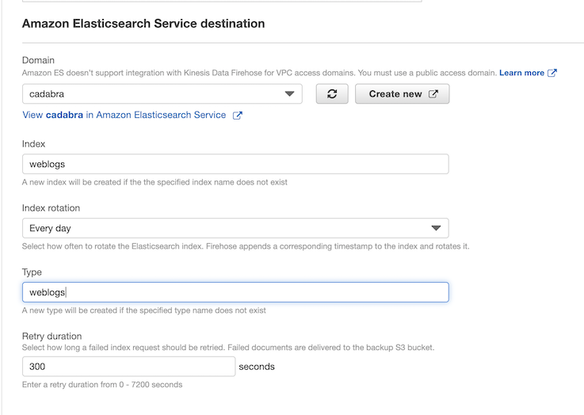 

### **3-3 Add S3 backup**

* S3: **kin-orderlogs**
* prefix: **es/**

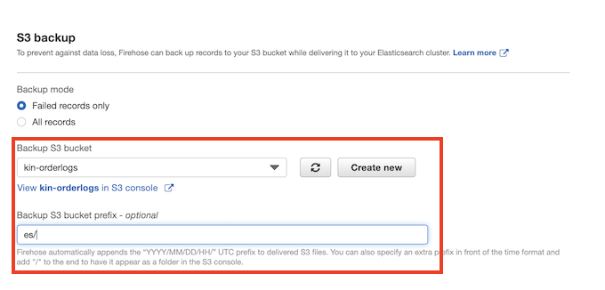 

### **3-4 ElasticSearch Service buffer condition**

* buffer interval: **300s**
* buffer size: **5MB**

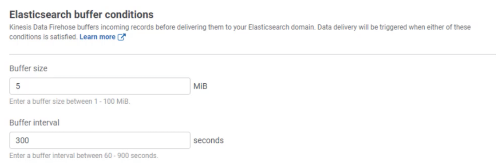 


### **3-5 Create new default firehose IAM role: `firehose_delivery_role`**

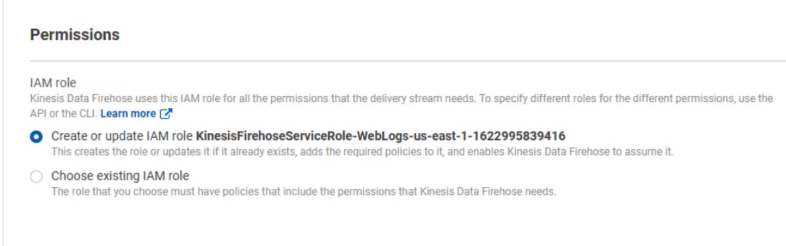 

### **3-6 Add `aws-kinesis-agent` new config**

```
$ ssh -i ...
$ sudo vi /etc/aws-kinesis/agent.json

{
  "cloudwatch.emitMetrics": true,
  "kinesis.endpoint": "kinesis.us-east-1.amazonaws.com",
  "firehose.endpoint": "firehose.us-east-1.amazonaws.com",

 // "awsAccessKeyId": "",
 // "awsAccessAccessKey": ""

  "flows": [
    {
      "filePattern": "/var/log/httpd/ssl_access*",
      "deliveryStream": "Weblogs",
      "initialPosition": "START_OF_FILE"    
    }
  ]
}


$ sudo service aws-kinesis-agent restart
aws-kinesis-agent startup                                  [  OK  ]
```

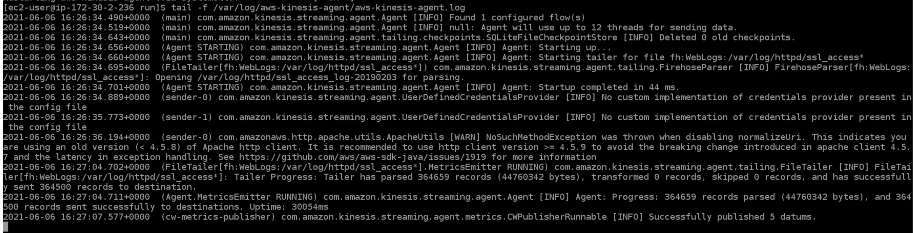 


### **3-7 Check Amazon ES indices**

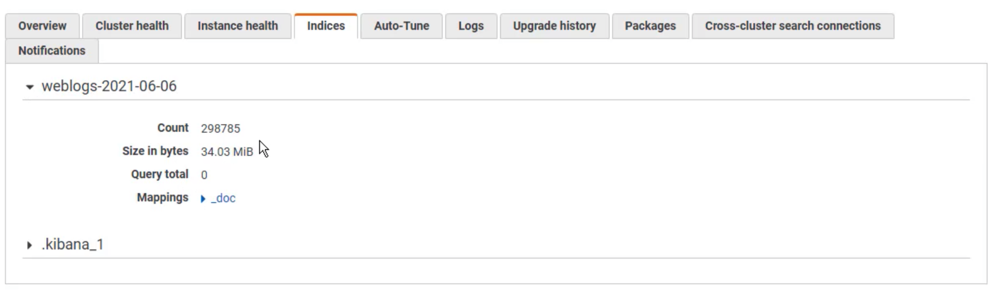 


## **4、Kibana**

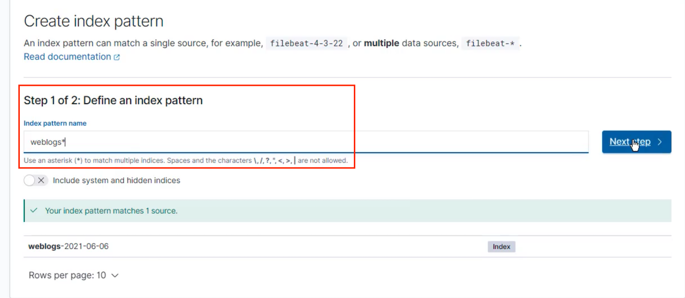 

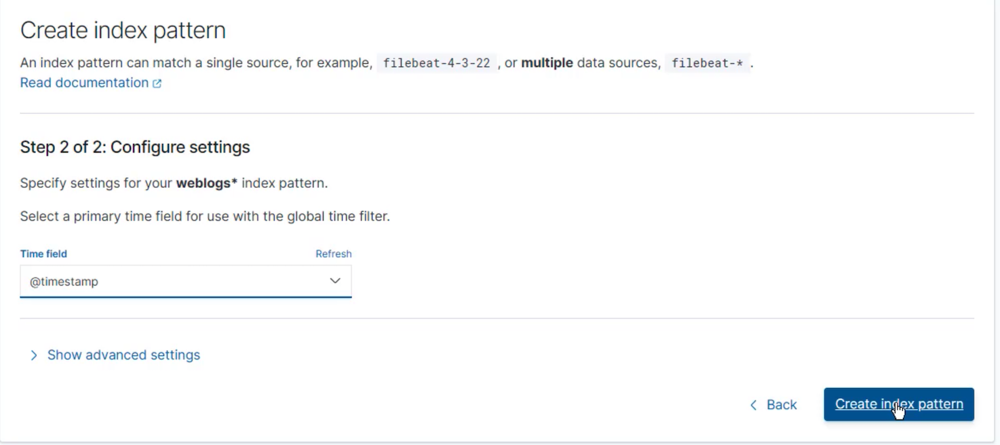 

### **4-1 Add new index**

* Index pattern: **`weblogs*`**
* Time Filter field name： `@timestamp`

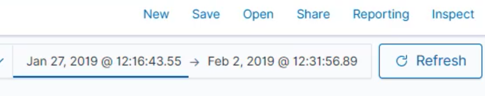 

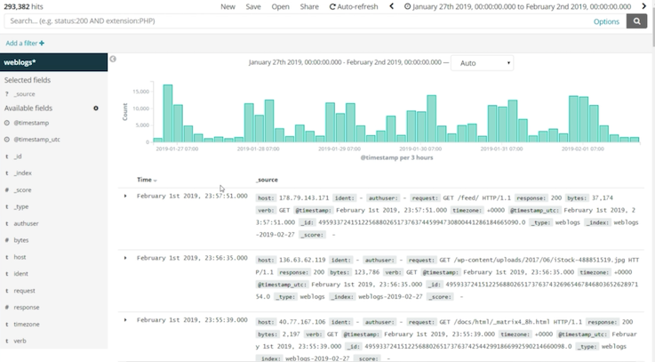 

### **4-2 Add visualize**

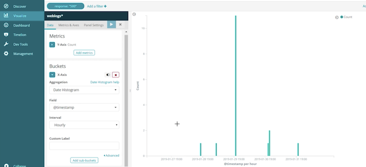 
