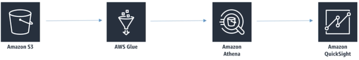

# **L5 Amazon Athena**

## **1、Athena Introdution**

> Serverless interactive queries of S3 data

* Interactive query service for S3 (SQL) 
	* **No need to load data, it stays in S3** 
* **Presto under the hood** 
* **Serverless!** 
* Supports many data formats 
	* CSV (human readable) 
	* JSON (human readable) 
	* ORC (columnar, splittable) 
	* Parquet (columnar, splittable)
	* Avro (splittable) 
* **Unstructured, semi-structured, or structured** 

> Athena doesn't really care if your data in S3 is **structured or semi-structured or structured** it can work with glue and the glue data catalog to impart structure on that data and make it something that you can query from a SQL command.

#### **CSV**

CSV which is comma separated value and its tab separated value lists is that they're **human readable**. Every line contains a bunch of fields separated by commas.

#### **JSON** 

JSON  has a bit more structure to it and that you can have more hierarchical data inside of it but it's still human readable

**It's still one row per document**

#### **Non-human readable formats such as ORC and Parquet**. 

**ORC and Parquet are both examples of columnar** or formats that are also **splittable**.

**Instead of organizing data by rows it's organizing it by each column.**

**Massive ORC or a massive Parquet file** and still have the ability for your cluster to split that data and view it across different instances.

#### **Avro** 

Splittable file format but it is not columnar so it is not human readable.

**Row based storage**

#### **Some examples** 

* Ad-hoc queries of web logs 
* Querying staging data before loading to Redshift 
* Analyze CloudTrail / CloudFront / VPC / ELB etc logs in S3 
* Integration with Jupyter, Zeppelin, RStudio notebooks 
* Integration with QuickSight 
* Integration via ODBC / JDBC with other visualization tools 

## **2、Athena and Glue, Costs, and Security**

### **2-1 Athena + Glue**

1. **Glue crawler** populating the **glue data catalogue** for your **S3 data** that's looking at what's stored in S3 and try to **extract columns and table definitions**
   * You can use the **glue console to refine that definition** as needed. 
2. You have a **glue data catalogue** published for your S3 data Athena and it can **build a table from it automatically** as well.
3. Athena that can use that **glue data catalogue** either it will allow any other analytics tool to visualize or analyze that data as well. 
4. **RDS, redshift, redshift spectrum, EMR, any application** that's compatible with an **Apache hive metastore as well because remember the glue data catalog can be used as a hive metastore too**.

* Athena integrated with AWS's glue data catalog that allows you to create a unified metadata repository across various services 
* **Crawl data to discover schemas**
* Populate your catalog with new and modified table and partition definitions, 
* **Maintain schema versioning all under the hood**.
* Athena just sits on top of that and provides a SQL interface to that underlying glue structure

### **2-2 Athena cost model** 

* `Pay-as-you-go` 
	* $5 per TB scanned
	* Successful or cancelled queries count, failed queries do not. 
	* **No charge for DDL (CREATE/ALTER/DROP etc.)** 
* Save LOTS of money by using columnar formats 
	* ORC, Parquet (Converting your data to a columnar format with ORC and Parquet)
	* Save `30-90%`, and get better performance 
* Glue and S3 have their own charges 

> Converting your data to a columnar format with ORC and Parquet.

### **2-3 Athena Security**

* **Access control** 
	* IAM, ACLs, S3 bucket policies 
	* AmazonAthenaFullAccess / AWSQuicksightAthenaAccess 
* **Encrypt results at rest in S3 staging directory**
	* S3 Server-side encryption with S3-managed key (SSE-S3)
	* Server-side encryption with KMS key (SSE-KMS) 
	* Client-side encryption with KMS key (CSE-KMS) 
* **Cross-account access in S3 bucket policy possible** 
* **Transport Layer Security (TLS) encrypts in-transit (between Athena and S3)** 

### **2-4 Athena anti-patterns** 

* **Highly formatted reports / visualization**
	* That's what QuickSight is for 
* **ETL** 
	* Use Glue instead or Apache Spark for a larger scale tests.

## **3、Athena Performance**

* **Use columnar data (ORC, Parquet)** 
* **Small number of large files performs better than large number of small files** 
* Use partitions 
	* **If adding partitions after the fact, use MSCK REPAIR TABLE command**
