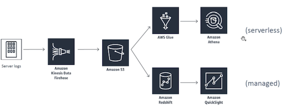
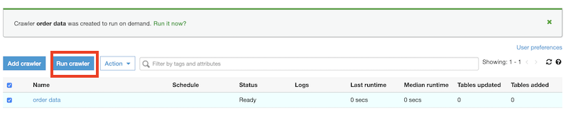
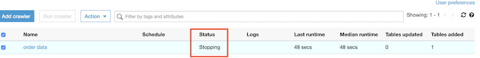
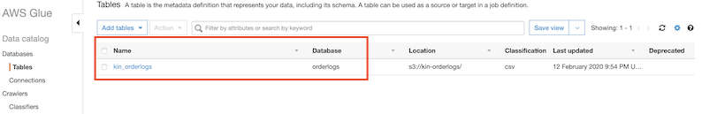
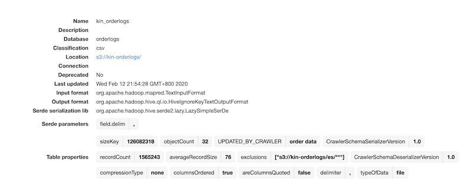
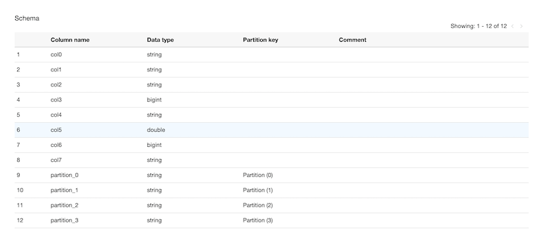
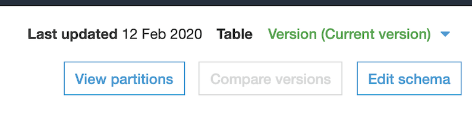
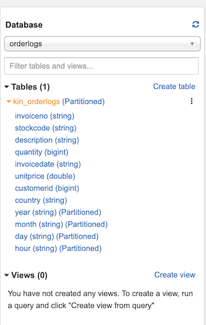
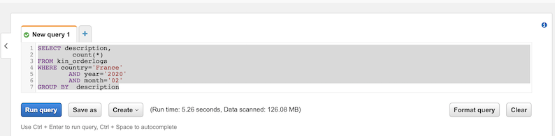
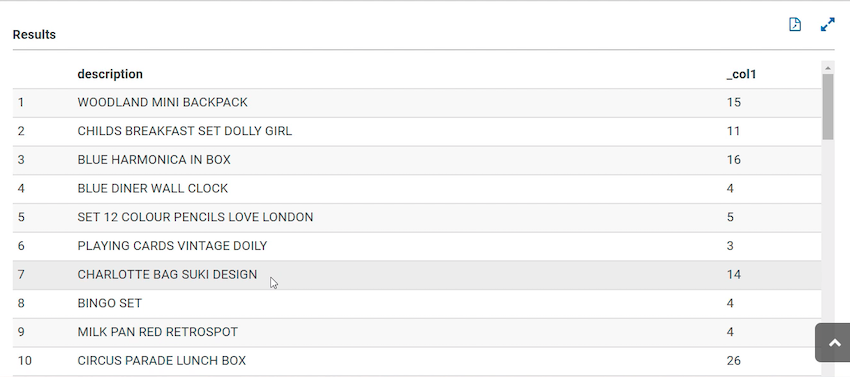

# **L6 [Exercise] AWS Glue and Athena**

## **1、Data Warehousing with visualization**



* AWS Glue to actually infer a schema from our data lake in S3
* Issue queries against that data from Athena as if it were a SQL database.

## **2、Create Glue cralwer**


* Crawler name: **orderdata**
* Crawler Source type: **Data Stores**
	* **S3**
	* `s3://glue-orderlogs`
	* **Exclude Pattern**: **`es/**`**
* Create IAM Role: **OrderData**
* Schedule: **Run on demand**
* Crawler output Database name: **orderlogs**



Run the cralwer, then go to the **glue table** when status changed from **running** to **stopping**









### **2-1 Change table col name: Edit Schema**






* InvoiceNo
* StockCode
* Description
* Quantity
* InvoiceDate
* UnitPrice
* CustomerID
* Country
* year
* month
* day
* hour

## **3、Run Athena SQL**

* Database name: **orderlogs**



```
SELECT description,
         count(*)
FROM kin_orderlogs
WHERE country='France'
        AND year='2020'
        AND month='02'
GROUP BY  description
```

### **3-1 Change settings to same region S3 bucket with Athena**





### **3-2 Output and result saved in S3**



