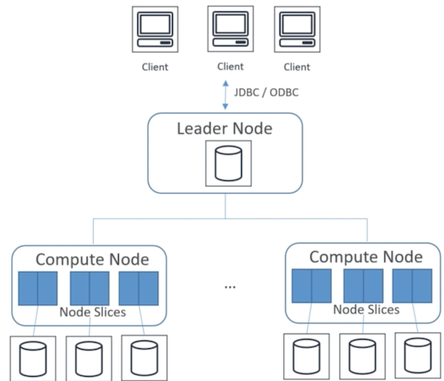
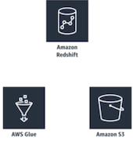
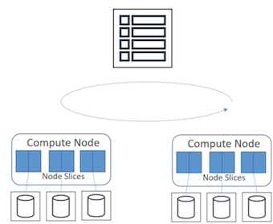
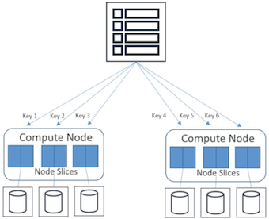
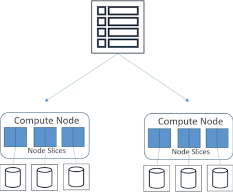
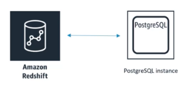
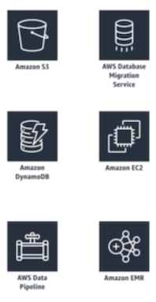
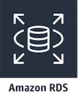

# **L7 AWS Redshift**

## **1、Redshift Intro and Architecture**

>  Redshift AWS's distributed to data warehouse solution

**Full-managed, petabytes-scale data warehouse spread across an entire cluster**


## **1、What is Redshift?** 

* **Fully-managed, petabyte scale data warehouse service**
* 10X better performance than other data warehouses 
	* **Via speed using machine learning, massively parallel query(MPP) execution, columnar storage** 
* Designed for OLAP(Online analytic processing), not OLTP 
* **Cost effective** 
* SQL ODBC, JDBC interfaces (SQL based clients and BI tools just using standard ODBC and JDBC connections.)
* Scale up or down on demand by (`AWS management console/Single API call`)
* **Built-in replication & backups** 
* Monitoring via CloudWatch / CloudTrail 
	* Metrics 
	* Compute utilization
	* Storage utilization
	* Read and write traffic to the cluster.
	* Custom metrics


### **1-1 Redshift Use-Cases** 

* **Accelerate analytics workloads**
  * Machine learning(MPP) and columnar storage on high performance disks and result caching to make it superfast. 
* **Unified data warehouse & data lake **
  * Redshift spectrum importing your unstructured data in S3 as just another table in your data warehouse.
* **Data warehouse modernization** 
	* Make it move faster and more scalable and easier 
* Analyze global sales data
* Store historical stock trade data 
* Analyze ad impressions & clicks 
* Aggregate gaming data 
* Analyze social trends 

### **1-2 Redshift architecture**

A cluster is the core infrastructure component of an Amazon Redshift data warehouse 

**A cluster is composed of:** 

* One **leader node**
* One or more **compute nodes** contain between 1 and 128 compute nodes depending on the node type.
	* User data is going to be stored on the compute nodes




### **1-3 Leader node **

* **Managing communication with the client programs and all communication with the compute nodes**
* It's sort of the **interface between your external clients to redshift** and the compute nodes under the hood
* It **receives all the queries from client applications passes the queries**
* **Develops execution plans** which are **an ordered set of steps to process those queries**.
* **It coordinates the parallel execution** of those plans with the compute nodes and also **aggregates the intermediate results from those nodes**.
* Finally the leader node will **return those results back to the client applications**.

### **1-4 compute nodes**

* **Responsible for executing the steps** specified in the execution plans from the leader node
* **Transmitting data among compute nodes to serve those queries**
* Sendsintermediate results back to the leader node for aggregation


### **1-5 Compute node types**

**Compute node** has its own **dedicated CPU, memory, and attached disk storage** which are determined by the node type.

* `Dense storage => HDS`
* `Dense compute => SSD`

#### **Dense storage(D.S. node)**

Very large data warehouse using hard disk drives(HDD) for a very low price point.

* **xlarge** (3HDD total 2TBs of magnetic storage on that node)
* **8xlarge** (24HDD total 16TBs of magnetic storage on that node)
* **D.S. 2.8xlarge** has 36 Intel Xeone 526 76 Haswell virtual cores and 244 GB of RAM whereas an extra large has for Intel Xeone 526 76 Haswell virtual cores and 31GB of RAM.

#### **Dense compute (D.C. node)**

Create very high performance data warehouses using fast CPUs large amounts of ram and SSD.

**SSD size**

* **xlarge**: 160gb of SSD storage 2vCPU and 15gbs of RAM
* **8xlarge**: 2.56tb of SSD, 32 vCPU and 244 gbs of RAM 


### **1-6 Compute Node Slice**

**Compute node have node slices.** So every compute node is divided into slices and a portion of the nodes memory and disk space is going to be allocated to each slice where it processes a portion of the workload assigned to that node


## **2、Redshift Spectrum and Performance Tuning**

Athena could use the AWS Glue catalog to make tables on top of your S3 data **redshift spectrum can do the same thing**. 



### **2-1 Redshift Spectrum** 

* **Query exabytes of unstructured data in S3 without loading** 
	* Like tables embody in redshift redshift cluster.
* **Limitless concurrency**
	* multiple queries to access the same data simultaneously in S3 it can scale out to thousands of instances if needed. 
* Horizontal scaling 
* **Separate storage & compute resources** 
	* All of your storage is being done in S3. 
	* Spectrum is just doing the compute part of analyzing that data. 
*  **Wide variety of data formats** 
	*  Avro, CSV, Grok, Ion, JSON, ORC, Parquet, RC file, Regx, Cirta, sequence files, text files, and TSVs 
* Support of Gzip and Snappy compression 
	* **Compress your S3 data to save space and save bandwidth** 


### **2-2 Redshift Performance** 

* Massively Parallel Processing (MPP)
* Columnar Data Storage 
* Column Compression 
* Copy command / Analyze compression command


#### **MPP**

Do that data and query loads are automatically distributed across all nodes and adding nodes to the data warehouse is made easy and also enables fast query performance as the data warehouse grows so it will do all of its queries in parallel.

**More speed or more capacity just add more nodes**

#### **Columnar Data Storage** 

* **Uses columnar data storage so your data is organized by column as column**
* Ideal for data warehousing and analytics for large data set querying because typically you're just looking at specific columns of a large number of columns so you can save a lot of bandwidth

#### **Column Compression** 

**Data format multiple compression**: 

* Select the most appropriate c**ompression schema**
* Data is loaded into an empty table 
* **Compression is a column level operation** that reduces the size of the data
* **Compression can conserve storage space** and and reduces the size of data that is read from the storage.
* It **reduces the amount of disk IO and improves your query performance**.


#### **Copy command / Analyze compression command**

* **Loading data into a redshift cluster by copy command**
* Copy command it will automatically analyze and apply compression automatically.
* It's not possible to change the compression encoding for a column after the table is created.
* **Analyze compression command** which will **perform compression analysis** and **produce a report with the suggested compression encoding** for the tables analyzed.


## **3、Redshift Durability and Scaling**

### **3-1 Redshift Durabillty**

* **Replication within cluster**
* Backup to S3 
* Asynchronously replicated to snapshots to S3 in another region 
* Automated snapshots (1 day retention period by default, top to 35 days)
* Failed drives/nodes automatically replaced
* AWS recommends at least two nodes in your cluster 
* However一 limited to a single avallabdity zone(AZ) 


#### **Three copies of the data are maintained**

* On the original compute nodes
* On a replica on compute nodes 
* In a backup in S3.

#### **Drive failure**

* The Redshift cluster will remain available with a slight decline in performance of certain queries 
* Redshift rebuilds that drive from a replica of the data on that drive which is stored on another drive within that node

#### **Single node cluster**

* Do not support data replication 
* Only restore your cluster from a snapshot in S3 instead

#### **Individual node failure**

* Automatically detect that node failure
* Replace a failed node in data warehouse cluster. 

#### **limited to a single avallabdity zone(AZ)**

However you can **restore the cluster from any existing snapshot to a new availability zone within the `same region`**.

### **3-2 Scaling Redshift**

* **Vertical and horizontal scaling on demand**
	* Increasing the node instance type
	* Increasing the number of nodes
* **During scaling**: 
	* A new cluster is created while your old one remains available for reads 
	* CNAME is flipped to new cluster (a few minutes of downtime) 
	* Data moved in parallel to new compute nodes 


## **4、Redshift Distribution Styles**

How the data in your table is **distributed across many compute nodes and many slices within those nodes**.

Two primary goals of data distribution:

* **Distribute the workload uniformly among the nodes** in the cluster
* **Minimize data movement during query execution**. 

### **4-1 Redshift Distribution Styles** 

* **AUTO** 
	* Redshift figures it out based on size of data 
* **EVEN** 
	* Rows distributed across slices in round-robin 
* **KEY** 
	* Rows distributed based on one column 
* **ALL** 
	* Entire table is copied to every node 

### **4-2 Auto distribution (don't specify)**

Redshift will assign an optimal distribution style

### **4-3 Even distribution**

Even distribution regardless of the values in any particular column the leader node distributes the rows across the slices in a round robin fashion and spread things out as evenly as possible.



Step through each individual slice and **keep assigning new data to each slice in a circular manner.**

### **4-4 key distribution**

Make sure that all the data associated with a **specific key value will be physically located on the same slice** and that can speed up your queries.



* New rows are coming in from your incoming data those keys will be hashed and set to a specific slice based on how that key is hashed.

### **4-5 All distribution**




* A copy of the entire table is distributed to every node 
* Ensures that every row is co-located for every join that the table participates in the all distribution multiplies the storage required by the number of nodes in the cluster.
* Much longer to load update or insert data into multiple tables all distribution
* Small dimension tables do not benefit significantly from all distribution.


## **5、Redshift Sort Keys**

* Creating a table you can define one or more of its columns as sort keys.
* When data is initially loaded into an empty table the rows are stored on disk in **sorted order**.
* The sorting enables efficient handling of range restricted 
* Predicates redshift will automatically **store the minimum and maximum values for each block as part of its metadata**.
* If a query uses a range restricted predicate the query processor can use the min and max values to rapidly skip over large numbers of blocks during table scans.

### **5-1 Redshift Sort Keys** 

* Rows are stored on disk in sorted order based on the column you designate as a sort key 
* Like an index 
* Makes for fast range queries 
* Choosing a sort key 
	* Recency? Filtering? Joins? 
* Single vs. Compound vs Interleaved sort keys 

> Recency(Recent Data) => timestamp column
> 
> Frequent range filtering or equality filtering on one column
> 
> Frequently join =>  join column for source key and the distribution key.

### **5-2 Sort Keys： Single Column**

A single column a single value to sort the data.


Is useful if you're consistently querying for data **within a single filter column like sort key by date**

### **5-3 Sort Keys：Compound**

A compound key is made up of all the columns listed in the sort key definition in the order they are listed in.


**Most useful when a query's filter applies conditions such as filters and joins** that use a prefix of the sort keys

>  Performance decrease when queries depend only on secondary sort columns without referencing the primary column. => Make sure that your primary column is one that you will most often be including in your queries.

* **Compound is the default sort type** 
* **Improve compression so their default for a reason**

#### **Sort Keys： Interleaved**

**Gives equal weight to each column or subset of columns in the sort key.**

Useful if multiple queries use different columns for filters it uses an internal compression


Schema for a zone map values that enables them to better discriminate among column values that have a long common prefix.

## **6、Redshift Data Flows and the COPY command**

### **6-1 Importing / Exporting data** 

* COPY command 
	* Parallelized; efficient 
	* From S3, EMR, DynamoDB, remote hosts(SSH)
	* role based or key based access control to provide authentication FOR load or unload
	* S3 requires a manifest file and IAM role 
* UNLOAD command 
	* Unload from a table into files in S3 
* Enhanced VPC routing 


#### **Example: copy command to load from Amazon S3**

There are couple ways:

*  **Using an Amazon S3 object prefix** which it would load all the data underneath a specific prefix or a path in S3.
	* COPY `s3://bucket_name/object_prefix`+`authorization`
* Use a **manifest file which is a JSON format of files in S3** that lists the data files that you want to load.
	* COPY `s3://booking_name/manifest_file`+ `authorization`

#### **Enhanced VPC routing** 

* Force all of your copy and unload traffic between your cluster and the repositories through your Amazon VPC. (Set up VPCe or Nat gateways or Internet gateways within your VPC)
* Otherwise all of that copy and unload traffic will be routed **through the Internet**.


### **6-2 COPY command: More depth** 

* Use **COPY** to load large amounts of data from **outside(EXTERNAL)** of Redshift 
* If your data is already in Redshift **in another table**(**INTERNAL**), 
	* Use `INSERT INTO ...SELECT` 
	* Or `CREATE TABLE AS` 
* **COPY** can **decrypt** data as it is loaded from S3 
	* `Hardware-accelerated SSL` used to keep it fast 
* Gzip, Izop, and bzip2 compression supported to speed it up further 
* **Automatic compression** option 
	* **Analyzes data** being loaded and figures out optimal compression scheme for storing it 
* Special case: **narrow tables (lots of rows, few columns)** 
	* Load with a **single COPY transaction** if possible 
	* Otherwise **hidden metadata columns** consume too much space 

> Exam:
> 
> How to efficiently load data into redshift from **outside**: `copy command`
> 
> How to optimize the usage of your actual storage on your cluster: `Automatic compression and analyzes data`


### **6-3 Redshift copy grants for cross-region snapshot copies** 

* Let's say you have a `KMS-encrypted` Redshift cluster and a snapshot of it 
* You want to copy that snapshot to another region for backup
* In the destination AWS region: 
	* Create a KMS key if you don't have one already 
	* Specify a unique name for your snapshot copy grant 
	* Specify the KMS key ID for which you're creating the copy grant 
* In the source AWS region: 
	* Enable copying of snapshots to the copy grant you just created 


### **6-4 DBLINK**

* Connect Redshift to PostgreSQL (possibly in RDS) 
* **Good way to copy and sync data between PostgreSQL and Redshift** 




* launch Redshift cluster and PostgreSQL RDS in same AZ 
* Configure VPC security group for Redshift cluster to allow incoming connection from PostgreSQL  

```
CREATE EXTENSION postgres_fdw; 
CREATE EXTENSION dblink; 
CREATE SERVER foreign_server 
	FOREIGN DATA WRAPPER postgres_fdw 
	OPTIONS (host '<omazon_redshift eip,, port '<port>, dbnome '<datobose_nome>, sslmode 'require'); 
	CREATE USER MAPPING FOR <rds_postgresql_username> 
	SERVER foreign_server 
	OPTIONS (user '<amazon_redshift_username>, password '<password>'); 
```

## **7、Redshift Integration / WLM / Vacuum / Anti-Patterns**

### **7-1 Integration with other services** 

* S3
* DynamoDB 
* EMR / EC2 
* Data Pipeline 
* Database Migration Service 



* S3: Parallel processing to **export or import** multiple data files from S3
* DynamoDB: Using Copy command to **load a redshift table with data from a single Amazon dynamoDB table**.
* EMR / EC2: Using Copy command to import from EMR and import data using SSH.
* Data Pipeline: **Automate the data movement and transformation in and out** of redshift tables using data pipeline.
* Database Migration Service: **Migrate data from some existing data warehouse into Amazon Redshift**


### **7-2 Redshift Workload Management (WLM)**

* Prioritize short, fast queries vs. long, slow queries 
* Query queues 
* Via console, CLI, or API 

#### **What is WLM(Prioritize)?**

WLM is a way to help users **prioritize workloads** so that short **fast running queries are not stuck behind long running slow queries**.The way it works is by creating query queues at runtime according to **service classes** and **configuration parameters** for **various types of queues** are defined by those service classes.

#### **How or manage WLM(Query queues)?**

Modify the WLM configuration to **create separate queues** for long running queries and for short running queries thereby **improving system performance and user experience.**

#### **How or set this up(`Exam`)?**

* Amazon Redshift management console 
* Amazon Redshift command line interface
* Amazon Redshift API 

### **7-3 Concurrency Scaling**

* **Automatically adds cluster capacity** to handle increase in **concurrent read queries** 
* Support **virtually unlimited concurrent users & queries**
* **WLM queues** manage which queries are sent to the concurrency scaling cluster
* **WLM queues is not free**

#### **workload management queue(WLM queues)**

It can help to manage queries are sent to the concurrency scaling cluster so you can manage:  

* **What queue you assign your queries to** 
* **Which ones can actually take advantage of concurrency scaling** and which ones do not.
* Pick and choose which queries take advantage of concurrency scaling.
	* **Segregate those read queries** might be bursting or vary in time in their frequency and **use that to automatically scale out the capacity for that specific query.**


### **7-3 Automatic Workload Management** 

* Creates up to 8 queues 
* Default 5 queues with even memory allocation 
* **Large queries** (ie big hash joins -> concurrency lowered) 
	* Larger queries need more capacity so lower concurrency. 
* **Small queries** (ie inserts, scans, aggregations) -> concurrency raised 
* Configuring query queues 
	* **Priority**:  Relative importance of queries within a workload.
	* **Concurrency scaling mode**: Set particular queue to have access to concurrency scaling cluster 
	* User groups 
	* Query groups 
	* Query monitoring rules 

#### **3.User group**

Set of user groups to a queue by specifying a **user group name** or by **using wildcards**.

When **a member of a listed user group** runs a query that query **will automatically run within the corresponding queue** so you can **assign queues to query queues based on users**.


#### **4.Query group - set by Label**

**Assign a query group label to a series of queries** and that will define which queue that query goes into

#### **5.Query monitoring rules**

**Define metric** space performance boundaries for workflow management queue

Specify what action to take when a query goes beyond those boundaries.

**Example:**

* Queue for dedicated to short running queries and you might have a query monitoring role that aborts those queries if run for more than 60s
* Short query queue is handling short queries if something goes wrong with one of those queries it's not going to hold up all the other queries in that queue.


### **7-4 Manual Workload Management**

* One default queue with concurrency level of 5 (5 queries at once) 
* Superuser queue with concurrency level 1
	* **Intended for administrative queries**
* Define up to 8 queues, up to concurrency level 50 
	* Each can have defined concurrency scaling mode, concurrency level, user groups, query groups, memory, timeout, query monitoring rules 
	* Can also enable query queue hopping 
	* Timed out queries "hop" to next queue to try again 


**Concurrency levels define how many queries can I run at once within this queue**.


#### **Query queue hopping**

So if you have a query that times out within a given queue you can configure things to have it hop to the next queue


### **7-5 Short Query Acceleration (SQA)** 

* Prioritize short-running queries over longer-running ones 
* Short queries run in a dedicated space, won't wait in queue behind long queries 
* Can be used in place of WLM queues for short queries 
* Works with: 
	* `CREATE TABLE AS` (CTAS) 
	* `Read-only queries` (SELECT statements) 
* Uses machine learning to predict a query's execution time 
* **Can configure how many seconds is "short"**


### **7-6 VACUUM command** 

**Vacuum is the command used to `recover space from deleted rows` and to `restore the sort order`.**

* Recovers space from deleted rows 
* VACUUM FULL 
* VACUUM DELETE ONLY 
* VACUUM SORT ONLY 
* VACUUM REINDEX 

#### **vacuum full(default)**

Re-sort all of the rows and reclaim space from deleted rows.

#### **VACUUM DELETE ONLY**

**Just reclaiming deleted row space** and not actually trying to record it and skips the sorting part.

#### **VACUUM SORT ONLY** 

Re-sort the table but not reclaim this space.

#### **VACUUM REINDEX** 

Re-index will reanalyze the distribution of the values in the table sort.

### **Redshift anti-patterns** 

* Small data sets
	* Use RDS instead 
* OLTP 
	* Use RDS or DynamoDB instead 
* Unstructured data 
	* ETL first with EMR etc.
	* Redshift spectrum let you query unstructured data in S3 
* BLOB data 
	* Store references to large binary files in S3, not the files themselves. 


## **8、Redshift Resizing (elastic vs. classic) and new Redshift features in 2020**

### **8-1 Resizing Redshift Clusters** 

* Elastic resize 
	* Quickly add or remove nodes of same type 
	* Cluster is down for a few minutes 
	* Tries to keep connections open across the downtime
	* **Limited to doubling or halving for some dc2 and ra3 node types**. 
* Classic resize 
	* Change node type and/or number of nodes 
	* Cluster is read-only for hours to days 
* Snapshot, restore, resize 
	* Used to keep cluster available during a classic resize 
	* Copy cluster, resize new cluster 

### **8-2 New Redshift features for 2020** 

* RA3 nodes with managed storage 
	* Enable independent scaling of compute and storage
* **Redshift data lake export** 
	* Unload Redshift query to S3 in **Apache Parquet format** 
	* Parquet is 2x faster to unload and consumes up to 6X less storage 
	* Compatible with Redshift Spectrum, Athena, EMR, SageMaker 
	* **Automatically partitioned** 

## **9、Amazon Relational Database Service(RDS) and Aurora**

> Relational Database



### **9-1 What is RDS?**

* Hosted relational database 
	* Amazon Aurora
	* MySQL 
	* PostgreSQL 
	* MariaDB 
	* Oracle 
	* SQL Server 
* Not for "big data" 
	* Might appear on exam as an example of what not to use 
	* Or in the context of migrating from RDS to Redshift etc. 


### **ACID** 

* RDS databases offer full ACID compliance 
	* Atomicity 
	* Consistency 
	* Isolation 
	* Durability 


* **Atomicity** ensures that either the transaction as a whole is successfully executed or if part of a transaction fails then the entire transaction is invalidated.
* **Consistency** ensures that the data written into the database as part of the transaction **must adhere to all defined rules and restriction**s including constraints cascades and trigger
* **isolation** ensures that each transaction is **independent** to itself. Critical in achieving **concurrency control**.
* **durability** ensures that all of the changes made to the database be **permanent**.

### **9-2 Amazon Aurora** 

* MySQL and PostgreSQL — compatible 
* Up to 5X faster than MySQL, 3X faster than PostgreSQL 
* 1/10 the cost of commercial databases 
* Up to 64TB per database instance
* Up to 15 read replicas 
* Continuous backup to S3
* Replication across availability zones 
* Automatic scaling with Aurora Serverless 


### **9-3 Aurora Security** 

* VPC network isolation 
* At-rest with KMS 
	* Data, backup, snapshots, and replicas can be encrypted 
* In-transit with SSL 
 
 
## **10、Redshift security concerns** 

### **10-1 Using a Hardware Security Module (HSM)**

* Must use a client and server certificate to configure a trusted connection between Redshift and the HSM 
* If migrating an unencrypted cluster to an HSM-encrypted cluster, you must create the new encrypted cluster and then move data to it.

### **10-2 Defining access privileges for user or group** 

* **Use the GRANT or REVOKE commands in SQL** 
* Example: grant select on table foo to bob; 


