# **L8 [Exercise] Redshift Spectrum**

### **Make sure**

* **AWS Glue run successfully and generate glue database and table**
* **Redshift, glue and S3 located in same region like athena**

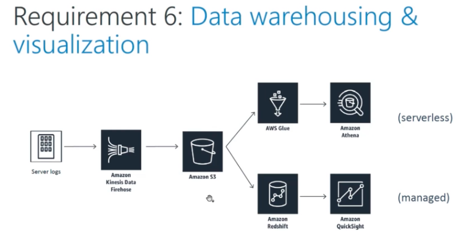

## **1、Create Redshift** 

> Rather than copy data from S3 to Redshift directly, **we will set Redshift Spectrum on AWS glue**, it can expose my S3 data to redshift spectrum

* Type: **dc2.large**
* Cluster identifier: **cadabra**
* Master user name: **awsuser**
* Master user password: **password**

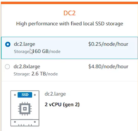

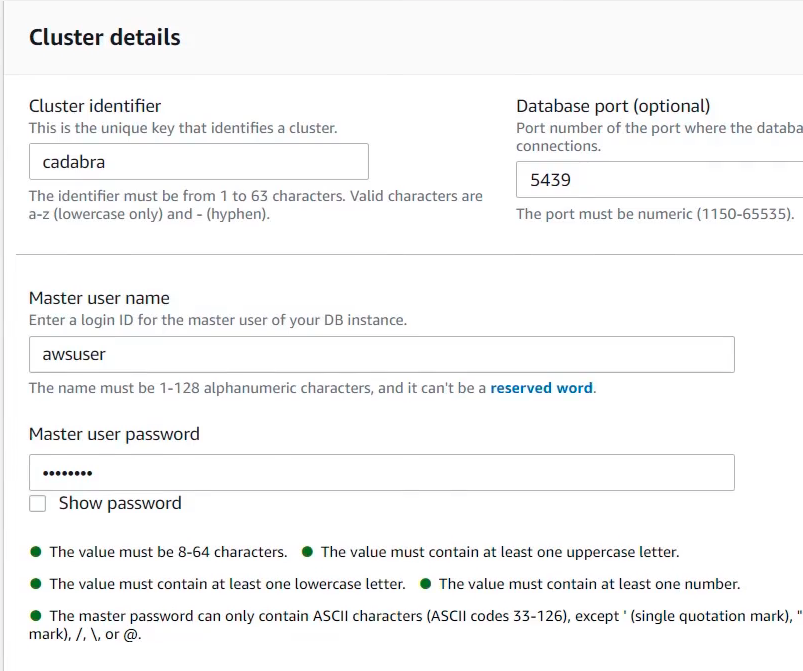

### **1-1 Create IAM role for Redshift**

* Name: **RedshiftSpectrum**
* Policy:
	* **AmazonS3ReadOnlyAccess**
	* **AWSGlueConsoleFullAccess**

Copy ARN:`arn:aws:iam::...:role/RedshiftSpectrum`

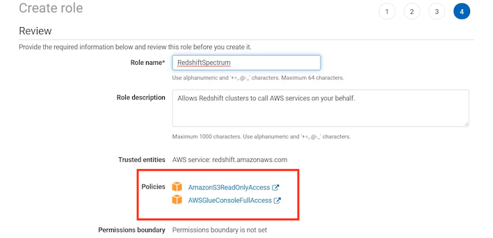

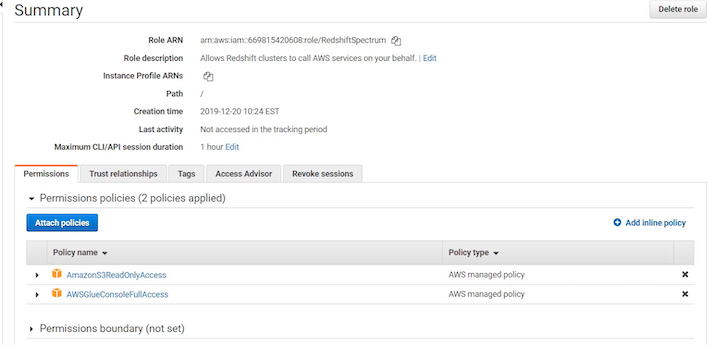

### **1-2 Enter IAM ARN**

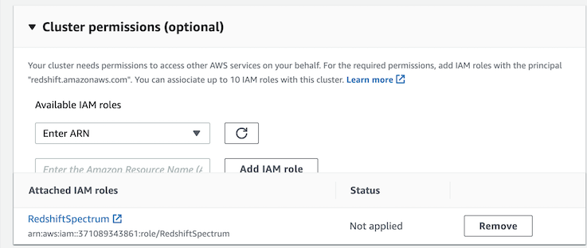

### **1-3 Use `default` configuration otherwise**

* Database name: **dev**


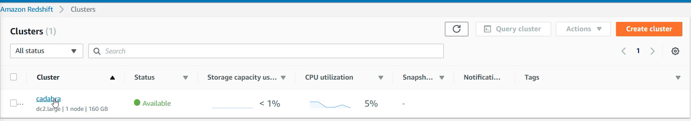


**Create Redshift**

## **2、Create Redshift schema from glue**

### **2-1 Connect to Redshift**

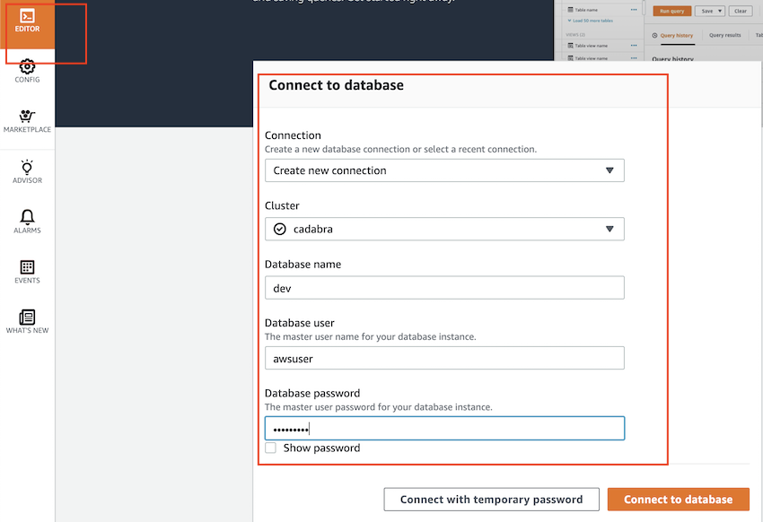

```
create external schema orderlog_schema from data catalog
database 'orderlogs'
iam_role 'arn:aws:iam:...:role/RedshiftSpectrum'
region 'us-east-2'
```

* glue database: **orderlogs**

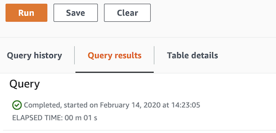

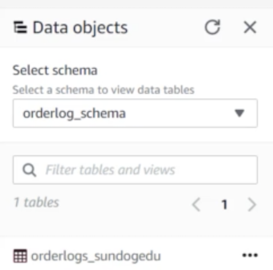

```
SELECT description,
         count(*)
FROM orderlog_schema.glue_orderlogs
WHERE country='France'
        AND year='2020'
        AND month='02'
```

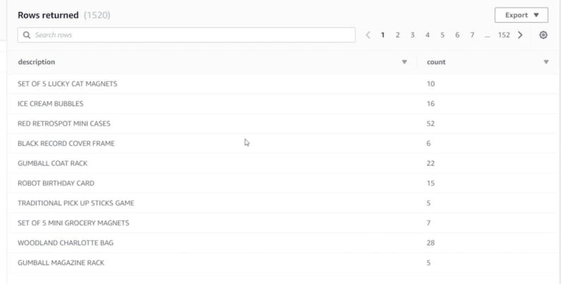