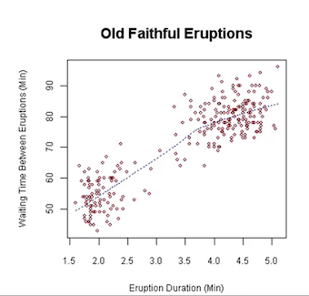
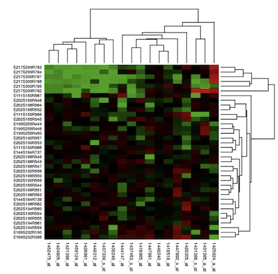
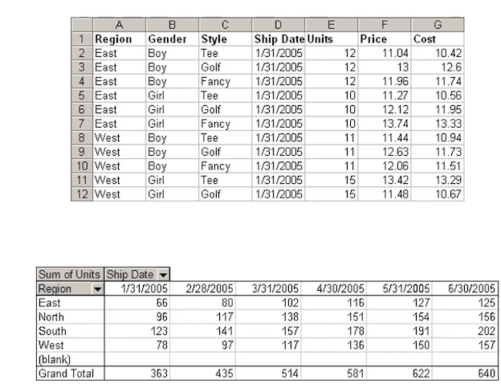

# **L1 Visualization**

## **1、Intro to Amazon Quicksight**

> Business analytics and visualization in the cloud 

### **1-1 What is QuickSight?** 

* Fast, easy, cloud-powered business analytics service 
* Allows all employees in an organization to: 
	* Build visualizations o Perform ad-hoc analysis 
	* Quickly get business insights from data 
	* Anytime, on any device (browsers, mobile) 
* Serverless 

### **1-2 QuickSight Data Sources** 

* Redshift 
* Aurora / RDS 
* Athena 
* EC2-hosted databases (communicate through JDBC or ODBC) 
* Files (S3 or on-premises) 
	* Excel
	* CSV, TSV 
	* Common or extended log format
	
**Limited ETL Example**

* Change column names for CSV file during the data preparation stage. 
* Add calculated files issuing SQL queries to transform your data 
* Change the data types that were imported before visualize it.  

**QuickSight is that it's not just sitting on top of data and analyzing it through some JDBC interface. It's actually importing your data sets into an engine that it calls** 

### **1-3 SPICE (Superfast parallel in memory calculation engine)** 

* Data sets are imported into **SPICE**  
	* Super-fast, Parallel, In-memory Calculation Engine 
	* Uses columar storage, in-memory, machine code generation 
	* Accelerates interactive queries on large datasets 

* Each user gets 10GB of SPICE 
* Highly available / durable
* Scales to hundreds of thousands of users 

### **1-4 QuickSight Use Cases** 

* Interactive ad-hoc exploration Rtaa gallon of data 
* Dashboards and KPI's 
* Stories 
	* Guided tours through specific vierws of an analysis
	* Convey  key poinys, thought process, evolution of any analysis

* Analyze / visualize data from: 
	* Logs in S3 
	* On-premise databases 
	* AWS (RDS, Redshift, Athena, S3) 
	* SaaS applications, such as Salesforce 
	* Any JDBC/ODBC 

### **1-5 QuickSight Anti-Patterns** 

* Highly formatted canned reportsries, analysis, and visualization 
	* QuickSight is for ad hoc que  
* ETL 
	* Use Glue instead, although QuickSight can do some transformations
	* Apache Spark. 

### **1-6 QuickSight Security** 

* Multi-factor authentication(MFA) on your account 
* VPC connectivity 
	* Add Quic Sight's IP address ranee to your database securit groups •
	* Row-level security(RLS) 
* Private VPC access 
	* Elastic Network Interface(ENI)AWS Enterprise Edition

### **1-7 Row-level security(RLS)** 

* QuickSight data set owners to control access to data at **row granularity based on permissions** associated with the user interacting with the data 
* RLS or role level security QuickSight users **only need to manage a single set of data and apply appropriate row level data set rules to it**. 

### **1-8 QuickSight User Management** 
 

* Users defined via IAM or email signup 
* Active Directory integration with QuickSight Enterprise Edition 

## **2、Quicksight Pricing and Dashboards; ML Insights** 

### **2-1 QuickSight Pricing** 

* Annual subscription 
	* Standard: `$9 / user /month`
	* Enterprise: `$18 / user / month `

* **Extra SPICE capacity** (beyond 10GB) 
	* `$0.25 (standard) $0.38 (enterprise) / GB / month`

* Month to month 
	* Standard: `$12 / GB / month` 
	* Enterprise: `$24 / GB / month` 

* Enterprise edition 
	* Encryption at rest 
	* Microsoft Active Directory integration 

### **2-2 QuickSight Dashboard** 

### **2-3 Quicksight Machine Learning Insights** 

* ML-powered anomaly detection 
	* Uses Random Cut Forest 
	* **Identify top contributors to significant changes in metrics automatcally**
	* Automatically find ourliers in dataset and identify what those are 

* ML-powered forecasting 
	* **Also uses Random Cut Forest**
	* **Detects seasonality and trends** 
	* Excludes outlier and imputes missing values
	* Using machine learning it can take an incomplete or a messy data set and still forecast that while still preserving seasonal trends 

* Autonarratives 
	* Adds "story of your data" to your dashboards 
	* Translate your data into plain English

* Suggested Insights 
	* "Insights" tab displays read-to-use suggested insights
	* Tell you which of these machine learning features might be relevant to your dataset 

## **3、Choosing Visualization Types**

### **3-1 QuickSight Visual Types**

* AutoGraph 
* Bar Charts 
	* For comparison and distribution (histograms) 
	* histograms 

* Line graphs 
	* **For changes over time** 

* Scatter plots, heat maps
	* **For correlation** 
 
* Pie graphs, tree maps 
	* For aggregation

* Pivot tables 
	* **For tabular data** 

* Stories 
	* **Stories create a narrative basically by presenting iterations of analysis** 
	* Construct Stories by capturing and annotating specific states of your analysis. 

### **3-2 Additional Visual Types**

* KPIs (key performance indicators) 
* Geospatial Charts (maps) 
* Donut Charts 
* Gauge Charts 
* Word Clouds 
	* Sum of Pop by State and State 

### **3-3 Bar Charts comparison and distribution** 

The idea of a histogram is that you bucket up your data into certain ranges. 

### **3-4 Line graphs: For changes over time** 

Trends over time 

**Area Charts** 

Two dimensions of data there u cal yo can actually visualize that using colors underneath the line of your line chart as well that's led an area **chart**. 

### **3-5 Scatter plots: correlation** 

### **3-6 heat maps: correlation**

The difference between **Scatter plots and heat maps** is that **each cell is colored based on the value of the data in that cell**. 

### **3-7 Pie graphs: aggregation** 

what different categories 

### **3-8 Additional Visual Types** 

* KPIs 
* Geospatial Charts (maps) 
* Donut Charts 
* Gauge Charts 
* Word Clouds 

### **3-9 Donut Charts: Percentage of Total mount**

**Represent the percentage of a given thing to sum total amount**. Similar to pie charts. 

### **3-10 Gauge Charts: Compare values in a measure**

It displays how much there is of the thing you are measuring. 

* Fuel in a tank 
* Bandwidth usage out of available bandwidth 

### **3-11 Tree Maps: Heirarchical Aggregation** 

* Allows you to visualize data in a hierarchical way whereas you have this sort of top level view of different categories 
* Different rectangles within that view reflecting how that is broken down further within subcategories within that category. 

This tree map we have these sort of colored blocks that correspond to broader 

categories of exports for this country and within each color 

### **3-12 Pivot tables For tabular data**

### **3-13 KPIs: Visualize some key value compared to its target value** 

### **3-14 Geospatial Charts (map)**

 

### **3-15 Word Clouds: wordor phase frequency**

 

## **4、Other Visualization Tools (HighCharts, D3,etc)**

### **4-1 Alternative Visualization Tools** 

* Web-based visualizations tools (deployed to the public and javascript libraries) 
	* D3.js 
	* Chart.js 
	* Highchartjs 

* Business Intelligence Tools(**integrate with any JDBC or ODBC database on the back end**) 

* Tableau 
* MicroStrategy 
* Top of redshift alternative to QuickSight 

### **4-2 D3.js**

 
D3 stands for **data driven documents** `D3.js` is a javascript library which is used for manipulating documents based on data. Its a dynamic interactive and online data visualization framework. 

### **4-3 Chart.js**
 
Community maintained open source library which helps easily visualize data using JavaScript. 

### **4-4 Highchart.js**

It is interactive and provides interactive charting capabilities to your web applications including line charts, spline charts, area charts, bar charts, pie charts 

* **Javascript libraries** intended to be deployed to the public. 
* **QuickSight intended to be deployed to users of your organization or people within your organization**. 

