# **L1 Security - Encryption**

## **1、AWS Security & Encryption** 

> KMS, Encryption SDK, SSM Parameter Stogy 

### **1-1 Why encryption? Encryption in flight (SSL)** 

* Data is encrypted before sending and decrypted after receiving 
* **SSL certificates help with encryption (HTTPS)** 
* Encryption in flight ensures no **MITM** (man in the middle attack) can happen 

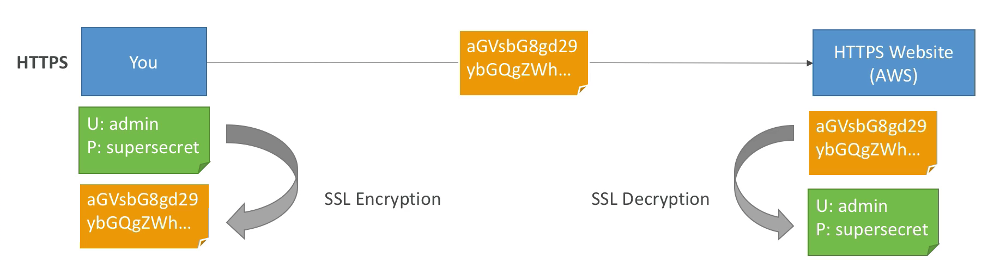

### **1-2 Why encryption? Server side encryption at rest** 

* Server side manages encryption and the decryption
* **Data is encrypted after being received by the server** 
* **Data is decrypted before being sent** 
* It is stored in an encrypted form thanks to a key (usually a **data key**)
* The encryption / decryption keys and object must be managed somewhere and the server must have access to it 

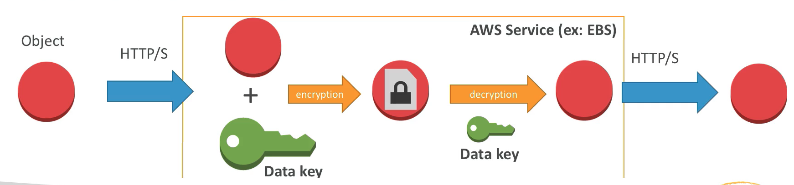

* **The encryption and the encryption keys must be managed somewhere usually called a KMS(Key Management Service)**
* The server must have the right to talk to that KMS.

### **1-3 Why encryption? Client side encryption**

* **Data is encrypted by the client and never decrypted by the server**
* **Data will be decrypted by a receiving client** 
* The server should not be able to decrypt the data 
* Could **leverage Envelope Encryption** 

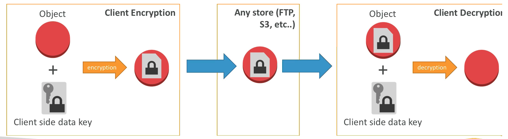

**Not using any KMS**

## **2、S3 Encryption (Reminder)**

### **2-1 S3 Encryption for Objects** 

* There are 4 methods of encrypting objects in S3 
* **`SSE-S3`**: Encrypts S3 objects using **keys handled & managed by AWS** 
* **`SSE-KMS`**: **Leverage AWS Key Management Service to manage encryption keys** 
* **`SSE-C`**: When you want to manage your own encryption keys 
* **Client Side Encryption** 

**It's important to understand which ones are adapted to which situation for the exam**

### **2-2 SSE-S3** 

* **SSE-S3: encryption using keys handled & managed by AWS S3**
* Object is encrypted server side 
* **AES-256 encryption type** 
* Must set header: **`"x-amz-server-side-encryption": "AES256"`** when you send your data to Amazon

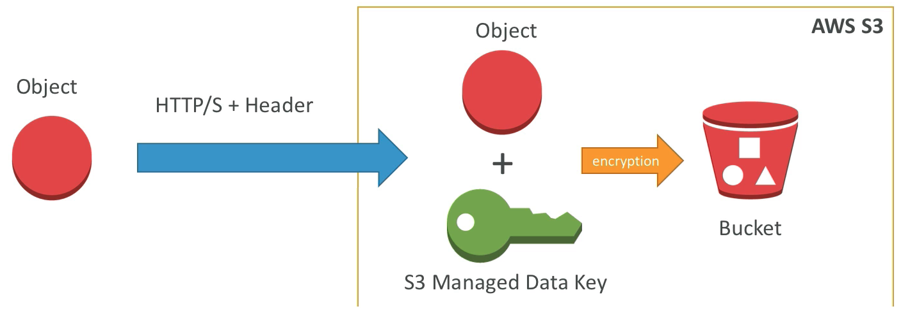

### **2-3 SSE-KMS** 

* SSE-KMS: encryption using keys handled & managed by KMS 
* KMS Advantages: **user control + audit trail** 
* Object is encrypted server side
* Must set header: **`"x-amz-servereside-encryption":"aws:kms"`**

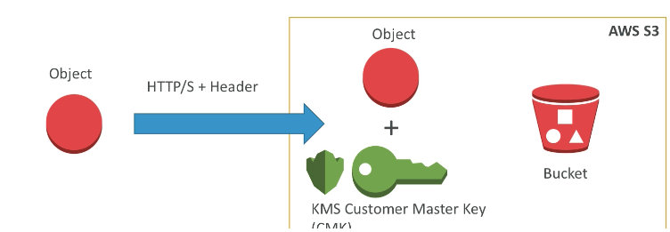

The difference between **SSE-S3** and **SSE-KMS** is that the key that is used is a **KMS customer master key(CMK) that you can manage over time** while **SSE-S3** using keys handled & managed by AWS S3

### **2-4 SSE-C** 

* SSE-C: **server-side encryption using data keys fully managed by the customer outside of AWS** 
* Amazon **S3 does not store the encryption key you provide** 
* **HTTPS must be used** 
* **Encryption key must provided in HTTP headers, for every HTTP request made **

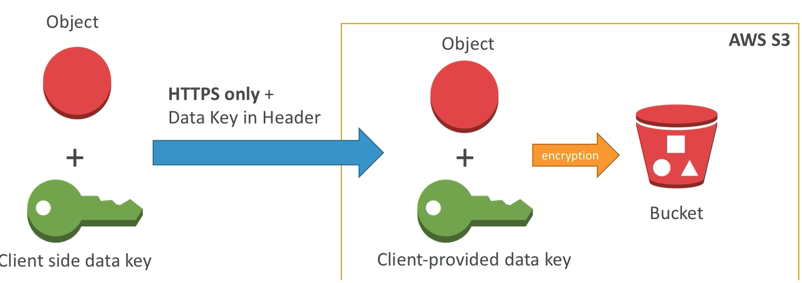

### **2-5 Client Side Encryption** 

* Client library such as the **Amazon S3 Encryption Client** 
* **Clients must encrypt data themselves before sending to S3** 
* **Clients must decrypt data themselves when retrieving from S3** 
* **Customer fully manages the keys and encryption cycle** 

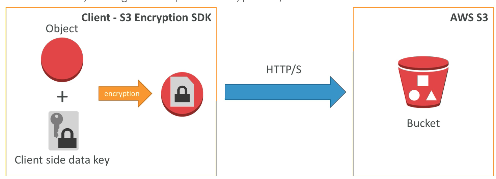

### **2-6 Encryption in transit (SSL)** 

* AWS S3 exposes: 
	* HTTP endpoint: non encrypted 
	* **HTTPS endpoint: encryption in flight**
	 
* You're free to use the endpoint you want, but HTTPS is recommended 
* **HTTPS is mandatory for SSE-C**
* **Encryption in flight is also called SSL /TLS** 

### **2-7 S3 encryption Example**

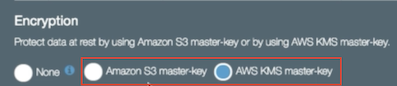

## **3、KMS Overview**

### **3-1 AWS KMS (Key Management Service)** 

* Anytime you hear	 "encryption" for an AWS service, it's most likely **KMS** 
* **Easy way to control access to your data, AWS manages keys for us** 
* Fully integrated with IAM for authorization 
	* Seamlessly integrated into: 
		* Amazon EBS: encrypt volumes 
		* Amazon S3: Server side encryption of objects 
		* Amazon Redshift: encryption of data 
		* Amazon RDS: encryption of data 
		* Amazon SSM: Parameter store 
		* Etc... 
* But you can also use the CLI / SDK 

### **3-2 AWS KMS 101** 

* Anytime you need to share sensitive information... use KMS 
	* Database passwords 
	* Credentials to external service 
	* Private Key of SSL certificates 
* The value in KMS is that the **CMK used to encrypt data can never be retrieved by the user**, and **the CMK can be rotated for extra security**
* **Never ever store your secrets in plaintext, especially in your code!** 
* Encrypted secrets can be stored in the code / environment variables 
* **KMS can only help in encrypting up to 4KB of data per call** 
* If `data > 4 KB`, use **envelope encryption**
* To give access to KMS to someone: 
	* **Make sure the Key Policy allows the user** 
	* **Make sure the IAM Policy allows the API calls** 

**Envelope Encryption:**

Basically will generate a new data key and that that key will be used to encrypt the big data sets.

### **3-3 AWS KMS (Key Management Service)** 

* Able to fully manage the keys & policies: 
	* Create 
	* Rotation policies 
	* Disable 
	* Enable 
* **Able to audit key usage (using CloudTrail)** 
* Three types of Customer Master Keys (CMK):
	* AWS Managed Service **Default CMK: free** 
	* **User Keys created in KMS: `$1 / month`** 
	* **User Keys imported** (must be 256-bit symmetric key): **`$1 / month`** 
* `+` pay for API call to KMS (`$0.03 / 10000 calls`) 

### **3-4 How does KMS work? API - `Encrypt` and `Decrypt`**

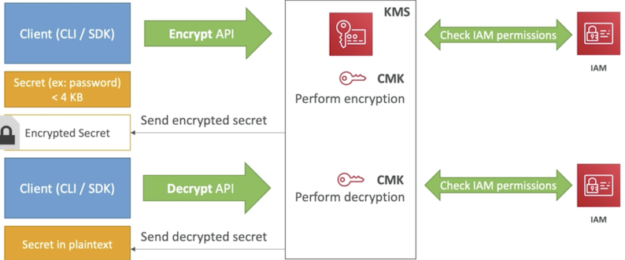

1. Encrypted API that within the KMS service check the CMK 
2. **IAM permission check**: User allowed to do this CMK encrypt call within IAM.
3. Encryption happens by CMK and then KMS will send back the encrypted secrets. (**never seen the CMK**)
4. use the CLI or the SDK again issue a decrypt API call and using the **same CMK** it again
5. KMS will check the information for **decrypt access** and **key policy**.
6. Decryption happen and send back the decrypted secrets in plaintext.

### **3-5 Encryption in AWS Services** 

* Requires migration (through Snapshot / Backup): 
	* EBS Volumes 
	* RDS databases 
	* ElastiCache 
	* EFS network file system 

* **In-place encryption**(Only One): 
	* S3 

### **3-6 Cloud HSM (Hardware Security Module)**

* **KMS => AWS manages the software for encryption** 
* CloudHSM => **AWS provisions encryption hardware** 
* Dedicated Hardware (**HSM = Hardware Security Module**) 
* You manage your own encryption keys entirely (not AWS) 
* The CloudHSM hardware device is tamper resistant 
* FIPS 140-2 Level 3 compliance 
* CloudHSM clusters are spread across multi AZ (HA) 
* Supports both **symmetric** and **asymmetric** encryption (SSL/TLS keys) 
* **No free tier available** 
* Must use the **CloudHSM Client Software** 
	* Not as easy as the KMS API call with the CLI.	
### CloudHSM Diagram

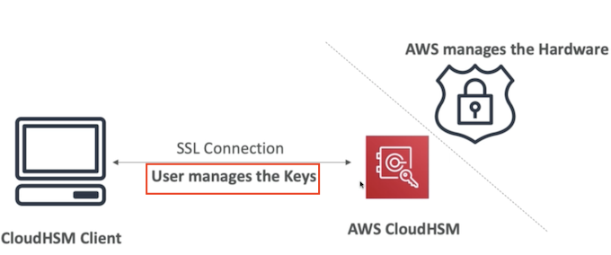

> Exam

* **Dedicated encryption hardware**
* Control over the **user keys** but still be in **AWS's cloud**
* Have **asymmetric type of encryption**

### CloudHSM VS KMS

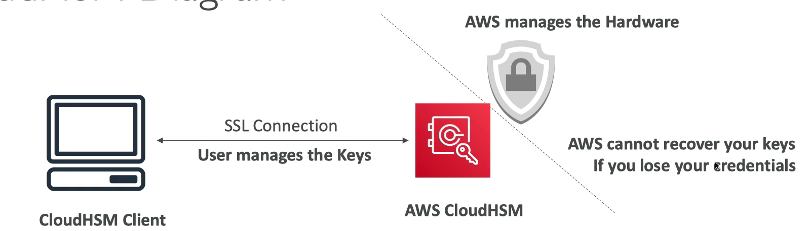

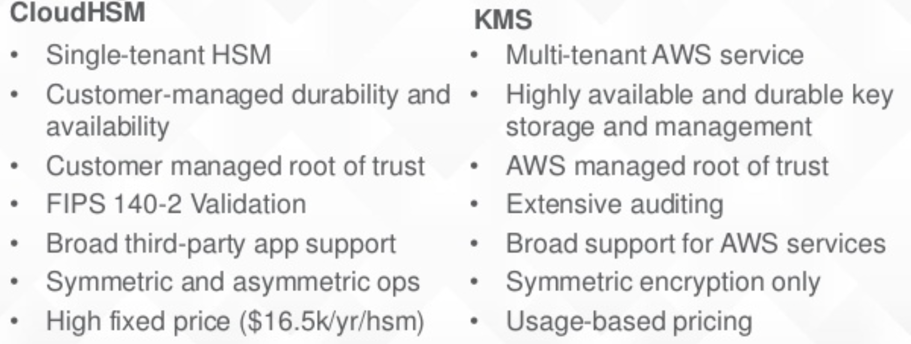