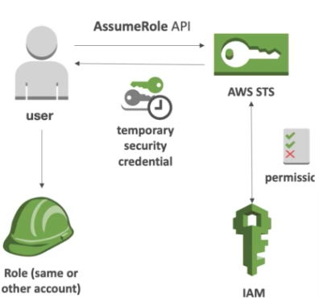
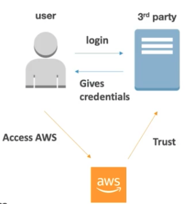
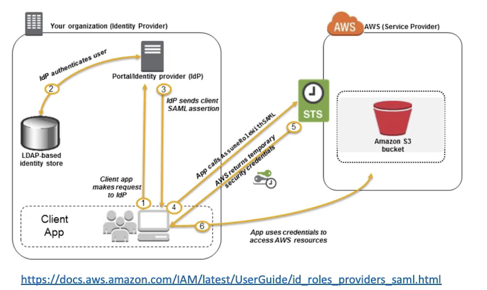
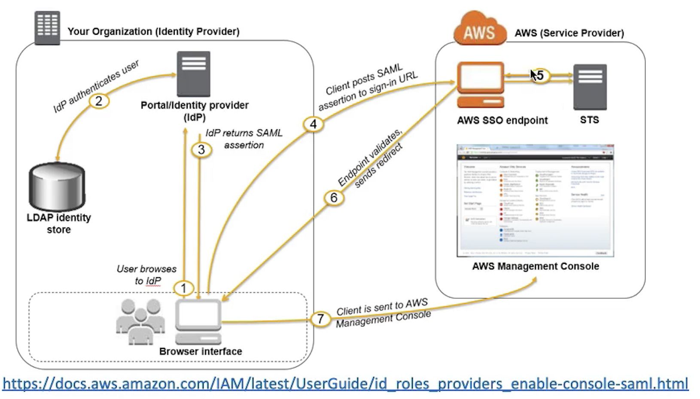
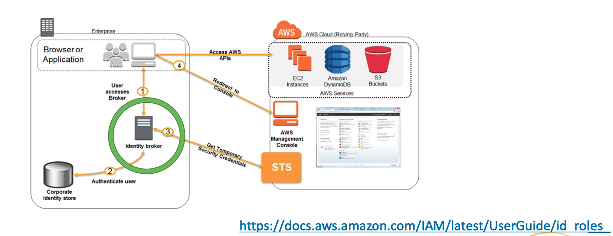
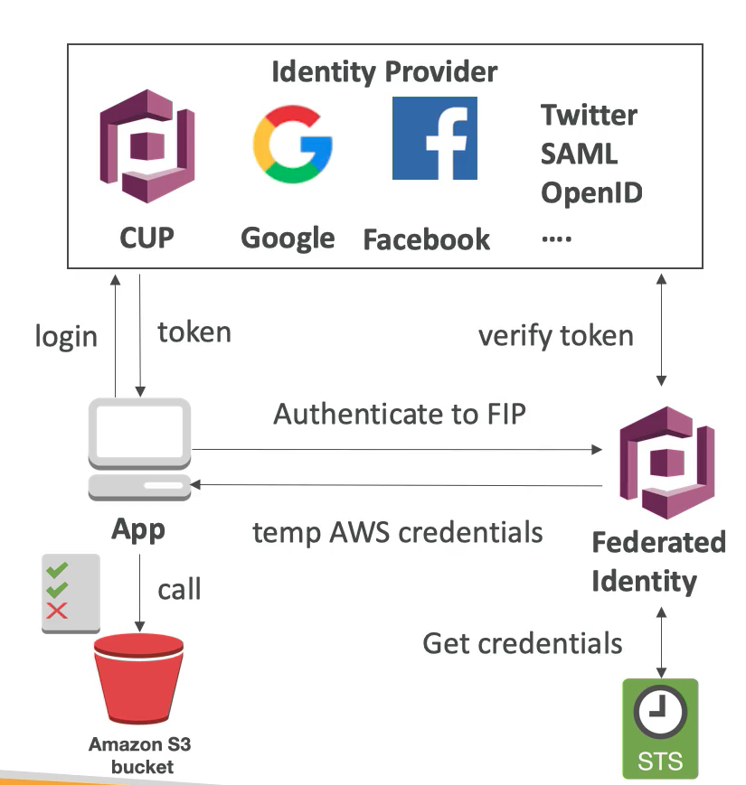

# **L3 Account and Identity Federation**

## **1、STS and Cross Account Access**

### **1-1 AWS STS(Security Token Service)** 

* **Allows to grant limited and temporary access to AWS resources** 
* **Token is valid for up to one hour** (must be refreshed) 
* **Cross Account Access** 
	* **Allows users from one AWS account access resources in another** 
* **Federation (Active Directory)** 
	* **Provides a non-AWS user with temporary AWS access by linking users Active Directory credentials** 
	* Uses SAML (**Security Assertion markup language**) 
	* Allows **Single Sign On (SSO)** which enables users to log in to AWS console without assigning IAM credentials 
* **Federation with third party providers / Cognito** 
	* Used mainly in web and mobile applications 
	* Makes use of Facebook/Google/Amazon etc to federate them 

### **1-2 Cross Account Access** 

* Define an **IAM Role for another account to access** 
* Define **which accounts can access this IAM Role** 
* Use AWS STS (Security Token Service) to retrieve credentials and impersonate the IAM Role you have access to (**AssumeRole API**) 
* Temporary credentials can be valid **between 15 minutes to 1 hour** 

**As a user access a role either in the same account or in another account.**

1. Assume role API on STS.
2. Check the IAM permissions 
3. **Send back temporary security credentials**
4. **These security credentials will basically allow to impersonate that role that you wanted to assume.**

## **2、Identity Federation**

### **2-1 What's Identity Federation?** 

* **Federation lets users outside of AWS to assume temporary role for accessing AWS resources.** 
* These users assume identity provided access role. 
* **Federation assumes a form of 3rd party authentication** 
	* LDAP 
	* Microsoft Active Directory (~= SAML) 
	* Single Sign On 
	* Open ID 
	* Cognito 
* **Using federation, you don't need to create IAM users (user management is outside of AWS)** 

1. Company User or mobile app user without account in AWS
2. Access to third party servers for login.
3. The third party is trusted by AWS 
4. Third party  give back credentials with **temporary to access AWS through the console or the API**.

### **2-2 SAML Federation For Enterprises** 

* **To integrate Active Directory / ADFS with AWS (or any SAML 2.0)**
* **Provides access to AWS Console or CLI (through temporary creds)**
* No need to create an IAM user for each of your employees 

1. Client app within our organization make request to identity provider IDP which is SAML compliant(Microsoft active directory or user database)
2.  Authenticated to this IDP the IDP will send back a SAML assertion(SAML assertion is a token)
3. Automatically call assume a role with SAML to STS which is special API on STS.
4. STS recognizes this SAML assertion give us back temporary security credentials which  is traded from SAML assertion
5. With the security credentials we can for example access AWS normally

### **2-3 Console based access**

1. Access the portal of identity provider and get it authenticated.
2. IDP will return a SAML assertion.
3. Use that SAML assertion directly to sign it into the AWS SSL end points
4. AWS SSL end points talks to STS.
5. Get validated and SAML is traded for STS
6. Get redirected to the AWS management console.
 

### **2-4 `Custom Identity Broker` Application <mark>For Enterprises</mark>  (Don't have a SAML 2.0)**

* Use only if identity provider is not compatible with SAML 2.0 
* **The identity broker must determine the appropriate IAM policy** 
* **Exact same principles as SAML but it's not SAML with more manual work** 

1. **Users browser or application will access our identity broker**
2. Identity broker is something that we have to program
3. **Identity broker will validate identity with maybe a corporate identity store authenticated** 
4. **Superuser can ask from STS any security credentials for any policy**
5. It's up to the identity broker to really test tailor a policy just for the user that was connected.
6. **It goes to STS makes a query request for separate for security credentials the security credentials come back they're given to our users**

### **2-5 AWS Cognito Federated Identity Pools <mark>For Public Applications</mark>**

* Goal: 
	* Provide direct access to AWS Resources from the Client Side 

* How: 
	* Log in to federated identity provider or remain anonymous 
	* Get temporary AWS credentials back from the Federated Identity Pool
	* These credentials come with a pre-defined IAM policy stating their permissions 

* Example: 
	* provide (temporary) access to write to S3 bucket using Facebook Login 

* Note: 
	* **Web Identity Federation is an alternative to using Cognito but AWS recommends against it**

> Example:

**Provide temporary access to write to S3 Buckets maybe using of a Facebook plugin**

1. **App is directly connected to our identity provider(User pool, Google, Facebook, Twitter, SAML, OpenID)**
2. App logs in to our identity provider and gets a token back
3. App talk to the federated identity provider in Cognito trading that token.
4. **Verified by the identity provider and then the identity provider will get credentials from STS** 
5. The identity the federated identity on Cognito will send us back a temporary AWS credentials.
6. **Using these credentials can directly talk to our S3 Buckets** 

