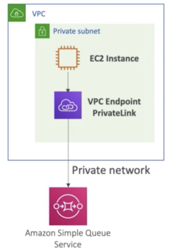
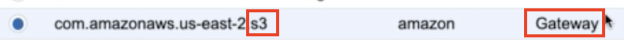
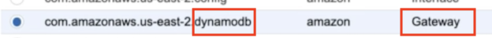

# **L4 Polices, CloudTrail & VPCe**


## **1、Policies - Advanced**

### **1-1 Policies — leveraging AWS variables**


[https://docs.aws.amazon.com/IAM/latest/UserGuide/reference_policies_variables.html](https://docs.aws.amazon.com/IAM/latest/UserGuide/reference_policies_variables.html)

* `${aws:usemame}` :to restrict users to tables / buckets  
* `${aws:principattype}` : account user, federated, or assumed role 
* `${aws:PrincipalTag/department}` :to restrict using Tags 

[https://docs.aws.amazon.com/IAM/latest/UserGuide/reference_policies_iam-condition-keys.html#condition-keys-wif](https://docs.aws.amazon.com/IAM/latest/UserGuide/reference_policies_iam-condition-keys.html#condition-keys-wif)


* `${aws:FederatedProvider}` : which IdP was used for the user (Cognito, Amazon.) 
* `${www.amazon.com:user_id}` , `${cognito-identity.amazonaws.com:sub}` 
* ` ${saml:sub}`, `${sts:Externalld}` 


### **1-2 Policies - Advanced**

 
For S3 - let's analyze the policies at

[https://docs.aws.amazon.com/AmazonS3/latest/dev/example-bucket-policies.html](https://docs.aws.amazon.com/AmazonS3/latest/dev/example-bucket-policies.html)


For DynamoDB — let's analyze the policies at: 

[https://docs.aws.amazon.com/amazondynamodb/latest/developerguide/specifying-conditions.html](https://docs.aws.amazon.com/amazondynamodb/latest/developerguide/specifying-conditions.html)


**Note for RDS — IAM policies don't help with in-database security, as it's a proprietary technology and we are responsible for users & authorization** 


## **2、CloudtTrail**


### **2-1 AWS CloudTrail**

*  Provides governance, compliance and audit for your AWS Account •
*  CloudTrail is enabled by default! 
*  Get an history of events / API calls made within your AWS Account by: 
	*  Console 
	*  SDK 
	*  CLI 
	*  AWS Services 

* Can put logs from CloudTrail into CloudWatch Logs 
* **If a resource is deleted in AWS, look into CloudTrail first!** 
* **CloudTrail shows the past 90 days of activity**
* The default UI only shows "Create","Modify" or "Delete" events 
* **CloudTrail Trail**: 
	* Get a detailed list of all the events you choose 
	* Ability to store these events in S3 for further analysis 
	* Can be region specific or global 

* CloudTrail Logs have SSE-S3 encryption when placed into S3 
* Control access to S3 using IAM, Bucket Policy, etc... 


```
data "aws_caller_identity" "current" {}
resource "aws_s3_bucket" "cloudtrail_bucket" {
  bucket = "jam-${terraform.workspace}-cloudtrail-logs"
  region = var.region

  lifecycle_rule {
    enabled = true
    id      = "jam-awsorgcloudtrail-rule"

    tags = {
      "rule"       = "cloudtrail-rule"
      "autoclean"  = "true"
      "department" = "jam"
      "team"       = "devops"
      "purpose"    = "cloudtrail"
      "env"        = "${terraform.workspace}"
    }

    transition {
      days          = 60
      storage_class = "STANDARD_IA"
    }

    transition {
      days          = 90
      storage_class = "GLACIER"
    }

    expiration {
      days = 180
    }

  }

  tags = {
    "department" = "jam"
    "team"       = "devops"
    "purpose"    = "cloudtrail"
    "env"        = "${terraform.workspace}"
  }

  policy = <<POLICY
{
    "Version": "2012-10-17",
    "Statement": [
        {
            "Sid": "AWSCloudTrailAclCheck20150319",
            "Effect": "Allow",
            "Principal": {"Service": "cloudtrail.amazonaws.com"},
            "Action": "s3:GetBucketAcl",
            "Resource": "arn:aws:s3:::jam-${terraform.workspace}-cloudtrail-logs"
        },
        {
            "Sid": "AWSCloudTrailWrite20150319",
            "Effect": "Allow",
            "Principal": {"Service": "cloudtrail.amazonaws.com"},
            "Action": "s3:PutObject",
            "Resource": "arn:aws:s3:::jam-${terraform.workspace}-cloudtrail-logs/AWSLogs/${data.aws_caller_identity.current.account_id}/*",
            "Condition": {"StringEquals": {"s3:x-amz-acl": "bucket-owner-full-control"}}
        }
    ]
} 
POLICY
}

resource "aws_s3_bucket_public_access_block" "cloudtrail_bucket" {

  bucket              = aws_s3_bucket.cloudtrail_bucket.id
  block_public_acls   = true
  block_public_policy = true
  
}

resource "aws_cloudtrail" "jam_cloudtrail" {
  name                          = "jam-${terraform.workspace}-cloudtrail"
  s3_bucket_name                = aws_s3_bucket.cloudtrail_bucket.id
  include_global_service_events = true
  is_multi_region_trail         = true
  tags = {
    "department" = "jam"
    "team"       = "devops"
    "env"        = "${terraform.workspace}"
    "owner"      = "jam-devops"
    "region"     = "gloabl"
  }

  event_selector {
    read_write_type           = "All"
    include_management_events = true
    data_resource {
      type   = "AWS::S3::Object"
      values = ["arn:aws:s3:::"]
    }
  }
}
```

## **3、VPC Endpoints**


* Endpoints allow you to connect to AWS Services using a private network instead of the public www network 
*  They scale horizontally and are redundant •
*  **They remove the need of IGW, NAT, etc**. to access AWS Services 
* **Gateway** provisions a target and must be used in a route table 
	* **ONLY S3 and DynamoDB** 

* **Interface: provisions an ENI** (private IP a mss as an entry point must attach security group) — **most AWS services Also called VPC PrivateLink** 








