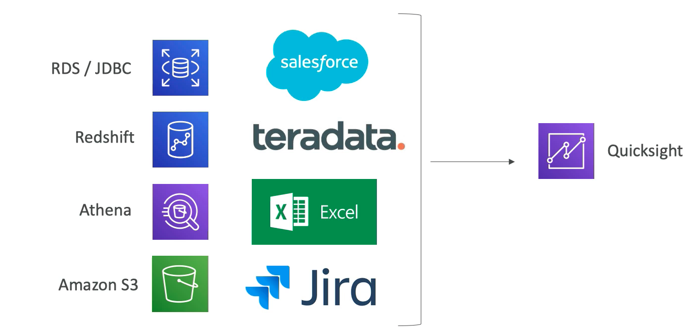

# **L1 AWS Bigdata Integration**

## **1、IoT**

IoT rules actions have amount variety of destinations **Kinesis, DynamoDB, SQS, SNS, S3, Lambda and so many others.**

## **2、Kinesis Data Stream**

### **2-1 Producer side**

* SDK, Kinesis producer library, Kinesis agents
* Third party libraries
	* Apache Spark
	* Apache Kafka

### **2-2 Consumers**

* Kinesis consumer library
* SDK
* Firehose
* AWS lambda
* Kinesis connector library
* Apache Spark

## **3、Kinesis Data Firehose**

### **3-1 Source**

* SDK Kinesis producer library)
* Kinesis agent
* Kinesis Data Streams
* Cloudwatch logs and events
* IoT rules actions

### **3-2 Data transformation**

AWS lambda functions do **transformation on top of the data.**

### **3-3 Destinations**

* Amazon S3
* Redshift
* Elasticsearch
* Splunk 

## **4、Kinesis Data Analytics**

### **4-1 Data sources**

* Real time Kinesis data streams 
* Kinesis data firehose
* Reference data in JSON or CSV formats directly from S3.

**Pre-process the data with AWS lambda so transform the records before doing some analytics.**

### **4-1 Result of the continuous running analytic queries Exp. SQL into** 

* Kinesis data streams
* Kinesis data firehose
* AWS lambda function
	* Exp. **notification**

## **5、SQS**

### **5-1 sources**

* AWS SDK deploy onto a server or EC2, ECS
* Rules engine on IoT core
* S3 event, like new files to S3

### **5-2 Destinations**

* Application on the server such as EC2 or you can use AWS
* Lambda functions to directly process events from SQS.

## **6、S3**

### **6-1 Go to places for data**

*  **Snowball**, **snowball edge** to transport data from your on premise environment
* **Firehose** deliver data into S3
* **Redshift** offload it data into S3
* **Athena**: **queries from** and **writes data** to S3
* **Data pipeline**:  Move data into S3
* **IoT core** is a direct rule that integrates with S3
* **Database migration service**: Source data from postgres and write it down to S3
* **EMR will use S3 as its own backend** if we use **EMRFS**
* **Glue** use S3 as a target

### **6-2 S3 integrate with**

* to **lambda function**
* to an **SQS queue**
* to an **SNS topic**

## **7、DynamoDB**

* Client SDK to write data 
* Database migration service(DMS) transfer data from MySQL into DynamoDB
* AWS data pipeline want to a batch running ETL
* **DynamoDB streams**: Chain of streams from DynamoDB 
	* integrated directly with AWS Lambda functions.
	* Kinesis client library with the DynamoDB adaptor 
* Glue:
	* Get all the **tables metadata information** directly into its **data catalog**
* **EMR can read from DynamoDB using hive** 
	* **Hive can basically scan entire DynamoDB table before doing a query**. 

	
## **8、Glue**

<mark>**A metadata service collection as ETL**</mark>

### **8-1 Sources**

* DynamoDB
* Amazon S3
* JDBC based.
	* RDS databases on premise database
	* Database in the cloud

**Glue crawlers to crawl these data sources retrieve the schema retrieve the table names all that stuff**

**Glue data catalog can be used by different technologies to basically query data.**

* **Redshift spectrum to query data directly on S3**
* Athena as well to create it on S3
* **EMR plus hive** know where it can store source data

## **9、EMR**

**EMR is a lot of things, it's Hadoop, spark, hive, pig, presto, Apache HBase, Jupiter, Zeppelin, Flink.**

* Glue data catalog to know what to query
* Amazon S3 using EMRFS and maybe using the consistent view on S3.
* DynamoDB where hive can scan an entire DynamoDB table for its query.
* Apache ranger on EC2 for advanced model for controlling user access into our EMR cluster

## **10、Amazon Machine Learning (ML) (Deprecated)**

### **10-1 Sources data** 

* Amazon S3 
* redshift

#### Exposes the output model as a prediction and **explicit prediction API** so we can basically throw some data at Amazon ML

## **11、Amazon SageMaker**

**Newer shiny Amazon machine learning service** 

* **Source only from S3**
* Tensorflow, pytorch, and mxnet or many other data machine learning framework for perform our data analysis or machine learning modelling.

## **12、AWS Data Pipeline**

**Moving data**

* Amazon S3
* JDBC for example RDS,
* EMR (hive)
* DynamoDB,
* basically or anything you want and can program

## **13、ElasticSearch Service**

* Kinesis data firehose
* **IoT core** has a rule to send data
* CloudWatch logs

**Kibana**

* IAM access integration 
* Cognito integration

## **14、Anthena**

* Query data only in S3
* Get a metadata information from the glue data catalogue
* QuickSight can use Athena as a database engine

## **15、Redshift**

* Copy load or unload data from and to through S3
* Redshift spectrum to basically query the data in S3(Dont touch data from S3)
* QuickSight query data warehouse in redshift
* Integration with PostgreSQL to replicate some data called **DBlink**

## **16、QuickSight**

* RDS or JDBC to connect to any database
* Redshift
* Amazon S3
* Salesforce, Teradata, Excel flat files, or JSON or CSV, Jira

