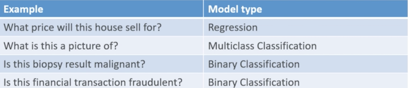
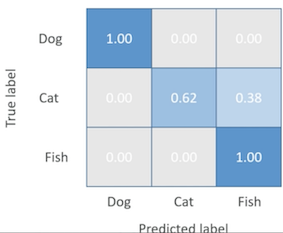
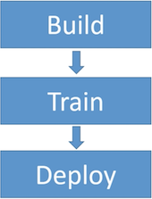
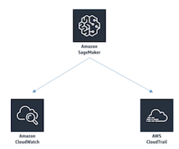

# **AWS Machine Learning （Amazon ML Service/Amazon SageMaker)**

##	**1、Machine Learning 101**

Amazon Machine Learning ML with **linear and logistic regression** 

### **1-1 Machine Learning 101**

* Machine learning systems predict some unknown property of an item, given its other properties 

**Examples:** 

* How much will this house sell for? 
* What is this a picture of? 
* Is this biopsy result malignant or benign? 
* Is this financial transaction fraudulent? 

### **1-2 Supervised Learning** 

Supervised machine learning systems are **trained** 

* The property we want to predict is called a **label** 
* Our **training data set** contains labels known to be correct, together with the other attributes of the data (i.e., known house sale price given its location, # of bedrooms, square feet, etc.) 
* This training data is used to build a model that can then make **predictions** of **unknown labels** 

### **1-3 Train / Test** 

* Your training data can be randomly split into a **training set** and a **test set** 
* **Only the training set is used to train the model** 
* **The model is then used on the test set** 
* We can then measure the **accuracy** of the predicted labels vs. their actual labels 

 

A popular one for example is **RMSE** or **root means squared error**.

## **2、Classification Models**

### **2-1 Types of models in Amazon ML**

 

* **Regression** means that **trying to predict some numerical value based on past trends. Trying to predict a specific number and that number has some sort of numeric meaning**.
	*  **Linear regression** for predicting **numbers**
	*  **Logistic regression** for predicting **categories**. 
* **Multi class classification** trying to classify something into one of many different buckets.
*  **Binary classification** binary referring to the fact that you just have two choices to choose from 

### **2-2 Confusion Matrix** 

**A way to visualize the accuracy of multiclass classification predictive models** 

 

So the way to interpret a confusion matrix by just looking at it is that a really perfect classifier will just have dark blue all the way down the diagonal here.

### **2-2 Hyperparameters** 

* Machine learning models often depend on tuning the parameters of the model itself 
	* **This is called hyperparameter tuning** 

* Parameters in Amazon ML include: 
	* Learning rate 
	* **Model size** 
	* Number of passes 
	* **Data shuffling** 
	* Regularization 

> **Learning rate** which is basically how quickly it moves from one iteration to the other.
> 
> **Whether or not the input data is shuffled or not** to sort of randomize things and try to eliminate any patterns that might be inherent in the order of the data you're feeding it 
> 
> **Regularization** means scaling the data to a common range as it goes in

## **3、Amazon ML Service**

 

### **3-1 Amazon Machine Learning (ML)**

* Provides visualization tools & wizards to make creating a model easy 
* **You point it to training data in S3, Redshift, or RDS** 
* It builds a model than can make predictions using batches or a low-latency API 
* Can do train/test and evaluate your model 
* Fully managed 
* **Honestly it's a bit outdated now**

### **3-2 "Ideal Usage Patterns"** 

* Flag suspicious transactions (fraud detection) 
* Forecasting product demand 
* Personalization — predict items a user will be interested in 
* Predict user activity (we'll do this) 
* Classify social media (does this Tweet require my attention?) 

### **3-3 Amazon ML: Cost Model** 

* "Pay for what you use" 
* Charged for compute time 
* Number of predictions 
* Memory used to run your model 
* Compute-hours for training 

### **3-5 Amazon ML: Promises & Limitations** 

* No downtime 
* Up to 100GB training data (more via support ticket) 
* Up to 5 simultaneous jobs (more via support ticket) 

### **3-6 Amazon ML: Anti-Patterns**

* Terabyte-scale data 
* Unsupported learning tasks
	* Sequence prediction 
	* Unsupervised clustering 
	* Deep learning 
* EMR / Spark is an (unmanaged) alternative. 

> Exam
> 
> Provide a machine learning solution that has terabytes or petabytes of training data **Amazon ML is not going to be the right answer for that**. 

## **4、Amazon SageMaker**

 

**SageMaker is a component of Amazon Web Services** and allows you to create **notebooks hosted on AWS** that can **train large scale models** in the cloud and then eent predictions from that model from the cloud as well.

* serious computing horsepower behind your machine learning system
* **Scales better than Amazon's ML service**
* More flexibility and more advanced and modern algorithms
* fully managed, SageMaker will manage your production compute infrastructure on your behalf to perform health check supply security patches and apply all the other routine maintenance

The way to use is to **write Python code in what's called a Jupiter notebook in order to use SageMaker**.

### **4-1 SageMaker Modules**

 

#### **4-1-1 Build Module**

Build module provides a hosted environment for working with your data. Experimenting with algorithms and visualizing your output.

This is where you're going to be working with fully managed instances running Jupiter notebooks for training data exploration and pre processing.

* These **Jupiter notebooks** that gonna be writing python code into build your model are preloaded with some pretty cool stuff such as **CUDA and CUDNN drivers for deep learning**. These drivers that allow to use the **GPU on the computers in your cluster to accelerate your neural networks**.
* Also includes a wide variety of **Anaconda packages** which are data science related to machine learning related packages for python and it also has libraries available for t**ensorflow, Apache MX net, pi torch, and chain**.
* SageMaker in the build stage also has available built in fully managed reinforcement learning algorithms in the academic literature. Offers broad framework support so you can actually test and prototype
* Download docker container to your local environment and work with that to actually develop your modules for SageMaker as well using the SageMaker Python sdk without actually being online. 

#### **4-1-2 Train Module**

**SageMaker Search** which allows you to quickly **find and evaluate the most relevant model training runs from potentially hundreds and thousands of your Amazon SageMaker model training job.**

#### **4-1-3 deploy module** 

Deploy module provides a managed environment for you to easily host and test your models that will make predictions securely and with low latency.

* There's a batch transform mode that allows you to run predictions on large or small batch data.
* **SageMaker enables you to deploy inference pipelines** so you can pass raw input data and execute pre processing predictions and post-processing on **real time** and **batch inference** requests as well.

#### **4-1-4 SageMaker Neo** 

SageMaker Neo that allows machine learning models to be trained once and run anywhere in the cloud and at the edge so you can actually push out your prediction models out to edge nodes

### **4-2 SageMaker is powerful** 

* Tensorflow 
* **Apache MXNet** 
* GPU accelerated deep learning 
* **Scaling effectively unlimited** 
* Flyperparameter tuning jobs 

### **4-3 SageMaker Security** 

* Code stored in "ML storage volumes" 
	* Controlled by security groups 
	* Optionally encrypted at rest 
* All artifacts encrypted in transit and at rest
* API & console secured by SSL 
* IAM roles 
* Encrypted S3 buckets for data 
* KMS integration for SageMaker notebooks, training jobs, endpoints 

### **4-4 SageMaker Operations**

 

* CloudWatch is used to monitor Amazon SageMaker which collects all the raw data and processes it into readable near real time metrics.
* CloudTrail records the history of your Amazon SageMaker API calls that were made on your account.

