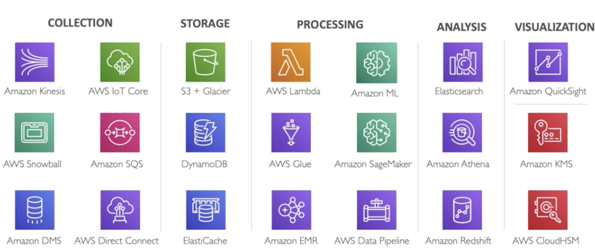
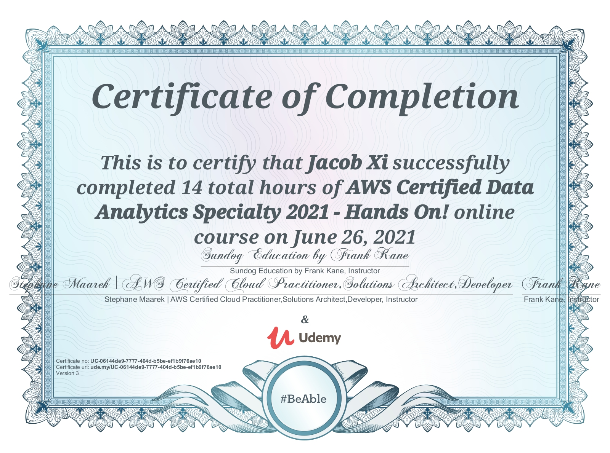
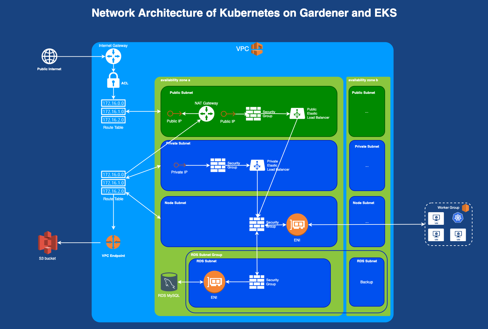

# **AWS Certified Data Analytics Tutorial**

> Started at May. 2021 By Jacob Xi 

## **About this tutorial**

 

This books is my 6th tech books published recently and my 1st English version tutorial book. And this book is my favorite and hard-working book so far. The weather is getting hotter and hotter☀️, thank you so much team colleagues' and friends' support and instruction. # Have to Keigo Higashino📚 is my favorite Japanese author， “The Miracles of the Namiya General Store” is one of my loving book

## **Description**

**The AWS Certified Data Analytics Specialty Exam is one of the most challenging certification exams you can take from Amazon**. Passing it tells employers in no uncertain terms that your knowledge of big data systems is wide and deep.

The world of data analytics on AWS includes a dizzying array of technologies and services. Just a sampling of the topics I cover in-depth are:

* Streaming massive data with **AWS Kinesis**
* Queuing messages with Simple Queue Service (**SQS**)
* Wrangling the explosion data from the **Internet of Things (IOT)**
* Transitioning from small to big data with the **AWS Database Migration Service (DMS)**
* Storing massive **data lakes** with the Simple Storage Service (**S3**)
* Optimizing transactional queries with **DynamoDB**
* TRying your big data systems together with **AWS Lambda**
* Making unstructured data query-able with **AWS Glue, Glue ETL, Glue DataBrew, Glue Studio, and Lake Formation**
* Processing data at unlimited scale with **Elastic MapReduce, including Apache Spark, Hive, HBase, Presto, Zeppelin, Splunk, and Flume**
* Applying neural networks at massive scale with **Deep Learning, MXNet, and Tensorflow**
* Applying advanced machine learning algorithms at scale with **Amazon SageMaker**
* Analyzing streaming data in real-time with **Kinesis Analytics**
* Searching and analyzing petabyte-scale data with **Amazon Elasticsearch Service**
* Querying S3 data lakes with Amazon **Athena**
* Hosting massive-scale data warehouses with **Redshift and Redshift Spectrum**
* Integrating smaller data with your big data, using the **Relational Database Service (RDS) and Aurora**
* Visualizing your data interactively with **Quicksight**
* Keeping your data secure with encryption, **KMS, HSM, IAM, Cognito, STS, and more**

 

### **Previous on my Technolog book**

> [手摸手 Jenkins 战术教程 (大师版）](https://chao-xi.github.io/jxjenkinsbook/)
> 
> [手摸手 Elasticsearch7 技术与实战教程](https://chao-xi.github.io/jxes7book/)
> 
> [手摸手 Redis 技术与实战教程](https://chao-xi.github.io/jxredisbook/)
> 
> [手摸手 Chef & Ansible 技术与实战教程](https://chao-xi.github.io/jxchefbook/)
> 
> [手摸手 分布式与流式系统 (In progress)](https://chao-xi.github.io/jxdmsbook/)
> 
> [Azure 103&900 Tutorial (In progress)](https://chao-xi.github.io/jxazurebook/)
> 
> [手摸手 Linux Performance & 面试实战教程](https://chao-xi.github.io/jxperfbook/)

## **Salut! C'est Moi**

> The man is not old as long as he is seeking something, A man is not old until regrets take the place of dreams.

Hello, this is me, Jacob. Currently, I'm working as DevOps and Cloud Engineer in SAP, and I'm the certified AWS Solution Architect and Certified Azure Administrator, Kubernetes Specialist, Jenkins CI/CD and ElasticStack enthusiast. 

I was working as Backend Engineer in New York City and achieved my CS master degree in SIT, America. Believe it or not, I'll keep writing, more and more books will come out at such dramatic and unprecedented 2021. 

If you have anything want to talk to me directly, you can reach out for via email xichao2015@outlook.com。

Salute, c'est moi, Jacob. Actuellement, je travaille en tant qu'ingénieur DevOps et Cloud dans SAP, et je suis architecte de solution AWS certifié et administrateur Azure certifié, spécialiste Kubernetes et passionné de CI/CD.

Je travaillais en tant qu'ingénieur backend à New York et j'ai obtenu mon master CS à SIT, en Amérique. Croyez-le ou non, je continuerai à écrire, de plus en plus de livres sortiront cette année.

## **Tutorial content**

* **Section1:	Intro**
	* [AWS Certified Big Data Specialty 2020 - In Depth & Hands On!
](https://chao-xi.github.io/jxawscbdbook/chap1/1intro/)
* **Section2:	Collection**
	* [L1 Collections - Kinesis DataStream Overview](https://chao-xi.github.io/jxawscbdbook/chap2/2Kinesis_data_collection/)
	* [L2 [Exercise] Kinesis Firehose (PurchaseLogs/OrderLogs)](https://chao-xi.github.io/jxawscbdbook/chap2/3Coll_Kinesis_Firehose_Exer/)
	* [L3 [Exercise] Kinesis Data Streams](https://chao-xi.github.io/jxawscbdbook/chap2/4Coll_Kinesis_DS_Exer/)
	* [L4 SQS vs. Kinesis Data Stream](https://chao-xi.github.io/jxawscbdbook/chap2/5Coll_SQS_Kinesis/)
	* [L5 IoT Overview and DeepDive](https://chao-xi.github.io/jxawscbdbook/chap2/6Coll_IOT/)
	* [L6 Data Collection Others](https://chao-xi.github.io/jxawscbdbook/chap2/7Coll_Others/)
	* [L7 MSK Managed Streaming for Apache Kafka (Amazon MSK)](https://chao-xi.github.io/jxawscbdbook/chap2/7Coll_MSK/)
* **Section3:	Storage**
	* [L1 Storage S3](https://chao-xi.github.io/jxawscbdbook/chap3/8Storage_S3/)
	* [L2 DynamoDB](https://chao-xi.github.io/jxawscbdbook/chap3/9Storage_dynamoDB/)
	* [L3 Hands on S3](https://chao-xi.github.io/jxawscbdbook/chap3/8Hands_onS3/)
	* [L4 ElastiCache Overview](https://chao-xi.github.io/jxawscbdbook/chap3/10Storage_cache/)
* **Section4:	Processing**
	* [L1 AWS Lambda](https://chao-xi.github.io/jxawscbdbook/chap4/11Process_Lambda/) 
	* [L2 [Exercise] AWS Lambda](https://chao-xi.github.io/jxawscbdbook/chap4/12Process_Lambda_Exer/)
	* [L3 AWS Glue & Lake Formation](https://chao-xi.github.io/jxawscbdbook/chap4/13Process_ETL_intro/)
	* [L4 EMR Elastic MapReduce](https://chao-xi.github.io/jxawscbdbook/chap4/15process_EMR/)
	* [L5 Elastic MapReduce Exercise](https://chao-xi.github.io/jxawscbdbook/chap4/17Process_EMR_Exer/)
	* [L6 AWS Data Pipeline](https://chao-xi.github.io/jxawscbdbook/chap4/15process_DataPipeline/)
	* [L7 Deep Learning](https://chao-xi.github.io/jxawscbdbook/chap4/20Process_DL/)
* **Section5:	Analysis**
	* [L1 Kinesis Analytics](https://chao-xi.github.io/jxawscbdbook/chap5/21Ana_KA/)
	* [L2 Kinesis Analytics Exercise](https://chao-xi.github.io/jxawscbdbook/chap5/22Ana_Kinesis_ana_Exer/)
	* [L3 Amazon Elasticsearch Service](https://chao-xi.github.io/jxawscbdbook/chap5/23Ana_ES/)
	* [L4 Amazon Elasticsearch Service Exercise](https://chao-xi.github.io/jxawscbdbook/chap5/24Ana_ES_Exer/)
	* [L5 Amazon Athena](https://chao-xi.github.io/jxawscbdbook/chap5/25Ana_Athena/)
	* [L6 [Exercise] AWS Glue and Athena](https://chao-xi.github.io/jxawscbdbook/chap5/26Glue_Athena_Exer/)
	* [L7 AWS Redshift](https://chao-xi.github.io/jxawscbdbook/chap5/27Ana_Redshift/)
	* [L8 [Exercise] Redshift Spectrum](https://chao-xi.github.io/jxawscbdbook/chap5/28Redshift_Spectrum_exer/)
* **Section6:	Visualization**
	* [L1 Visualization](https://chao-xi.github.io/jxawscbdbook/chap6/30Vis_Qs/) 
	* [L2 Amazon Quicksight Exercise](https://chao-xi.github.io/jxawscbdbook/chap6/31Vis_Exer/)
* **Section7:	Security**
	* [L1 Security - Encryption](https://chao-xi.github.io/jxawscbdbook/chap7/32Secu_Encryption/)
	* [L2 AWS Services Security Deep Dive](https://chao-xi.github.io/jxawscbdbook/chap7/33Secu_bg_svc/)
	* [L3 Account and Identity Federation](https://chao-xi.github.io/jxawscbdbook/chap7/34Secu_account_fedration/)
	* [L4 Polices, CloudTrail & VPCe](https://chao-xi.github.io/jxawscbdbook/chap7/35Secu_others/)
* **Section8:	WrapUp**
	* [L1 AWS Bigdata Integration](https://chao-xi.github.io/jxawscbdbook/chap8/36bg_integration/)
	* [L2 AWS Big Data Instances](https://chao-xi.github.io/jxawscbdbook/chap8/37bg_instances/)
* **Section9:	Machine Learning**
	* [AWS Machine Learning （Amazon ML Service/Amazon SageMaker)](https://chao-xi.github.io/jxawscbdbook/chap9/18Process_ML/)
* **Section10:	Quizs**
	* [Quiz1 Collection](https://chao-xi.github.io/jxawscbdbook/chap10/qz1_coll/)
	* [Quiz2 Storage](https://chao-xi.github.io/jxawscbdbook/chap10/qz2_storage/)
	* [Quiz3 AWS Lambda](https://chao-xi.github.io/jxawscbdbook/chap10/qz3_lambda/)
	* [Quiz4 AWS Glue](https://chao-xi.github.io/jxawscbdbook/chap10/qz4_glue/)
	* [Quiz5 EMR and the Hadoop Ecosystem](https://chao-xi.github.io/jxawscbdbook/chap10/qz5_emr/)
	* [Quiz6 Kinesis Analytics](https://chao-xi.github.io/jxawscbdbook/chap10/qz6_ka/)
	* [Quiz7 Amazon ES](https://chao-xi.github.io/jxawscbdbook/chap10/qz7_ES/)
	* [Quiz8 Amazon Athena](https://chao-xi.github.io/jxawscbdbook/chap10/qz8_athena/)
	* [Quiz9 Amazon Redshift](https://chao-xi.github.io/jxawscbdbook/chap10/qz9_redshift/)
	* [Quiz10 Amazon Quicksight](https://chao-xi.github.io/jxawscbdbook/chap10/qz10_quicksight/)
	* [Quiz11 Security](https://chao-xi.github.io/jxawscbdbook/chap10/qz11_security/)
	* [Quiz12 Amazon Machine Learning and Sagemaker](https://chao-xi.github.io/jxawscbdbook/chap10/qz12_ML/)
	* [AWS Certified Data Analytics Specialty Practice Exam](https://chao-xi.github.io/jxawscbdbook/chap10/qz_final/)

## **To be continue**

I will put more effort do finish "Azure 103&900 Tutorial book" and "Distributed Message System Book" this month hopefully. And starting working on "AWS Solution Arcitect" and "Istio", please waiting for it.🙂
	
 